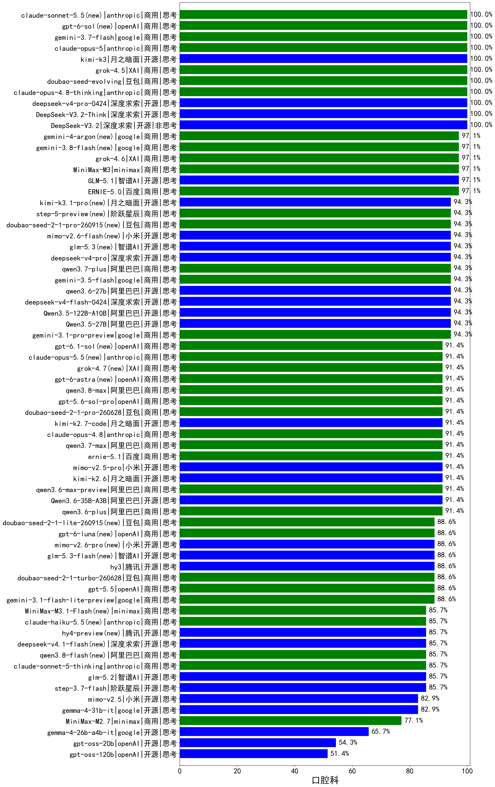

|类别|机构|大模型|【口腔科】准确率|平均耗时|平均消耗token|花费/千次（元）|排名（准确率）|
|---|---|-----|-------------------|-------|-----------|-----------|-----------|
|开源|深度求索|DeepSeek-V3.2|100.0%|69s|392|1.1|1|
|开源|深度求索|DeepSeek-V3.2-Think|100.0%|63s|1143|3.3|2|
|商用|XAI|grok-4.5|100.0%|59s|1691|63.1|3|
|商用|anthropic|claude-opus-4.8-thinking|100.0%|14s|842|130.1|4|
|开源|月之暗面|kimi-k3|100.0%|33s|729|60.3|5|
|商用|anthropic|claude-opus-5|100.0%|15s|739|112.0|6|
|商用|openAI|gpt-6-sol(new)|100.0%|284s|275|13.6|7|
|开源|深度求索|deepseek-v4-pro-0424|100.0%|26s|669|15.1|8|
|商用|豆包|doubao-seed-evolving|100.0%|211s|5901|174.1|9|
|商用|google|gemini-3.7-flash|100.0%|11s|892|21.7|10|
|商用|anthropic|claude-sonnet-5.5(new)|100.0%|11s|591|34.4|11|
|商用|minimax|MiniMax-M3|97.1%|23s|678|8.3|12|
|开源|智谱AI|GLM-5.1|97.1%|137s|1357|31.1|13|
|商用|XAI|grok-4.6|97.1%|261s|1803|67.8|14|
|商用|google|gemini-4-argon(new)|97.1%|18s|477|54.4|15|
|商用|google|gemini-3.8-flash(new)|97.1%|11s|779|37.4|16|
|商用|百度|ERNIE-5.0|97.1%|156s|1698|39.4|17|
|商用|google|gemini-3.5-flash|94.3%|8s|1394|83.5|18|
|开源|智谱AI|glm-5.3(new)|94.3%|224s|2511|68.5|19|
|商用|google|gemini-3.1-pro-preview|94.3%|42s|1607|131.0|20|
|商用|阶跃星辰|step-5-preview(new)|94.3%|19s|1229|23.4|21|
|商用|阿里巴巴|qwen3.7-plus|94.3%|22s|1190|9.0|22|
|开源|小米|mimo-v2.6-flash(new)|94.3%|42s|1228|2.4|23|
|开源|阿里巴巴|Qwen3.5-27B|94.3%|231s|2836|13.2|24|
|商用|豆包|doubao-seed-2-1-pro-260915(new)|94.3%|45s|1179|32.5|25|
|开源|阿里巴巴|Qwen3.5-122B-A10B|94.3%|299s|2568|16.0|26|
|开源|阿里巴巴|qwen3.6-27b|94.3%|28s|1689|29.1|27|
|开源|深度求索|deepseek-v4-flash-0424|94.3%|31s|937|1.8|28|
|开源|深度求索|deepseek-v4-pro|94.3%|381s|1818|46.2|29|
|商用|openAI|gpt-5.6-sol-pro|91.4%|45s|4000|344.3|30|
|商用|阿里巴巴|qwen3.8-max|91.4%|30s|1161|38.8|31|
|商用|openAI|gpt-6-astra(new)|91.4%|14s|286|71.7|32|
|商用|anthropic|claude-opus-5.5(new)|91.4%|37s|678|80.8|33|
|商用|XAI|grok-4.7(new)|91.4%|92s|6041|216.7|34|
|商用|豆包|doubao-seed-2-1-pro-260628|91.4%|194s|7536|223.2|35|
|商用|openAI|gpt-6.1-sol(new)|91.4%|10s|256|12.3|36|
|开源|月之暗面|kimi-k2.7-code|91.4%|35s|1156|29.6|37|
|商用|anthropic|claude-opus-4.8|91.4%|11s|609|89.3|38|
|商用|阿里巴巴|qwen3.7-max|91.4%|27s|1161|39.7|39|
|商用|百度|ernie-5.1|91.4%|33s|948|16.0|40|
|开源|小米|mimo-v2.5-pro|91.4%|35s|1747|32.0|41|
|商用|阿里巴巴|qwen3.6-plus|91.4%|34s|1699|19.5|42|
|开源|月之暗面|kimi-k2.6|91.4%|135s|2632|69.4|43|
|商用|阿里巴巴|qwen3.6-max-preview|91.4%|56s|1670|86.3|44|
|开源|阿里巴巴|Qwen3.6-35B-A3B|91.4%|153s|2118|22.1|45|
|开源|智谱AI|glm-5.3-flash(new)|88.6%|62s|2357|6.4|46|
|商用|openAI|gpt-6-luna(new)|88.6%|198s|540|1.6|47|
|商用|google|gemini-3.1-flash-lite-preview|88.6%|14s|412|3.6|48|
|商用|豆包|doubao-seed-2-1-turbo-260628|88.6%|199s|6478|95.7|49|
|商用|豆包|doubao-seed-2-1-lite-260915(new)|88.6%|65s|1517|3.9|50|
|商用|openAI|gpt-5.5|88.6%|13s|691|127.5|51|
|开源|腾讯|hy3|88.6%|97s|252|0.8|52|
|开源|小米|mimo-v2.6-pro(new)|88.6%|60s|2138|12.6|53|
|商用|anthropic|claude-haiku-5.5(new)|85.7%|8s|958|3.0|54|
|商用|minimax|MiniMax-M3.1-Flash(new)|85.7%|39s|2165|7.8|55|
|开源|腾讯|hy4-preview(new)|85.7%|76s|4046|71.7|56|
|开源|深度求索|deepseek-v4.1-flash(new)|85.7%|19s|2033|15.6|57|
|商用|阿里巴巴|qwen3.8-flash(new)|85.7%|46s|1665|4.2|58|
|商用|anthropic|claude-sonnet-5-thinking|85.7%|17s|941|58.9|59|
|开源|智谱AI|glm-5.2|85.7%|40s|1578|42.4|60|
|开源|阶跃星辰|step-3.7-flash|85.7%|24s|2353|18.5|61|
|开源|小米|mimo-v2.5|82.9%|35s|1501|17.3|62|
|开源|google|gemma-4-31b-it|82.9%|79s|548|1.4|63|
|商用|minimax|MiniMax-M2.7|77.1%|60s|2440|19.8|64|
|开源|google|gemma-4-26b-a4b-it|65.7%|70s|615|1.5|65|
|开源|openAI|gpt-oss-20b|54.3%|112s|1424|1.5|66|
|开源|openAI|gpt-oss-120b|51.4%|9s|777|2.1|67|

