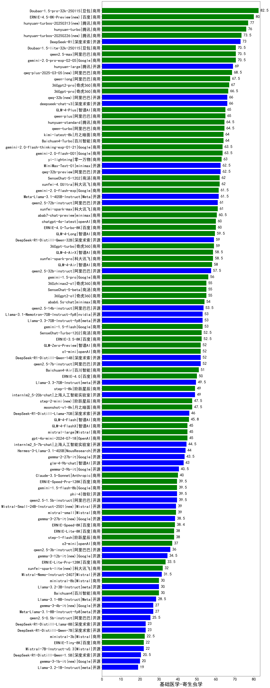

| 类别 | 大模型                         | 基础医学-寄生虫学 | 排名 |
|-----|------------------------------|---------|----|
|商用|Doubao-1.5-pro-32k-250115|82.5|1|
|商用|ERNIE-4.5-8K-Preview(new)|80.0|2|
|商用|hunyuan-turbos-20250313(new)|77.0|3|
|商用|hunyuan-turbo|76.0|4|
|商用|hunyuan-turbos-20250226(new)|73.5|5|
|开源|DeepSeek-R1|73.0|6|
|商用|Doubao-1.5-lite-32k-250115|70.5|7|
|商用|qwen2.5-max|70.5|8|
|商用|gemini-2.0-pro-exp-02-05|70.5|9|
|开源|hunyuan-large|69.0|10|
|商用|qwq-plus-2025-03-05(new)|68.5|11|
|商用|qwen-long|67.5|12|
|商用|360gpt2-pro|67.0|13|
|商用|360gpt-pro|66.5|14|
|开源|qwq-32b(new)|66.0|15|
|开源|deepseek-chat-v3|66.0|16|
|商用|GLM-4-Plus|65.0|17|
|商用|qwen-plus|65.0|18|
|商用|qwen-turbo|64.5|19|
|商用|hunyuan-standard|64.5|20|
|商用|Baichuan4-Turbo|64.0|21|
|商用|kimi-latest-8k|64.0|22|
|商用|gemini-2.0-flash-thinking-exp-01-21|63.5|23|
|商用|gemini-2.0-flash-001|63.5|24|
|商用|yi-lightning|63.0|25|
|开源|qwq-32b-preview|62.5|26|
|开源|MiniMax-Text-01|62.5|27|
|商用|SenseChat-5-1202|62.0|28|
|商用|xunfei-4.0Ultra|62.0|29|
|商用|gemini-2.0-flash-exp|61.5|30|
|开源|Meta-Llama-3.1-405B-Instruct|61.5|31|
|商用|xunfei-spark-max|61.0|32|
|开源|qwen2.5-72b-instruct|61.0|33|
|商用|abab7-chat-preview|60.5|34|
|商用|chatgpt-4o-latest|60.0|35|
|商用|ERNIE-4.0-Turbo-8K|60.0|36|
|商用|GLM-4-Long|59.5|37|
|开源|DeepSeek-R1-Distill-Qwen-32B|59.0|38|
|商用|360gpt-turbo|59.0|39|
|商用|GLM-4-AirX|58.5|40|
|商用|xunfei-spark-pro|58.5|41|
|商用|GLM-4-Air|58.0|42|
|开源|qwen2.5-32b-instruct|57.5|43|
|商用|gemini-1.5-pro|56.0|44|
|商用|360zhinao2-o1|55.0|45|
|商用|360gpt2-o1|55.0|46|
|商用|SenseChat-5-beta|55.0|47|
|商用|abab6.5s-chat|54.0|48|
|开源|qwen2.5-14b-instruct|53.5|49|
|开源|Llama-3.1-Nemotron-70B-Instruct-fp8|53.0|50|
|开源|Llama-3.3-70B-Instruct-fp8|53.0|51|
|商用|gemini-1.5-flash|53.0|52|
|商用|ERNIE-3.5-8K|52.5|53|
|商用|SenseChat-Turbo-1202|52.5|54|
|开源|DeepSeek-R1-Distill-Qwen-14B|52.0|55|
|开源|qwen2.5-7b-instruct|52.0|56|
|商用|o1-mini|52.0|57|
|商用|GLM-Zero-Preview|52.0|58|
|商用|Baichuan4-Air|51.0|59|
|商用|ERNIE-4.0|50.0|60|
|开源|Llama-3.3-70B-Instruct|49.5|61|
|商用|step-1-8k|49.0|62|
|开源|internlm2_5-20b-chat|49.0|63|
|商用|step-2-mini(new)|47.5|64|
|商用|moonshot-v1-8k|47.5|65|
|开源|DeepSeek-R1-Distill-Llama-70B|46.0|66|
|商用|GLM-4-Flash|45.8|67|
|商用|GLM-4-FlashX|45.0|68|
|商用|gpt-4o-mini-2024-07-18|45.0|69|
|商用|mistral-large|45.0|70|
|开源|internlm2_5-7b-chat|44.5|71|
|开源|Hermes-3-Llama-3.1-405B|44.0|72|
|开源|gemma-2-27b-it|43.5|73|
|开源|glm-4-9b-chat|43.0|74|
|开源|gemma-2-9b-it|40.5|75|
|商用|Claude-3.5-Sonnet|40.0|76|
|商用|gemini-1.5-flash-8b|39.5|77|
|开源|phi-4|39.5|78|
|开源|qwen2.5-1.5b-instruct|39.5|79|
|商用|ERNIE-Speed-Pro-128K|39.5|80|
|开源|Mistral-Small-24B-Instruct-2501(new)|39.0|81|
|商用|mistral-small|39.0|82|
|开源|gemma-3-27b-it(new)|38.5|83|
|商用|ERNIE-Speed-8K|38.4|84|
|商用|step-1-flash|38.0|85|
|商用|ERNIE-Lite-8K|38.0|86|
|商用|o3-mini|37.0|87|
|开源|qwen2.5-3b-instruct|36.0|88|
|开源|gemma-3-12b-it(new)|34.5|89|
|商用|ERNIE-Lite-Pro-128K|33.5|90|
|商用|xunfei-spark-lite(new)|32.0|91|
|开源|Mistral-Nemo-Instruct-2407|31.5|92|
|开源|Llama-3.2-3B-Instruct|30.0|93|
|商用|ministral-8b|30.0|94|
|商用|Baichuan4|30.0|95|
|开源|Llama-3.1-8B-Instruct|28.5|96|
|开源|Meta-Llama-3.1-8B-Instruct-fp8|27.0|97|
|开源|gemma-3-4b-it(new)|27.0|98|
|开源|qwen2.5-0.5b-instruct|25.5|99|
|开源|DeepSeek-R1-Distill-Qwen-7B|23.0|100|
|开源|DeepSeek-R1-Distill-Llama-8B|23.0|101|
|商用|ministral-3b|22.5|102|
|商用|ERNIE-Tiny-8K|22.0|103|
|开源|Mistral-7B-Instruct-v0.3|22.0|104|
|开源|DeepSeek-R1-Distill-Qwen-1.5B|20.5|105|
|开源|gemma-3-1b-it(new)|20.0|106|
|开源|Llama-3.2-1B-Instruct|19.0|107|
|开源|qwen2.5-math-72b-instruct|/|108|

