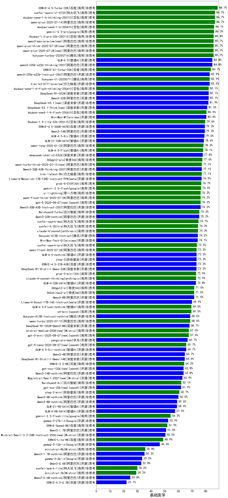

|类别|机构|大模型|【基础医学】准确率|平均耗时|平均消耗token|花费/千次（元）|排名（准确率）|
|---|---|-----|-------------------|-------|-----------|-----------|-----------|
|商用|阿里巴巴|qwen-plus-think-2025-12-01(new)|89.5%|53s|2280|17.8|1|
|商用|google|gemini-3-pro-preview(new)|89.5%|57s|1775|147.0|2|
|商用|百度|ERNIE-4.5-Turbo-32K|88.7%|24s|523|1.6|3|
|商用|腾讯|hunyuan-2.0-instruct-20251111(new)|88.6%|7s|411|0.7|4|
|商用|豆包|doubao-seed-1-6-251015(new)|88.6%|44s|676|4.8|5|
|商用|google|gemini-3-flash-preview(new)|87.6%|47s|1111|22.6|6|
|商用|豆包|doubao-seed-1-6-thinking-250715|86.7%|25s|1262|9.7|7|
|商用|百度|ERNIE-X1.1-Preview(new)|86.7%|129s|971|3.7|8|
|商用|科大讯飞|xunfei-spark-x1-0725|86.7%|/|941|11.3|9|
|商用|豆包|doubao-seed-1-6-250615|86.1%|80s|455|3.0|10|
|商用|google|gemini-2.5-pro|86.0%|32s|2211|156.5|11|
|商用|腾讯|hunyuan-2.0-thinking-20251109(new)|85.7%|11s|892|3.4|12|
|商用|阿里巴巴|qwen3-max-preview|85.7%|10s|456|9.8|13|
|开源|深度求索|DeepSeek-V3.2-Think(new)|85.7%|102s|1255|3.7|14|
|商用|阿里巴巴|qwen-plus-think-2025-07-28|85.7%|/|2326|18.1|15|
|商用|豆包|doubao-seed-1-6-lite-251015(new)|85.7%|62s|770|1.7|16|
|开源|月之暗面|Kimi-K2-Thinking(new)|85.7%|166s|2706|42.6|17|
|商用|阿里巴巴|qwen-plus-2025-07-28|85.7%|13s|481|0.9|18|
|开源|阿里巴巴|qwen3-235b-a22b-thinking-2507|84.8%|99s|2344|45.7|19|
|开源|小米|MiMo-V2-Flash-think(new)|84.8%|122s|1829|0.0|20|
|开源|智谱AI|GLM-4.5|84.8%|59s|1654|22.5|21|
|商用|豆包|doubao-seed-1-8-251215(new)|84.8%|27s|674|4.7|22|
|开源|豆包|Seed-OSS-36B-Instruct|83.8%|90s|1881|7.4|23|
|商用|百度|ERNIE-X1-Turbo-32K|83.7%|105s|1809|7.1|24|
|开源|月之暗面|kimi-k2-0711-preview|82.9%|36s|575|8.5|25|
|开源|月之暗面|kimi-k2-0905(new)|82.9%|72s|354|4.7|26|
|开源|阿里巴巴|qwen3-next-80b-a3b-thinking(new)|82.9%|112s|3092|12.2|27|
|开源|阿里巴巴|qwen3-235b-a22b-instruct-2507|82.9%|12s|487|3.5|28|
|商用|百度|ERNIE-5.0-Thinking-Preview(new)|82.9%|239s|1932|45.5|29|
|商用|腾讯|hunyuan-t1-20250711|82.9%|27s|1605|6.1|30|
|商用|openAI|gpt-5.1-medium(new)|82.9%|136s|436|26.3|31|
|开源|阿里巴巴|Qwen3-32B|82.1%|48s|1389|5.4|32|
|开源|深度求索|DeepSeek-R1-0528|82.1%|223s|1747|27.3|33|
|商用|豆包|doubao-seed-1-6-flash-thinking-250615|82.1%|7s|687|0.9|34|
|开源|深度求索|DeepSeek-V3.1|81.9%|19s|332|3.5|35|
|商用|openAI|gpt-5.2-high(new)|81.9%|9s|424|35.7|36|
|开源|智谱AI|GLM-4.6(new)|81.0%|51s|2203|30.2|37|
|商用|腾讯|hunyuan-turbos-20250926(new)|81.0%|15s|624|1.1|38|
|开源|深度求索|DeepSeek-V3.2-Exp-Think(new)|81.0%|259s|1067|3.1|39|
|开源|阿里巴巴|qwen3-next-80b-a3b-instruct|81.0%|11s|535|1.9|40|
|开源|深度求索|DeepSeek-V3.1-Think|81.0%|53s|1021|11.8|41|
|商用|豆包|doubao-seed-1-6-flash-250615|80.5%|3s|313|0.4|42|
|商用|豆包|Doubao-1.5-lite-32k-250115|80.4%|2s|178|0.1|43|
|商用|openAI|gpt-5.2-medium(new)|80.0%|8s|341|27.4|44|
|开源|minimax|MiniMax-M1|80.0%|187s|3218|22.6|45|
|开源|深度求索|DeepSeek-V3.2(new)|80.0%|54s|355|1.0|46|
|开源|阿里巴巴|Qwen3-14B|79.3%|62s|1940|3.8|47|
|开源|百度|ERNIE-4.5-300B-A47B|79.3%|18s|373|2.6|48|
|开源|智谱AI|GLM-4.5-Air|79.0%|33s|1617|9.4|49|
|商用|阿里巴巴|qwen3-max-2025-09-23(new)|79.0%|187s|511|11.1|50|
|商用|openAI|gpt-5.1-high(new)|79.0%|87s|847|55.5|51|
|商用|anthropic|claude-opus-4.5(new)|79.0%|16s|655|103.7|52|
|商用|anthropic|claude-sonnet-4.5-thinking(new)|78.1%|25s|1682|172.5|53|
|商用|智谱AI|GLM-4.5-Flash|78.1%|27s|1528|0.0|54|
|商用|阿里巴巴|qwen-plus-2025-12-01(new)|78.1%|23s|887|1.7|55|
|商用|阿里巴巴|qwen-long-2025-01-25|77.8%|53s|350|0.6|56|
|开源|阿里巴巴|Qwen3-30B-A3B-Thinking-2507|77.1%|66s|2735|7.5|57|
|商用|阿里巴巴|qwen-turbo-think-2025-07-15|77.1%|/|2109|6.2|58|
|开源|深度求索|DeepSeek-V3.2-Exp(new)|77.1%|151s|325|0.9|59|
|商用|XAI|grok-4-0709|76.7%|254s|1489|155.9|60|
|开源|meta|Llama-4-Maverick-17B-128E-Instruct-FP8|76.6%|7s|508|2.0|61|
|商用|google|gemini-2.5-flash|76.5%|10s|1681|29.5|62|
|开源|阿里巴巴|Qwen3-30B-A3B-Instruct-2507|76.2%|4s|544|1.5|63|
|商用|阿里巴巴|qwen-flash-think-2025-07-28|76.2%|25s|2687|3.9|64|
|商用|openAI|gpt-5-2025-08-07|76.2%|25s|329|19.5|65|
|开源|Mistral|mistral-large-2512(new)|75.2%|12s|520|5.0|66|
|开源|阿里巴巴|Qwen3-32B-nothink|75.2%|71s|511|1.8|67|
|商用|anthropic|claude-sonnet-4.5(new)|74.3%|11s|582|55.4|68|
|商用|openAI|gpt-5.2(new)|74.3%|5s|194|12.8|69|
|商用|anthropic|claude-4-sonnet|74.3%|43s|529|48.6|70|
|开源|小米|MiMo-V2-Flash(new)|74.3%|32s|450|0.0|71|
|开源|腾讯|Hunyuan-A13B-Instruct|74.2%|51s|979|3.8|72|
|商用|阿里巴巴|qwen-flash-2025-07-28|73.3%|9s|563|0.8|73|
|开源|阶跃星辰|step-3|73.3%|91s|1796|7.0|74|
|开源|minimax|MiniMax-M2(new)|73.3%|37s|1753|14.2|75|
|开源|智谱AI|GLM-4.5-nothink|73.3%|24s|709|9.2|76|
|商用|anthropic|claude-4-sonnet-thinking|72.9%|50s|1110|111.8|77|
|商用|XAI|grok-3-mini|72.9%|194s|1077|3.8|78|
|商用|百川智能|Baichuan4-Turbo|72.5%|/|/|/|79|
|开源|百度|ERNIE-4.5-21B-A3B|72.5%|30s|348|0.0|80|
|开源|minimax|MiniMax-Text-01|72.4%|11s|893|7.1|81|
|开源|阿里巴巴|Qwen3-8B|71.7%|372s|7995|0.0|82|
|商用|XAI|grok-4-1-fast-reasoning(new)|70.5%|74s|1681|5.5|83|
|商用|anthropic|claude-haiku-4.5-thinking(new)|70.5%|37s|2634|91.6|84|
|开源|meta|Llama-4-Scout-17B-16E-Instruct|70.1%|9s|524|1.0|85|
|商用|360|360zhinao2-o1|70.1%|/|/|/|86|
|商用|智谱AI|GLM-4.5-Flash-nothink|69.5%|20s|955|0.0|87|
|商用|openAI|o4-mini|69.5%|31s|801|23.7|88|
|商用|阿里巴巴|qwen-turbo-2025-07-15|68.6%|7s|347|0.2|89|
|开源|腾讯|Hunyuan-A13B-Instruct-nothink|68.6%|382s|382|1.3|90|
|商用|openAI|gpt-5.1(new)|68.6%|208s|197|9.3|91|
|开源|深度求索|DeepSeek-R1-0528-Qwen3-8B|68.1%|247s|1734|0.0|92|
|商用|Mistral|mistral-medium-2508|67.6%|112s|468|5.8|93|
|商用|openAI|gpt-5-mini-2025-08-07|67.6%|53s|840|11.2|94|
|开源|智谱AI|GLM-4.5-Air-nothink|65.7%|15s|969|5.5|95|
|商用|openAI|gpt-5-nano-2025-08-07|65.7%|73s|1700|4.7|96|
|商用|anthropic|claude-haiku-4.5(new)|64.8%|12s|612|19.1|97|
|商用|openAI|gpt-5-nano-high(new)|64.8%|751s|3939|11.2|98|
|开源|阿里巴巴|Qwen3-4B|64.7%|42s|1857|5.4|99|
|开源|openAI|gpt-oss-120b|63.8%|17s|604|1.6|100|
|开源|阿里巴巴|Qwen3-14B-nothink|63.8%|16s|534|1.0|101|
|开源|阿里巴巴|Qwen3-8B-nothink|63.8%|36s|468|0.0|102|
|开源|Mistral|Magistral-Small-2507|62.9%|185s|5662|61.0|103|
|商用|openAI|gpt-5-mini-high(new)|61.9%|528s|1849|25.9|104|
|开源|openAI|gpt-oss-20b|61.9%|54s|1096|1.2|105|
|开源|Mistral|Ministral-3-14B-Instruct-2512(new)|61.9%|8s|522|0.7|106|
|开源|阿里巴巴|Qwen3-4B-nothink|60.0%|18s|430|1.1|107|
|商用|百川智能|Baichuan4-Air|59.6%|/|/|/|108|
|开源|智谱AI|GLM-4-9B-0414|57.5%|9s|412|0.0|109|
|商用|google|gemini-2.5-flash-lite|54.3%|8s|1065|3.0|110|
|开源|Mistral|Ministral-3-8B-Instruct-2512(new)|54.3%|9s|646|0.7|111|
|开源|阿里巴巴|Qwen3-1.7B|51.0%|37s|2437|7.1|112|
|商用|XAI|grok-4-1-fast-non-reasoning(new)|50.5%|34s|633|1.8|113|
|开源|Mistral|Mistral-Small-3.2-24B-Instruct-2506|50.5%|91s|526|1.0|114|
|开源|google|gemma-3-27b-it|48.0%|/|/|/|115|
|商用|百度|ERNIE-Lite-8K|46.2%|/|/|/|116|
|开源|google|gemma-3-12b-it|44.5%|/|/|/|117|
|开源|Mistral|Ministral-3-3B-Instruct-2512(new)|40.0%|8s|690|0.5|118|
|开源|阿里巴巴|Qwen3-1.7B-nothink|35.2%|12s|439|1.1|119|
|开源|阿里巴巴|Qwen3-0.6B|32.8%|20s|1210|3.5|120|
|开源|google|gemma-3-4b-it|29.8%|/|/|/|121|
|开源|阿里巴巴|Qwen3-0.6B-nothink|24.8%|10s|228|0.5|122|
|开源|百度|ERNIE-4.5-0.3B|21.9%|26s|379|0.0|123|

