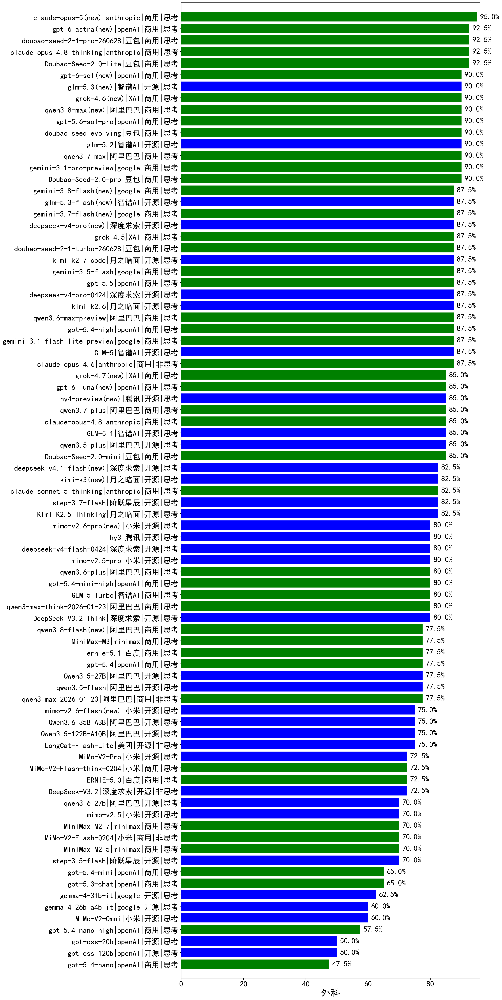

|类别|机构|大模型|【外科】准确率|平均耗时|平均消耗token|花费/千次（元）|排名（准确率）|
|---|---|-----|-------------------|-------|-----------|-----------|-----------|
|商用|anthropic|claude-opus-5(new)|95.0%|16s|770|118.8|1|
|商用|openAI|gpt-6-astra(new)|92.5%|14s|305|80.2|2|
|商用|豆包|Doubao-Seed-2.0-lite|92.5%|219s|993|3.2|3|
|商用|豆包|doubao-seed-2-1-pro-260628(new)|92.5%|230s|8587|254.9|4|
|商用|anthropic|claude-opus-4.8-thinking(new)|92.5%|12s|792|122.6|5|
|商用|阿里巴巴|qwen3.7-max|90.0%|24s|1221|42.1|6|
|商用|阿里巴巴|qwen3.8-max(new)|90.0%|47s|1947|67.4|7|
|开源|智谱AI|glm-5.3(new)|90.0%|95s|1807|49.0|8|
|商用|腾讯|hunyuan-2.0-thinking-20251109|90.0%|14s|841|3.2|9|
|商用|openAI|gpt-5.6-sol-pro(new)|90.0%|41s|3523|282.2|10|
|开源|智谱AI|glm-5.2(new)|90.0%|46s|1688|45.7|11|
|商用|google|gemini-3.1-pro-preview|90.0%|40s|2121|175.2|12|
|商用|XAI|grok-4.6(new)|90.0%|259s|1553|57.5|13|
|商用|豆包|Doubao-Seed-2.0-pro|90.0%|216s|1006|14.6|14|
|商用|豆包|doubao-seed-1-8-251215|90.0%|26s|758|5.2|15|
|商用|豆包|doubao-seed-evolving(new)|90.0%|277s|9038|268.5|16|
|商用|openAI|gpt-5.5|87.5%|11s|517|92.0|17|
|商用|anthropic|claude-opus-4.6|87.5%|19s|670|101.0|18|
|开源|智谱AI|GLM-5|87.5%|77s|2245|39.4|19|
|商用|google|gemini-3.5-flash|87.5%|9s|1455|87.6|20|
|商用|google|gemini-3.7-flash(new)|87.5%|5s|818|19.8|21|
|开源|深度求索|deepseek-v4-pro-0424|87.5%|70s|1894|44.6|22|
|开源|月之暗面|kimi-k2.6|87.5%|191s|2712|71.8|23|
|商用|阿里巴巴|qwen3.6-max-preview|87.5%|62s|1797|93.6|24|
|商用|google|gemini-3.1-flash-lite-preview|87.5%|23s|416|3.7|25|
|商用|google|gemini-3.8-flash(new)|87.5%|24s|922|45.1|26|
|商用|openAI|gpt-5.4-high|87.5%|26s|987|95.4|27|
|开源|深度求索|deepseek-v4-pro(new)|87.5%|133s|1385|34.7|28|
|开源|月之暗面|kimi-k2.7-code(new)|87.5%|56s|1462|38.0|29|
|开源|智谱AI|glm-5.3-flash(new)|87.5%|49s|1884|5.1|30|
|商用|豆包|doubao-seed-2-1-turbo-260628(new)|87.5%|203s|8001|118.7|31|
|商用|XAI|grok-4.5(new)|87.5%|112s|1987|75.8|32|
|商用|google|gemini-3-flash-preview|87.5%|48s|1343|27.2|33|
|商用|anthropic|claude-opus-4.8(new)|85.0%|9s|592|87.6|34|
|商用|豆包|Doubao-Seed-2.0-mini|85.0%|465s|2795|5.4|35|
|开源|智谱AI|GLM-5.1|85.0%|151s|1734|40.3|36|
|开源|阿里巴巴|qwen3.5-plus|85.0%|41s|3330|15.7|37|
|商用|阿里巴巴|qwen3.7-plus(new)|85.0%|26s|1285|9.8|38|
|开源|小米|MiMo-V2-Flash|85.0%|60s|791|0.0|39|
|开源|月之暗面|Kimi-K2.5-Thinking|82.5%|463s|2405|49.3|40|
|开源|月之暗面|kimi-k3(new)|82.5%|42s|783|66.4|41|
|开源|阶跃星辰|step-3.7-flash(new)|82.5%|48s|2982|23.6|42|
|商用|anthropic|claude-sonnet-5-thinking(new)|82.5%|18s|957|60.6|43|
|开源|深度求索|deepseek-v4-flash-0424|80.0%|34s|1031|2.0|44|
|开源|腾讯|hy3(new)|80.0%|64s|270|0.9|45|
|开源|小米|mimo-v2.5-pro|80.0%|25s|1366|24.2|46|
|商用|openAI|gpt-5.4-mini-high|80.0%|40s|1305|38.6|47|
|商用|阿里巴巴|qwen3.6-plus|80.0%|34s|1802|20.9|48|
|商用|智谱AI|GLM-5-Turbo|80.0%|51s|1752|37.3|49|
|开源|智谱AI|GLM-4.7|80.0%|65s|2345|32.0|50|
|开源|深度求索|DeepSeek-V3.2-Think|80.0%|106s|1443|4.3|51|
|商用|阿里巴巴|qwen3-max-think-2026-01-23|80.0%|192s|3528|34.7|52|
|商用|腾讯|hunyuan-2.0-instruct-20251111|80.0%|11s|456|0.8|53|
|商用|minimax|MiniMax-M3(new)|77.5%|27s|742|9.4|54|
|开源|阿里巴巴|Qwen3.5-27B|77.5%|339s|3701|17.4|55|
|商用|阿里巴巴|qwen-plus-think-2025-12-01|77.5%|72s|2981|23.3|56|
|商用|阿里巴巴|qwen3-max-preview-think|77.5%|155s|2861|67.2|57|
|商用|阿里巴巴|qwen3-max-2026-01-23|77.5%|77s|551|4.9|58|
|商用|openAI|gpt-5.2|77.5%|6s|236|15.2|59|
|商用|百度|ernie-5.1|77.5%|29s|1002|17.1|60|
|开源|阿里巴巴|qwen3.5-flash|77.5%|311s|4106|8.1|61|
|商用|openAI|gpt-5.2-high|77.5%|11s|543|45.7|62|
|商用|openAI|gpt-5.4|77.5%|7s|309|24.2|63|
|商用|阿里巴巴|qwen3.8-flash(new)|77.5%|35s|1908|4.9|64|
|开源|阿里巴巴|Qwen3.5-122B-A10B|75.0%|299s|3605|22.6|65|
|开源|阿里巴巴|Qwen3.6-35B-A3B|75.0%|66s|2896|30.6|66|
|开源|美团|LongCat-Flash-Lite|75.0%|239s|512|0.0|67|
|开源|深度求索|DeepSeek-V3.2|72.5%|95s|394|1.1|68|
|开源|小米|MiMo-V2-Pro|72.5%|159s|1177|20.2|69|
|商用|百度|ERNIE-5.0|72.5%|154s|2700|63.7|70|
|商用|小米|MiMo-V2-Flash-think-0204|72.5%|694s|2215|4.5|71|
|商用|openAI|gpt-5.2-medium|72.5%|9s|441|35.7|72|
|开源|阶跃星辰|step-3.5-flash|70.0%|26s|2600|5.4|73|
|开源|小米|mimo-v2.5|70.0%|20s|1460|16.9|74|
|商用|minimax|MiniMax-M2.5|70.0%|38s|1751|14.1|75|
|开源|Mistral|mistral-large-2512|70.0%|13s|540|5.0|76|
|开源|阿里巴巴|qwen3.6-27b|70.0%|32s|1978|34.5|77|
|开源|美团|LongCat-Flash-Thinking-2601|70.0%|243s|2943|0.0|78|
|商用|阿里巴巴|qwen-plus-2025-12-01|70.0%|37s|869|1.6|79|
|商用|小米|MiMo-V2-Flash-0204|70.0%|250s|542|1.0|80|
|商用|minimax|MiniMax-M2.7|70.0%|46s|1855|14.9|81|
|开源|阿里巴巴|qwen3-next-80b-a3b-thinking|65.0%|114s|3799|14.9|82|
|商用|openAI|gpt-5.4-mini|65.0%|26s|284|6.5|83|
|开源|智谱AI|GLM-4.7-Flash|65.0%|1351s|3264|0.0|84|
|商用|openAI|gpt-5.3-chat|65.0%|46s|437|34.8|85|
|开源|小米|MiMo-V2-Flash-think|62.5%|121s|2165|0.0|86|
|商用|minimax|MiniMax-M2.1|62.5%|121s|1824|14.7|87|
|开源|google|gemma-4-31b-it|62.5%|77s|542|1.4|88|
|开源|google|gemma-4-26b-a4b-it|60.0%|70s|606|1.5|89|
|开源|小米|MiMo-V2-Omni|60.0%|124s|1362|15.5|90|
|商用|openAI|gpt-5.4-nano-high|57.5%|69s|651|5.0|91|
|开源|Mistral|Ministral-3-14B-Instruct-2512|52.5%|10s|605|0.9|92|
|开源|openAI|gpt-oss-20b|50.0%|43s|1057|1.1|93|
|开源|Mistral|Ministral-3-8B-Instruct-2512|50.0%|8s|647|0.7|94|
|开源|openAI|gpt-oss-120b|50.0%|57s|690|1.9|95|
|商用|openAI|gpt-5.4-nano|47.5%|67s|281|1.8|96|
|开源|Mistral|Ministral-3-3B-Instruct-2512|30.0%|9s|679|0.5|97|

