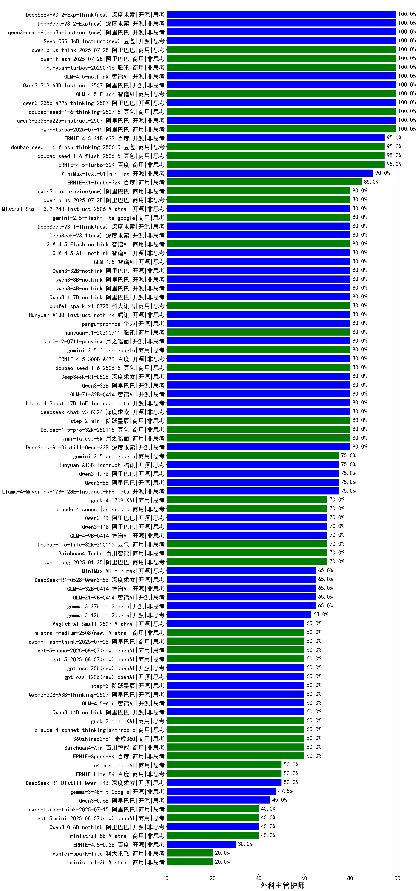

|类别|机构|大模型|【外科主管护师】准确率|平均耗时|平均消耗token|花费/千次（元）|排名（准确率）|
|---|---|-----|-------------------|-------|-----------|-----------|-----------|
|开源|阿里巴巴|qwen3-235b-a22b-thinking-2507(new)|100.0%|237s|3737|73.3|1|
|开源|阿里巴巴|Qwen3-30B-A3B-Instruct-2507(new)|100.0%|7s|702|1.9|2|
|商用|智谱AI|GLM-4.5-Flash(new)|100.0%|38s|1757|0.0|3|
|商用|腾讯|hunyuan-turbos-20250716(new)|100.0%|15s|755|1.4|4|
|商用|阿里巴巴|qwen-flash-2025-07-28(new)|100.0%|9s|648|0.9|5|
|商用|阿里巴巴|qwen-turbo-2025-07-15|100.0%|9s|432|0.2|6|
|商用|豆包|doubao-seed-1-6-thinking-250715(new)|100.0%|16s|865|6.4|7|
|开源|阿里巴巴|qwen3-235b-a22b-instruct-2507(new)|100.0%|16s|584|4.2|8|
|开源|智谱AI|GLM-4.5-nothink|100.0%|22s|661|8.4|9|
|商用|百度|ERNIE-4.5-Turbo-32K|95.0%|21s|533|1.6|10|
|开源|百度|ERNIE-4.5-21B-A3B|95.0%|3s|277|0.0|11|
|商用|豆包|doubao-seed-1-6-flash-250615|95.0%|4s|310|0.4|12|
|商用|豆包|doubao-seed-1-6-flash-thinking-250615|95.0%|7s|493|0.6|13|
|开源|minimax|MiniMax-Text-01|90.0%|20s|920|6.9|14|
|商用|百度|ERNIE-X1-Turbo-32K|85.0%|129s|1664|6.5|15|
|商用|腾讯|hunyuan-t1-20250711|80.0%|42s|2414|9.3|16|
|商用|阶跃星辰|step-2-mini|80.0%|14s|389|0.7|17|
|开源|阿里巴巴|Qwen3-8B-nothink|80.0%|24s|556|0.0|18|
|开源|阿里巴巴|Qwen3-32B-nothink|80.0%|17s|476|1.7|19|
|商用|科大讯飞|xunfei-spark-x1-0725(new)|80.0%|/|1415|17.0|20|
|商用|阿里巴巴|qwen-plus-2025-07-14|80.0%|10s|586|1.1|21|
|开源|腾讯|Hunyuan-A13B-Instruct-nothink|80.0%|18s|397|1.4|22|
|开源|智谱AI|GLM-Z1-32B-0414|80.0%|150s|3055|12.0|23|
|开源|阿里巴巴|Qwen3-32B|80.0%|28s|973|3.7|24|
|开源|华为|pangu-pro-moe|80.0%|109s|1998|7.7|25|
|开源|深度求索|DeepSeek-R1-0528|80.0%|225s|1925|30.0|26|
|开源|百度|ERNIE-4.5-300B-A47B|80.0%|21s|311|2.1|27|
|开源|月之暗面|kimi-k2-0711-preview|80.0%|29s|487|7.0|28|
|商用|google|gemini-2.5-flash|80.0%|13s|1888|33.1|29|
|商用|豆包|doubao-seed-1-6-250615|80.0%|107s|466|3.0|30|
|开源|智谱AI|GLM-4.5(new)|80.0%|97s|2109|28.8|31|
|开源|阿里巴巴|Qwen3-1.7B-nothink|80.0%|10s|512|1.3|32|
|开源|阿里巴巴|Qwen3-4B-nothink|80.0%|6s|470|1.2|33|
|开源|深度求索|deepseek-chat-v3-0324|80.0%|21s|373|2.6|34|
|商用|豆包|Doubao-1.5-pro-32k-250115|80.0%|19s|388|0.7|35|
|商用|月之暗面|kimi-latest-8k|80.0%|29s|484|5.8|36|
|开源|深度求索|DeepSeek-R1-Distill-Qwen-32B|80.0%|29s|682|0.9|37|
|开源|meta|Llama-4-Scout-17B-16E-Instruct|80.0%|9s|536|1.0|38|
|商用|google|gemini-2.5-flash-lite(new)|80.0%|3s|509|1.3|39|
|开源|深度求索|DeepSeek-V3.1-Think(new)|80.0%|61s|1184|13.7|40|
|商用|智谱AI|GLM-4.5-Flash-nothink|80.0%|26s|1054|0.0|41|
|开源|智谱AI|GLM-4.5-Air-nothink|80.0%|15s|977|5.5|42|
|开源|深度求索|DeepSeek-V3.1(new)|80.0%|17s|345|3.6|43|
|开源|阿里巴巴|Qwen3-1.7B|75.0%|21s|2402|7.0|44|
|开源|阿里巴巴|Qwen3-8B|75.0%|142s|3153|0.0|45|
|商用|google|gemini-2.5-pro|75.0%|39s|2415|170.4|46|
|开源|meta|Llama-4-Maverick-17B-128E-Instruct-FP8|75.0%|7s|494|1.9|47|
|开源|腾讯|Hunyuan-A13B-Instruct|75.0%|53s|1022|3.9|48|
|开源|阿里巴巴|Qwen3-14B|70.0%|44s|2208|4.3|49|
|商用|anthropic|claude-4-sonnet|70.0%|46s|576|52.1|50|
|开源|阿里巴巴|qwq-32b|70.0%|58s|3459|20.5|51|
|商用|豆包|Doubao-1.5-lite-32k-250115|70.0%|9s|194|0.1|52|
|开源|阿里巴巴|Qwen3-4B|70.0%|21s|1444|4.1|53|
|商用|XAI|grok-4-0709|70.0%|492s|2305|244.1|54|
|商用|奇虎360|360gpt2-pro|70.0%|19s|274|1.1|55|
|开源|Mistral|Mistral-Small-3.1-24B-Instruct-2503|70.0%|/|/|/|56|
|商用|阿里巴巴|qwen-long-2025-01-25|70.0%|97s|367|0.6|57|
|商用|百度|ERNIE-3.5-8K|70.0%|32s|422|0.8|58|
|商用|百川智能|Baichuan4-Turbo|70.0%|/|/|/|59|
|开源|智谱AI|GLM-4-9B-0414|70.0%|6s|440|0.0|60|
|商用|Mistral|mistral-large|70.0%|/|/|/|61|
|商用|智谱AI|GLM-Z1-Flash|65.0%|26s|1724|0.0|62|
|开源|智谱AI|GLM-4-32B-0414|65.0%|32s|388|0.7|63|
|开源|深度求索|DeepSeek-R1-0528-Qwen3-8B|65.0%|187s|1603|0.0|64|
|开源|minimax|MiniMax-M1|65.0%|292s|2435|18.2|65|
|开源|Google|gemma-3-27b-it|65.0%|/|/|/|66|
|开源|智谱AI|GLM-Z1-9B-0414|65.0%|169s|2622|0.0|67|
|开源|Google|gemma-3-12b-it|63.0%|/|/|/|68|
|商用|百度|ERNIE-Speed-8K|60.0%|/|/|/|69|
|商用|科大讯飞|xunfei-4.0Ultra|60.0%|12s|115|8.1|70|
|开源|阶跃星辰|step-3(new)|60.0%|121s|2425|9.5|71|
|开源|openAI|gpt-oss-20b(new)|60.0%|7s|1241|1.3|72|
|开源|openAI|gpt-oss-120b(new)|60.0%|6s|665|1.8|73|
|商用|XAI|grok-3-mini|60.0%|120s|1184|4.2|74|
|商用|anthropic|claude-4-sonnet-thinking|60.0%|50s|1062|104.9|75|
|商用|openAI|gpt-5-2025-08-07(new)|60.0%|23s|469|28.5|76|
|开源|阿里巴巴|Qwen3-14B-nothink|60.0%|16s|596|1.1|77|
|开源|智谱AI|GLM-4.5-Air(new)|60.0%|35s|1744|10.1|78|
|商用|阿里巴巴|qwen-flash-think-2025-07-28(new)|60.0%|36s|3871|5.7|79|
|商用|商汤|SenseChat-5-1202|60.0%|/|/|/|80|
|商用|Mistral|mistral-small|60.0%|/|/|/|81|
|商用|奇虎360|360zhinao2-o1|60.0%|/|/|/|82|
|商用|零一万物|yi-lightning|60.0%|/|/|/|83|
|商用|百川智能|Baichuan4-Air|60.0%|/|/|/|84|
|商用|科大讯飞|xunfei-spark-pro|60.0%|/|/|/|85|
|商用|科大讯飞|xunfei-spark-max|60.0%|11s|118|3.5|86|
|开源|阿里巴巴|Qwen3-30B-A3B-Thinking-2507(new)|60.0%|85s|3502|9.6|87|
|商用|openAI|gpt-5-nano-2025-08-07(new)|60.0%|85s|1685|4.7|88|
|商用|奇虎360|360gpt2-o1|50.0%|26s|346|14.7|89|
|商用|openAI|o4-mini|50.0%|22s|680|19.6|90|
|商用|阿里巴巴|qwq-plus-2025-03-05|50.0%|87s|2858|11.3|91|
|商用|百度|ERNIE-Lite-8K|50.0%|/|/|/|92|
|开源|深度求索|DeepSeek-R1-Distill-Qwen-14B|50.0%|/|/|/|93|
|开源|Google|gemma-3-4b-it|47.5%|/|/|/|94|
|开源|阿里巴巴|Qwen3-0.6B|45.0%|14s|1518|4.4|95|
|开源|阿里巴巴|Qwen3-0.6B-nothink|40.0%|7s|283|0.6|96|
|商用|openAI|gpt-5-mini-2025-08-07(new)|40.0%|28s|911|12.0|97|
|商用|Mistral|ministral-8b|40.0%|/|/|/|98|
|开源|百度|ERNIE-4.5-0.3B|30.0%|2s|378|0.0|99|
|商用|科大讯飞|xunfei-spark-lite|20.0%|/|/|/|100|
|商用|Mistral|ministral-3b|20.0%|/|/|/|101|
|商用|百度|ERNIE-Tiny-8K|20.0%|/|/|/|102|

