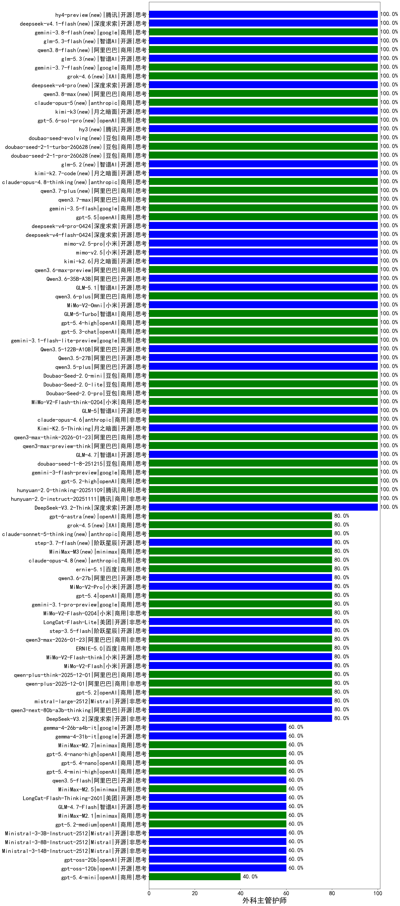

|类别|机构|大模型|【外科主管护师】准确率|平均耗时|平均消耗token|花费/千次（元）|排名（准确率）|
|---|---|-----|-------------------|-------|-----------|-----------|-----------|
|开源|腾讯|hy4-preview(new)|100.0%|38s|2467|43.4|1|
|商用|豆包|Doubao-Seed-2.0-pro|100.0%|198s|886|12.7|2|
|开源|小米|MiMo-V2-Omni|100.0%|201s|1551|18.1|3|
|商用|openAI|gpt-5.6-sol-pro(new)|100.0%|20s|3248|246.1|4|
|开源|月之暗面|kimi-k3(new)|100.0%|28s|794|67.6|5|
|商用|anthropic|claude-opus-5(new)|100.0%|14s|782|120.6|6|
|商用|阿里巴巴|qwen3.8-max(new)|100.0%|16s|675|21.6|7|
|商用|智谱AI|GLM-5-Turbo|100.0%|49s|1135|23.8|8|
|商用|openAI|gpt-5.4-high|100.0%|12s|748|70.5|9|
|商用|openAI|gpt-5.3-chat|100.0%|8s|405|31.8|10|
|商用|google|gemini-3.1-flash-lite-preview|100.0%|3s|404|3.6|11|
|开源|阿里巴巴|Qwen3.5-122B-A10B|100.0%|173s|2963|18.6|12|
|开源|阿里巴巴|Qwen3.5-27B|100.0%|397s|3954|18.7|13|
|开源|深度求索|deepseek-v4-pro(new)|100.0%|285s|633|14.4|14|
|商用|豆包|doubao-seed-evolving(new)|100.0%|159s|6512|192.7|15|
|开源|阿里巴巴|qwen3.5-plus|100.0%|27s|2220|10.4|16|
|商用|豆包|Doubao-Seed-2.0-mini|100.0%|457s|1968|3.7|17|
|商用|阿里巴巴|qwen3.6-plus|100.0%|29s|1772|20.5|18|
|开源|腾讯|hy3(new)|100.0%|18s|230|0.7|19|
|开源|智谱AI|GLM-5.1|100.0%|152s|1372|31.7|20|
|商用|google|gemini-3.5-flash|100.0%|11s|1328|79.8|21|
|商用|豆包|doubao-seed-2-1-pro-260628(new)|100.0%|194s|7391|219.1|22|
|开源|智谱AI|glm-5.2(new)|100.0%|41s|1779|48.3|23|
|开源|月之暗面|kimi-k2.7-code(new)|100.0%|21s|738|18.5|24|
|商用|anthropic|claude-opus-4.8-thinking(new)|100.0%|17s|935|147.5|25|
|商用|阿里巴巴|qwen3.7-plus(new)|100.0%|19s|946|7.1|26|
|商用|阿里巴巴|qwen3.7-max|100.0%|21s|866|29.4|27|
|商用|openAI|gpt-5.5|100.0%|25s|531|95.4|28|
|开源|阿里巴巴|Qwen3.6-35B-A3B|100.0%|14s|1957|20.5|29|
|开源|深度求索|deepseek-v4-pro-0424|100.0%|22s|702|16.0|30|
|开源|深度求索|deepseek-v4-flash-0424|100.0%|31s|764|1.5|31|
|开源|小米|mimo-v2.5-pro|100.0%|27s|1714|31.5|32|
|开源|小米|mimo-v2.5|100.0%|22s|1495|17.4|33|
|开源|月之暗面|kimi-k2.6|100.0%|73s|1278|33.1|34|
|商用|阿里巴巴|qwen3.6-max-preview|100.0%|51s|1573|81.7|35|
|商用|豆包|Doubao-Seed-2.0-lite|100.0%|162s|870|2.8|36|
|商用|豆包|doubao-seed-2-1-turbo-260628(new)|100.0%|328s|5936|87.7|37|
|商用|小米|MiMo-V2-Flash-think-0204|100.0%|239s|2435|5.0|38|
|开源|智谱AI|glm-5.3(new)|100.0%|40s|2136|58.3|39|
|开源|深度求索|DeepSeek-V3.2-Think|100.0%|45s|1384|4.1|40|
|开源|深度求索|deepseek-v4.1-flash(new)|100.0%|42s|1007|7.5|41|
|商用|google|gemini-3.8-flash(new)|100.0%|20s|649|30.9|42|
|商用|腾讯|hunyuan-2.0-instruct-20251111|100.0%|16s|428|0.7|43|
|商用|腾讯|hunyuan-2.0-thinking-20251109|100.0%|6s|599|2.2|44|
|商用|openAI|gpt-5.2-high|100.0%|13s|494|41.1|45|
|开源|智谱AI|glm-5.3-flash(new)|100.0%|30s|1222|3.3|46|
|商用|google|gemini-3-flash-preview|100.0%|99s|988|19.7|47|
|开源|智谱AI|GLM-4.7|100.0%|59s|1790|24.3|48|
|商用|阿里巴巴|qwen3.8-flash(new)|100.0%|86s|4860|12.9|49|
|商用|阿里巴巴|qwen3-max-preview-think|100.0%|76s|2221|51.8|50|
|商用|豆包|doubao-seed-1-8-251215|100.0%|22s|626|4.2|51|
|商用|google|gemini-3.7-flash(new)|100.0%|5s|643|15.3|52|
|商用|anthropic|claude-opus-4.6|100.0%|12s|712|108.2|53|
|商用|XAI|grok-4.6(new)|100.0%|22s|1226|43.8|54|
|商用|阿里巴巴|qwen3-max-think-2026-01-23|100.0%|178s|3759|37.0|55|
|开源|月之暗面|Kimi-K2.5-Thinking|100.0%|285s|1449|29.2|56|
|开源|智谱AI|GLM-5|100.0%|73s|2141|37.6|57|
|开源|深度求索|DeepSeek-V3.2|80.0%|31s|317|0.9|58|
|开源|美团|LongCat-Flash-Lite|80.0%|63s|649|0.0|59|
|开源|阿里巴巴|qwen3-next-80b-a3b-thinking|80.0%|89s|4730|18.7|60|
|开源|Mistral|mistral-large-2512|80.0%|13s|556|5.2|61|
|开源|阶跃星辰|step-3.7-flash(new)|80.0%|50s|3766|30.0|62|
|商用|minimax|MiniMax-M3(new)|80.0%|33s|801|10.5|63|
|商用|anthropic|claude-opus-4.8(new)|80.0%|9s|691|104.7|64|
|商用|openAI|gpt-6-astra(new)|80.0%|10s|302|80.0|65|
|商用|百度|ernie-5.1|80.0%|25s|1018|17.4|66|
|开源|阿里巴巴|qwen3.6-27b|80.0%|27s|1715|29.8|67|
|开源|阶跃星辰|step-3.5-flash|80.0%|17s|2124|4.4|68|
|商用|百度|ERNIE-5.0|80.0%|99s|2010|47.1|69|
|商用|openAI|gpt-5.2|80.0%|4s|235|15.3|70|
|商用|阿里巴巴|qwen-plus-2025-12-01|80.0%|21s|850|1.6|71|
|商用|阿里巴巴|qwen-plus-think-2025-12-01|80.0%|67s|2759|21.5|72|
|商用|openAI|gpt-5.4|80.0%|6s|328|26.4|73|
|商用|小米|MiMo-V2-Flash-0204|80.0%|111s|493|0.9|74|
|商用|anthropic|claude-sonnet-5-thinking(new)|80.0%|14s|796|49.2|75|
|开源|小米|MiMo-V2-Flash|80.0%|126s|487|0.0|76|
|开源|小米|MiMo-V2-Flash-think|80.0%|31s|2357|0.0|77|
|商用|阿里巴巴|qwen3-max-2026-01-23|80.0%|174s|586|5.3|78|
|开源|小米|MiMo-V2-Pro|80.0%|398s|1288|22.6|79|
|商用|XAI|grok-4.5(new)|80.0%|157s|2057|78.7|80|
|商用|google|gemini-3.1-pro-preview|80.0%|79s|1314|106.7|81|
|开源|openAI|gpt-oss-120b|60.0%|6s|665|1.8|82|
|开源|google|gemma-4-26b-a4b-it|60.0%|59s|535|1.3|83|
|开源|美团|LongCat-Flash-Thinking-2601|60.0%|16s|2091|0.0|84|
|开源|Mistral|Ministral-3-14B-Instruct-2512|60.0%|9s|608|0.9|85|
|开源|Mistral|Ministral-3-8B-Instruct-2512|60.0%|15s|562|0.6|86|
|开源|Mistral|Ministral-3-3B-Instruct-2512|60.0%|10s|673|0.5|87|
|商用|openAI|gpt-5.2-medium|60.0%|8s|392|31.0|88|
|商用|minimax|MiniMax-M2.1|60.0%|91s|1610|12.9|89|
|开源|智谱AI|GLM-4.7-Flash|60.0%|997s|2423|0.0|90|
|商用|minimax|MiniMax-M2.5|60.0%|34s|1637|13.1|91|
|开源|google|gemma-4-31b-it|60.0%|23s|518|1.3|92|
|开源|阿里巴巴|qwen3.5-flash|60.0%|202s|3752|7.4|93|
|开源|openAI|gpt-oss-20b|60.0%|7s|1241|1.3|94|
|商用|openAI|gpt-5.4-mini-high|60.0%|18s|1197|35.3|95|
|商用|openAI|gpt-5.4-nano|60.0%|12s|283|1.8|96|
|商用|openAI|gpt-5.4-nano-high|60.0%|109s|777|6.1|97|
|商用|minimax|MiniMax-M2.7|60.0%|34s|1289|10.2|98|
|商用|openAI|gpt-5.4-mini|40.0%|12s|310|7.3|99|

