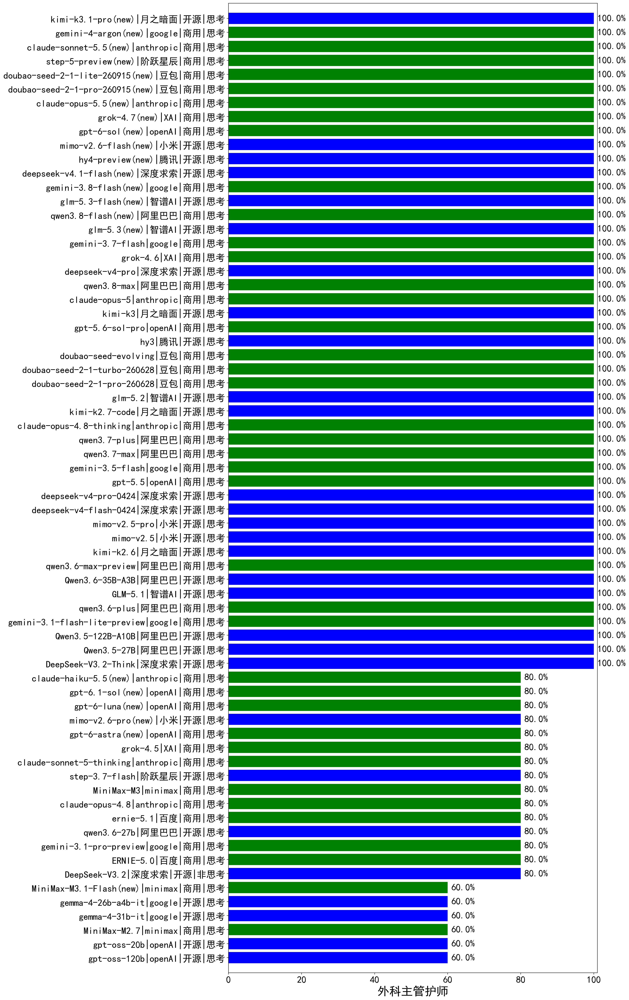

|类别|机构|大模型|【外科主管护师】准确率|平均耗时|平均消耗token|花费/千次（元）|排名（准确率）|
|---|---|-----|-------------------|-------|-----------|-----------|-----------|
|商用|豆包|doubao-seed-2-1-turbo-260628|100.0%|328s|5936|87.7|1|
|商用|阿里巴巴|qwen3.8-flash(new)|100.0%|86s|4860|12.9|2|
|开源|智谱AI|glm-5.2|100.0%|41s|1779|48.3|3|
|商用|豆包|doubao-seed-2-1-pro-260628|100.0%|194s|7391|219.1|4|
|商用|豆包|doubao-seed-evolving|100.0%|159s|6512|192.7|5|
|开源|腾讯|hy3|100.0%|18s|230|0.7|6|
|商用|openAI|gpt-5.6-sol-pro|100.0%|20s|3248|246.1|7|
|开源|月之暗面|kimi-k3|100.0%|28s|794|67.6|8|
|商用|anthropic|claude-opus-5|100.0%|14s|782|120.6|9|
|商用|阿里巴巴|qwen3.8-max|100.0%|16s|675|21.6|10|
|开源|深度求索|deepseek-v4-pro|100.0%|285s|633|14.4|11|
|商用|XAI|grok-4.6|100.0%|22s|1226|43.8|12|
|商用|google|gemini-3.7-flash|100.0%|5s|643|15.3|13|
|开源|智谱AI|glm-5.3(new)|100.0%|40s|2136|58.3|14|
|开源|智谱AI|glm-5.3-flash(new)|100.0%|30s|1222|3.3|15|
|商用|anthropic|claude-opus-4.8-thinking|100.0%|17s|935|147.5|16|
|商用|google|gemini-3.8-flash(new)|100.0%|20s|649|30.9|17|
|开源|深度求索|deepseek-v4.1-flash(new)|100.0%|42s|1007|7.5|18|
|开源|腾讯|hy4-preview(new)|100.0%|38s|2467|43.4|19|
|开源|小米|mimo-v2.6-flash(new)|100.0%|40s|887|1.7|20|
|商用|openAI|gpt-6-sol(new)|100.0%|936s|235|11.3|21|
|商用|XAI|grok-4.7(new)|100.0%|23s|2671|75.5|22|
|商用|anthropic|claude-opus-5.5(new)|100.0%|64s|738|90.1|23|
|商用|豆包|doubao-seed-2-1-pro-260915(new)|100.0%|37s|771|20.5|24|
|商用|豆包|doubao-seed-2-1-lite-260915(new)|100.0%|37s|635|1.5|25|
|商用|阶跃星辰|step-5-preview(new)|100.0%|50s|1648|32.0|26|
|商用|anthropic|claude-sonnet-5.5(new)|100.0%|7s|574|33.6|27|
|商用|google|gemini-4-argon(new)|100.0%|33s|419|47.4|28|
|开源|月之暗面|kimi-k2.7-code|100.0%|21s|738|18.5|29|
|开源|月之暗面|kimi-k3.1-pro(new)|100.0%|27s|1051|63.3|30|
|开源|智谱AI|GLM-5.1|100.0%|152s|1372|31.7|31|
|开源|深度求索|deepseek-v4-pro-0424|100.0%|22s|702|16.0|32|
|商用|google|gemini-3.1-flash-lite-preview|100.0%|3s|404|3.6|33|
|开源|阿里巴巴|Qwen3.5-122B-A10B|100.0%|173s|2963|18.6|34|
|商用|阿里巴巴|qwen3.7-plus|100.0%|19s|946|7.1|35|
|开源|阿里巴巴|Qwen3.6-35B-A3B|100.0%|14s|1957|20.5|36|
|商用|阿里巴巴|qwen3.6-max-preview|100.0%|51s|1573|81.7|37|
|开源|月之暗面|kimi-k2.6|100.0%|73s|1278|33.1|38|
|开源|小米|mimo-v2.5|100.0%|22s|1495|17.4|39|
|开源|小米|mimo-v2.5-pro|100.0%|27s|1714|31.5|40|
|开源|深度求索|deepseek-v4-flash-0424|100.0%|31s|764|1.5|41|
|商用|openAI|gpt-5.5|100.0%|25s|531|95.4|42|
|商用|阿里巴巴|qwen3.6-plus|100.0%|29s|1772|20.5|43|
|开源|阿里巴巴|Qwen3.5-27B|100.0%|397s|3954|18.7|44|
|商用|google|gemini-3.5-flash|100.0%|11s|1328|79.8|45|
|商用|阿里巴巴|qwen3.7-max|100.0%|21s|866|29.4|46|
|开源|深度求索|DeepSeek-V3.2-Think|100.0%|45s|1384|4.1|47|
|商用|google|gemini-3.1-pro-preview|80.0%|79s|1314|106.7|48|
|商用|百度|ERNIE-5.0|80.0%|99s|2010|47.1|49|
|商用|openAI|gpt-6.1-sol(new)|80.0%|6s|258|12.9|50|
|开源|深度求索|DeepSeek-V3.2|80.0%|31s|317|0.9|51|
|商用|anthropic|claude-haiku-5.5(new)|80.0%|6s|893|2.8|52|
|商用|openAI|gpt-6-luna(new)|80.0%|362s|409|1.2|53|
|开源|阶跃星辰|step-3.7-flash|80.0%|50s|3766|30.0|54|
|开源|小米|mimo-v2.6-pro(new)|80.0%|18s|903|5.2|55|
|商用|openAI|gpt-6-astra(new)|80.0%|10s|302|80.0|56|
|开源|阿里巴巴|qwen3.6-27b|80.0%|27s|1715|29.8|57|
|商用|百度|ernie-5.1|80.0%|25s|1018|17.4|58|
|商用|XAI|grok-4.5|80.0%|157s|2057|78.7|59|
|商用|anthropic|claude-sonnet-5-thinking|80.0%|14s|796|49.2|60|
|商用|anthropic|claude-opus-4.8|80.0%|9s|691|104.7|61|
|商用|minimax|MiniMax-M3|80.0%|33s|801|10.5|62|
|开源|google|gemma-4-31b-it|60.0%|23s|518|1.3|63|
|商用|minimax|MiniMax-M2.7|60.0%|34s|1289|10.2|64|
|开源|google|gemma-4-26b-a4b-it|60.0%|59s|535|1.3|65|
|开源|openAI|gpt-oss-20b|60.0%|7s|1241|1.3|66|
|商用|minimax|MiniMax-M3.1-Flash(new)|60.0%|68s|661|1.9|67|
|开源|openAI|gpt-oss-120b|60.0%|6s|665|1.8|68|

