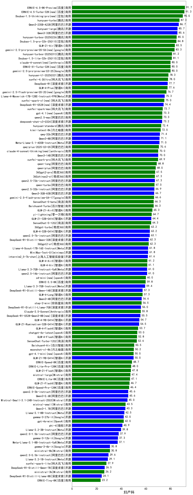

| 类别 | 大模型                         | 妇产科 | 排名 |
|-----|------------------------------|---------|----|
|商用|ERNIE-4.5-Turbo-32K(new)|91.3%|1|
|商用|doubao-seed-1-6-250615(new)|91.1%|2|
|商用|Doubao-1.5-thinking-pro|90.0%|3|
|商用|hunyuan-t1-20250529(new)|90.0%|4|
|商用|hunyuan-turbo|87.3%|5|
|商用|hunyuan-turbos-20250604(new)|86.7%|6|
|开源|Qwen3-235B-A22B|86.7%|7|
|商用|doubao-seed-1-6-thinking-250615(new)|86.7%|8|
|开源|hunyuan-large|85.7%|9|
|开源|Qwen3-32B|85.6%|10|
|商用|Doubao-1.5-pro-32k-250115|84.8%|11|
|商用|gemini-2.5-pro-preview-05-06(new)|83.3%|12|
|商用|hunyuan-turbos-20250313|81.2%|13|
|商用|doubao-seed-1-6-flash-250615(new)|81.1%|14|
|商用|doubao-seed-1-6-flash-thinking-250615(new)|81.1%|15|
|商用|Doubao-1.5-lite-32k-250115|81.1%|16|
|商用|ERNIE-X1-Turbo-32K(new)|80.0%|17|
|商用|claude-4-sonnet(new)|80.0%|18|
|商用|hunyuan-t1-20250321|78.3%|19|
|商用|xunfei-4.0Ultra|78.0%|20|
|商用|qwen-plus-2025-04-28(new)|77.8%|21|
|开源|DeepSeek-R1|77.7%|22|
|商用|gemini-2.5-flash-preview-05-20(new)|76.7%|23|
|商用|qwen-plus-think-2025-04-28(new)|75.6%|24|
|开源|Llama-4-Maverick-17B-128E-Instruct-FP8|75.3%|25|
|商用|xunfei-spark-x1|75.0%|26|
|开源|DeepSeek-R1-0528(new)|74.4%|27|
|商用|xunfei-spark-max|73.7%|28|
|商用|qwen2.5-max|73.3%|29|
|商用|gpt-4.1|73.3%|30|
|开源|deepseek-chat-v3-0324|73.2%|31|
|商用|GLM-4-Plus|72.6%|32|
|商用|hunyuan-standard|72.4%|33|
|商用|kimi-latest-8k|72.0%|34|
|开源|qwq-32b|71.4%|35|
|开源|Qwen3-8B|71.1%|36|
|商用|qwq-plus-2025-03-05|70.6%|37|
|开源|Qwen3-14B|70.0%|38|
|商用|claude-4-sonnet-thinking(new)|70.0%|39|
|商用|GLM-4-AirX|70.0%|40|
|开源|MiniMax-M1(new)|70.0%|41|
|商用|xunfei-spark-pro|69.9%|42|
|商用|GLM-Z1-Air|69.3%|43|
|商用|qwen-turbo-think-2025-04-28(new)|68.9%|44|
|商用|qwen-long-2025-01-25|68.8%|45|
|商用|qwen-plus-2025-01-25|68.0%|46|
|商用|360gpt2-pro|67.5%|47|
|开源|qwen2.5-72b-instruct|67.3%|48|
|商用|360zhinao2-o1|67.3%|49|
|商用|qwen-turbo-2025-02-11|67.0%|50|
|开源|qwen2.5-32b-instruct|66.9%|51|
|商用|qwen-turbo-2025-04-28(new)|66.7%|52|
|开源|Qwen3-30B-A3B|66.7%|53|
|商用|GLM-4-Air|66.7%|54|
|商用|SenseChat-5-beta|66.3%|55|
|商用|Baichuan4-Turbo|66.3%|56|
|商用|GLM-Z1-AirX|65.3%|57|
|商用|yi-lightning|64.7%|58|
|开源|GLM-Z1-32B-0414|64.4%|59|
|商用|SenseChat-5-1202|64.3%|60|
|商用|step-r1-v-mini(new)|63.3%|61|
|商用|360gpt-turbo|63.2%|62|
|开源|GLM-4-32B-0414|63.2%|63|
|开源|qwen2.5-7b-instruct|63.1%|64|
|商用|360gpt2-o1|62.3%|65|
|开源|DeepSeek-R1-Distill-Qwen-32B|62.3%|66|
|商用|GLM-4-Long|62.2%|67|
|开源|Llama-4-Scout-17B-16E-Instruct|61.8%|68|
|开源|MiniMax-Text-01|61.8%|69|
|开源|internlm2_5-7b-chat|61.6%|70|
|开源|qwen2.5-14b-instruct|61.0%|71|
|商用|o4-mini|60.0%|72|
|商用|ERNIE-3.5-8K|59.8%|73|
|开源|DeepSeek-R1-Distill-Qwen-14B|57.3%|74|
|开源|Qwen3-4B|56.6%|75|
|商用|step-2-mini|56.5%|76|
|开源|DeepSeek-R1-Distill-Llama-70B|56.0%|77|
|开源|DeepSeek-R1-0528-Qwen3-8B(new)|55.5%|78|
|开源|GLM-4-9B-0414|54.7%|79|
|开源|GLM-Z1-Rumination-32B-0414|54.5%|80|
|商用|GLM-4-FlashX|53.7%|81|
|商用|chatgpt-4o-latest|53.0%|82|
|商用|GLM-4-Flash|52.8%|83|
|商用|SenseChat-Turbo-1202|52.6%|84|
|商用|Baichuan4-Air|50.5%|85|
|商用|moonshot-v1-8k|50.2%|86|
|商用|gpt-4.1-mini|50.0%|87|
|开源|GLM-Z1-9B-0414|50.0%|88|
|商用|ERNIE-Speed-8K|48.7%|89|
|商用|GLM-Z1-Flash|47.8%|90|
|商用|mistral-large|47.4%|91|
|商用|ERNIE-Lite-8K|47.1%|92|
|开源|qwen2.5-3b-instruct|45.6%|93|
|开源|Qwen3-0.6B|45.6%|94|
|商用|GLM-Z1-FlashX|45.6%|95|
|开源|Mistral-Small-3.1-24B-Instruct-2503|45.0%|96|
|商用|mistral-small|43.5%|97|
|开源|Qwen3-1.7B|43.3%|98|
|开源|gemma-3-27b-it|42.0%|99|
|商用|gpt-4o-mini|42.0%|100|
|开源|phi-4|40.9%|101|
|开源|qwen2.5-1.5b-instruct|37.9%|102|
|开源|gemma-3-12b-it|37.3%|103|
|开源|gemma-3-4b-it|30.8%|104|
|商用|ministral-8b|30.8%|105|
|开源|qwen2.5-0.5b-instruct|29.6%|106|
|商用|xunfei-spark-lite|27.9%|107|
|开源|DeepSeek-R1-Distill-Qwen-7B|26.5%|108|
|商用|ministral-3b|26.2%|109|
|开源|DeepSeek-R1-Distill-Llama-8B|24.1%|110|
|商用|ERNIE-Tiny-8K|23.2%|111|

