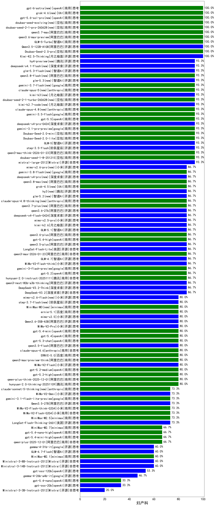

|类别|机构|大模型|【妇产科】准确率|平均耗时|平均消耗token|花费/千次（元）|排名（准确率）|
|---|---|-----|-------------------|-------|-----------|-----------|-----------|
|商用|智谱AI|GLM-5-Turbo|100.0%|34s|1438|29.9|1|
|开源|月之暗面|Kimi-K2.5-Thinking|100.0%|440s|2388|48.5|2|
|商用|XAI|grok-4.6(new)|100.0%|42s|1736|64.4|3|
|商用|openAI|gpt-5.6-sol-pro(new)|100.0%|59s|4228|366.9|4|
|商用|豆包|doubao-seed-evolving(new)|100.0%|169s|6942|204.9|5|
|商用|豆包|doubao-seed-2-1-pro-260628(new)|100.0%|282s|7632|225.6|6|
|商用|阿里巴巴|qwen3.7-max|100.0%|29s|1394|47.7|7|
|商用|阿里巴巴|qwen3.6-max-preview|100.0%|61s|1933|99.6|8|
|开源|阿里巴巴|Qwen3.5-122B-A10B|100.0%|392s|4055|25.4|9|
|商用|豆包|Doubao-Seed-2.0-pro|100.0%|223s|1060|15.1|10|
|商用|openAI|gpt-6-astra(new)|100.0%|17s|411|108.6|11|
|商用|google|gemini-3.5-flash|93.3%|10s|1781|106.5|12|
|商用|anthropic|claude-opus-5(new)|93.3%|18s|856|128.2|13|
|开源|Mistral|mistral-large-2512|93.3%|18s|741|6.9|14|
|商用|豆包|Doubao-Seed-2.0-mini|93.3%|283s|2012|3.8|15|
|商用|豆包|Doubao-Seed-2.0-lite|93.3%|213s|1043|3.3|16|
|开源|月之暗面|kimi-k2.7-code(new)|93.3%|42s|1297|33.1|17|
|开源|智谱AI|GLM-5|93.3%|201s|2469|43.1|18|
|商用|anthropic|claude-opus-4.8(new)|93.3%|9s|665|94.7|19|
|开源|阶跃星辰|step-3.5-flash|93.3%|18s|2515|5.1|20|
|开源|月之暗面|kimi-k3(new)|93.3%|56s|1301|116.2|21|
|商用|阿里巴巴|qwen3-max-think-2026-01-23|93.3%|113s|3261|31.8|22|
|商用|豆包|doubao-seed-2-1-turbo-260628(new)|93.3%|280s|8002|118.3|23|
|商用|google|gemini-3.1-pro-preview|93.3%|48s|1940|157.5|24|
|开源|深度求索|deepseek-v4-pro-0424|93.3%|62s|1542|35.9|25|
|商用|google|gemini-3.7-flash(new)|93.3%|4s|746|17.3|26|
|开源|智谱AI|glm-5.3-flash(new)|93.3%|68s|2346|6.4|27|
|开源|智谱AI|glm-5.3(new)|93.3%|73s|2352|63.7|28|
|商用|豆包|doubao-seed-1-8-251215|93.3%|28s|796|5.3|29|
|商用|openAI|gpt-5.5|93.3%|11s|655|115.5|30|
|商用|阿里巴巴|qwen3.8-flash(new)|93.3%|58s|854|2.0|31|
|开源|阿里巴巴|qwen3.6-27b|86.7%|35s|2177|37.6|32|
|开源|小米|mimo-v2.5-pro|86.7%|49s|1817|33.2|33|
|开源|智谱AI|GLM-5.1|86.7%|123s|1631|37.4|34|
|开源|智谱AI|glm-5.2(new)|86.7%|50s|2155|58.2|35|
|商用|阿里巴巴|qwen3.7-plus(new)|86.7%|35s|1921|14.7|36|
|商用|anthropic|claude-opus-4.8-thinking(new)|86.7%|14s|890|134.1|37|
|商用|openAI|gpt-5.4-high|86.7%|17s|1083|102.6|38|
|开源|深度求索|deepseek-v4-flash-0424|86.7%|33s|951|1.8|39|
|商用|阿里巴巴|qwen3.6-plus|86.7%|39s|1915|22.0|40|
|商用|openAI|gpt-5.2|86.7%|6s|316|20.5|41|
|商用|腾讯|hunyuan-2.0-instruct-20251111|86.7%|18s|478|0.8|42|
|开源|阿里巴巴|qwen3.5-plus|86.7%|40s|3306|15.5|43|
|开源|月之暗面|kimi-k2.6|86.7%|103s|1824|47.3|44|
|商用|google|gemini-3.8-flash(new)|86.7%|27s|1033|49.7|45|
|商用|google|gemini-3-flash-preview|86.7%|47s|1377|27.4|46|
|开源|小米|MiMo-V2-Flash-think|86.7%|25s|2474|0.0|47|
|开源|智谱AI|GLM-4.7|86.7%|56s|2319|31.4|48|
|开源|深度求索|DeepSeek-V3.2|86.7%|26s|451|1.3|49|
|开源|深度求索|deepseek-v4-pro(new)|86.7%|33s|1178|28.6|50|
|商用|阿里巴巴|qwen3.8-max(new)|86.7%|58s|1816|61.9|51|
|商用|阿里巴巴|qwen3-max-2026-01-23|86.7%|103s|596|5.1|52|
|开源|深度求索|DeepSeek-V3.2-Think|86.7%|120s|1333|3.9|53|
|商用|XAI|grok-4.5(new)|86.7%|55s|1607|59.0|54|
|开源|美团|LongCat-Flash-Lite|86.7%|385s|698|0.0|55|
|开源|腾讯|hy3(new)|86.7%|90s|335|1.0|56|
|开源|阿里巴巴|qwen3-next-80b-a3b-thinking|86.7%|121s|4270|16.7|57|
|商用|百度|ernie-5.1|80.0%|50s|1578|27.0|58|
|商用|minimax|MiniMax-M3(new)|80.0%|26s|708|8.5|59|
|开源|阶跃星辰|step-3.7-flash(new)|80.0%|22s|2101|16.3|60|
|开源|小米|mimo-v2.5|80.0%|30s|1588|18.3|61|
|开源|小米|MiMo-V2-Pro|80.0%|331s|1444|25.4|62|
|商用|openAI|gpt-5.4|80.0%|4s|370|27.9|63|
|开源|阿里巴巴|Qwen3.6-35B-A3B|80.0%|48s|2220|23.0|64|
|开源|阿里巴巴|qwen3.5-flash|80.0%|347s|4262|8.3|65|
|商用|openAI|gpt-5.3-chat|80.0%|45s|520|40.1|66|
|商用|openAI|gpt-5.4-mini|80.0%|7s|353|7.8|67|
|开源|小米|MiMo-V2-Flash|80.0%|92s|581|0.0|68|
|商用|openAI|gpt-5.2-medium|80.0%|13s|570|45.7|69|
|商用|anthropic|claude-opus-4.6|80.0%|20s|770|113.1|70|
|商用|腾讯|hunyuan-2.0-thinking-20251109|80.0%|30s|1037|3.9|71|
|商用|百度|ERNIE-5.0|80.0%|181s|2128|49.4|72|
|商用|openAI|gpt-5.2-high|80.0%|18s|815|70.1|73|
|商用|阿里巴巴|qwen-plus-think-2025-12-01|80.0%|56s|2694|20.8|74|
|商用|阿里巴巴|qwen3-max-preview-think|80.0%|95s|2584|60.0|75|
|商用|minimax|MiniMax-M2.5|73.3%|34s|1867|14.9|76|
|商用|小米|MiMo-V2-Flash-0204|73.3%|217s|676|1.2|77|
|商用|anthropic|claude-sonnet-5-thinking(new)|73.3%|16s|970|59.2|78|
|商用|小米|MiMo-V2-Flash-think-0204|73.3%|958s|2510|5.1|79|
|开源|阿里巴巴|Qwen3.5-27B|73.3%|278s|3759|17.6|80|
|商用|google|gemini-3.1-flash-lite-preview|73.3%|6s|487|4.2|81|
|开源|小米|MiMo-V2-Omni|73.3%|153s|1668|19.4|82|
|开源|美团|LongCat-Flash-Thinking-2601|73.3%|249s|3162|0.0|83|
|商用|openAI|gpt-5.4-mini-high|66.7%|71s|1866|55.5|84|
|商用|openAI|gpt-5.4-nano-high|66.7%|96s|978|7.6|85|
|商用|minimax|MiniMax-M2.7|66.7%|49s|2059|16.5|86|
|商用|阿里巴巴|qwen-plus-2025-12-01|66.7%|26s|1089|2.0|87|
|开源|智谱AI|GLM-4.7-Flash|60.0%|1384s|2985|0.0|88|
|商用|minimax|MiniMax-M2.1|60.0%|101s|1615|12.7|89|
|开源|Mistral|Ministral-3-8B-Instruct-2512|60.0%|9s|787|0.8|90|
|开源|Mistral|Ministral-3-14B-Instruct-2512|60.0%|6s|879|1.3|91|
|开源|google|gemma-4-31b-it|60.0%|54s|632|1.6|92|
|开源|openAI|gpt-oss-120b|53.3%|91s|898|2.5|93|
|开源|google|gemma-4-26b-a4b-it|46.7%|83s|708|1.8|94|
|开源|openAI|gpt-oss-20b|33.3%|11s|1207|1.2|95|
|商用|openAI|gpt-5.4-nano|33.3%|92s|357|2.2|96|
|开源|Mistral|Ministral-3-3B-Instruct-2512|20.0%|9s|679|0.5|97|

