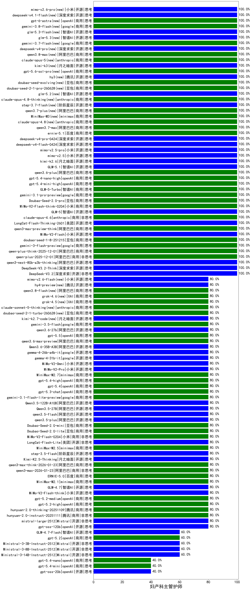

|类别|机构|大模型|【妇产科主管护师】准确率|平均耗时|平均消耗token|花费/千次（元）|排名（准确率）|
|---|---|-----|-------------------|-------|-----------|-----------|-----------|
|商用|openAI|gpt-5.4-mini-high|100.0%|15s|1294|37.7|1|
|商用|minimax|MiniMax-M3(new)|100.0%|19s|609|7.1|2|
|开源|智谱AI|GLM-5|100.0%|44s|1700|29.4|3|
|商用|豆包|doubao-seed-evolving(new)|100.0%|183s|6708|198.2|4|
|商用|豆包|doubao-seed-2-1-pro-260628(new)|100.0%|235s|9972|296.2|5|
|商用|小米|MiMo-V2-Flash-think-0204|100.0%|1073s|1876|3.8|6|
|商用|豆包|Doubao-Seed-2.0-pro|100.0%|166s|778|10.8|7|
|开源|智谱AI|glm-5.2(new)|100.0%|26s|1108|29.2|8|
|商用|anthropic|claude-opus-4.8-thinking(new)|100.0%|11s|770|114.8|9|
|商用|google|gemini-3.1-pro-preview|100.0%|45s|1318|105.5|10|
|开源|阶跃星辰|step-3.7-flash(new)|100.0%|19s|1392|10.7|11|
|商用|阿里巴巴|qwen3.7-plus(new)|100.0%|22s|1081|8.1|12|
|商用|anthropic|claude-opus-4.8(new)|100.0%|10s|618|88.2|13|
|商用|openAI|gpt-5.6-sol-pro(new)|100.0%|22s|4144|354.0|14|
|商用|阿里巴巴|qwen3.7-max|100.0%|22s|982|33.2|15|
|商用|百度|ernie-5.1|100.0%|21s|834|13.9|16|
|商用|智谱AI|GLM-5-Turbo|100.0%|21s|1150|23.9|17|
|开源|深度求索|deepseek-v4-pro-0424|100.0%|23s|801|18.2|18|
|商用|openAI|gpt-5.4-nano-high|100.0%|25s|638|4.7|19|
|开源|深度求索|deepseek-v4-flash-0424|100.0%|31s|629|1.2|20|
|开源|小米|mimo-v2.5-pro|100.0%|22s|1144|19.3|21|
|开源|小米|mimo-v2.5|100.0%|25s|1415|16.1|22|
|商用|阿里巴巴|qwen3.6-plus|100.0%|38s|1796|20.7|23|
|开源|月之暗面|kimi-k2.6|100.0%|177s|2339|61.5|24|
|开源|腾讯|hy3(new)|100.0%|83s|267|0.8|25|
|商用|anthropic|claude-opus-4.6|100.0%|13s|731|107.6|26|
|开源|月之暗面|kimi-k3(new)|100.0%|43s|896|76.8|27|
|商用|google|gemini-3-flash-preview|100.0%|113s|1169|23.2|28|
|开源|深度求索|DeepSeek-V3.2|100.0%|56s|380|1.1|29|
|开源|深度求索|DeepSeek-V3.2-Think|100.0%|49s|849|2.5|30|
|开源|阿里巴巴|qwen3-next-80b-a3b-thinking|100.0%|69s|3034|11.8|31|
|开源|小米|mimo-v2.6-pro(new)|100.0%|37s|1151|6.6|32|
|开源|深度求索|deepseek-v4.1-flash(new)|100.0%|11s|1604|12.2|33|
|商用|openAI|gpt-6-astra(new)|100.0%|11s|347|88.3|34|
|商用|google|gemini-3.8-flash(new)|100.0%|10s|696|32.5|35|
|开源|智谱AI|glm-5.3-flash(new)|100.0%|31s|1134|3.0|36|
|商用|阿里巴巴|qwen-plus-2025-12-01|100.0%|22s|840|1.6|37|
|开源|智谱AI|glm-5.3(new)|100.0%|36s|1189|31.4|38|
|商用|google|gemini-3.7-flash(new)|100.0%|5s|765|18.1|39|
|商用|阿里巴巴|qwen-plus-think-2025-12-01|100.0%|47s|2098|16.1|40|
|商用|豆包|doubao-seed-1-8-251215|100.0%|28s|729|4.9|41|
|开源|深度求索|deepseek-v4-pro(new)|100.0%|29s|992|23.9|42|
|开源|美团|LongCat-Flash-Thinking-2601|100.0%|244s|2516|0.0|43|
|商用|anthropic|claude-opus-5(new)|100.0%|15s|760|113.0|44|
|商用|阿里巴巴|qwen3-max-preview-think|100.0%|232s|3192|74.9|45|
|商用|阿里巴巴|qwen3.8-max(new)|100.0%|18s|780|25.0|46|
|开源|智谱AI|GLM-5.1|100.0%|148s|1201|27.3|47|
|开源|小米|MiMo-V2-Flash|100.0%|252s|476|0.0|48|
|商用|google|gemini-3.5-flash|80.0%|8s|1448|86.2|49|
|商用|阿里巴巴|qwen3.8-flash(new)|80.0%|43s|698|1.6|50|
|开源|阿里巴巴|qwen3.6-27b|80.0%|31s|1965|34.0|51|
|开源|月之暗面|kimi-k2.7-code(new)|80.0%|32s|1206|30.9|52|
|商用|豆包|doubao-seed-2-1-turbo-260628(new)|80.0%|106s|4992|73.4|53|
|商用|XAI|grok-4.6(new)|80.0%|37s|1661|61.7|54|
|开源|腾讯|hy4-preview(new)|80.0%|125s|4977|88.4|55|
|商用|XAI|grok-4.5(new)|80.0%|38s|1046|35.9|56|
|开源|阿里巴巴|Qwen3.6-35B-A3B|80.0%|11s|1822|18.9|57|
|商用|anthropic|claude-sonnet-5-thinking(new)|80.0%|35s|975|60.2|58|
|商用|阿里巴巴|qwen3.6-max-preview|80.0%|56s|1825|94.5|59|
|商用|openAI|gpt-5.5|80.0%|9s|603|106.0|60|
|开源|openAI|gpt-oss-120b|80.0%|3s|643|1.7|61|
|开源|google|gemma-4-26b-a4b-it|80.0%|95s|696|1.7|62|
|商用|minimax|MiniMax-M2.1|80.0%|69s|1221|9.5|63|
|开源|google|gemma-4-31b-it|80.0%|61s|565|1.4|64|
|开源|阶跃星辰|step-3.5-flash|80.0%|23s|2042|4.2|65|
|开源|月之暗面|Kimi-K2.5-Thinking|80.0%|334s|1706|34.4|66|
|商用|阿里巴巴|qwen3-max-think-2026-01-23|80.0%|102s|3126|30.5|67|
|商用|阿里巴巴|qwen3-max-2026-01-23|80.0%|108s|629|5.6|68|
|商用|百度|ERNIE-5.0|80.0%|187s|1718|39.9|69|
|开源|智谱AI|GLM-4.7|80.0%|52s|1914|25.9|70|
|商用|小米|MiMo-V2-Flash-0204|80.0%|382s|579|1.1|71|
|开源|小米|MiMo-V2-Flash-think|80.0%|25s|2223|0.0|72|
|商用|openAI|gpt-5.2-medium|80.0%|12s|489|38.3|73|
|商用|openAI|gpt-5.2-high|80.0%|13s|596|49.0|74|
|商用|腾讯|hunyuan-2.0-thinking-20251109|80.0%|11s|640|2.3|75|
|商用|腾讯|hunyuan-2.0-instruct-20251111|80.0%|5s|445|0.7|76|
|开源|Mistral|mistral-large-2512|80.0%|19s|797|7.5|77|
|开源|美团|LongCat-Flash-Lite|80.0%|518s|544|0.0|78|
|商用|minimax|MiniMax-M2.5|80.0%|31s|1639|13.0|79|
|商用|豆包|Doubao-Seed-2.0-lite|80.0%|177s|927|3.0|80|
|商用|openAI|gpt-5.4|80.0%|22s|397|31.3|81|
|开源|小米|MiMo-V2-Omni|80.0%|190s|1744|20.6|82|
|开源|小米|MiMo-V2-Pro|80.0%|142s|1472|26.2|83|
|商用|minimax|MiniMax-M2.7|80.0%|51s|1882|15.1|84|
|商用|豆包|Doubao-Seed-2.0-mini|80.0%|242s|1102|2.0|85|
|商用|openAI|gpt-5.4-high|80.0%|22s|1265|122.5|86|
|开源|小米|mimo-v2.6-flash(new)|80.0%|33s|1015|1.9|87|
|商用|openAI|gpt-5.3-chat|80.0%|48s|477|36.6|88|
|商用|google|gemini-3.1-flash-lite-preview|80.0%|7s|466|4.1|89|
|开源|阿里巴巴|Qwen3.5-122B-A10B|80.0%|306s|2365|14.6|90|
|开源|阿里巴巴|Qwen3.5-27B|80.0%|328s|2624|12.2|91|
|开源|阿里巴巴|qwen3.5-flash|80.0%|114s|2564|5.0|92|
|开源|阿里巴巴|qwen3.5-plus|80.0%|26s|2027|9.4|93|
|开源|智谱AI|GLM-4.7-Flash|60.0%|2500s|2606|0.0|94|
|商用|openAI|gpt-5.2|60.0%|7s|275|17.0|95|
|开源|Mistral|Ministral-3-3B-Instruct-2512|60.0%|12s|935|0.7|96|
|开源|Mistral|Ministral-3-8B-Instruct-2512|60.0%|14s|704|0.8|97|
|开源|Mistral|Ministral-3-14B-Instruct-2512|60.0%|5s|648|0.9|98|
|开源|openAI|gpt-oss-20b|40.0%|340s|1058|1.1|99|
|商用|openAI|gpt-5.4-nano|40.0%|10s|254|1.4|100|
|商用|openAI|gpt-5.4-mini|40.0%|171s|368|8.5|101|

