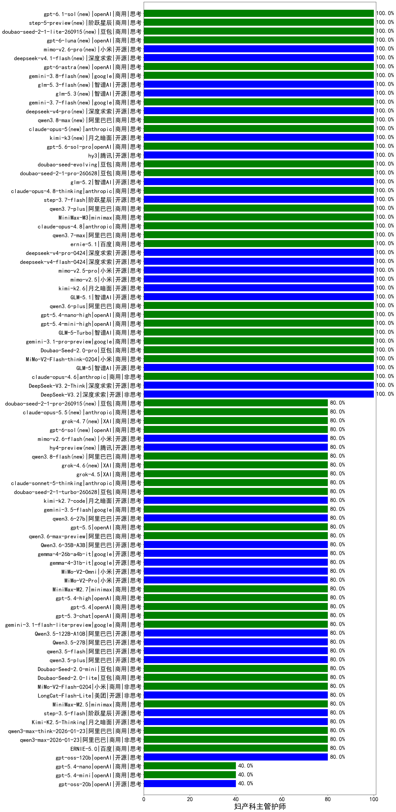

|类别|机构|大模型|【妇产科主管护师】准确率|平均耗时|平均消耗token|花费/千次（元）|排名（准确率）|
|---|---|-----|-------------------|-------|-----------|-----------|-----------|
|开源|月之暗面|kimi-k3.1-pro(new)|100.0%|62s|2055|130.9|1|
|开源|智谱AI|glm-5.3-flash(new)|100.0%|31s|1134|3.0|2|
|商用|anthropic|claude-opus-4.8|100.0%|10s|618|88.2|3|
|商用|minimax|MiniMax-M3|100.0%|19s|609|7.1|4|
|商用|阿里巴巴|qwen3.7-plus|100.0%|22s|1081|8.1|5|
|开源|阶跃星辰|step-3.7-flash|100.0%|19s|1392|10.7|6|
|商用|anthropic|claude-opus-4.8-thinking|100.0%|11s|770|114.8|7|
|开源|小米|mimo-v2.6-pro(new)|100.0%|37s|1151|6.6|8|
|开源|智谱AI|glm-5.2|100.0%|26s|1108|29.2|9|
|商用|豆包|doubao-seed-2-1-pro-260628|100.0%|235s|9972|296.2|10|
|商用|豆包|doubao-seed-evolving|100.0%|183s|6708|198.2|11|
|开源|深度求索|deepseek-v4.1-flash(new)|100.0%|11s|1604|12.2|12|
|开源|腾讯|hy3|100.0%|83s|267|0.8|13|
|商用|openAI|gpt-6-astra(new)|100.0%|11s|347|88.3|14|
|商用|openAI|gpt-5.6-sol-pro|100.0%|22s|4144|354.0|15|
|开源|月之暗面|kimi-k3|100.0%|43s|896|76.8|16|
|商用|anthropic|claude-opus-5|100.0%|15s|760|113.0|17|
|商用|阿里巴巴|qwen3.8-max|100.0%|18s|780|25.0|18|
|开源|深度求索|deepseek-v4-pro|100.0%|29s|992|23.9|19|
|商用|google|gemini-3.8-flash(new)|100.0%|10s|696|32.5|20|
|商用|google|gemini-3.7-flash|100.0%|5s|765|18.1|21|
|商用|阿里巴巴|qwen3.7-max|100.0%|22s|982|33.2|22|
|商用|百度|ernie-5.1|100.0%|21s|834|13.9|23|
|商用|openAI|gpt-6-luna(new)|100.0%|73s|468|1.3|24|
|开源|智谱AI|GLM-5.1|100.0%|148s|1201|27.3|25|
|开源|深度求索|DeepSeek-V3.2|100.0%|56s|380|1.1|26|
|开源|深度求索|DeepSeek-V3.2-Think|100.0%|49s|849|2.5|27|
|商用|google|gemini-3.1-pro-preview|100.0%|45s|1318|105.5|28|
|商用|google|gemini-4-argon(new)|100.0%|13s|709|86.1|29|
|商用|openAI|gpt-6.1-sol(new)|100.0%|6s|297|14.2|30|
|商用|阶跃星辰|step-5-preview(new)|100.0%|17s|1198|22.8|31|
|商用|阿里巴巴|qwen3.6-plus|100.0%|38s|1796|20.7|32|
|商用|豆包|doubao-seed-2-1-lite-260915(new)|100.0%|24s|880|2.2|33|
|开源|智谱AI|glm-5.3(new)|100.0%|36s|1189|31.4|34|
|开源|月之暗面|kimi-k2.6|100.0%|177s|2339|61.5|35|
|开源|小米|mimo-v2.5|100.0%|25s|1415|16.1|36|
|开源|小米|mimo-v2.5-pro|100.0%|22s|1144|19.3|37|
|开源|深度求索|deepseek-v4-flash-0424|100.0%|31s|629|1.2|38|
|开源|深度求索|deepseek-v4-pro-0424|100.0%|23s|801|18.2|39|
|开源|腾讯|hy4-preview(new)|80.0%|125s|4977|88.4|40|
|开源|小米|mimo-v2.6-flash(new)|80.0%|33s|1015|1.9|41|
|商用|anthropic|claude-opus-5.5(new)|80.0%|16s|822|98.9|42|
|商用|XAI|grok-4.7(new)|80.0%|56s|3921|127.6|43|
|商用|anthropic|claude-sonnet-5.5(new)|80.0%|7s|631|36.1|44|
|商用|minimax|MiniMax-M3.1-Flash(new)|80.0%|37s|2483|9.1|45|
|商用|openAI|gpt-6-sol(new)|80.0%|93s|316|15.5|46|
|商用|豆包|doubao-seed-2-1-pro-260915(new)|80.0%|37s|1345|37.3|47|
|开源|openAI|gpt-oss-120b|80.0%|3s|643|1.7|48|
|商用|阿里巴巴|qwen3.8-flash(new)|80.0%|43s|698|1.6|49|
|商用|XAI|grok-4.6|80.0%|37s|1661|61.7|50|
|商用|百度|ERNIE-5.0|80.0%|187s|1718|39.9|51|
|开源|阿里巴巴|Qwen3.5-27B|80.0%|328s|2624|12.2|52|
|开源|阿里巴巴|Qwen3.5-122B-A10B|80.0%|306s|2365|14.6|53|
|商用|google|gemini-3.1-flash-lite-preview|80.0%|7s|466|4.1|54|
|商用|minimax|MiniMax-M2.7|80.0%|51s|1882|15.1|55|
|开源|google|gemma-4-31b-it|80.0%|61s|565|1.4|56|
|开源|google|gemma-4-26b-a4b-it|80.0%|95s|696|1.7|57|
|开源|阿里巴巴|Qwen3.6-35B-A3B|80.0%|11s|1822|18.9|58|
|商用|阿里巴巴|qwen3.6-max-preview|80.0%|56s|1825|94.5|59|
|商用|openAI|gpt-5.5|80.0%|9s|603|106.0|60|
|开源|阿里巴巴|qwen3.6-27b|80.0%|31s|1965|34.0|61|
|商用|google|gemini-3.5-flash|80.0%|8s|1448|86.2|62|
|开源|月之暗面|kimi-k2.7-code|80.0%|32s|1206|30.9|63|
|商用|anthropic|claude-sonnet-5-thinking|80.0%|35s|975|60.2|64|
|商用|XAI|grok-4.5|80.0%|38s|1046|35.9|65|
|商用|豆包|doubao-seed-2-1-turbo-260628|80.0%|106s|4992|73.4|66|
|商用|anthropic|claude-haiku-5.5(new)|60.0%|7s|1055|3.3|67|
|开源|openAI|gpt-oss-20b|40.0%|340s|1058|1.1|68|

