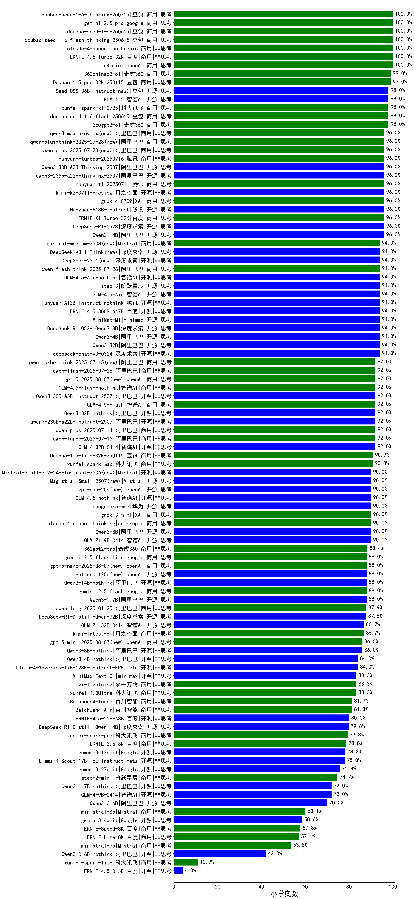

| 类别 | 大模型                         | 小学奥数 | 排名 |
|-----|------------------------------|---------|----|
|开源|DeepSeek-R1|99.0|1|
|商用|hunyuan-t1-20250321|99.0|2|
|商用|Doubao-1.5-pro-32k-250115|99.0|3|
|商用|360zhinao2-o1|99.0|4|
|商用|qwq-plus-2025-03-05|98.0|5|
|商用|360gpt2-o1|98.0|6|
|商用|gemini-2.5-pro-preview-03-25(new)|98.0|7|
|开源|qwq-32b|97.0|8|
|商用|xunfei-spark-x1(new)|97.0|9|
|商用|hunyuan-turbo|96.9|10|
|开源|Qwen3-14B(new)|96.5|11|
|开源|Qwen3-235B-A22B(new)|96.5|12|
|开源|Qwen3-32B(new)|96.5|13|
|商用|ERNIE-X1-32K-Preview|96.0|14|
|开源|Qwen3-30B-A3B(new)|96.0|15|
|开源|deepseek-chat-v3-0324|95.5|16|
|商用|hunyuan-turbos-20250313|95.5|17|
|开源|Qwen3-4B(new)|95.0|18|
|开源|Qwen3-8B(new)|94.5|19|
|开源|GLM-4-32B-0414(new)|93.9|20|
|商用|ERNIE-4.5-8K-Preview|93.9|21|
|商用|hunyuan-turbos-20250226|93.4|22|
|商用|hunyuan-standard|93.3|23|
|商用|gemini-2.5-flash-preview-04-17(new)|93.3|24|
|商用|GLM-Z1-Air(new)|92.0|25|
|开源|GLM-Z1-9B-0414(new)|91.9|26|
|开源|hunyuan-large|91.9|27|
|商用|SenseChat-5-beta|91.8|28|
|商用|qwen-plus|91.4|29|
|商用|Doubao-1.5-lite-32k-250115|90.9|30|
|开源|Llama-4-Maverick-17B-128E-Instruct-FP8|90.8|31|
|商用|xunfei-spark-max|90.8|32|
|商用|GLM-Z1-AirX(new)|90.0|33|
|商用|GLM-Z1-FlashX(new)|90.0|34|
|商用|GLM-Z1-Flash(new)|90.0|35|
|开源|GLM-Z1-Rumination-32B-0414(new)|90.0|36|
|商用|gemini-2.0-flash-001|89.9|37|
|开源|qwen2.5-32b-instruct|88.9|38|
|商用|360gpt2-pro|88.4|39|
|商用|qwen-long|87.9|40|
|商用|ERNIE-4.0-Turbo-8K|87.8|41|
|开源|DeepSeek-R1-Distill-Qwen-32B|87.8|42|
|开源|Qwen3-1.7B(new)|87.0|43|
|商用|qwen2.5-max|86.9|44|
|开源|qwen2.5-72b-instruct|86.7|45|
|商用|kimi-latest-8k|86.7|46|
|商用|SenseChat-5-1202|86.7|47|
|开源|GLM-Z1-32B-0414(new)|86.7|48|
|商用|o3-mini|86.7|49|
|开源|qwen2.5-14b-instruct|84.3|50|
|开源|DeepSeek-R1-Distill-Llama-70B|83.7|51|
|商用|xunfei-4.0Ultra|83.3|52|
|商用|yi-lightning|83.3|53|
|开源|MiniMax-Text-01|83.3|54|
|商用|360gpt-turbo|81.8|55|
|商用|mistral-large|81.6|56|
|开源|Llama-4-Scout-17B-16E-Instruct|81.3|57|
|商用|Baichuan4-Turbo|81.3|58|
|商用|Baichuan4-Air|81.3|59|
|开源|phi-4|80.3|60|
|商用|Claude-3.5-Sonnet|80.0|61|
|商用|qwen-turbo|79.8|62|
|开源|DeepSeek-R1-Distill-Qwen-14B|79.8|63|
|商用|xunfei-spark-pro|79.3|64|
|商用|ERNIE-3.5-8K|78.8|65|
|开源|Mistral-Small-3.1-24B-Instruct-2503|78.8|66|
|开源|gemma-3-12b-it|78.3|67|
|开源|DeepSeek-R1-Distill-Qwen-7B|77.8|68|
|商用|abab6.5s-chat|76.8|69|
|商用|GLM-4-Air|76.8|70|
|商用|GLM-4-Plus|76.7|71|
|商用|chatgpt-4o-latest|76.7|72|
|商用|mistral-small|76.3|73|
|商用|gpt-4o-mini|76.3|74|
|商用|SenseChat-Turbo-1202|76.3|75|
|开源|gemma-3-27b-it|75.8|76|
|商用|GLM-4-Long|75.8|77|
|商用|step-2-mini|74.7|78|
|开源|GLM-4-9B-0414(new)|74.2|79|
|商用|GLM-4-AirX|74.2|80|
|商用|moonshot-v1-8k|73.3|81|
|开源|qwen2.5-7b-instruct|73.2|82|
|开源|internlm2_5-20b-chat|70.7|83|
|开源|Llama-3.3-70B-Instruct|69.7|84|
|商用|ERNIE-Speed-Pro-128K|66.7|85|
|开源|Meta-Llama-3.1-405B-Instruct|65.7|86|
|开源|Llama-3.3-70B-Instruct-fp8|65.7|87|
|商用|GLM-4-Flash|65.6|88|
|商用|GLM-4-FlashX|64.1|89|
|开源|glm-4-9b-chat|63.6|90|
|开源|qwen2.5-3b-instruct|63.6|91|
|开源|internlm2_5-7b-chat|62.6|92|
|开源|Qwen3-0.6B(new)|62.0|93|
|开源|DeepSeek-R1-Distill-Qwen-1.5B|60.6|94|
|商用|ministral-8b|60.1|95|
|商用|ERNIE-Lite-Pro-128K|59.1|96|
|开源|DeepSeek-R1-Distill-Llama-8B|58.6|97|
|开源|gemma-3-4b-it|58.6|98|
|商用|ERNIE-Speed-8K|57.8|99|
|商用|ERNIE-Lite-8K|57.1|100|
|商用|ministral-3b|53.5|101|
|开源|qwen2.5-1.5b-instruct|43.4|102|
|开源|Meta-Llama-3.1-8B-Instruct-fp8|36.4|103|
|开源|Llama-3.1-8B-Instruct|35.4|104|
|开源|Llama-3.2-3B-Instruct|32.8|105|
|商用|ERNIE-Tiny-8K|26.3|106|
|开源|qwen2.5-0.5b-instruct|24.2|107|
|开源|Llama-3.2-1B-Instruct|22.2|108|
|商用|xunfei-spark-lite|10.9|109|

