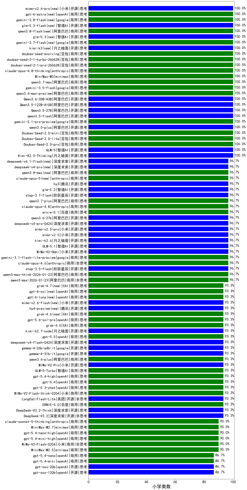

|类别|机构|大模型|【小学奥数】准确率|平均耗时|平均消耗token|花费/千次（元）|排名（准确率）|
|---|---|-----|-------------------|-------|-----------|-----------|-----------|
|商用|google|gemini-3.7-flash(new)|100.0%|21s|563|14.1|1|
|商用|豆包|doubao-seed-2-1-turbo-260628(new)|100.0%|109s|1949|28.3|2|
|开源|月之暗面|Kimi-K2.5-Thinking|100.0%|70s|811|16.5|3|
|商用|anthropic|claude-opus-4.8-thinking(new)|100.0%|6s|388|61.2|4|
|商用|minimax|MiniMax-M3(new)|100.0%|16s|576|7.1|5|
|商用|豆包|Doubao-Seed-2.0-pro|100.0%|117s|600|8.6|6|
|商用|豆包|Doubao-Seed-2.0-lite|100.0%|114s|534|1.7|7|
|商用|豆包|Doubao-Seed-2.0-mini|100.0%|131s|765|1.4|8|
|开源|阿里巴巴|qwen3.5-plus|100.0%|24s|1838|8.7|9|
|商用|google|gemini-3.1-pro-preview|100.0%|17s|929|76.9|10|
|开源|阿里巴巴|qwen3.5-flash|100.0%|304s|2034|4.0|11|
|开源|阿里巴巴|Qwen3.5-27B|100.0%|315s|1894|8.9|12|
|开源|阿里巴巴|Qwen3.5-122B-A10B|100.0%|95s|2009|12.6|13|
|开源|智谱AI|glm-5.3(new)|100.0%|-96s|485|12.8|14|
|商用|阿里巴巴|qwen3.7-max|100.0%|29s|506|17.3|15|
|商用|google|gemini-3.5-flash|100.0%|6s|957|58.6|16|
|开源|智谱AI|glm-5.3-flash(new)|100.0%|20s|542|1.4|17|
|商用|阿里巴巴|qwen3.8-flash(new)|100.0%|24s|520|1.2|18|
|开源|阿里巴巴|Qwen3.6-35B-A3B|100.0%|9s|1384|14.6|19|
|商用|豆包|doubao-seed-2-1-pro-260628(new)|100.0%|97s|3551|104.7|20|
|开源|智谱AI|GLM-5|100.0%|52s|1078|19.0|21|
|开源|智谱AI|GLM-4.7|100.0%|35s|1257|17.2|22|
|商用|豆包|doubao-seed-1-8-251215|100.0%|17s|354|2.3|23|
|商用|openAI|gpt-6-astra(new)|100.0%|12s|129|34.7|24|
|商用|google|gemini-3.8-flash(new)|100.0%|11s|575|28.9|25|
|开源|月之暗面|kimi-k3(new)|100.0%|24s|425|33.5|26|
|商用|google|gemini-3-flash-preview|100.0%|11s|649|13.3|27|
|商用|腾讯|hunyuan-2.0-thinking-20251109|100.0%|7s|726|2.8|28|
|商用|阿里巴巴|qwen3.6-max-preview|100.0%|26s|873|45.5|29|
|商用|豆包|doubao-seed-evolving(new)|100.0%|206s|3290|96.9|30|
|商用|google|gemini-3.1-flash-lite-preview|96.7%|3s|191|1.7|31|
|开源|智谱AI|GLM-5.1|96.7%|45s|844|19.7|32|
|开源|小米|mimo-v2.5|96.7%|10s|875|9.2|33|
|开源|小米|mimo-v2.5-pro|96.7%|8s|665|10.0|34|
|开源|小米|MiMo-V2-Omni|96.7%|44s|788|7.9|35|
|开源|深度求索|deepseek-v4-pro-0424|96.7%|19s|385|8.9|36|
|开源|阿里巴巴|qwen3.6-27b|96.7%|32s|2049|36.3|37|
|开源|深度求索|deepseek-v4-pro(new)|96.7%|49s|622|14.8|38|
|商用|百度|ernie-5.1|96.7%|14s|415|7.0|39|
|商用|阿里巴巴|qwen3.8-max(new)|96.7%|13s|546|17.8|40|
|商用|anthropic|claude-opus-5(new)|96.7%|6s|350|54.4|41|
|开源|深度求索|deepseek-v4.1-flash(new)|96.7%|3s|343|2.4|42|
|开源|阶跃星辰|step-3.5-flash|96.7%|18s|962|2.0|43|
|开源|腾讯|hy3(new)|96.7%|59s|157|0.5|44|
|开源|智谱AI|glm-5.2(new)|96.7%|86s|921|25.0|45|
|商用|阿里巴巴|qwen3-max-2026-01-23|96.7%|104s|264|2.4|46|
|商用|anthropic|claude-opus-4.6|96.7%|8s|254|37.2|47|
|开源|月之暗面|kimi-k2.6|96.7%|23s|566|14.6|48|
|商用|阿里巴巴|qwen3-max-think-2026-01-23|96.7%|162s|1112|10.8|49|
|开源|阶跃星辰|step-3.7-flash(new)|96.7%|8s|488|3.7|50|
|商用|阿里巴巴|qwen3.7-plus(new)|96.7%|12s|554|4.2|51|
|商用|腾讯|hunyuan-2.0-instruct-20251111|96.7%|4s|385|0.7|52|
|商用|anthropic|claude-opus-4.8(new)|96.7%|6s|302|46.0|53|
|商用|阿里巴巴|qwen-plus-think-2025-12-01|96.7%|21s|977|7.5|54|
|商用|阿里巴巴|qwen-plus-2025-12-01|96.7%|11s|389|0.7|55|
|商用|阿里巴巴|qwen3-max-preview-think|96.7%|58s|832|19.2|56|
|商用|XAI|grok-4.5(new)|93.3%|43s|730|24.1|57|
|商用|openAI|gpt-5.6-sol-pro(new)|93.3%|47s|2218|136.2|58|
|开源|深度求索|deepseek-v4-flash-0424|93.3%|24s|378|0.7|59|
|开源|月之暗面|kimi-k2.7-code(new)|93.3%|12s|307|7.6|60|
|商用|XAI|grok-4.6(new)|93.3%|14s|798|26.9|61|
|商用|openAI|gpt-5.5|93.3%|5s|175|30.1|62|
|开源|腾讯|hy4-preview(new)|93.3%|12s|560|9.5|63|
|开源|google|gemma-4-26b-a4b-it|93.3%|46s|248|0.6|64|
|开源|美团|LongCat-Flash-Lite|93.3%|305s|566|0.0|65|
|开源|深度求索|DeepSeek-V3.2|93.3%|102s|299|0.9|66|
|开源|深度求索|DeepSeek-V3.2-Think|93.3%|19s|569|1.7|67|
|开源|阿里巴巴|qwen3-next-80b-a3b-thinking|93.3%|16s|1206|4.7|68|
|开源|Mistral|mistral-large-2512|93.3%|7s|295|2.9|69|
|商用|openAI|gpt-5.2-high|93.3%|7s|205|17.1|70|
|商用|openAI|gpt-5.2-medium|93.3%|7s|188|15.4|71|
|开源|小米|MiMo-V2-Flash-think|93.3%|173s|1399|0.0|72|
|商用|minimax|MiniMax-M2.1|93.3%|89s|757|5.9|73|
|开源|美团|LongCat-Flash-Thinking-2601|93.3%|141s|1441|0.0|74|
|开源|google|gemma-4-31b-it|93.3%|29s|207|0.5|75|
|商用|百度|ERNIE-5.0|93.3%|114s|1318|31.2|76|
|商用|小米|MiMo-V2-Flash-think-0204|93.3%|270s|1624|3.3|77|
|商用|openAI|gpt-5.3-chat|93.3%|10s|216|17.9|78|
|商用|openAI|gpt-5.4-high|93.3%|19s|219|19.7|79|
|商用|智谱AI|GLM-5-Turbo|93.3%|30s|795|16.9|80|
|开源|小米|MiMo-V2-Pro|93.3%|8s|644|9.6|81|
|商用|阿里巴巴|qwen3.6-plus|93.3%|42s|1190|13.9|82|
|商用|openAI|gpt-5.4|93.3%|3s|136|11.0|83|
|商用|minimax|MiniMax-M2.5|90.0%|17s|789|6.2|84|
|商用|小米|MiMo-V2-Flash-0204|90.0%|24s|332|0.6|85|
|开源|智谱AI|GLM-4.7-Flash|90.0%|1374s|1215|0.0|86|
|商用|anthropic|claude-sonnet-5-thinking(new)|90.0%|11s|371|23.2|87|
|开源|小米|MiMo-V2-Flash|90.0%|57s|302|0.0|88|
|商用|openAI|gpt-5.4-mini-high|90.0%|29s|247|6.8|89|
|商用|openAI|gpt-5.2|90.0%|9s|138|10.5|90|
|商用|openAI|gpt-5.4-nano-high|90.0%|11s|306|2.4|91|
|商用|minimax|MiniMax-M2.7|90.0%|21s|816|6.4|92|
|开源|openAI|gpt-oss-120b|86.7%|87s|563|1.6|93|
|商用|openAI|gpt-5.4-nano|86.7%|71s|146|1.0|94|
|开源|openAI|gpt-oss-20b|86.7%|225s|1189|1.3|95|
|商用|openAI|gpt-5.4-mini|86.7%|6s|131|3.1|96|
|开源|Mistral|Ministral-3-8B-Instruct-2512|83.3%|12s|315|0.3|97|
|开源|Mistral|Ministral-3-14B-Instruct-2512|80.0%|12s|285|0.4|98|
|开源|Mistral|Ministral-3-3B-Instruct-2512|76.7%|11s|351|0.2|99|

