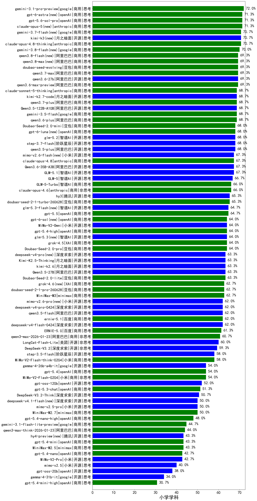

|类别|机构|大模型|【小学学科】准确率|平均耗时|平均消耗token|花费/千次（元）|排名（准确率）|
|---|---|-----|-------------------|-------|-----------|-----------|-----------|
|商用|google|gemini-3.1-pro-preview|72.0%|37s|2085|173.6|1|
|商用|openAI|gpt-6-astra(new)|71.3%|12s|232|63.7|2|
|商用|openAI|gpt-5.6-sol-pro(new)|71.3%|18s|3296|265.9|3|
|商用|anthropic|claude-opus-5(new)|71.3%|17s|607|94.4|4|
|商用|google|gemini-3.7-flash(new)|70.7%|8s|694|17.0|5|
|开源|月之暗面|kimi-k3(new)|70.7%|69s|1257|115.2|6|
|商用|anthropic|claude-opus-4.8-thinking(new)|70.7%|12s|857|138.0|7|
|商用|google|gemini-3.8-flash(new)|70.0%|13s|1041|52.2|8|
|商用|阿里巴巴|qwen3.7-max|69.3%|40s|1985|70.1|9|
|商用|阿里巴巴|qwen3.6-max-preview|69.3%|68s|1902|100.1|10|
|商用|豆包|doubao-seed-evolving(new)|69.3%|265s|9424|280.4|11|
|开源|阿里巴巴|qwen3.6-27b|69.3%|80s|5436|97.0|12|
|商用|阿里巴巴|qwen3.8-max(new)|69.3%|62s|2510|88.1|13|
|商用|阿里巴巴|qwen3.8-flash(new)|69.3%|59s|2596|6.8|14|
|开源|阿里巴巴|Qwen3.5-122B-A10B|68.7%|348s|4572|28.9|15|
|开源|月之暗面|kimi-k2.7-code(new)|68.7%|39s|1301|34.0|16|
|商用|anthropic|claude-sonnet-5-thinking(new)|68.7%|25s|1582|105.9|17|
|商用|阿里巴巴|qwen3.7-plus(new)|68.7%|57s|2954|23.3|18|
|商用|阿里巴巴|qwen3.6-plus|68.7%|65s|2865|33.8|19|
|商用|google|gemini-3-flash-preview|68.7%|62s|1903|39.5|20|
|商用|google|gemini-3.5-flash|68.7%|11s|1796|110.1|21|
|商用|豆包|Doubao-Seed-2.0-mini|68.0%|367s|2629|5.1|22|
|开源|智谱AI|glm-5.2(new)|68.0%|77s|2663|73.3|23|
|开源|阿里巴巴|qwen3.5-plus|68.0%|46s|3849|18.2|24|
|开源|阶跃星辰|step-3.7-flash(new)|68.0%|34s|3122|24.9|25|
|商用|anthropic|claude-opus-4.8(new)|67.3%|10s|659|103.4|26|
|开源|阿里巴巴|Qwen3.6-35B-A3B|67.3%|48s|4477|47.8|27|
|开源|智谱AI|GLM-5.1|67.3%|135s|2278|53.7|28|
|商用|阿里巴巴|qwen-plus-2025-12-01|67.3%|29s|1274|2.5|29|
|开源|智谱AI|GLM-5|66.7%|112s|2939|52.1|30|
|商用|智谱AI|GLM-5-Turbo|66.0%|46s|2745|59.5|31|
|商用|anthropic|claude-opus-4.6|66.0%|18s|469|70.2|32|
|开源|腾讯|hy3(new)|65.3%|54s|304|1.0|33|
|商用|豆包|doubao-seed-2-1-turbo-260628(new)|65.3%|196s|8338|123.9|34|
|开源|智谱AI|glm-5.3-flash(new)|64.7%|83s|2295|6.3|35|
|商用|openAI|gpt-5.5|64.7%|21s|473|88.4|36|
|开源|小米|MiMo-V2-Omni|64.0%|231s|2166|26.9|37|
|商用|openAI|gpt-5.4-high|64.0%|16s|722|70.4|38|
|开源|智谱AI|glm-5.3(new)|64.0%|188s|4376|121.3|39|
|商用|XAI|grok-4.5(new)|64.0%|85s|2908|114.8|40|
|商用|豆包|Doubao-Seed-2.0-pro|64.0%|242s|1091|16.2|41|
|开源|深度求索|deepseek-v4-pro(new)|63.3%|84s|3317|87.2|42|
|开源|月之暗面|Kimi-K2.5-Thinking|63.3%|483s|3281|68.0|43|
|开源|阿里巴巴|Qwen3.5-27B|63.3%|317s|4168|19.8|44|
|商用|腾讯|hunyuan-2.0-thinking-20251109|63.3%|55s|1828|7.2|45|
|开源|月之暗面|kimi-k2.6|63.3%|116s|2938|78.2|46|
|商用|豆包|Doubao-Seed-2.0-lite|63.3%|211s|1059|3.5|47|
|商用|XAI|grok-4.6(new)|62.7%|54s|2151|83.1|48|
|商用|豆包|doubao-seed-2-1-pro-260628(new)|62.7%|222s|8556|254.4|49|
|商用|minimax|MiniMax-M3(new)|62.7%|194s|2606|41.0|50|
|开源|深度求索|deepseek-v4-pro-0424|62.0%|58s|1747|41.3|51|
|开源|阿里巴巴|qwen3.5-flash|62.0%|266s|4714|9.3|52|
|商用|百度|ernie-5.1|62.0%|44s|1453|25.4|53|
|开源|深度求索|deepseek-v4-flash-0424|62.0%|42s|1994|3.9|54|
|商用|豆包|doubao-seed-1-8-251215|61.3%|22s|652|4.5|55|
|商用|腾讯|hunyuan-2.0-instruct-20251111|61.3%|29s|682|1.3|56|
|商用|百度|ERNIE-5.0|61.3%|222s|2859|67.7|57|
|商用|阿里巴巴|qwen3-max-2026-01-23|60.7%|145s|907|8.6|58|
|商用|阿里巴巴|qwen-plus-think-2025-12-01|60.7%|93s|3039|23.9|59|
|开源|美团|LongCat-Flash-Lite|60.0%|171s|791|0.0|60|
|开源|智谱AI|GLM-4.7|60.0%|66s|2614|36.0|61|
|开源|深度求索|DeepSeek-V3.2|59.3%|81s|620|1.8|62|
|开源|阿里巴巴|qwen3-next-80b-a3b-thinking|59.3%|166s|4114|16.3|63|
|开源|阶跃星辰|step-3.5-flash|58.0%|32s|3655|7.6|64|
|商用|小米|MiMo-V2-Flash-think-0204|58.0%|490s|2816|5.8|65|
|开源|小米|MiMo-V2-Flash|55.3%|55s|1097|0.0|66|
|开源|google|gemma-4-26b-a4b-it|54.0%|39s|662|1.7|67|
|商用|小米|MiMo-V2-Flash-0204|54.0%|290s|855|1.7|68|
|商用|openAI|gpt-5.4|54.0%|13s|266|22.5|69|
|商用|openAI|gpt-5.2|53.3%|7s|238|18.2|70|
|开源|美团|LongCat-Flash-Thinking-2601|53.3%|257s|4519|0.0|71|
|开源|openAI|gpt-oss-120b|52.0%|122s|681|1.9|72|
|商用|openAI|gpt-5.3-chat|51.3%|22s|414|35.3|73|
|商用|minimax|MiniMax-M2.1|51.3%|96s|2226|18.1|74|
|商用|openAI|gpt-5.2-high|51.3%|15s|703|64.5|75|
|开源|Mistral|mistral-large-2512|50.7%|17s|782|7.9|76|
|开源|深度求索|DeepSeek-V3.2-Think|50.7%|180s|1929|5.7|77|
|商用|openAI|gpt-5.2-medium|50.0%|11s|511|45.3|78|
|开源|小米|mimo-v2.5-pro|50.0%|39s|2153|41.0|79|
|商用|minimax|MiniMax-M2.7|50.0%|71s|3152|25.9|80|
|开源|智谱AI|GLM-4.7-Flash|49.3%|1754s|4699|0.0|81|
|商用|openAI|gpt-5.4-nano-high|48.0%|67s|822|6.7|82|
|商用|google|gemini-3.1-flash-lite-preview|44.7%|21s|332|3.0|83|
|商用|阿里巴巴|qwen3-max-think-2026-01-23|44.0%|354s|3851|38.0|84|
|商用|minimax|MiniMax-M2.5|43.3%|43s|2578|21.1|85|
|商用|openAI|gpt-5.4-mini|43.3%|23s|233|5.7|86|
|商用|openAI|gpt-5.4-nano|42.7%|27s|232|1.6|87|
|开源|小米|MiMo-V2-Pro|42.7%|892s|1346|24.0|88|
|开源|Mistral|Ministral-3-3B-Instruct-2512|41.3%|23s|2638|1.9|89|
|开源|小米|mimo-v2.5|40.0%|39s|2406|30.3|90|
|开源|Mistral|Ministral-3-14B-Instruct-2512|39.3%|21s|1628|2.3|91|
|开源|小米|MiMo-V2-Flash-think|38.7%|105s|3349|0.0|92|
|开源|openAI|gpt-oss-20b|38.0%|69s|1195|1.3|93|
|开源|Mistral|Ministral-3-8B-Instruct-2512|36.0%|29s|2862|3.1|94|
|开源|google|gemma-4-31b-it|34.0%|54s|438|1.1|95|
|商用|阿里巴巴|qwen3-max-preview-think|34.0%|136s|3241|76.6|96|
|商用|openAI|gpt-5.4-mini-high|30.7%|111s|1310|39.6|97|

