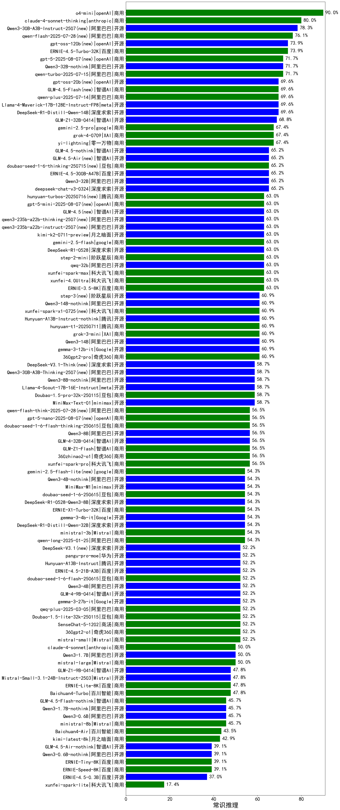

| 类别 | 大模型                         | 常识推理 | 排名 |
|-----|------------------------------|---------|----|
|商用|gemini-2.5-pro-preview-05-06(new)|90.0|1|
|商用|o4-mini(new)|90.0|2|
|商用|gemini-2.5-flash-preview-05-20(new)|90.0|3|
|商用|gemini-2.5-flash-preview-04-17|87.5|4|
|开源|Qwen3-235B-A22B|83.3|5|
|开源|Qwen3-32B|81.2|6|
|开源|Qwen3-14B|81.2|7|
|商用|Doubao-1.5-thinking-pro(new)|80.0|8|
|商用|claude-4-sonnet-thinking(new)|80.0|9|
|商用|ERNIE-4.5-Turbo-32K(new)|76.1|10|
|开源|Qwen3-4B|75.0|11|
|开源|Qwen3-1.7B|75.0|12|
|开源|Qwen3-8B|75.0|13|
|开源|hunyuan-large|71.7|14|
|开源|DeepSeek-R1-Distill-Qwen-14B|69.6|15|
|开源|Llama-4-Maverick-17B-128E-Instruct-FP8|69.6|16|
|商用|hunyuan-turbos-20250226|69.6|17|
|开源|GLM-Z1-32B-0414|68.8|18|
|开源|Qwen3-30B-A3B|68.8|19|
|商用|qwen2.5-max|67.4|20|
|商用|yi-lightning|67.4|21|
|商用|gemini-2.5-pro-preview-03-25|66.7|22|
|开源|deepseek-chat-v3-0324|65.2|23|
|开源|DeepSeek-R1|63.6|24|
|商用|xunfei-spark-max|63.0|25|
|商用|step-2-mini|63.0|26|
|商用|ERNIE-4.5-8K-Preview|63.0|27|
|开源|qwq-32b|63.0|28|
|商用|ERNIE-3.5-8K|63.0|29|
|商用|Claude-3.5-Sonnet|63.0|30|
|商用|xunfei-4.0Ultra|63.0|31|
|开源|DeepSeek-R1-0528(new)|63.0|32|
|开源|GLM-Z1-Rumination-32B-0414|62.5|33|
|商用|GLM-Z1-AirX|62.5|34|
|商用|360gpt2-pro|60.9|35|
|开源|qwen2.5-72b-instruct|60.9|36|
|开源|gemma-3-12b-it|60.9|37|
|商用|ERNIE-Lite-Pro-128K|60.9|38|
|商用|360gpt-turbo|60.9|39|
|商用|gpt-4.1-mini(new)|60.0|40|
|开源|Llama-4-Scout-17B-16E-Instruct|58.7|41|
|开源|MiniMax-Text-01|58.7|42|
|商用|qwen-plus|58.7|43|
|商用|Doubao-1.5-pro-32k-250115|58.7|44|
|商用|GLM-Z1-Air|58.7|45|
|商用|ERNIE-Speed-Pro-128K|58.7|46|
|开源|DeepSeek-R1-Distill-Llama-70B|58.7|47|
|商用|chatgpt-4o-latest|57.1|48|
|商用|SenseChat-5-beta|57.1|49|
|商用|hunyuan-turbos-20250313|56.5|50|
|开源|phi-4|56.5|51|
|商用|GLM-4-Plus|56.5|52|
|开源|qwen2.5-14b-instruct|56.5|53|
|商用|xunfei-spark-pro|56.5|54|
|开源|GLM-4-32B-0414|56.5|55|
|商用|360zhinao2-o1|56.5|56|
|开源|Qwen3-0.6B|56.2|57|
|商用|qwen-long|54.3|58|
|商用|moonshot-v1-8k|54.3|59|
|商用|hunyuan-t1-20250321|54.3|60|
|开源|gemma-3-4b-it|54.3|61|
|商用|ministral-3b|54.3|62|
|商用|hunyuan-turbo|54.3|63|
|开源|DeepSeek-R1-Distill-Qwen-32B|54.3|64|
|开源|Llama-3.2-3B-Instruct|54.3|65|
|商用|xunfei-spark-x1(new)|52.2|66|
|开源|Llama-3.1-8B-Instruct|52.2|67|
|开源|Meta-Llama-3.1-405B-Instruct|52.2|68|
|开源|Llama-3.2-1B-Instruct|52.2|69|
|开源|Meta-Llama-3.1-8B-Instruct-fp8|52.2|70|
|商用|360gpt2-o1|52.2|71|
|商用|GLM-4-AirX|52.2|72|
|商用|qwen-turbo|52.2|73|
|商用|GLM-4-Air|52.2|74|
|商用|hunyuan-standard|52.2|75|
|开源|Llama-3.3-70B-Instruct-fp8|52.2|76|
|商用|mistral-small|52.2|77|
|商用|Doubao-1.5-lite-32k-250115|52.2|78|
|商用|SenseChat-5-1202|52.2|79|
|商用|qwq-plus-2025-03-05|52.2|80|
|开源|gemma-3-27b-it|52.2|81|
|开源|GLM-4-9B-0414|52.2|82|
|开源|qwen2.5-32b-instruct|50.0|83|
|商用|claude-4-sonnet(new)|50.0|84|
|商用|mistral-large|50.0|85|
|开源|DeepSeek-R1-Distill-Qwen-7B|50.0|86|
|开源|Mistral-Small-3.1-24B-Instruct-2503|47.8|87|
|商用|SenseChat-Turbo-1202|47.8|88|
|开源|GLM-Z1-9B-0414|47.8|89|
|商用|Baichuan4-Turbo|47.8|90|
|商用|GLM-4-Long|47.8|91|
|商用|ERNIE-Lite-8K|47.8|92|
|开源|qwen2.5-3b-instruct|47.8|93|
|开源|DeepSeek-R1-0528-Qwen3-8B(new)|46.7|94|
|商用|ERNIE-X1-Turbo-32K(new)|46.7|95|
|商用|gpt-4o-mini|45.7|96|
|开源|internlm2_5-7b-chat|45.7|97|
|开源|Llama-3.3-70B-Instruct|45.7|98|
|商用|ministral-8b|45.7|99|
|开源|qwen2.5-7b-instruct|43.5|100|
|商用|GLM-Z1-FlashX|43.5|101|
|商用|Baichuan4-Air|43.5|102|
|商用|kimi-latest-8k|42.9|103|
|商用|GLM-4-Flash|41.3|104|
|开源|DeepSeek-R1-Distill-Llama-8B|41.3|105|
|商用|GLM-4-FlashX|41.3|106|
|商用|gpt-4.1(new)|40.0|107|
|商用|ERNIE-Speed-8K|39.1|108|
|商用|ERNIE-Tiny-8K|39.1|109|
|开源|qwen2.5-1.5b-instruct|34.8|110|
|商用|GLM-Z1-Flash|32.6|111|
|开源|qwen2.5-0.5b-instruct|28.3|112|
|商用|xunfei-spark-lite|17.4|113|

