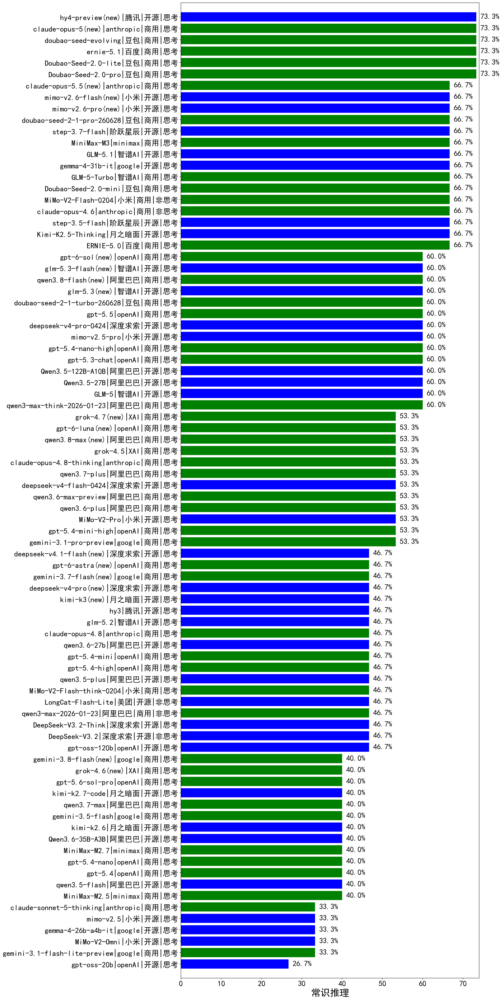

|类别|机构|大模型|【常识推理】准确率|平均耗时|平均消耗token|花费/千次（元）|排名（准确率）|
|---|---|-----|-------------------|-------|-----------|-----------|-----------|
|开源|腾讯|hy4-preview(new)|73.3%|108s|7150|128.0|1|
|商用|百度|ernie-5.1|73.3%|44s|713|12.2|2|
|商用|豆包|doubao-seed-evolving|73.3%|280s|5435|160.9|3|
|商用|anthropic|claude-opus-5(new)|73.3%|9s|455|69.3|4|
|商用|豆包|Doubao-Seed-2.0-lite|73.3%|269s|1276|4.3|5|
|商用|豆包|Doubao-Seed-2.0-pro|73.3%|207s|953|14.1|6|
|商用|anthropic|claude-opus-5.5(new)|66.7%|13s|386|45.5|7|
|商用|minimax|MiniMax-M3|66.7%|32s|788|10.5|8|
|商用|豆包|doubao-seed-2-1-pro-260628|66.7%|196s|6816|202.3|9|
|开源|智谱AI|GLM-5.1|66.7%|261s|1740|40.9|10|
|开源|google|gemma-4-31b-it|66.7%|11s|111|0.2|11|
|开源|阶跃星辰|step-3.7-flash|66.7%|15s|1479|11.6|12|
|商用|豆包|Doubao-Seed-2.0-mini|66.7%|497s|2958|5.8|13|
|商用|智谱AI|GLM-5-Turbo|66.7%|70s|1199|25.6|14|
|商用|小米|MiMo-V2-Flash-0204|66.7%|170s|307|0.6|15|
|商用|anthropic|claude-opus-4.6|66.7%|6s|247|32.7|16|
|商用|百度|ERNIE-5.0|66.7%|89s|1388|32.6|17|
|开源|月之暗面|Kimi-K2.5-Thinking|66.7%|192s|1652|33.9|18|
|开源|小米|mimo-v2.6-pro(new)|66.7%|15s|584|3.4|19|
|开源|阶跃星辰|step-3.5-flash|66.7%|25s|2408|5.0|20|
|开源|小米|mimo-v2.6-flash(new)|66.7%|154s|504|1.0|21|
|商用|豆包|doubao-seed-2-1-turbo-260628|60.0%|178s|8170|121.5|22|
|开源|深度求索|deepseek-v4-pro-0424|60.0%|37s|1299|30.7|23|
|开源|阿里巴巴|Qwen3.5-27B|60.0%|193s|3966|18.8|24|
|开源|智谱AI|GLM-5|60.0%|139s|2867|51.0|25|
|商用|openAI|gpt-6-sol(new)|60.0%|160s|200|10.9|26|
|商用|openAI|gpt-5.4-nano-high|60.0%|7s|351|2.7|27|
|开源|小米|mimo-v2.5-pro|60.0%|24s|1371|24.7|28|
|商用|阿里巴巴|qwen3-max-think-2026-01-23|60.0%|510s|3251|32.1|29|
|商用|openAI|gpt-5.5|60.0%|6s|287|50.6|30|
|开源|智谱AI|glm-5.3(new)|60.0%|291s|1982|54.5|31|
|商用|阿里巴巴|qwen3.8-flash(new)|60.0%|46s|2197|5.7|32|
|商用|openAI|gpt-5.3-chat|60.0%|6s|263|21.0|33|
|开源|智谱AI|glm-5.3-flash(new)|60.0%|103s|1255|3.4|34|
|开源|阿里巴巴|Qwen3.5-122B-A10B|60.0%|589s|3931|24.9|35|
|商用|XAI|grok-4.5|53.3%|78s|2335|91.1|36|
|商用|openAI|gpt-6-luna(new)|53.3%|166s|372|1.1|37|
|商用|阿里巴巴|qwen3.6-max-preview|53.3%|45s|1262|65.9|38|
|开源|深度求索|deepseek-v4-flash-0424|53.3%|26s|626|1.2|39|
|商用|阿里巴巴|qwen3.7-plus|53.3%|39s|1962|15.4|40|
|商用|阿里巴巴|qwen3.6-plus|53.3%|31s|1309|15.2|41|
|开源|小米|MiMo-V2-Pro|53.3%|303s|1063|18.3|42|
|商用|阿里巴巴|qwen3.8-max(new)|53.3%|53s|2000|69.9|43|
|商用|anthropic|claude-opus-4.8-thinking|53.3%|10s|457|69.6|44|
|商用|openAI|gpt-5.4-mini-high|53.3%|48s|706|20.8|45|
|商用|XAI|grok-4.7(new)|53.3%|40s|3427|107.9|46|
|商用|google|gemini-3.1-pro-preview|53.3%|45s|2481|208.1|47|
|开源|智谱AI|glm-5.2|46.7%|39s|1715|47.0|48|
|商用|openAI|gpt-6-astra(new)|46.7%|10s|154|38.2|49|
|开源|腾讯|hy3|46.7%|59s|152|0.4|50|
|开源|深度求索|deepseek-v4.1-flash(new)|46.7%|12s|2358|18.4|51|
|开源|深度求索|deepseek-v4-pro(new)|46.7%|47s|2301|59.9|52|
|商用|google|gemini-3.7-flash(new)|46.7%|4s|564|13.8|53|
|开源|月之暗面|kimi-k3(new)|46.7%|27s|622|52.4|54|
|开源|openAI|gpt-oss-120b|46.7%|2s|412|1.1|55|
|商用|anthropic|claude-opus-4.8|46.7%|16s|284|39.3|56|
|商用|openAI|gpt-5.4-mini|46.7%|2s|101|1.7|57|
|开源|深度求索|DeepSeek-V3.2|46.7%|106s|258|0.7|58|
|开源|深度求索|DeepSeek-V3.2-Think|46.7%|65s|1901|5.7|59|
|开源|阿里巴巴|qwen3.6-27b|46.7%|25s|1368|23.9|60|
|商用|阿里巴巴|qwen3-max-2026-01-23|46.7%|12s|221|1.8|61|
|开源|美团|LongCat-Flash-Lite|46.7%|49s|404|0.0|62|
|商用|小米|MiMo-V2-Flash-think-0204|46.7%|826s|1726|3.5|63|
|开源|阿里巴巴|qwen3.5-plus|46.7%|57s|4499|21.4|64|
|商用|openAI|gpt-5.4-high|46.7%|9s|467|44.1|65|
|商用|minimax|MiniMax-M2.5|40.0%|25s|1226|9.8|66|
|开源|阿里巴巴|qwen3.5-flash|40.0%|177s|3967|7.8|67|
|商用|google|gemini-3.8-flash(new)|40.0%|24s|1389|71.0|68|
|商用|openAI|gpt-5.4|40.0%|3s|119|7.6|69|
|商用|XAI|grok-4.6(new)|40.0%|31s|1685|63.8|70|
|开源|月之暗面|kimi-k2.7-code|40.0%|65s|2600|69.3|71|
|商用|openAI|gpt-5.4-nano|40.0%|68s|99|0.5|72|
|商用|minimax|MiniMax-M2.7|40.0%|48s|1842|15.0|73|
|商用|openAI|gpt-5.6-sol-pro|40.0%|24s|2556|172.8|74|
|开源|阿里巴巴|Qwen3.6-35B-A3B|40.0%|8s|1313|13.7|75|
|开源|月之暗面|kimi-k2.6|40.0%|164s|2765|73.7|76|
|商用|google|gemini-3.5-flash|40.0%|18s|1493|91.6|77|
|商用|阿里巴巴|qwen3.7-max|40.0%|21s|984|34.2|78|
|商用|google|gemini-3.1-flash-lite-preview|33.3%|11s|167|1.3|79|
|开源|小米|MiMo-V2-Omni|33.3%|120s|1255|14.3|80|
|开源|google|gemma-4-26b-a4b-it|33.3%|30s|298|0.7|81|
|商用|anthropic|claude-sonnet-5-thinking|33.3%|10s|346|20.1|82|
|开源|小米|mimo-v2.5|33.3%|31s|1547|18.4|83|
|开源|openAI|gpt-oss-20b|26.7%|202s|650|0.7|84|

