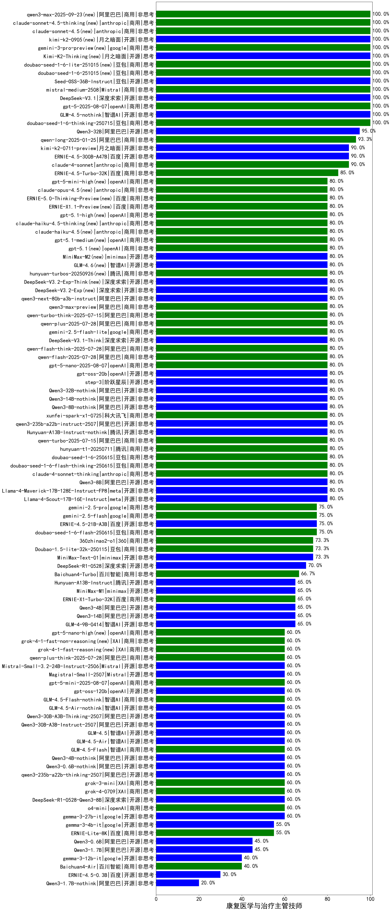

| 类别 | 大模型                         | 康复医学与治疗主管技师 | 排名 |
|-----|------------------------------|---------|----|
|开源|hunyuan-large|100.0%|1|
|商用|hunyuan-turbo|100.0%|2|
|开源|Qwen3-235B-A22B|100.0%|3|
|开源|Qwen3-32B|96.7%|4|
|商用|qwen-plus-2025-04-28(new)|96.7%|5|
|商用|360gpt2-pro|93.3%|6|
|商用|yi-lightning|93.3%|7|
|商用|ERNIE-4.5-Turbo-32K(new)|92.0%|8|
|商用|claude-4-sonnet(new)|90.0%|9|
|商用|hunyuan-turbos-20250604(new)|90.0%|10|
|开源|Llama-4-Maverick-17B-128E-Instruct-FP8|88.0%|11|
|商用|hunyuan-turbos-20250313|88.0%|12|
|商用|GLM-4-Plus|87.0%|13|
|商用|qwen-plus-2025-01-25|86.7%|14|
|商用|qwen-long-2025-01-25|86.7%|15|
|开源|qwen2.5-32b-instruct|86.7%|16|
|开源|DeepSeek-R1|86.7%|17|
|商用|doubao-seed-1-6-250615(new)|83.3%|18|
|商用|qwen-plus-think-2025-04-28(new)|83.3%|19|
|商用|hunyuan-t1-20250321|83.3%|20|
|商用|doubao-seed-1-6-flash-thinking-250615(new)|83.3%|21|
|开源|deepseek-chat-v3-0324|82.5%|22|
|商用|xunfei-spark-x1|82.0%|23|
|商用|Doubao-1.5-pro-32k-250115|80.0%|24|
|开源|qwq-32b|80.0%|25|
|商用|claude-4-sonnet-thinking(new)|80.0%|26|
|开源|Qwen3-8B|80.0%|27|
|商用|gpt-4.1-mini|80.0%|28|
|开源|DeepSeek-R1-0528(new)|80.0%|29|
|商用|Doubao-1.5-thinking-pro|80.0%|30|
|商用|qwen-turbo-2025-04-28(new)|80.0%|31|
|商用|SenseChat-5-beta|80.0%|32|
|商用|hunyuan-t1-20250529(new)|80.0%|33|
|开源|qwen2.5-72b-instruct|80.0%|34|
|商用|qwen-turbo-2025-02-11|80.0%|35|
|开源|qwen2.5-14b-instruct|80.0%|36|
|开源|qwen2.5-3b-instruct|80.0%|37|
|开源|DeepSeek-R1-Distill-Llama-70B|80.0%|38|
|商用|doubao-seed-1-6-flash-250615(new)|80.0%|39|
|商用|360gpt2-o1|80.0%|40|
|开源|Llama-4-Scout-17B-16E-Instruct|77.5%|41|
|开源|MiniMax-M1(new)|76.7%|42|
|商用|GLM-Z1-Air|76.0%|43|
|开源|GLM-4-32B-0414|76.0%|44|
|商用|GLM-Z1-AirX|74.0%|45|
|开源|qwen2.5-7b-instruct|73.3%|46|
|商用|hunyuan-standard|73.3%|47|
|商用|SenseChat-Turbo-1202|73.3%|48|
|商用|SenseChat-5-1202|73.3%|49|
|商用|ERNIE-X1-Turbo-32K(new)|73.3%|50|
|商用|doubao-seed-1-6-thinking-250615(new)|73.3%|51|
|商用|qwen-turbo-think-2025-04-28(new)|73.3%|52|
|商用|360zhinao2-o1|73.3%|53|
|商用|qwq-plus-2025-03-05|73.3%|54|
|商用|kimi-latest-8k|73.3%|55|
|商用|gpt-4o-mini|73.3%|56|
|商用|xunfei-spark-pro|73.3%|57|
|开源|DeepSeek-R1-Distill-Qwen-14B|73.3%|58|
|开源|DeepSeek-R1-Distill-Qwen-32B|73.3%|59|
|商用|Doubao-1.5-lite-32k-250115|73.3%|60|
|商用|step-r1-v-mini(new)|70.0%|61|
|开源|Qwen3-14B|70.0%|62|
|商用|gemini-2.5-flash-preview-05-20(new)|70.0%|63|
|商用|gpt-4.1|70.0%|64|
|商用|GLM-4-Long|70.0%|65|
|开源|DeepSeek-R1-0528-Qwen3-8B(new)|70.0%|66|
|商用|gemini-2.5-pro-preview-05-06(new)|70.0%|67|
|开源|Qwen3-30B-A3B|70.0%|68|
|开源|GLM-Z1-32B-0414|70.0%|69|
|开源|Qwen3-4B|66.7%|70|
|商用|GLM-4-Air|66.7%|71|
|商用|Baichuan4-Turbo|66.7%|72|
|商用|step-2-mini|66.7%|73|
|商用|chatgpt-4o-latest|66.7%|74|
|商用|qwen2.5-max|66.7%|75|
|商用|xunfei-spark-max|66.7%|76|
|开源|MiniMax-Text-01|66.7%|77|
|商用|GLM-Z1-FlashX|66.7%|78|
|商用|GLM-Z1-Flash|64.5%|79|
|开源|GLM-4-9B-0414|64.5%|80|
|开源|GLM-Z1-9B-0414|64.5%|81|
|商用|GLM-4-AirX|63.3%|82|
|开源|internlm2_5-7b-chat|60.0%|83|
|商用|mistral-large|60.0%|84|
|商用|moonshot-v1-8k|60.0%|85|
|商用|xunfei-4.0Ultra|60.0%|86|
|商用|o4-mini|60.0%|87|
|商用|ERNIE-Lite-8K|59.0%|88|
|开源|Mistral-Small-3.1-24B-Instruct-2503|57.0%|89|
|开源|GLM-Z1-Rumination-32B-0414|56.7%|90|
|开源|gemma-3-27b-it|55.5%|91|
|商用|ERNIE-3.5-8K|53.3%|92|
|开源|phi-4|53.3%|93|
|商用|mistral-small|53.3%|94|
|商用|360gpt-turbo|53.3%|95|
|开源|gemma-3-12b-it|52.0%|96|
|开源|qwen2.5-0.5b-instruct|46.7%|97|
|商用|GLM-4-FlashX|46.7%|98|
|商用|GLM-4-Flash|46.7%|99|
|开源|Qwen3-0.6B|46.7%|100|
|商用|ERNIE-Tiny-8K|46.7%|101|
|开源|qwen2.5-1.5b-instruct|46.7%|102|
|开源|Qwen3-1.7B|43.3%|103|
|商用|Baichuan4-Air|40.0%|104|
|商用|ERNIE-Speed-8K|40.0%|105|
|开源|DeepSeek-R1-Distill-Qwen-7B|40.0%|106|
|开源|DeepSeek-R1-Distill-Llama-8B|40.0%|107|
|开源|gemma-3-4b-it|38.5%|108|
|商用|ministral-3b|26.7%|109|
|商用|ministral-8b|26.7%|110|
|商用|xunfei-spark-lite|26.7%|111|

