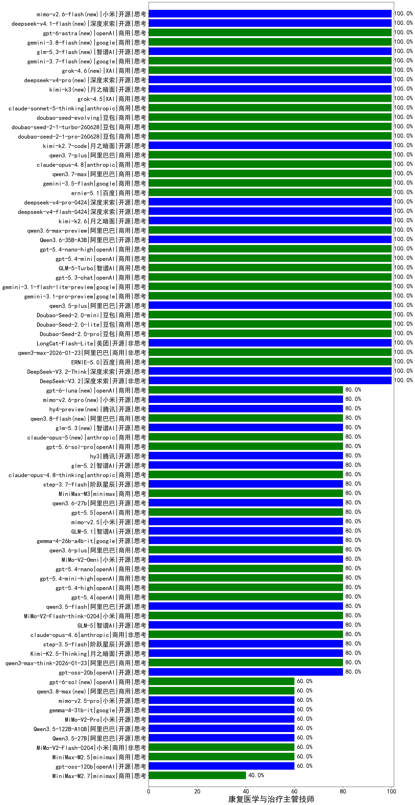

|类别|机构|大模型|【康复医学与治疗主管技师】准确率|平均耗时|平均消耗token|花费/千次（元）|排名（准确率）|
|---|---|-----|-------------------|-------|-----------|-----------|-----------|
|开源|月之暗面|kimi-k2.6|100.0%|119s|2110|55.0|1|
|商用|智谱AI|GLM-5-Turbo|100.0%|48s|1466|30.6|2|
|商用|openAI|gpt-5.4-nano-high|100.0%|32s|686|5.1|3|
|开源|深度求索|deepseek-v4.1-flash(new)|100.0%|6s|1284|9.6|4|
|商用|openAI|gpt-6-astra(new)|100.0%|14s|371|95.4|5|
|商用|google|gemini-3.8-flash(new)|100.0%|18s|718|33.2|6|
|开源|阿里巴巴|Qwen3.6-35B-A3B|100.0%|10s|1709|17.5|7|
|商用|阿里巴巴|qwen3.6-max-preview|100.0%|49s|1632|83.6|8|
|开源|智谱AI|glm-5.3-flash(new)|100.0%|49s|1258|3.3|9|
|开源|深度求索|deepseek-v4-flash-0424|100.0%|63s|1118|2.1|10|
|开源|深度求索|deepseek-v4-pro-0424|100.0%|35s|591|13.1|11|
|商用|百度|ernie-5.1|100.0%|48s|866|14.1|12|
|商用|google|gemini-3.5-flash|100.0%|9s|1600|95.2|13|
|商用|阿里巴巴|qwen3.7-max|100.0%|26s|1393|47.7|14|
|商用|anthropic|claude-opus-4.8|100.0%|12s|549|73.8|15|
|商用|阿里巴巴|qwen3.7-plus|100.0%|20s|1078|8.0|16|
|开源|月之暗面|kimi-k2.7-code|100.0%|51s|1885|48.9|17|
|商用|豆包|doubao-seed-2-1-pro-260628|100.0%|202s|9289|275.2|18|
|商用|豆包|doubao-seed-2-1-turbo-260628|100.0%|184s|8213|121.4|19|
|商用|豆包|doubao-seed-evolving|100.0%|136s|5945|174.9|20|
|商用|anthropic|claude-sonnet-5-thinking|100.0%|13s|604|33.3|21|
|商用|XAI|grok-4.5|100.0%|91s|1218|42.7|22|
|开源|月之暗面|kimi-k3(new)|100.0%|48s|722|58.3|23|
|开源|深度求索|deepseek-v4-pro(new)|100.0%|346s|647|14.4|24|
|商用|XAI|grok-4.6(new)|100.0%|43s|2332|89.5|25|
|商用|openAI|gpt-5.4-mini|100.0%|90s|288|5.9|26|
|商用|google|gemini-3.7-flash(new)|100.0%|5s|798|18.7|27|
|商用|google|gemini-3.1-pro-preview|100.0%|66s|2197|179.7|28|
|开源|阿里巴巴|qwen3.5-plus|100.0%|28s|2300|10.6|29|
|开源|深度求索|DeepSeek-V3.2|100.0%|130s|429|1.2|30|
|开源|深度求索|DeepSeek-V3.2-Think|100.0%|135s|1489|4.4|31|
|商用|openAI|gpt-5.3-chat|100.0%|59s|410|29.7|32|
|商用|google|gemini-3.1-flash-lite-preview|100.0%|36s|389|3.2|33|
|开源|美团|LongCat-Flash-Lite|100.0%|104s|453|0.0|34|
|开源|小米|mimo-v2.6-flash(new)|100.0%|40s|855|1.6|35|
|商用|百度|ERNIE-5.0|100.0%|102s|2176|50.6|36|
|商用|阿里巴巴|qwen3-max-2026-01-23|100.0%|154s|551|4.7|37|
|商用|豆包|Doubao-Seed-2.0-pro|100.0%|159s|838|11.5|38|
|商用|豆包|Doubao-Seed-2.0-lite|100.0%|188s|861|2.7|39|
|商用|豆包|Doubao-Seed-2.0-mini|100.0%|441s|1968|3.7|40|
|开源|智谱AI|GLM-5|80.0%|68s|1903|32.9|41|
|开源|智谱AI|glm-5.2|80.0%|42s|1607|42.9|42|
|商用|anthropic|claude-opus-4.6|80.0%|11s|712|102.2|43|
|商用|openAI|gpt-5.4-high|80.0%|17s|985|92.7|44|
|开源|阶跃星辰|step-3.5-flash|80.0%|24s|1965|4.0|45|
|开源|月之暗面|Kimi-K2.5-Thinking|80.0%|356s|2020|40.8|46|
|开源|阶跃星辰|step-3.7-flash|80.0%|43s|3793|30.0|47|
|商用|阿里巴巴|qwen3-max-think-2026-01-23|80.0%|151s|4044|39.6|48|
|开源|腾讯|hy3|80.0%|77s|252|0.7|49|
|商用|openAI|gpt-5.6-sol-pro|80.0%|24s|3754|321.4|50|
|商用|anthropic|claude-opus-5(new)|80.0%|16s|792|116.3|51|
|商用|阿里巴巴|qwen3.8-flash(new)|80.0%|58s|1416|3.5|52|
|商用|anthropic|claude-opus-4.8-thinking|80.0%|24s|740|107.1|53|
|商用|小米|MiMo-V2-Flash-think-0204|80.0%|671s|2055|4.1|54|
|商用|openAI|gpt-6-luna(new)|80.0%|232s|579|1.7|55|
|开源|google|gemma-4-26b-a4b-it|80.0%|59s|545|1.3|56|
|商用|openAI|gpt-5.4-mini-high|80.0%|17s|1151|33.0|57|
|商用|openAI|gpt-5.4-nano|80.0%|10s|276|1.5|58|
|开源|腾讯|hy4-preview(new)|80.0%|123s|7080|126.1|59|
|开源|小米|MiMo-V2-Omni|80.0%|136s|2427|30.0|60|
|开源|智谱AI|glm-5.3(new)|80.0%|71s|2726|74.3|61|
|开源|小米|mimo-v2.6-pro(new)|80.0%|27s|991|5.6|62|
|开源|智谱AI|GLM-5.1|80.0%|27s|1180|26.6|63|
|商用|minimax|MiniMax-M3|80.0%|21s|636|7.4|64|
|开源|阿里巴巴|qwen3.5-flash|80.0%|348s|3095|6.0|65|
|开源|openAI|gpt-oss-20b|80.0%|8s|1650|1.8|66|
|开源|小米|mimo-v2.5|80.0%|19s|1106|11.6|67|
|商用|openAI|gpt-5.5|80.0%|20s|1214|233.4|68|
|开源|阿里巴巴|qwen3.6-27b|80.0%|32s|1838|31.6|69|
|商用|openAI|gpt-5.4|80.0%|6s|308|21.6|70|
|商用|阿里巴巴|qwen3.6-plus|80.0%|23s|1504|17.0|71|
|开源|openAI|gpt-oss-120b|60.0%|4s|735|1.9|72|
|商用|阿里巴巴|qwen3.8-max(new)|60.0%|48s|2146|73.9|73|
|开源|小米|mimo-v2.5-pro|60.0%|39s|1718|31.2|74|
|开源|google|gemma-4-31b-it|60.0%|118s|572|1.4|75|
|开源|小米|MiMo-V2-Pro|60.0%|164s|2066|38.5|76|
|开源|阿里巴巴|Qwen3.5-122B-A10B|60.0%|356s|3118|19.4|77|
|开源|阿里巴巴|Qwen3.5-27B|60.0%|106s|2510|11.6|78|
|商用|小米|MiMo-V2-Flash-0204|60.0%|170s|602|1.1|79|
|商用|minimax|MiniMax-M2.5|60.0%|29s|1380|10.8|80|
|商用|openAI|gpt-6-sol(new)|60.0%|567s|347|17.4|81|
|商用|minimax|MiniMax-M2.7|40.0%|67s|2467|19.9|82|

