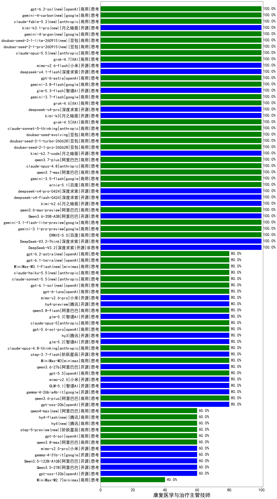

|类别|机构|大模型|【康复医学与治疗主管技师】准确率|平均耗时|平均消耗token|花费/千次（元）|排名（准确率）|
|---|---|-----|-------------------|-------|-----------|-----------|-----------|
|商用|XAI|grok-4.5|100.0%|91s|1218|42.7|1|
|商用|google|gemini-3.8-flash|100.0%|18s|718|33.2|2|
|开源|月之暗面|kimi-k2.7-code|100.0%|51s|1885|48.9|3|
|商用|豆包|doubao-seed-2-1-pro-260628|100.0%|202s|9289|275.2|4|
|商用|豆包|doubao-seed-2-1-turbo-260628|100.0%|184s|8213|121.4|5|
|商用|豆包|doubao-seed-evolving|100.0%|136s|5945|174.9|6|
|商用|anthropic|claude-sonnet-5-thinking|100.0%|13s|604|33.3|7|
|开源|月之暗面|kimi-k3|100.0%|48s|722|58.3|8|
|开源|深度求索|deepseek-v4-pro|100.0%|346s|647|14.4|9|
|商用|XAI|grok-4.6|100.0%|43s|2332|89.5|10|
|商用|google|gemini-3.7-flash|100.0%|5s|798|18.7|11|
|开源|智谱AI|glm-5.3-flash|100.0%|49s|1258|3.3|12|
|商用|openAI|gpt-6-astra|100.0%|14s|371|95.4|13|
|商用|anthropic|claude-opus-4.8|100.0%|12s|549|73.8|14|
|开源|深度求索|deepseek-v4.1-flash|100.0%|6s|1284|9.6|15|
|开源|小米|mimo-v2.6-flash|100.0%|40s|855|1.6|16|
|商用|XAI|grok-4.7|100.0%|44s|3916|127.0|17|
|商用|anthropic|claude-opus-5.5(new)|100.0%|15s|684|77.7|18|
|商用|豆包|doubao-seed-2-1-pro-260915(new)|100.0%|52s|1066|28.5|19|
|商用|豆包|doubao-seed-2-1-lite-260915(new)|100.0%|32s|1687|4.3|20|
|商用|google|gemini-4-argon(new)|100.0%|15s|608|70.4|21|
|开源|月之暗面|kimi-k3.1-pro(new)|100.0%|54s|1800|112.9|22|
|商用|anthropic|claude-fable-5.2(new)|100.0%|18s|547|117.0|23|
|商用|google|gemini-4-carbon(new)|100.0%|19s|1072|135.4|24|
|商用|阿里巴巴|qwen3.7-plus|100.0%|20s|1078|8.0|25|
|商用|openAI|gpt-6.2-sol(new)|100.0%|5s|252|10.8|26|
|商用|阿里巴巴|qwen3.7-max|100.0%|26s|1393|47.7|27|
|开源|深度求索|deepseek-v4-pro-0424|100.0%|35s|591|13.1|28|
|商用|百度|ERNIE-5.0|100.0%|102s|2176|50.6|29|
|商用|阿里巴巴|qwen3.6-max-preview|100.0%|49s|1632|83.6|30|
|开源|月之暗面|kimi-k2.6|100.0%|119s|2110|55.0|31|
|开源|深度求索|DeepSeek-V3.2|100.0%|130s|429|1.2|32|
|商用|google|gemini-3.1-flash-lite-preview|100.0%|36s|389|3.2|33|
|开源|深度求索|deepseek-v4-flash-0424|100.0%|63s|1118|2.1|34|
|开源|深度求索|DeepSeek-V3.2-Think|100.0%|135s|1489|4.4|35|
|商用|百度|ernie-5.1|100.0%|48s|866|14.1|36|
|商用|google|gemini-3.1-pro-preview|100.0%|66s|2197|179.7|37|
|商用|google|gemini-3.5-flash|100.0%|9s|1600|95.2|38|
|开源|阿里巴巴|Qwen3.6-35B-A3B|100.0%|10s|1709|17.5|39|
|商用|openAI|gpt-6.1-terra(new)|80.0%|6s|381|9.9|40|
|商用|openAI|gpt-6.1-sol(new)|80.0%|9s|371|19.1|41|
|开源|google|gemma-4-26b-a4b-it|80.0%|59s|545|1.3|42|
|商用|anthropic|claude-sonnet-5.5(new)|80.0%|9s|711|40.7|43|
|商用|openAI|gpt-6-luna|80.0%|232s|579|1.7|44|
|商用|阿里巴巴|qwen3.6-plus|80.0%|23s|1504|17.0|45|
|开源|小米|mimo-v2.6-pro|80.0%|27s|991|5.6|46|
|开源|腾讯|hy4-preview|80.0%|123s|7080|126.1|47|
|商用|anthropic|claude-haiku-5.5(new)|80.0%|7s|922|2.8|48|
|商用|minimax|MiniMax-M3|80.0%|21s|636|7.4|49|
|开源|智谱AI|glm-5.3|80.0%|71s|2726|74.3|50|
|开源|智谱AI|GLM-5.1|80.0%|27s|1180|26.6|51|
|商用|阿里巴巴|qwen3.8-flash|80.0%|58s|1416|3.5|52|
|开源|阶跃星辰|step-3.7-flash|80.0%|43s|3793|30.0|53|
|商用|anthropic|claude-opus-4.8-thinking|80.0%|24s|740|107.1|54|
|开源|智谱AI|glm-5.2|80.0%|42s|1607|42.9|55|
|开源|阿里巴巴|qwen3.6-27b|80.0%|32s|1838|31.6|56|
|商用|openAI|gpt-5.5|80.0%|20s|1214|233.4|57|
|开源|腾讯|hy3|80.0%|77s|252|0.7|58|
|开源|openAI|gpt-oss-20b|80.0%|8s|1650|1.8|59|
|商用|openAI|gpt-5.6-sol-pro|80.0%|24s|3754|321.4|60|
|商用|openAI|gpt-6.2-astra(new)|80.0%|6s|269|47.8|61|
|商用|anthropic|claude-opus-5|80.0%|16s|792|116.3|62|
|开源|小米|mimo-v2.5|80.0%|19s|1106|11.6|63|
|商用|minimax|MiniMax-M3.1-Flash(new)|80.0%|35s|2116|7.6|64|
|商用|腾讯|hy4(new)|60.0%|153s|7072|126.0|65|
|商用|腾讯|hy4-flash(new)|60.0%|71s|2630|5.1|66|
|商用|阿里巴巴|qwen4-max(new)|60.0%|19s|809|22.0|67|
|开源|google|gemma-4-31b-it|60.0%|118s|572|1.4|68|
|商用|阶跃星辰|step-5-preview(new)|60.0%|46s|3104|60.8|69|
|开源|阿里巴巴|Qwen3.5-27B|60.0%|106s|2510|11.6|70|
|开源|阿里巴巴|Qwen3.5-122B-A10B|60.0%|356s|3118|19.4|71|
|商用|openAI|gpt-6-sol|60.0%|567s|347|17.4|72|
|商用|阿里巴巴|qwen3.8-max|60.0%|48s|2146|73.9|73|
|开源|小米|mimo-v2.5-pro|60.0%|39s|1718|31.2|74|
|开源|openAI|gpt-oss-120b|60.0%|4s|735|1.9|75|
|商用|minimax|MiniMax-M2.7|40.0%|67s|2467|19.9|76|

