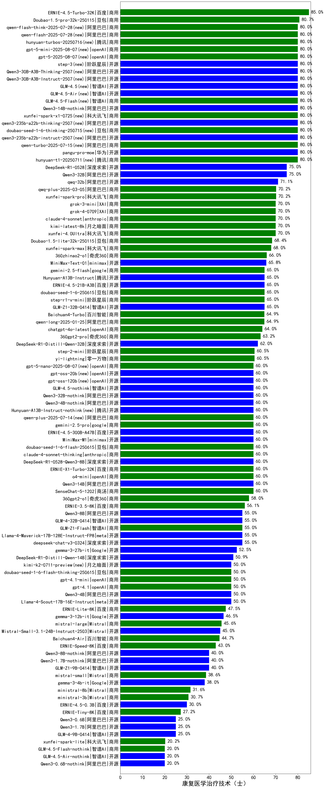

|类别|机构|大模型|【康复医学治疗技术（士）】准确率|平均耗时|平均消耗token|排名（准确率）|
|---|---|-----|-------------------|-------|-----------|------------|
|开源|腾讯|hunyuan-large|94.7%|10s|1021|1|
|商用|腾讯|hunyuan-turbo|90.0%|17s|940|2|
|商用|百度|ERNIE-4.5-Turbo-32K|85.0%|21s|514|3|
|商用|腾讯|hunyuan-standard|81.6%|/|/|4|
|商用|豆包|Doubao-1.5-pro-32k-250115|80.7%|10s|347|5|
|商用|豆包|doubao-seed-1-6-thinking-250615(new)|80.0%|260s|1147|6|
|开源|阿里巴巴|Qwen3-30B-A3B|75.0%|26s|1243|7|
|开源|阿里巴巴|Qwen3-32B|75.0%|40s|1721|8|
|开源|深度求索|DeepSeek-R1-0528|75.0%|208s|1758|9|
|商用|智谱AI|GLM-Z1-AirX|75.0%|24s|1660|10|
|开源|阿里巴巴|qwq-32b|71.1%|39s|2181|11|
|商用|阿里巴巴|qwq-plus-2025-03-05|70.2%|62s|2398|12|
|商用|科大讯飞|xunfei-spark-pro|70.2%|/|/|13|
|商用|阿里巴巴|qwen2.5-max|70.2%|24s|448|14|
|商用|月之暗面|kimi-latest-8k|70.0%|26s|483|15|
|商用|科大讯飞|xunfei-4.0Ultra|70.0%|2s|105|16|
|商用|XAI|grok-4-0709(new)|70.0%|452s|1097|17|
|商用|XAI|grok-3-mini(new)|70.0%|158s|978|18|
|商用|科大讯飞|xunfei-spark-x1|70.0%|46s|1429|19|
|商用|腾讯|hunyuan-turbos-20250604(new)|70.0%|71s|420|20|
|商用|阿里巴巴|qwen-turbo-think-2025-04-28|70.0%|56s|2010|21|
|商用|anthropic|claude-4-sonnet|70.0%|47s|480|22|
|商用|豆包|Doubao-1.5-lite-32k-250115|68.4%|5s|183|23|
|商用|智谱AI|GLM-4-Plus|68.3%|11s|287|24|
|商用|科大讯飞|xunfei-spark-max|68.0%|4s|126|25|
|开源|阿里巴巴|qwen2.5-72b-instruct|67.0%|17s|265|26|
|商用|奇虎360|360zhinao2-o1|66.0%|/|/|27|
|开源|minimax|MiniMax-Text-01|65.8%|10s|892|28|
|商用|阶跃星辰|step-r1-v-mini|65.0%|30s|1470|29|
|商用|腾讯|hunyuan-t1-20250529|65.0%|67s|1119|30|
|开源|腾讯|Hunyuan-A13B-Instruct(new)|65.0%|92s|1093|31|
|商用|google|gemini-2.5-flash(new)|65.0%|10s|1647|32|
|商用|豆包|doubao-seed-1-6-250615(new)|65.0%|148s|388|33|
|商用|阿里巴巴|qwen-plus-2025-04-28|65.0%|187s|489|34|
|开源|百度|ERNIE-4.5-21B-A3B(new)|65.0%|6s|290|35|
|商用|阿里巴巴|qwen-plus-think-2025-04-28|65.0%|67s|2064|36|
|开源|智谱AI|GLM-Z1-32B-0414|65.0%|104s|2397|37|
|开源|阿里巴巴|Qwen3-235B-A22B|65.0%|68s|1943|38|
|商用|百川智能|Baichuan4-Turbo|64.9%|/|/|39|
|商用|阿里巴巴|qwen-long-2025-01-25|64.9%|9s|290|40|
|商用|openAI|chatgpt-4o-latest|64.0%|/|/|41|
|商用|奇虎360|360gpt2-pro|63.2%|19s|232|42|
|商用|商汤|SenseChat-5-beta|63.0%|24s|342|43|
|开源|深度求索|DeepSeek-R1-Distill-Qwen-32B|62.0%|30s|740|44|
|开源|阿里巴巴|qwen2.5-32b-instruct|61.4%|10s|251|45|
|开源|上海人工智能实验室|internlm2_5-7b-chat|61.4%|/|/|46|
|商用|零一万物|yi-lightning|60.5%|/|/|47|
|商用|阶跃星辰|step-2-mini|60.5%|82s|286|48|
|开源|百度|ERNIE-4.5-300B-A47B(new)|60.0%|25s|315|49|
|商用|google|gemini-2.5-pro-preview-05-06|60.0%|41s|3091|50|
|开源|minimax|MiniMax-M1(new)|60.0%|185s|2939|51|
|商用|豆包|doubao-seed-1-6-flash-250615(new)|60.0%|3s|287|52|
|商用|google|gemini-2.5-flash-preview-05-20|60.0%|44s|1428|53|
|商用|anthropic|claude-4-sonnet-thinking|60.0%|50s|1097|54|
|开源|深度求索|DeepSeek-R1-0528-Qwen3-8B|60.0%|302s|1917|55|
|商用|openAI|o4-mini|60.0%|30s|814|56|
|商用|豆包|Doubao-1.5-thinking-pro|60.0%|364s|781|57|
|商用|智谱AI|GLM-Z1-Air|60.0%|62s|2157|58|
|商用|商汤|SenseChat-5-1202|60.0%|/|/|59|
|开源|阿里巴巴|Qwen3-14B|60.0%|29s|1221|60|
|商用|百度|ERNIE-X1-Turbo-32K|60.0%|177s|2328|61|
|开源|阿里巴巴|qwen2.5-7b-instruct|58.8%|3s|162|62|
|商用|奇虎360|360gpt2-o1|58.0%|12s|311|63|
|商用|百度|ERNIE-3.5-8K|56.1%|19s|308|64|
|开源|阿里巴巴|qwen2.5-14b-instruct|55.3%|8s|245|65|
|商用|阿里巴巴|qwen-turbo-2025-04-28|55.0%|7s|393|66|
|商用|智谱AI|GLM-Z1-Flash|55.0%|19s|2167|67|
|开源|阿里巴巴|Qwen3-8B|55.0%|239s|5550|68|
|开源|meta|Llama-4-Maverick-17B-128E-Instruct-FP8|55.0%|13s|517|69|
|开源|深度求索|deepseek-chat-v3-0324|55.0%|173s|304|70|
|开源|智谱AI|GLM-4-32B-0414|55.0%|12s|362|71|
|商用|智谱AI|GLM-4-Air|53.3%|14s|257|72|
|商用|奇虎360|360gpt-turbo|52.6%|/|/|73|
|开源|Google|gemma-3-27b-it|52.5%|/|/|74|
|商用|智谱AI|GLM-4-Flash|51.8%|8s|290|75|
|商用|智谱AI|GLM-4-FlashX|50.9%|18s|297|76|
|开源|深度求索|DeepSeek-R1-Distill-Qwen-14B|50.9%|/|/|77|
|商用|智谱AI|GLM-4-AirX|50.0%|12s|246|78|
|商用|智谱AI|GLM-Z1-FlashX|50.0%|20s|1888|79|
|商用|智谱AI|GLM-4-Long|50.0%|20s|337|80|
|商用|豆包|doubao-seed-1-6-flash-thinking-250615(new)|50.0%|9s|876|81|
|开源|阿里巴巴|Qwen3-4B|50.0%|45s|2171|82|
|商用|openAI|gpt-4.1|50.0%|11s|243|83|
|商用|openAI|gpt-4.1-mini|50.0%|8s|300|84|
|商用|google|gemini-2.5-pro(new)|50.0%|56s|3008|85|
|开源|meta|Llama-4-Scout-17B-16E-Instruct|50.0%|14s|446|86|
|商用|OpenAI|gpt-4o-mini|48.2%|/|/|87|
|商用|百度|ERNIE-Lite-8K|47.5%|/|/|88|
|开源|Google|gemma-3-12b-it|46.5%|/|/|89|
|商用|Mistral|mistral-large|45.6%|/|/|90|
|商用|google|gemini-2.5-flash-lite-preview-06-17(new)|45.0%|5s|560|91|
|开源|Mistral|Mistral-Small-3.1-24B-Instruct-2503|45.0%|/|/|92|
|商用|百川智能|Baichuan4-Air|44.7%|/|/|93|
|商用|月之暗面|moonshot-v1-8k|43.9%|/|/|94|
|商用|百度|ERNIE-Speed-8K|43.0%|/|/|95|
|开源|微软|phi-4|43.0%|/|/|96|
|商用|商汤|SenseChat-Turbo-1202|43.0%|/|/|97|
|开源|阿里巴巴|qwen2.5-3b-instruct|41.2%|12s|180|98|
|开源|智谱AI|GLM-Z1-9B-0414|40.0%|78s|2880|99|
|开源|阿里巴巴|qwen2.5-1.5b-instruct|39.5%|1s|99|100|
|商用|Mistral|mistral-small|38.6%|/|/|101|
|开源|Google|gemma-3-4b-it|38.0%|/|/|102|
|商用|Mistral|ministral-8b|31.6%|/|/|103|
|商用|Mistral|ministral-3b|30.7%|/|/|104|
|开源|智谱AI|GLM-Z1-Rumination-32B-0414|30.0%|13s|873|105|
|开源|百度|ERNIE-4.5-0.3B(new)|30.0%|4s|373|106|
|商用|百度|ERNIE-Tiny-8K|27.2%|/|/|107|
|开源|智谱AI|GLM-4-9B-0414|25.0%|12s|437|108|
|开源|阿里巴巴|Qwen3-0.6B|25.0%|17s|1188|109|
|开源|阿里巴巴|Qwen3-1.7B|25.0%|20s|2279|110|
|商用|科大讯飞|xunfei-spark-lite|20.2%|/|/|111|
|开源|阿里巴巴|qwen2.5-0.5b-instruct|19.3%|9s|204|112|

