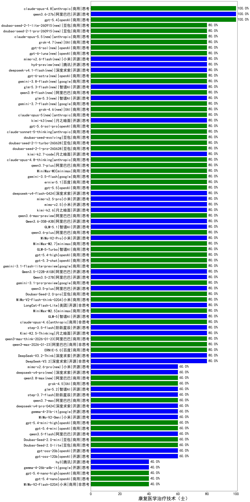

|类别|机构|大模型|【康复医学治疗技术（士）】准确率|平均耗时|平均消耗token|花费/千次（元）|排名（准确率）|
|---|---|-----|-------------------|-------|-----------|-----------|-----------|
|商用|anthropic|claude-opus-4.8|100.0%|7s|457|68.9|1|
|商用|openAI|gpt-5.4|100.0%|5s|186|13.7|2|
|开源|阿里巴巴|qwen3.6-27b|100.0%|29s|1657|28.9|3|
|开源|小米|mimo-v2.5|80.0%|42s|2562|32.5|4|
|商用|豆包|doubao-seed-2-1-pro-260628|80.0%|223s|5843|173.0|5|
|开源|月之暗面|kimi-k2.7-code|80.0%|107s|3658|97.6|6|
|商用|anthropic|claude-opus-4.8-thinking|80.0%|9s|565|87.7|7|
|商用|阿里巴巴|qwen3.7-plus|80.0%|15s|785|5.9|8|
|商用|minimax|MiniMax-M3|80.0%|20s|545|6.4|9|
|商用|google|gemini-3.5-flash|80.0%|6s|1094|66.0|10|
|商用|豆包|doubao-seed-evolving|80.0%|209s|5621|166.3|11|
|商用|百度|ernie-5.1|80.0%|23s|958|16.5|12|
|商用|openAI|gpt-5.5|80.0%|20s|449|82.6|13|
|开源|深度求索|deepseek-v4-flash-0424|80.0%|27s|894|1.7|14|
|开源|小米|mimo-v2.5-pro|80.0%|18s|1064|18.1|15|
|开源|月之暗面|kimi-k2.6|80.0%|54s|1100|28.6|16|
|商用|阿里巴巴|qwen3.6-max-preview|80.0%|39s|1242|64.3|17|
|商用|豆包|doubao-seed-2-1-turbo-260628|80.0%|61s|3227|47.3|18|
|商用|anthropic|claude-sonnet-5-thinking|80.0%|12s|635|40.0|19|
|开源|智谱AI|GLM-5.1|80.0%|158s|1287|29.9|20|
|商用|openAI|gpt-5.6-sol-pro|80.0%|64s|2745|188.6|21|
|商用|XAI|grok-4.7(new)|80.0%|15s|2275|59.3|22|
|商用|openAI|gpt-6-sol(new)|80.0%|243s|180|8.9|23|
|商用|openAI|gpt-6-luna(new)|80.0%|149s|442|1.4|24|
|开源|小米|mimo-v2.6-flash(new)|80.0%|62s|556|1.1|25|
|开源|腾讯|hy4-preview(new)|80.0%|16s|967|16.5|26|
|开源|深度求索|deepseek-v4.1-flash(new)|80.0%|3s|570|4.1|27|
|商用|openAI|gpt-6-astra(new)|80.0%|11s|253|70.1|28|
|商用|google|gemini-3.8-flash(new)|80.0%|8s|664|32.5|29|
|开源|智谱AI|glm-5.3-flash(new)|80.0%|140s|1401|3.8|30|
|商用|阿里巴巴|qwen3.8-flash(new)|80.0%|54s|3928|10.4|31|
|开源|智谱AI|glm-5.3(new)|80.0%|72s|2242|61.5|32|
|商用|google|gemini-3.7-flash(new)|80.0%|18s|678|16.6|33|
|商用|XAI|grok-4.6(new)|80.0%|1038s|803|26.5|34|
|商用|anthropic|claude-opus-5(new)|80.0%|11s|562|87.3|35|
|开源|月之暗面|kimi-k3(new)|80.0%|32s|397|29.0|36|
|开源|阿里巴巴|Qwen3.6-35B-A3B|80.0%|9s|1541|16.1|37|
|商用|anthropic|claude-opus-5.5(new)|80.0%|15s|524|64.2|38|
|开源|阿里巴巴|qwen3.5-plus|80.0%|32s|2460|11.6|39|
|商用|豆包|Doubao-Seed-2.0-pro|80.0%|234s|976|14.4|40|
|商用|小米|MiMo-V2-Flash-think-0204|80.0%|775s|1758|3.6|41|
|开源|美团|LongCat-Flash-Lite|80.0%|52s|335|0.0|42|
|商用|google|gemini-3.1-pro-preview|80.0%|22s|1189|97.3|43|
|商用|minimax|MiniMax-M2.5|80.0%|37s|1886|15.3|44|
|开源|阿里巴巴|Qwen3.5-27B|80.0%|286s|2183|10.2|45|
|开源|智谱AI|GLM-5|80.0%|41s|1503|26.3|46|
|开源|阿里巴巴|Qwen3.5-122B-A10B|80.0%|148s|2000|12.5|47|
|商用|google|gemini-3.1-flash-lite-preview|80.0%|40s|305|2.7|48|
|商用|anthropic|claude-opus-4.6|80.0%|10s|517|79.1|49|
|商用|openAI|gpt-5.3-chat|80.0%|44s|396|33.1|50|
|商用|openAI|gpt-5.4-high|80.0%|10s|519|48.7|51|
|商用|智谱AI|GLM-5-Turbo|80.0%|40s|1891|40.6|52|
|开源|阶跃星辰|step-3.5-flash|80.0%|14s|1155|2.3|53|
|开源|月之暗面|Kimi-K2.5-Thinking|80.0%|139s|2729|56.4|54|
|商用|阿里巴巴|qwen3-max-think-2026-01-23|80.0%|60s|1530|14.8|55|
|商用|阿里巴巴|qwen3-max-2026-01-23|80.0%|53s|371|3.2|56|
|商用|百度|ERNIE-5.0|80.0%|432s|1669|39.2|57|
|商用|minimax|MiniMax-M2.7|80.0%|55s|2075|16.9|58|
|开源|小米|MiMo-V2-Pro|80.0%|481s|1018|17.1|59|
|开源|深度求索|DeepSeek-V3.2-Think|80.0%|24s|754|2.2|60|
|开源|深度求索|DeepSeek-V3.2|80.0%|25s|379|1.1|61|
|商用|阿里巴巴|qwen3.6-plus|80.0%|39s|1336|15.4|62|
|开源|小米|mimo-v2.6-pro(new)|60.0%|689s|612|3.5|63|
|开源|深度求索|deepseek-v4-pro(new)|60.0%|26s|517|11.6|64|
|商用|阿里巴巴|qwen3.8-max(new)|60.0%|16s|382|11.4|65|
|开源|openAI|gpt-oss-120b|60.0%|3s|581|1.6|66|
|商用|豆包|Doubao-Seed-2.0-lite|60.0%|130s|612|1.9|67|
|开源|阶跃星辰|step-3.7-flash|60.0%|79s|1235|9.6|68|
|开源|小米|MiMo-V2-Omni|60.0%|145s|1026|11.0|69|
|开源|openAI|gpt-oss-20b|60.0%|11s|1361|1.5|70|
|开源|深度求索|deepseek-v4-pro-0424|60.0%|19s|644|14.8|71|
|商用|openAI|gpt-5.4-mini-high|60.0%|18s|562|16.0|72|
|商用|openAI|gpt-5.4-mini|60.0%|103s|188|4.2|73|
|商用|豆包|Doubao-Seed-2.0-mini|60.0%|411s|1687|3.2|74|
|商用|阿里巴巴|qwen3.7-max|60.0%|17s|972|33.5|75|
|开源|智谱AI|glm-5.2|60.0%|96s|2093|57.3|76|
|开源|阿里巴巴|qwen3.5-flash|60.0%|127s|1992|3.9|77|
|开源|google|gemma-4-31b-it|60.0%|134s|448|1.1|78|
|商用|XAI|grok-4.5|60.0%|49s|2413|94.1|79|
|商用|openAI|gpt-5.4-nano|40.0%|15s|216|1.4|80|
|商用|openAI|gpt-5.4-nano-high|40.0%|18s|401|3.0|81|
|商用|小米|MiMo-V2-Flash-0204|40.0%|104s|448|0.8|82|
|开源|腾讯|hy3|40.0%|45s|206|0.6|83|
|开源|google|gemma-4-26b-a4b-it|40.0%|20s|612|1.6|84|

