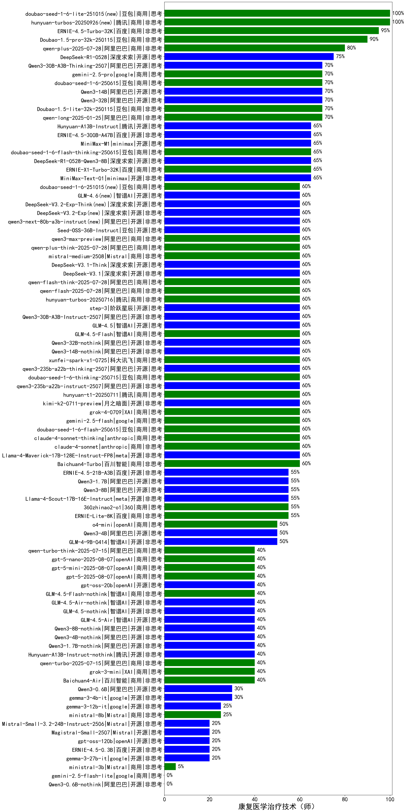

|类别|机构|大模型|【康复医学治疗技术（师）】准确率|平均耗时|平均消耗token|花费/千次（元）|排名（准确率）|
|---|---|-----|-------------------|-------|-----------|-----------|-----------|
|开源|腾讯|hunyuan-large|96.2%|8s|1013|6.5|1|
|商用|百度|ERNIE-4.5-Turbo-32K|95.0%|21s|514|1.5|2|
|商用|豆包|Doubao-1.5-pro-32k-250115|86.7%|10s|347|0.6|3|
|开源|阿里巴巴|Qwen3-30B-A3B|85.0%|26s|1160|3.1|4|
|商用|腾讯|hunyuan-standard|83.8%|/|/|/|5|
|商用|阿里巴巴|qwen2.5-max|81.0%|25s|443|3.7|6|
|商用|阿里巴巴|qwq-plus-2025-03-05|80.0%|62s|2377|9.3|7|
|商用|豆包|Doubao-1.5-lite-32k-250115|80.0%|6s|185|0.1|8|
|开源|阿里巴巴|qwq-32b|77.1%|45s|2307|13.5|9|
|商用|智谱AI|GLM-4-Plus|76.0%|12s|273|1.4|10|
|商用|科大讯飞|xunfei-spark-max|76.0%|5s|124|3.7|11|
|商用|阿里巴巴|qwen-long-2025-01-25|75.2%|7s|287|0.5|12|
|开源|阿里巴巴|qwen2.5-72b-instruct|75.0%|10s|266|2.6|13|
|开源|深度求索|DeepSeek-R1-0528|75.0%|243s|2039|31.8|14|
|商用|月之暗面|kimi-latest-8k|75.0%|18s|484|5.8|15|
|商用|百川智能|Baichuan4-Turbo|74.3%|/|/|/|16|
|开源|阿里巴巴|qwen2.5-32b-instruct|74.3%|17s|250|1.2|17|
|商用|奇虎360|360gpt2-pro|73.3%|10s|229|0.9|18|
|商用|零一万物|yi-lightning|73.3%|/|/|/|19|
|开源|minimax|MiniMax-Text-01|72.4%|10s|896|7.2|20|
|开源|阿里巴巴|qwen2.5-14b-instruct|71.4%|8s|226|0.5|21|
|商用|科大讯飞|xunfei-spark-pro|71.4%|/|/|/|22|
|商用|google|gemini-2.5-pro|70.0%|27s|2099|147.8|23|
|商用|阿里巴巴|qwen-turbo-think-2025-04-28|70.0%|46s|2549|7.5|24|
|开源|阿里巴巴|Qwen3-235B-A22B-nothink|70.0%|19s|473|4.2|25|
|开源|阿里巴巴|Qwen3-30B-A3B-Thinking-2507(new)|70.0%|66s|2861|7.9|26|
|开源|阿里巴巴|Qwen3-32B|70.0%|32s|1158|4.4|27|
|开源|阿里巴巴|Qwen3-14B|70.0%|34s|1242|2.4|28|
|商用|智谱AI|GLM-Z1-AirX|70.0%|35s|1607|11.5|29|
|商用|豆包|doubao-seed-1-6-250615|70.0%|144s|474|3.1|30|
|商用|阿里巴巴|qwen-plus-think-2025-04-28|70.0%|210s|2292|17.8|31|
|开源|阿里巴巴|Qwen3-235B-A22B|70.0%|272s|2591|25.4|32|
|商用|智谱AI|GLM-Z1-Air|70.0%|51s|1440|0.7|33|
|商用|腾讯|hunyuan-turbos-20250604|70.0%|88s|484|0.8|34|
|商用|阶跃星辰|step-r1-v-mini|70.0%|128s|1752|13.5|35|
|商用|商汤|SenseChat-5-1202|69.0%|/|/|/|36|
|开源|上海人工智能实验室|internlm2_5-7b-chat|68.6%|/|/|/|37|
|商用|奇虎360|360gpt2-o1|68.0%|12s|301|12.5|38|
|商用|奇虎360|360zhinao2-o1|67.0%|/|/|/|39|
|开源|阿里巴巴|qwen2.5-7b-instruct|66.7%|5s|193|0.2|40|
|商用|奇虎360|360gpt-turbo|66.7%|/|/|/|41|
|开源|腾讯|Hunyuan-A13B-Instruct|65.0%|74s|993|3.8|42|
|商用|豆包|doubao-seed-1-6-flash-thinking-250615|65.0%|6s|620|0.8|43|
|商用|百度|ERNIE-X1-Turbo-32K|65.0%|129s|2658|10.5|44|
|开源|深度求索|DeepSeek-R1-0528-Qwen3-8B|65.0%|274s|1570|0.0|45|
|开源|meta|Llama-4-Maverick-17B-128E-Instruct-FP8|65.0%|7s|523|2.0|46|
|开源|智谱AI|GLM-Z1-32B-0414|65.0%|122s|2209|8.6|47|
|开源|深度求索|deepseek-chat-v3-0324|65.0%|159s|266|1.8|48|
|商用|openAI|chatgpt-4o-latest|65.0%|/|/|/|49|
|开源|minimax|MiniMax-M1|65.0%|239s|2916|22.1|50|
|开源|百度|ERNIE-4.5-300B-A47B|65.0%|28s|337|2.3|51|
|开源|深度求索|DeepSeek-R1-Distill-Qwen-32B|63.0%|24s|703|0.9|52|
|商用|百度|ERNIE-3.5-8K|61.0%|20s|360|0.7|53|
|商用|阶跃星辰|step-2-mini|61.0%|5s|304|0.5|54|
|开源|阶跃星辰|step-3(new)|60.0%|81s|1622|6.3|55|
|商用|腾讯|hunyuan-turbos-20250716(new)|60.0%|11s|514|0.9|56|
|开源|阿里巴巴|Qwen3-30B-A3B-Instruct-2507(new)|60.0%|4s|412|1.1|57|
|商用|智谱AI|GLM-4-AirX|60.0%|6s|258|2.6|58|
|开源|智谱AI|GLM-4-32B-0414|60.0%|10s|360|0.7|59|
|开源|阿里巴巴|Qwen3-32B-nothink|60.0%|21s|443|1.6|60|
|开源|阿里巴巴|qwen3-235b-a22b-instruct-2507(new)|60.0%|10s|400|2.8|61|
|开源|阿里巴巴|Qwen3-14B-nothink|60.0%|27s|501|0.9|62|
|商用|阿里巴巴|qwen-flash-2025-07-28(new)|60.0%|41s|423|0.5|63|
|商用|anthropic|claude-4-sonnet-thinking|60.0%|46s|1010|101.1|64|
|商用|豆包|doubao-seed-1-6-flash-250615|60.0%|3s|276|0.3|65|
|商用|XAI|grok-4-0709|60.0%|370s|1433|149.5|66|
|商用|google|gemini-2.5-flash|60.0%|10s|1757|30.7|67|
|商用|腾讯|hunyuan-t1-20250711(new)|60.0%|26s|1448|5.5|68|
|开源|月之暗面|kimi-k2-0711-preview(new)|60.0%|29s|512|7.4|69|
|开源|阿里巴巴|qwen3-235b-a22b-thinking-2507(new)|60.0%|108s|1942|37.6|70|
|商用|豆包|doubao-seed-1-6-thinking-250715(new)|60.0%|17s|960|7.2|71|
|开源|阿里巴巴|Qwen3-30B-A3B-nothink|60.0%|22s|391|0.9|72|
|商用|阿里巴巴|qwen-flash-think-2025-07-28(new)|60.0%|59s|2338|3.4|73|
|开源|智谱AI|GLM-4.5(new)|60.0%|22s|1421|19.2|74|
|商用|智谱AI|GLM-4.5-Flash(new)|60.0%|26s|1438|0.0|75|
|商用|阿里巴巴|qwen-plus-2025-07-14(new)|60.0%|11s|406|0.7|76|
|商用|anthropic|claude-4-sonnet|60.0%|42s|516|47.8|77|
|商用|科大讯飞|xunfei-spark-x1-0725(new)|60.0%|/|845|10.1|78|
|开源|深度求索|DeepSeek-R1-Distill-Qwen-14B|58.1%|/|/|/|79|
|商用|OpenAI|gpt-4o-mini|56.2%|/|/|/|80|
|商用|Mistral|mistral-large|56.2%|/|/|/|81|
|开源|百度|ERNIE-4.5-21B-A3B|55.0%|60s|301|0.0|82|
|开源|智谱AI|GLM-Z1-Rumination-32B-0414|55.0%|31s|1385|3.9|83|
|开源|阿里巴巴|Qwen3-1.7B|55.0%|20s|1846|5.3|84|
|商用|google|gemini-2.5-flash-lite-preview-06-17|55.0%|2s|475|1.2|85|
|商用|百度|ERNIE-Lite-8K|55.0%|/|/|/|86|
|开源|Google|gemma-3-27b-it|55.0%|/|/|/|87|
|商用|智谱AI|GLM-Z1-Flash|55.0%|19s|2069|0.0|88|
|开源|阿里巴巴|Qwen3-8B|55.0%|131s|4004|0.0|89|
|商用|智谱AI|GLM-4-Long|53.3%|9s|346|0.4|90|
|商用|智谱AI|GLM-4-FlashX|52.4%|6s|286|0.0|91|
|开源|阿里巴巴|qwen2.5-3b-instruct|51.4%|3s|230|0.2|92|
|商用|百川智能|Baichuan4-Air|51.4%|/|/|/|93|
|开源|智谱AI|GLM-4-9B-0414|50.0%|6s|433|0.0|94|
|商用|科大讯飞|xunfei-4.0Ultra|50.0%|3s|101|7.1|95|
|商用|openAI|o4-mini|50.0%|42s|886|26.4|96|
|开源|阿里巴巴|Qwen3-4B|50.0%|25s|2255|6.6|97|
|开源|meta|Llama-4-Scout-17B-16E-Instruct|50.0%|8s|478|0.9|98|
|开源|Google|gemma-3-12b-it|45.0%|/|/|/|99|
|商用|Mistral|mistral-small|43.8%|/|/|/|100|
|商用|百度|ERNIE-Speed-8K|41.9%|/|/|/|101|
|商用|openAI|gpt-5-2025-08-07(new)|40.0%|20s|218|11.6|102|
|商用|openAI|gpt-5-mini-2025-08-07(new)|40.0%|100s|802|10.7|103|
|开源|阿里巴巴|Qwen3-8B-nothink|40.0%|23s|465|0.0|104|
|开源|阿里巴巴|Qwen3-1.7B-nothink|40.0%|19s|389|1.0|105|
|开源|腾讯|Hunyuan-A13B-Instruct-nothink(new)|40.0%|11s|311|1.0|106|
|商用|阿里巴巴|qwen-turbo-2025-07-15(new)|40.0%|13s|325|0.2|107|
|开源|阿里巴巴|Qwen3-4B-nothink|40.0%|25s|351|0.9|108|
|开源|智谱AI|GLM-4.5-Air(new)|40.0%|32s|1748|10.2|109|
|商用|openAI|gpt-5-nano-2025-08-07(new)|40.0%|127s|1176|3.2|110|
|开源|智谱AI|GLM-Z1-9B-0414|40.0%|169s|2982|0.0|111|
|开源|Mistral|Mistral-Small-3.1-24B-Instruct-2503|40.0%|/|/|/|112|
|商用|智谱AI|GLM-4.5-Flash-nothink|40.0%|19s|911|0.0|113|
|商用|openAI|gpt-4.1|40.0%|12s|229|9.9|114|
|开源|智谱AI|GLM-4.5-Air-nothink|40.0%|11s|916|5.2|115|
|商用|openAI|gpt-4.1-mini|40.0%|8s|276|2.5|116|
|商用|XAI|grok-3-mini|40.0%|148s|1115|3.9|117|
|开源|智谱AI|GLM-4.5-nothink|40.0%|26s|861|11.3|118|
|开源|openAI|gpt-oss-20b(new)|40.0%|7s|753|0.8|119|
|开源|微软|phi-4|39.0%|/|/|/|120|
|开源|阿里巴巴|qwen2.5-1.5b-instruct|37.1%|5s|167|0.0|121|
|商用|智谱AI|GLM-Z1-FlashX|35.0%|30s|1629|0.3|122|
|开源|Google|gemma-3-4b-it|33.5%|/|/|/|123|
|商用|Mistral|ministral-8b|30.5%|/|/|/|124|
|开源|阿里巴巴|Qwen3-0.6B|30.0%|6s|1341|3.8|125|
|商用|百度|ERNIE-Tiny-8K|27.6%|/|/|/|126|
|开源|阿里巴巴|qwen2.5-0.5b-instruct|23.8%|6s|284|0.0|127|
|商用|科大讯飞|xunfei-spark-lite|21.9%|/|/|/|128|
|商用|Mistral|ministral-3b|21.0%|/|/|/|129|
|开源|百度|ERNIE-4.5-0.3B|20.0%|55s|383|0.0|130|
|开源|华为|pangu-pro-moe|20.0%|85s|1505|5.8|131|
|开源|openAI|gpt-oss-120b(new)|20.0%|51s|495|1.3|132|
|开源|阿里巴巴|Qwen3-0.6B-nothink|/%|4s|183|0.4|133|

