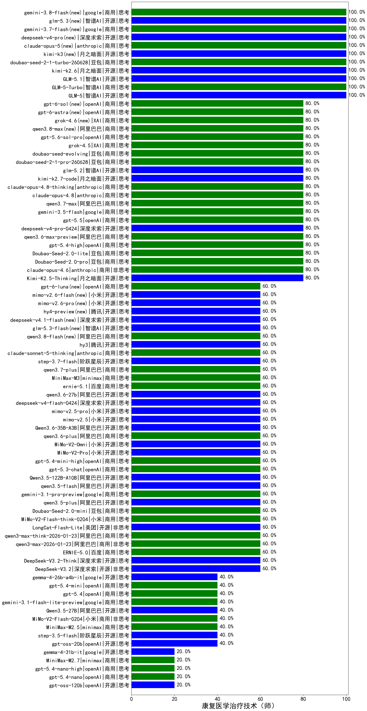

|类别|机构|大模型|【康复医学治疗技术（师）】准确率|平均耗时|平均消耗token|花费/千次（元）|排名（准确率）|
|---|---|-----|-------------------|-------|-----------|-----------|-----------|
|开源|月之暗面|kimi-k2.6|100.0%|65s|1277|33.2|1|
|开源|深度求索|deepseek-v4-pro(new)|100.0%|199s|684|16.0|2|
|商用|豆包|doubao-seed-2-1-turbo-260628|100.0%|210s|9069|134.8|3|
|开源|智谱AI|GLM-5.1|100.0%|243s|2031|47.6|4|
|开源|月之暗面|kimi-k3(new)|100.0%|32s|694|58.2|5|
|商用|anthropic|claude-opus-5(new)|100.0%|14s|645|100.6|6|
|开源|智谱AI|GLM-5|100.0%|42s|1449|25.2|7|
|商用|智谱AI|GLM-5-Turbo|100.0%|56s|1283|27.2|8|
|商用|google|gemini-3.7-flash(new)|100.0%|7s|764|18.8|9|
|开源|智谱AI|glm-5.3(new)|100.0%|137s|1094|29.3|10|
|商用|google|gemini-3.8-flash(new)|100.0%|9s|740|36.2|11|
|商用|XAI|grok-4.6(new)|80.0%|140s|1464|54.1|12|
|商用|anthropic|claude-opus-4.8-thinking|80.0%|11s|631|98.2|13|
|商用|阿里巴巴|qwen3.6-max-preview|80.0%|45s|1573|82.0|14|
|开源|深度求索|deepseek-v4-pro-0424|80.0%|21s|648|14.8|15|
|商用|openAI|gpt-5.5|80.0%|7s|368|64.5|16|
|商用|google|gemini-3.5-flash|80.0%|8s|1279|77.3|17|
|商用|阿里巴巴|qwen3.7-max|80.0%|30s|1483|51.8|18|
|商用|anthropic|claude-opus-4.8|80.0%|10s|457|67.8|19|
|开源|智谱AI|glm-5.2|80.0%|28s|1263|34.0|20|
|开源|月之暗面|kimi-k2.7-code|80.0%|11s|712|17.9|21|
|商用|阿里巴巴|qwen3.8-max(new)|80.0%|24s|1067|35.9|22|
|商用|豆包|doubao-seed-2-1-pro-260628|80.0%|237s|11336|337.7|23|
|商用|openAI|gpt-6-sol(new)|80.0%|269s|294|16.5|24|
|商用|豆包|doubao-seed-evolving|80.0%|254s|8620|256.2|25|
|商用|openAI|gpt-6-astra(new)|80.0%|17s|280|77.6|26|
|商用|openAI|gpt-5.6-sol-pro|80.0%|29s|3540|292.3|27|
|商用|XAI|grok-4.5|80.0%|107s|1229|44.3|28|
|商用|XAI|grok-4.7(new)|80.0%|22s|2787|80.7|29|
|商用|豆包|Doubao-Seed-2.0-lite|80.0%|205s|891|2.9|30|
|商用|豆包|Doubao-Seed-2.0-pro|80.0%|252s|1170|17.4|31|
|商用|anthropic|claude-opus-4.6|80.0%|21s|521|79.0|32|
|开源|月之暗面|Kimi-K2.5-Thinking|80.0%|309s|1590|32.3|33|
|商用|openAI|gpt-5.4-high|80.0%|16s|878|85.8|34|
|商用|openAI|gpt-5.4-mini-high|60.0%|29s|668|19.1|35|
|商用|阿里巴巴|qwen3-max-2026-01-23|60.0%|92s|305|2.5|36|
|商用|豆包|Doubao-Seed-2.0-mini|60.0%|305s|1891|3.6|37|
|商用|anthropic|claude-sonnet-5-thinking|60.0%|16s|849|54.5|38|
|开源|腾讯|hy3|60.0%|72s|224|0.7|39|
|商用|小米|MiMo-V2-Flash-think-0204|60.0%|509s|1877|3.8|40|
|开源|美团|LongCat-Flash-Lite|60.0%|501s|508|0.0|41|
|商用|阿里巴巴|qwen3-max-think-2026-01-23|60.0%|103s|2092|20.4|42|
|商用|阿里巴巴|qwen3.8-flash(new)|60.0%|42s|918|2.3|43|
|开源|阿里巴巴|qwen3.5-flash|60.0%|373s|3398|6.7|44|
|开源|智谱AI|glm-5.3-flash(new)|60.0%|70s|2557|7.0|45|
|商用|百度|ERNIE-5.0|60.0%|147s|1624|38.0|46|
|开源|深度求索|DeepSeek-V3.2-Think|60.0%|136s|867|2.5|47|
|开源|深度求索|deepseek-v4.1-flash(new)|60.0%|5s|608|4.4|48|
|开源|腾讯|hy4-preview(new)|60.0%|65s|4148|73.7|49|
|开源|小米|mimo-v2.6-pro(new)|60.0%|69s|839|4.8|50|
|开源|小米|mimo-v2.6-flash(new)|60.0%|57s|816|1.6|51|
|商用|openAI|gpt-6-luna(new)|60.0%|537s|478|1.5|52|
|开源|深度求索|DeepSeek-V3.2|60.0%|107s|270|0.8|53|
|开源|阿里巴巴|qwen3.5-plus|60.0%|49s|3745|17.7|54|
|商用|google|gemini-3.1-pro-preview|60.0%|41s|1791|148.2|55|
|开源|阶跃星辰|step-3.7-flash|60.0%|16s|2110|16.6|56|
|商用|openAI|gpt-5.3-chat|60.0%|38s|368|29.8|57|
|开源|小米|MiMo-V2-Pro|60.0%|13s|990|16.5|58|
|开源|小米|MiMo-V2-Omni|60.0%|136s|1213|13.5|59|
|商用|阿里巴巴|qwen3.6-plus|60.0%|25s|1425|16.4|60|
|开源|阿里巴巴|Qwen3.6-35B-A3B|60.0%|110s|1455|15.1|61|
|开源|小米|mimo-v2.5|60.0%|33s|1527|18.0|62|
|开源|小米|mimo-v2.5-pro|60.0%|47s|1867|34.9|63|
|开源|深度求索|deepseek-v4-flash-0424|60.0%|47s|600|1.1|64|
|开源|阿里巴巴|Qwen3.5-122B-A10B|60.0%|383s|3934|24.8|65|
|开源|阿里巴巴|qwen3.6-27b|60.0%|27s|1604|27.9|66|
|商用|阿里巴巴|qwen3.7-plus|60.0%|22s|1145|8.8|67|
|商用|minimax|MiniMax-M3|60.0%|22s|576|6.8|68|
|商用|百度|ernie-5.1|60.0%|29s|1096|18.9|69|
|开源|阿里巴巴|Qwen3.5-27B|40.0%|416s|4244|20.1|70|
|开源|google|gemma-4-26b-a4b-it|40.0%|60s|519|1.3|71|
|商用|openAI|gpt-5.4-mini|40.0%|13s|183|3.8|72|
|商用|小米|MiMo-V2-Flash-0204|40.0%|368s|442|0.8|73|
|开源|openAI|gpt-oss-20b|40.0%|7s|753|0.8|74|
|商用|google|gemini-3.1-flash-lite-preview|40.0%|14s|345|3.1|75|
|开源|阶跃星辰|step-3.5-flash|40.0%|11s|1811|3.7|76|
|商用|openAI|gpt-5.4|40.0%|3s|193|13.9|77|
|商用|minimax|MiniMax-M2.5|40.0%|18s|932|7.2|78|
|商用|openAI|gpt-5.4-nano|20.0%|12s|141|0.7|79|
|开源|google|gemma-4-31b-it|20.0%|50s|439|1.1|80|
|商用|minimax|MiniMax-M2.7|20.0%|35s|1517|12.2|81|
|商用|openAI|gpt-5.4-nano-high|20.0%|10s|380|2.8|82|
|开源|openAI|gpt-oss-120b|20.0%|51s|495|1.3|83|

