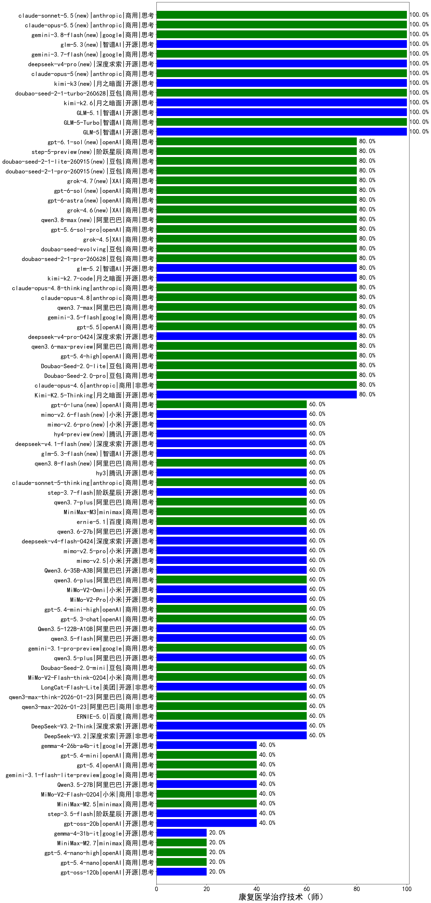

|类别|机构|大模型|【康复医学治疗技术（师）】准确率|平均耗时|平均消耗token|花费/千次（元）|排名（准确率）|
|---|---|-----|-------------------|-------|-----------|-----------|-----------|
|商用|豆包|doubao-seed-2-1-turbo-260628|100.0%|210s|9069|134.8|1|
|开源|智谱AI|GLM-5.1|100.0%|243s|2031|47.6|2|
|商用|google|gemini-4-argon(new)|100.0%|19s|585|71.9|3|
|商用|anthropic|claude-sonnet-5.5(new)|100.0%|8s|640|39.8|4|
|商用|anthropic|claude-opus-5.5(new)|100.0%|15s|647|80.6|5|
|商用|google|gemini-3.8-flash(new)|100.0%|9s|740|36.2|6|
|开源|智谱AI|glm-5.3(new)|100.0%|137s|1094|29.3|7|
|商用|google|gemini-3.7-flash|100.0%|7s|764|18.8|8|
|开源|深度求索|deepseek-v4-pro|100.0%|199s|684|16.0|9|
|商用|anthropic|claude-opus-5|100.0%|14s|645|100.6|10|
|开源|月之暗面|kimi-k3|100.0%|32s|694|58.2|11|
|开源|月之暗面|kimi-k2.6|100.0%|65s|1277|33.2|12|
|开源|月之暗面|kimi-k3.1-pro(new)|100.0%|30s|1033|62.5|13|
|商用|豆包|doubao-seed-2-1-lite-260915(new)|80.0%|94s|788|2.0|14|
|商用|anthropic|claude-opus-4.8|80.0%|10s|457|67.8|15|
|商用|openAI|gpt-6.1-sol(new)|80.0%|7s|235|12.4|16|
|商用|阿里巴巴|qwen3.8-max|80.0%|24s|1067|35.9|17|
|商用|openAI|gpt-5.6-sol-pro|80.0%|29s|3540|292.3|18|
|商用|XAI|grok-4.5|80.0%|107s|1229|44.3|19|
|商用|阶跃星辰|step-5-preview(new)|80.0%|13s|981|18.8|20|
|商用|豆包|doubao-seed-evolving|80.0%|254s|8620|256.2|21|
|商用|openAI|gpt-6-astra(new)|80.0%|17s|280|77.6|22|
|商用|豆包|doubao-seed-2-1-pro-260628|80.0%|237s|11336|337.7|23|
|开源|智谱AI|glm-5.2|80.0%|28s|1263|34.0|24|
|开源|月之暗面|kimi-k2.7-code|80.0%|11s|712|17.9|25|
|商用|anthropic|claude-opus-4.8-thinking|80.0%|11s|631|98.2|26|
|商用|XAI|grok-4.6|80.0%|140s|1464|54.1|27|
|商用|阿里巴巴|qwen3.6-max-preview|80.0%|45s|1573|82.0|28|
|商用|阿里巴巴|qwen3.7-max|80.0%|30s|1483|51.8|29|
|商用|google|gemini-3.5-flash|80.0%|8s|1279|77.3|30|
|商用|豆包|doubao-seed-2-1-pro-260915(new)|80.0%|50s|1833|52.6|31|
|商用|openAI|gpt-5.5|80.0%|7s|368|64.5|32|
|开源|深度求索|deepseek-v4-pro-0424|80.0%|21s|648|14.8|33|
|商用|openAI|gpt-6-sol(new)|80.0%|269s|294|16.5|34|
|商用|XAI|grok-4.7(new)|80.0%|22s|2787|80.7|35|
|开源|小米|mimo-v2.6-pro(new)|60.0%|69s|839|4.8|36|
|商用|百度|ERNIE-5.0|60.0%|147s|1624|38.0|37|
|商用|阿里巴巴|qwen3.8-flash(new)|60.0%|42s|918|2.3|38|
|开源|智谱AI|glm-5.3-flash(new)|60.0%|70s|2557|7.0|39|
|商用|google|gemini-3.1-pro-preview|60.0%|41s|1791|148.2|40|
|开源|腾讯|hy4-preview(new)|60.0%|65s|4148|73.7|41|
|商用|openAI|gpt-6-luna(new)|60.0%|537s|478|1.5|42|
|开源|小米|mimo-v2.6-flash(new)|60.0%|57s|816|1.6|43|
|开源|阿里巴巴|Qwen3.5-122B-A10B|60.0%|383s|3934|24.8|44|
|开源|深度求索|deepseek-v4.1-flash(new)|60.0%|5s|608|4.4|45|
|商用|阿里巴巴|qwen3.6-plus|60.0%|25s|1425|16.4|46|
|开源|深度求索|DeepSeek-V3.2-Think|60.0%|136s|867|2.5|47|
|开源|深度求索|DeepSeek-V3.2|60.0%|107s|270|0.8|48|
|开源|阿里巴巴|Qwen3.6-35B-A3B|60.0%|110s|1455|15.1|49|
|商用|anthropic|claude-sonnet-5-thinking|60.0%|16s|849|54.5|50|
|开源|阶跃星辰|step-3.7-flash|60.0%|16s|2110|16.6|51|
|商用|阿里巴巴|qwen3.7-plus|60.0%|22s|1145|8.8|52|
|商用|minimax|MiniMax-M3|60.0%|22s|576|6.8|53|
|商用|百度|ernie-5.1|60.0%|29s|1096|18.9|54|
|开源|阿里巴巴|qwen3.6-27b|60.0%|27s|1604|27.9|55|
|开源|深度求索|deepseek-v4-flash-0424|60.0%|47s|600|1.1|56|
|开源|小米|mimo-v2.5-pro|60.0%|47s|1867|34.9|57|
|开源|小米|mimo-v2.5|60.0%|33s|1527|18.0|58|
|商用|minimax|MiniMax-M3.1-Flash(new)|60.0%|40s|984|3.2|59|
|开源|腾讯|hy3|60.0%|72s|224|0.7|60|
|商用|anthropic|claude-haiku-5.5(new)|40.0%|43s|803|2.6|61|
|开源|google|gemma-4-26b-a4b-it|40.0%|60s|519|1.3|62|
|开源|阿里巴巴|Qwen3.5-27B|40.0%|416s|4244|20.1|63|
|商用|google|gemini-3.1-flash-lite-preview|40.0%|14s|345|3.1|64|
|开源|openAI|gpt-oss-20b|40.0%|7s|753|0.8|65|
|商用|minimax|MiniMax-M2.7|20.0%|35s|1517|12.2|66|
|开源|google|gemma-4-31b-it|20.0%|50s|439|1.1|67|
|开源|openAI|gpt-oss-120b|20.0%|51s|495|1.3|68|

