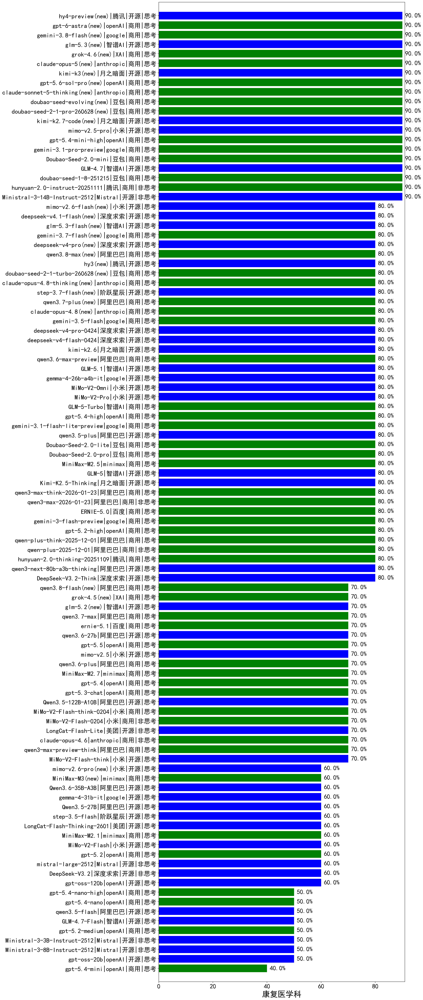

|类别|机构|大模型|【康复医学科】准确率|平均耗时|平均消耗token|花费/千次（元）|排名（准确率）|
|---|---|-----|-------------------|-------|-----------|-----------|-----------|
|开源|腾讯|hy4-preview(new)|90.0%|98s|5704|101.7|1|
|开源|智谱AI|glm-5.3(new)|90.0%|-297s|2299|62.9|2|
|商用|豆包|doubao-seed-2-1-pro-260628(new)|90.0%|371s|9644|286.7|3|
|开源|小米|mimo-v2.5-pro|90.0%|32s|1871|34.8|4|
|商用|豆包|doubao-seed-evolving(new)|90.0%|216s|7716|228.9|5|
|商用|anthropic|claude-sonnet-5-thinking(new)|90.0%|17s|836|52.4|6|
|商用|openAI|gpt-5.4-mini-high|90.0%|14s|859|24.7|7|
|商用|openAI|gpt-5.6-sol-pro(new)|90.0%|15s|3453|278.2|8|
|开源|月之暗面|kimi-k3(new)|90.0%|31s|632|51.6|9|
|商用|google|gemini-3.1-pro-preview|90.0%|36s|1871|154.3|10|
|商用|豆包|Doubao-Seed-2.0-mini|90.0%|609s|3046|5.9|11|
|商用|anthropic|claude-opus-5(new)|90.0%|13s|718|110.4|12|
|商用|XAI|grok-4.6(new)|90.0%|681s|2380|92.4|13|
|开源|智谱AI|GLM-4.7|90.0%|68s|2570|35.2|14|
|商用|豆包|doubao-seed-1-8-251215|90.0%|37s|641|4.3|15|
|开源|月之暗面|kimi-k2.7-code(new)|90.0%|99s|2565|67.9|16|
|商用|google|gemini-3.8-flash(new)|90.0%|14s|750|36.3|17|
|商用|腾讯|hunyuan-2.0-instruct-20251111|90.0%|17s|388|0.6|18|
|开源|Mistral|Ministral-3-14B-Instruct-2512|90.0%|9s|577|0.8|19|
|商用|openAI|gpt-6-astra(new)|90.0%|13s|278|72.5|20|
|商用|google|gemini-3-flash-preview|80.0%|74s|1555|31.8|21|
|商用|openAI|gpt-5.2-high|80.0%|13s|664|58.3|22|
|商用|智谱AI|GLM-5-Turbo|80.0%|25s|1451|30.8|23|
|开源|腾讯|hy3(new)|80.0%|32s|212|0.6|24|
|开源|小米|MiMo-V2-Pro|80.0%|337s|1207|20.9|25|
|开源|小米|MiMo-V2-Omni|80.0%|72s|1540|18.0|26|
|开源|阿里巴巴|qwen3-next-80b-a3b-thinking|80.0%|134s|4187|16.5|27|
|开源|google|gemma-4-26b-a4b-it|80.0%|38s|500|1.2|28|
|开源|智谱AI|GLM-5.1|80.0%|213s|2145|50.2|29|
|商用|豆包|doubao-seed-2-1-turbo-260628(new)|80.0%|269s|10675|158.8|30|
|商用|阿里巴巴|qwen3.6-max-preview|80.0%|55s|1593|82.7|31|
|开源|月之暗面|kimi-k2.6|80.0%|80s|2013|53.0|32|
|开源|深度求索|DeepSeek-V3.2-Think|80.0%|178s|1177|3.5|33|
|开源|深度求索|deepseek-v4-flash-0424|80.0%|17s|650|1.2|34|
|开源|深度求索|deepseek-v4-pro-0424|80.0%|67s|1214|28.4|35|
|商用|google|gemini-3.5-flash|80.0%|11s|1600|97.0|36|
|商用|anthropic|claude-opus-4.8(new)|80.0%|9s|475|67.9|37|
|开源|深度求索|deepseek-v4.1-flash(new)|80.0%|10s|1105|8.3|38|
|商用|阿里巴巴|qwen3.7-plus(new)|80.0%|35s|1826|14.2|39|
|开源|阶跃星辰|step-3.7-flash(new)|80.0%|70s|4650|37.2|40|
|商用|anthropic|claude-opus-4.8-thinking(new)|80.0%|11s|757|117.1|41|
|商用|google|gemini-3.1-flash-lite-preview|80.0%|7s|373|3.3|42|
|商用|openAI|gpt-5.4-high|80.0%|20s|1131|111.0|43|
|开源|阿里巴巴|qwen3.5-plus|80.0%|40s|3316|15.6|44|
|商用|百度|ERNIE-5.0|80.0%|99s|2088|49.0|45|
|商用|阿里巴巴|qwen3.8-max(new)|80.0%|233s|2299|80.1|46|
|商用|阿里巴巴|qwen3-max-think-2026-01-23|80.0%|124s|3037|29.8|47|
|开源|月之暗面|Kimi-K2.5-Thinking|80.0%|472s|2265|46.4|48|
|开源|智谱AI|glm-5.3-flash(new)|80.0%|59s|2162|5.9|49|
|开源|智谱AI|GLM-5|80.0%|76s|2500|44.0|50|
|商用|minimax|MiniMax-M2.5|80.0%|36s|1643|13.2|51|
|开源|深度求索|deepseek-v4-pro(new)|80.0%|208s|1197|29.7|52|
|商用|豆包|Doubao-Seed-2.0-pro|80.0%|226s|1069|15.7|53|
|商用|豆包|Doubao-Seed-2.0-lite|80.0%|197s|877|2.8|54|
|商用|阿里巴巴|qwen-plus-2025-12-01|80.0%|21s|875|1.7|55|
|商用|腾讯|hunyuan-2.0-thinking-20251109|80.0%|21s|866|3.3|56|
|商用|阿里巴巴|qwen-plus-think-2025-12-01|80.0%|99s|3145|24.6|57|
|商用|google|gemini-3.7-flash(new)|80.0%|7s|809|19.7|58|
|商用|阿里巴巴|qwen3-max-2026-01-23|80.0%|81s|456|4.0|59|
|商用|阿里巴巴|qwen3-max-preview-think|70.0%|152s|2885|67.8|60|
|商用|阿里巴巴|qwen3.7-max|70.0%|26s|1370|47.6|61|
|商用|百度|ernie-5.1|70.0%|34s|913|15.5|62|
|开源|阿里巴巴|qwen3.6-27b|70.0%|36s|1727|30.0|63|
|商用|openAI|gpt-5.5|70.0%|15s|656|122.3|64|
|开源|小米|MiMo-V2-Flash-think|70.0%|39s|2451|0.0|65|
|开源|阿里巴巴|Qwen3.5-122B-A10B|70.0%|392s|3564|22.4|66|
|开源|小米|mimo-v2.5|70.0%|25s|1898|23.0|67|
|商用|anthropic|claude-opus-4.6|70.0%|16s|578|85.7|68|
|商用|阿里巴巴|qwen3.6-plus|70.0%|38s|1847|21.4|69|
|开源|美团|LongCat-Flash-Lite|70.0%|157s|865|0.0|70|
|商用|小米|MiMo-V2-Flash-0204|70.0%|363s|554|1.0|71|
|商用|minimax|MiniMax-M2.7|70.0%|37s|1513|12.1|72|
|商用|小米|MiMo-V2-Flash-think-0204|70.0%|1050s|2371|4.8|73|
|商用|XAI|grok-4.5(new)|70.0%|69s|2571|100.4|74|
|开源|智谱AI|glm-5.2(new)|70.0%|75s|2584|70.8|75|
|商用|openAI|gpt-5.4|70.0%|4s|243|17.8|76|
|商用|openAI|gpt-5.3-chat|70.0%|43s|403|31.8|77|
|商用|阿里巴巴|qwen3.8-flash(new)|70.0%|23s|1110|2.8|78|
|开源|openAI|gpt-oss-120b|60.0%|6s|774|2.2|79|
|商用|minimax|MiniMax-M3(new)|60.0%|36s|1006|14.0|80|
|商用|openAI|gpt-5.2|60.0%|5s|194|11.5|81|
|开源|google|gemma-4-31b-it|60.0%|92s|471|1.2|82|
|开源|深度求索|DeepSeek-V3.2|60.0%|64s|339|1.0|83|
|开源|Mistral|mistral-large-2512|60.0%|13s|555|5.2|84|
|开源|阿里巴巴|Qwen3.5-27B|60.0%|308s|3641|17.2|85|
|开源|阶跃星辰|step-3.5-flash|60.0%|36s|2695|5.6|86|
|开源|美团|LongCat-Flash-Thinking-2601|60.0%|218s|2455|0.0|87|
|开源|阿里巴巴|Qwen3.6-35B-A3B|60.0%|109s|1622|16.9|88|
|商用|minimax|MiniMax-M2.1|60.0%|82s|1603|12.8|89|
|开源|小米|MiMo-V2-Flash|60.0%|15s|770|0.0|90|
|开源|Mistral|Ministral-3-8B-Instruct-2512|50.0%|8s|485|0.5|91|
|开源|Mistral|Ministral-3-3B-Instruct-2512|50.0%|7s|619|0.4|92|
|开源|智谱AI|GLM-4.7-Flash|50.0%|333s|1674|0.0|93|
|商用|openAI|gpt-5.2-medium|50.0%|13s|433|35.3|94|
|开源|阿里巴巴|qwen3.5-flash|50.0%|360s|4426|8.7|95|
|开源|openAI|gpt-oss-20b|50.0%|13s|1444|1.6|96|
|商用|openAI|gpt-5.4-nano|50.0%|8s|222|1.3|97|
|商用|openAI|gpt-5.4-nano-high|50.0%|55s|475|3.5|98|
|商用|openAI|gpt-5.4-mini|40.0%|53s|242|5.3|99|

