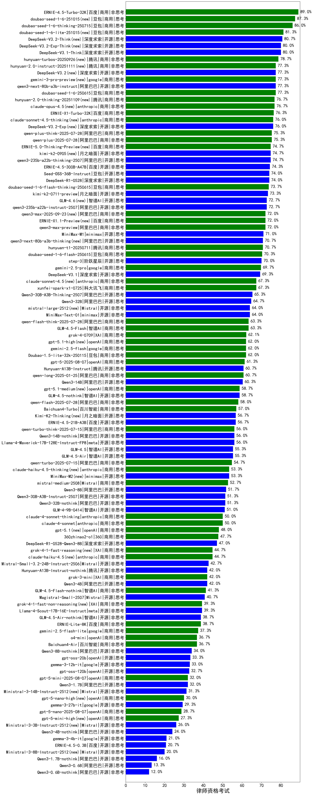

|类别|机构|大模型|【律师资格考试】准确率|平均耗时|平均消耗token|花费/千次（元）|排名（准确率）|
|---|---|-----|-------------------|-------|-----------|-----------|-----------|
|商用|智谱AI|GLM-4-Plus|89.3%|9s|402|2.0|1|
|商用|百度|ERNIE-4.5-Turbo-32K|89.0%|22s|612|1.7|2|
|商用|豆包|doubao-seed-1-6-thinking-250715(new)|86.0%|47s|1835|13.8|3|
|开源|腾讯|hunyuan-large|83.2%|9s|1816|10.2|4|
|开源|阿里巴巴|Qwen3-235B-A22B|78.0%|199s|2567|24.7|5|
|商用|豆包|doubao-seed-1-6-250615|77.3%|83s|568|3.4|6|
|商用|百度|ERNIE-X1-Turbo-32K|76.3%|199s|2266|8.7|7|
|商用|腾讯|hunyuan-turbos-20250604|75.3%|49s|647|1.1|8|
|开源|阿里巴巴|qwen3-235b-a22b-thinking-2507(new)|74.7%|82s|3431|66.4|9|
|商用|科大讯飞|xunfei-spark-x1-0725(new)|74.4%|/|1254|15.1|10|
|开源|百度|ERNIE-4.5-300B-A47B|74.3%|197s|471|3.0|11|
|商用|阿里巴巴|qwen-plus-2025-07-14(new)|74.0%|12s|714|1.3|12|
|开源|深度求索|DeepSeek-R1-0528|74.0%|227s|2343|36.0|13|
|商用|豆包|doubao-seed-1-6-flash-thinking-250615|73.7%|11s|870|1.1|14|
|开源|月之暗面|kimi-k2-0711-preview(new)|73.3%|34s|628|8.7|15|
|开源|阿里巴巴|Qwen3-235B-A22B-nothink|72.7%|24s|654|5.5|16|
|开源|阿里巴巴|qwen3-235b-a22b-instruct-2507(new)|72.7%|17s|717|5.0|17|
|商用|阿里巴巴|qwen-plus-think-2025-04-28|72.3%|238s|2369|18.0|18|
|商用|豆包|Doubao-1.5-pro-32k-250115|72.3%|8s|487|0.8|19|
|商用|腾讯|hunyuan-t1-20250711(new)|71.1%|27s|1601|6.0|20|
|商用|豆包|doubao-seed-1-6-flash-250615|70.3%|5s|421|0.4|21|
|开源|深度求索|deepseek-chat-v3-0324|70.0%|141s|544|3.7|22|
|开源|阶跃星辰|step-3(new)|70.0%|119s|2376|9.2|23|
|商用|阶跃星辰|step-r1-v-mini|69.7%|125s|1849|14.0|24|
|商用|google|gemini-2.5-pro|69.7%|34s|2803|194.2|25|
|开源|minimax|MiniMax-M1|68.0%|340s|4222|32.2|26|
|商用|智谱AI|GLM-Z1-AirX|67.7%|31s|2609|16.8|27|
|商用|科大讯飞|xunfei-4.0Ultra|66.7%|6s|294|20.7|28|
|商用|科大讯飞|xunfei-spark-max|66.5%|6s|300|9.0|29|
|开源|阿里巴巴|Qwen3-30B-A3B-Thinking-2507(new)|65.3%|84s|3604|9.8|30|
|开源|阿里巴巴|Qwen3-32B|64.7%|72s|1975|7.5|31|
|商用|阿里巴巴|qwq-plus-2025-03-05|63.7%|70s|3174|12.4|32|
|开源|智谱AI|GLM-Z1-32B-0414|63.3%|208s|2953|11.4|33|
|商用|智谱AI|GLM-4.5-Flash(new)|63.3%|32s|1911|0.0|34|
|商用|豆包|Doubao-1.5-lite-32k-250115|63.2%|4s|368|0.2|35|
|商用|月之暗面|kimi-latest-8k|63.0%|20s|584|7.0|36|
|开源|阿里巴巴|qwq-32b|62.5%|60s|3822|22.4|37|
|商用|智谱AI|GLM-Z1-Air|62.3%|36s|1696|0.9|38|
|商用|XAI|grok-4-0709|62.1%|469s|2639|275.6|39|
|商用|google|gemini-2.5-flash|62.0%|14s|2278|39.0|40|
|商用|阿里巴巴|qwen2.5-max|61.2%|17s|579|4.6|41|
|开源|腾讯|Hunyuan-A13B-Instruct|60.7%|57s|1619|6.1|42|
|开源|阿里巴巴|Qwen3-14B|60.3%|86s|3452|6.7|43|
|开源|智谱AI|GLM-4-32B-0414|60.0%|32s|573|1.1|44|
|开源|meta|Llama-4-Maverick-17B-128E-Instruct-FP8|59.0%|12s|766|2.9|45|
|商用|阿里巴巴|qwen-turbo-think-2025-04-28|59.0%|112s|3219|9.3|46|
|开源|智谱AI|GLM-4.5-nothink|58.7%|31s|1074|12.0|47|
|商用|科大讯飞|xunfei-spark-pro|58.2%|/|/|/|48|
|商用|openAI|gpt-4.1|56.7%|11s|531|24.1|49|
|开源|百度|ERNIE-4.5-21B-A3B|56.7%|22s|511|0.0|50|
|商用|百度|ERNIE-3.5-8K|56.6%|25s|520|0.9|51|
|开源|阿里巴巴|Qwen3-14B-nothink|56.0%|14s|672|1.2|52|
|开源|阿里巴巴|Qwen3-30B-A3B|55.7%|151s|3100|8.4|53|
|开源|智谱AI|GLM-4.5-Air(new)|55.3%|35s|1883|10.0|54|
|开源|智谱AI|GLM-4.5(new)|55.3%|67s|1776|21.0|55|
|商用|阿里巴巴|qwen-turbo-2025-07-15(new)|54.7%|10s|545|0.3|56|
|开源|深度求索|DeepSeek-R1-Distill-Qwen-32B|53.5%|49s|1020|1.3|57|
|开源|华为|pangu-pro-moe(new)|53.3%|81s|1571|5.9|58|
|开源|阿里巴巴|qwen2.5-72b-instruct|53.2%|11s|430|4.1|59|
|开源|minimax|MiniMax-Text-01|52.7%|8s|963|7.7|60|
|开源|阿里巴巴|qwen2.5-32b-instruct|52.7%|5s|383|1.8|61|
|商用|奇虎360|360gpt2-pro|52.5%|10s|412|1.6|62|
|开源|阿里巴巴|Qwen3-32B-nothink|51.3%|41s|691|2.4|63|
|开源|阿里巴巴|Qwen3-30B-A3B-Instruct-2507(new)|51.3%|8s|879|2.4|64|
|商用|阿里巴巴|qwen-long-2025-01-25|51.3%|20s|452|0.7|65|
|开源|智谱AI|GLM-4-9B-0414|51.0%|15s|652|0.0|66|
|开源|阿里巴巴|Qwen3-8B|50.0%|215s|6132|0.0|67|
|商用|anthropic|claude-4-sonnet|50.0%|41s|685|55.7|68|
|商用|智谱AI|GLM-Z1-Flash|50.0%|36s|4530|0.0|69|
|商用|anthropic|claude-4-sonnet-thinking|50.0%|70s|1370|130.3|70|
|商用|奇虎360|360gpt2-o1|49.6%|17s|520|21.6|71|
|商用|阶跃星辰|step-2-mini|49.2%|10s|420|0.7|72|
|商用|商汤|SenseChat-5-1202|49.2%|/|/|/|73|
|商用|智谱AI|GLM-4-Long|48.9%|5s|361|0.4|74|
|开源|阿里巴巴|Qwen3-30B-A3B-nothink|48.7%|19s|645|1.5|75|
|商用|奇虎360|360zhinao2-o1|47.7%|/|/|/|76|
|商用|奇虎360|360gpt-turbo|47.1%|/|/|/|77|
|开源|阿里巴巴|qwen2.5-14b-instruct|47.1%|7s|364|0.8|78|
|商用|百川智能|Baichuan4-Turbo|47.1%|/|/|/|79|
|开源|深度求索|DeepSeek-R1-0528-Qwen3-8B|47.0%|344s|2746|0.0|80|
|开源|上海人工智能实验室|internlm2_5-7b-chat|45.3%|/|/|/|81|
|商用|零一万物|yi-lightning|44.3%|/|/|/|82|
|开源|阿里巴巴|qwen2.5-7b-instruct|43.8%|6s|388|0.3|83|
|商用|腾讯|hunyuan-standard|42.4%|/|/|/|84|
|开源|深度求索|DeepSeek-R1-Distill-Qwen-14B|42.2%|/|/|/|85|
|开源|腾讯|Hunyuan-A13B-Instruct-nothink(new)|42.0%|436s|598|2.0|86|
|开源|阿里巴巴|Qwen3-4B|42.0%|47s|1891|5.3|87|
|商用|XAI|grok-3-mini|42.0%|147s|1322|4.6|88|
|商用|google|gemini-2.5-flash-lite-preview-06-17|41.7%|4s|878|2.2|89|
|商用|openAI|chatgpt-4o-latest|41.7%|/|/|/|90|
|商用|智谱AI|GLM-4.5-Flash-nothink|41.3%|20s|1022|0.0|91|
|商用|智谱AI|GLM-Z1-FlashX|41.1%|32s|1820|0.4|92|
|商用|智谱AI|GLM-4-AirX|41.1%|2s|360|3.6|93|
|开源|meta|Llama-4-Scout-17B-16E-Instruct|41.0%|11s|693|1.3|94|
|开源|Mistral|Mistral-Small-3.1-24B-Instruct-2503|40.0%|/|/|/|95|
|开源|智谱AI|GLM-4.5-Air-nothink|38.7%|15s|1072|5.3|96|
|商用|百度|ERNIE-Speed-8K|37.9%|/|/|/|97|
|开源|智谱AI|GLM-Z1-Rumination-32B-0414|37.8%|30s|1447|4.0|98|
|商用|智谱AI|GLM-4-FlashX|37.7%|4s|367|0.0|99|
|商用|openAI|o4-mini|36.7%|38s|1967|59.1|100|
|开源|阿里巴巴|Qwen3-8B-nothink|35.3%|24s|621|0.0|101|
|开源|智谱AI|GLM-Z1-9B-0414|35.0%|133s|4074|0.0|102|
|商用|Mistral|mistral-large|34.8%|/|/|/|103|
|开源|openAI|gpt-oss-20b(new)|33.3%|96s|1921|2.1|104|
|商用|openAI|gpt-4.1-mini|33.3%|10s|608|5.7|105|
|开源|openAI|gpt-oss-120b(new)|32.7%|14s|1005|2.8|106|
|商用|百川智能|Baichuan4-Air|32.3%|/|/|/|107|
|开源|阿里巴巴|Qwen3-1.7B|32.0%|43s|2231|6.3|108|
|商用|百度|ERNIE-Lite-8K|31.2%|/|/|/|109|
|开源|阿里巴巴|qwen2.5-1.5b-instruct|29.6%|2s|302|0.0|110|
|开源|阿里巴巴|qwen2.5-3b-instruct|29.2%|10s|407|0.3|111|
|商用|科大讯飞|xunfei-spark-lite|28.0%|/|/|/|112|
|开源|微软|phi-4|26.7%|/|/|/|113|
|商用|Mistral|mistral-small|25.2%|/|/|/|114|
|商用|OpenAI|gpt-4o-mini|24.5%|/|/|/|115|
|开源|阿里巴巴|Qwen3-4B-nothink|24.0%|16s|574|1.4|116|
|开源|Google|gemma-3-27b-it|23.0%|/|/|/|117|
|商用|Mistral|ministral-8b|21.3%|/|/|/|118|
|开源|阿里巴巴|qwen2.5-0.5b-instruct|21.3%|1s|302|0.0|119|
|商用|百度|ERNIE-Tiny-8K|21.1%|/|/|/|120|
|开源|Google|gemma-3-12b-it|20.3%|/|/|/|121|
|开源|百度|ERNIE-4.5-0.3B|20.0%|3s|452|0.0|122|
|开源|Google|gemma-3-4b-it|16.5%|/|/|/|123|
|开源|阿里巴巴|Qwen3-1.7B-nothink|16.0%|12s|569|1.4|124|
|商用|Mistral|ministral-3b|15.7%|/|/|/|125|
|开源|阿里巴巴|Qwen3-0.6B|13.3%|27s|1766|4.9|126|
|开源|阿里巴巴|Qwen3-0.6B-nothink|12.0%|8s|303|0.6|127|

