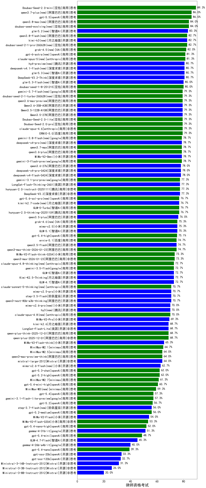

|类别|机构|大模型|【律师资格考试】准确率|平均耗时|平均消耗token|花费/千次（元）|排名（准确率）|
|---|---|-----|-------------------|-------|-----------|-----------|-----------|
|商用|豆包|Doubao-Seed-2.0-mini|89.3%|434s|3169|6.0|1|
|商用|openAI|gpt-5.5|86.0%|23s|1405|269.7|2|
|商用|阿里巴巴|qwen3.7-plus|86.0%|36s|1941|14.8|3|
|商用|阿里巴巴|qwen3.8-max(new)|84.0%|108s|4432|155.9|4|
|商用|豆包|doubao-seed-evolving|84.0%|247s|10946|324.5|5|
|开源|智谱AI|glm-5.2|83.3%|60s|2690|72.9|6|
|商用|阿里巴巴|qwen3.8-flash(new)|82.7%|76s|4059|10.6|7|
|商用|豆包|doubao-seed-2-1-pro-260628|82.7%|272s|10959|324.9|8|
|开源|月之暗面|kimi-k3(new)|82.7%|128s|2793|254.9|9|
|商用|XAI|grok-4.5|82.0%|62s|2892|112.4|10|
|商用|anthropic|claude-opus-5(new)|81.3%|17s|1109|166.2|11|
|商用|openAI|gpt-6-astra(new)|81.3%|19s|528|144.4|12|
|开源|智谱AI|glm-5.3(new)|80.7%|247s|5672|156.4|13|
|开源|深度求索|DeepSeek-V3.2-Think|80.7%|99s|1878|5.5|14|
|开源|深度求索|deepseek-v4.1-flash(new)|80.7%|18s|2709|20.9|15|
|开源|腾讯|hy4-preview(new)|80.7%|155s|9741|173.9|16|
|开源|智谱AI|glm-5.3-flash(new)|80.0%|175s|6198|17.1|17|
|开源|阿里巴巴|Qwen3.5-122B-A10B|79.3%|374s|4890|30.7|18|
|商用|阿里巴巴|qwen3.6-max-preview|79.3%|86s|2386|123.7|19|
|开源|阿里巴巴|Qwen3.6-35B-A3B|79.3%|82s|2411|25.0|20|
|商用|豆包|doubao-seed-2-1-turbo-260628|79.3%|265s|9222|136.4|21|
|商用|google|gemini-3.7-flash(new)|79.3%|5s|889|20.6|22|
|开源|阿里巴巴|Qwen3.5-27B|79.3%|298s|4435|20.8|23|
|商用|百度|ERNIE-5.0|79.3%|157s|2136|49.4|24|
|商用|anthropic|claude-opus-4.6|79.3%|21s|850|120.7|25|
|商用|豆包|Doubao-Seed-2.0-lite|79.3%|270s|1285|4.1|26|
|商用|豆包|Doubao-Seed-2.0-pro|79.3%|272s|1233|17.6|27|
|开源|小米|MiMo-V2-Omni|78.7%|12s|1843|21.7|28|
|商用|google|gemini-3.8-flash(new)|78.7%|13s|1075|51.0|29|
|开源|深度求索|deepseek-v4-pro(new)|78.7%|86s|2896|74.9|30|
|商用|阿里巴巴|qwen3.7-max|78.7%|33s|1679|57.7|31|
|商用|阿里巴巴|qwen3.6-plus|78.7%|55s|2396|27.6|32|
|开源|深度求索|deepseek-v4-pro-0424|78.0%|50s|1365|31.5|33|
|开源|阿里巴巴|qwen3.6-27b|78.0%|41s|2607|45.2|34|
|开源|深度求索|deepseek-v4-flash-0424|78.0%|38s|1578|3.1|35|
|开源|深度求索|DeepSeek-V3.2|77.3%|107s|662|1.9|36|
|商用|google|gemini-3.1-pro-preview|77.3%|52s|2180|176.5|37|
|开源|月之暗面|kimi-k2.7-code|76.7%|100s|2953|77.6|38|
|商用|智谱AI|GLM-5-Turbo|76.7%|40s|1928|40.5|39|
|商用|openAI|gpt-5.6-sol-pro|76.7%|43s|5988|579.9|40|
|开源|阿里巴巴|qwen3.5-plus|76.0%|50s|4258|20.0|41|
|开源|小米|mimo-v2.5|75.3%|22s|2058|24.8|42|
|开源|智谱AI|GLM-5.1|75.3%|135s|2082|48.0|43|
|商用|openAI|gpt-6-luna(new)|75.3%|320s|1145|3.6|44|
|商用|XAI|grok-4.6(new)|75.3%|79s|2526|97.1|45|
|商用|openAI|gpt-5.4-high|75.1%|30s|1776|173.8|46|
|开源|阿里巴巴|qwen3.5-flash|74.7%|280s|5049|9.9|47|
|商用|百度|ernie-5.1|74.7%|34s|1327|22.1|48|
|商用|阿里巴巴|qwen3-max-think-2026-01-23|74.7%|176s|4473|43.8|49|
|商用|openAI|gpt-6-sol(new)|74.0%|188s|518|28.2|50|
|商用|阿里巴巴|qwen3-max-2026-01-23|73.3%|49s|798|7.1|51|
|商用|小米|MiMo-V2-Flash-think-0204|73.3%|301s|2545|5.2|52|
|开源|月之暗面|Kimi-K2.5-Thinking|72.7%|190s|3463|70.9|53|
|商用|anthropic|claude-opus-4.8-thinking|72.7%|20s|1502|235.0|54|
|商用|XAI|grok-4.7(new)|72.7%|76s|6065|216.7|55|
|商用|google|gemini-3.5-flash|72.7%|14s|2188|131.0|56|
|开源|智谱AI|GLM-5|72.7%|104s|2815|49.1|57|
|开源|阶跃星辰|step-3.5-flash|70.7%|29s|3564|7.3|58|
|商用|anthropic|claude-sonnet-5-thinking|70.7%|25s|1378|85.3|59|
|开源|小米|mimo-v2.5-pro|70.7%|46s|2729|52.2|60|
|商用|anthropic|claude-opus-4.8|70.0%|10s|754|104.0|61|
|开源|小米|mimo-v2.6-pro(new)|70.0%|116s|5542|32.9|62|
|开源|腾讯|hy3|70.0%|101s|371|1.2|63|
|开源|小米|MiMo-V2-Pro|69.3%|269s|1533|27.1|64|
|开源|月之暗面|kimi-k2.6|68.7%|135s|3016|77.2|65|
|开源|美团|LongCat-Flash-Lite|68.7%|312s|701|0.0|66|
|商用|minimax|MiniMax-M2.5|64.0%|47s|2451|19.7|67|
|开源|小米|mimo-v2.6-flash(new)|62.7%|296s|2559|5.0|68|
|商用|openAI|gpt-5.3-chat|62.0%|25s|616|48.0|69|
|商用|minimax|MiniMax-M2.7|61.3%|65s|2455|19.7|70|
|商用|openAI|gpt-5.4-mini-high|60.7%|71s|2927|88.4|71|
|商用|minimax|MiniMax-M3|59.3%|58s|1626|23.8|72|
|商用|openAI|gpt-5.4|57.3%|6s|427|32.2|73|
|商用|google|gemini-3.1-flash-lite-preview|57.3%|6s|540|4.5|74|
|开源|阶跃星辰|step-3.7-flash|56.0%|474s|4693|37.2|75|
|商用|小米|MiMo-V2-Flash-0204|53.3%|222s|738|1.4|76|
|商用|openAI|gpt-5.4-nano-high|52.0%|83s|1514|12.2|77|
|开源|google|gemma-4-31b-it|51.3%|98s|644|1.5|78|
|商用|openAI|gpt-5.4-mini|48.7%|74s|393|8.6|79|
|开源|google|gemma-4-26b-a4b-it|40.0%|56s|745|1.8|80|
|商用|openAI|gpt-5.4-nano|39.3%|59s|400|2.4|81|
|开源|openAI|gpt-oss-20b|33.3%|96s|1921|2.1|82|
|开源|openAI|gpt-oss-120b|32.7%|14s|1005|2.8|83|

