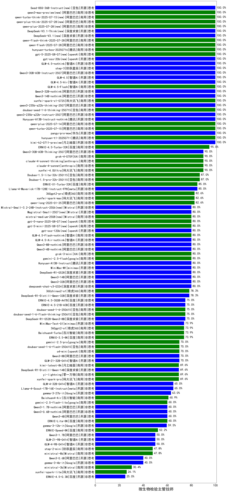

| 类别 |机构| 大模型                         | 微生物检验主管技师 | 排名 |
|-----|----|--------------------------|---------|----|
|商用|百度|ERNIE-4.5-Turbo-32K|95.0%|1|
|商用|科大讯飞|xunfei-4.0Ultra|90.0%|2|
|商用|anthropic|claude-4-sonnet|90.0%|3|
|商用|腾讯|hunyuan-turbo|90.0%|4|
|商用|anthropic|claude-4-sonnet-thinking|90.0%|5|
|商用|豆包|Doubao-1.5-thinking-pro|90.0%|6|
|商用|google|gemini-2.5-pro-preview-05-06|90.0%|7|
|商用|豆包|Doubao-1.5-lite-32k-250115|87.0%|8|
|商用|商汤|SenseChat-5-1202|87.0%|9|
|开源|深度求索|DeepSeek-R1|87.0%|10|
|商用|智谱AI|GLM-4-Plus|87.0%|11|
|开源|腾讯|hunyuan-large|87.0%|12|
|商用|豆包|Doubao-1.5-pro-32k-250115|87.0%|13|
|开源|阿里巴巴|Qwen3-30B-A3B|85.0%|14|
|商用|腾讯|hunyuan-t1-20250529|85.0%|15|
|商用|阿里巴巴|qwen-plus-2025-04-28|85.0%|16|
|开源|meta|Llama-4-Maverick-17B-128E-Instruct-FP8|85.0%|17|
|商用|百度|ERNIE-X1-Turbo-32K|85.0%|18|
|商用|腾讯|hunyuan-turbos-20250604(new)|85.0%|19|
|商用|阿里巴巴|qwen2.5-max|82.6%|20|
|商用|科大讯飞|xunfei-spark-max|82.6%|21|
|商用|商汤|SenseChat-5-beta|82.6%|22|
|商用|奇虎360|360gpt-turbo|82.6%|23|
|商用|奇虎360|360gpt2-pro|82.6%|24|
|商用|阿里巴巴|qwen-long-2025-01-25|82.6%|25|
|开源|深度求索|deepseek-chat-v3-0324|80.0%|26|
|商用|科大讯飞|xunfei-spark-x1|80.0%|27|
|商用|智谱AI|GLM-Z1-AirX|80.0%|28|
|开源|阿里巴巴|Qwen3-32B|80.0%|29|
|商用|豆包|doubao-seed-1-6-thinking-250615(new)|80.0%|30|
|开源|腾讯|Hunyuan-A13B-Instruct(new)|80.0%|31|
|开源|minimax|MiniMax-M1(new)|80.0%|32|
|开源|深度求索|DeepSeek-R1-0528|80.0%|33|
|商用|阿里巴巴|qwen-plus-think-2025-04-28|80.0%|34|
|开源|阿里巴巴|Qwen3-14B|80.0%|35|
|开源|阿里巴巴|qwq-32b|78.3%|36|
|开源|阿里巴巴|qwen2.5-14b-instruct|78.3%|37|
|开源|阿里巴巴|qwen2.5-72b-instruct|78.3%|38|
|商用|商汤|SenseChat-Turbo-1202|78.3%|39|
|开源|深度求索|DeepSeek-R1-Distill-Qwen-32B|78.3%|40|
|商用|奇虎360|360zhinao2-o1|78.3%|41|
|商用|阿里巴巴|qwq-plus-2025-03-05|78.3%|42|
|开源|阿里巴巴|qwen2.5-32b-instruct|78.3%|43|
|商用|腾讯|hunyuan-standard|78.3%|44|
|商用|智谱AI|GLM-4-AirX|76.7%|45|
|商用|豆包|doubao-seed-1-6-flash-thinking-250615(new)|75.0%|46|
|商用|豆包|doubao-seed-1-6-250615(new)|75.0%|47|
|开源|百度|ERNIE-4.5-21B-A3B(new)|75.0%|48|
|开源|深度求索|DeepSeek-R1-0528-Qwen3-8B|75.0%|49|
|开源|阿里巴巴|Qwen3-235B-A22B|75.0%|50|
|商用|智谱AI|GLM-Z1-Air|75.0%|51|
|开源|百度|ERNIE-4.5-300B-A47B(new)|75.0%|52|
|商用|百度|ERNIE-3.5-8K|73.9%|53|
|商用|百川智能|Baichuan4-Turbo|73.9%|54|
|商用|奇虎360|360gpt2-o1|73.9%|55|
|开源|minimax|MiniMax-Text-01|73.9%|56|
|商用|Mistral|mistral-large|73.9%|57|
|开源|阿里巴巴|qwen2.5-7b-instruct|73.9%|58|
|商用|智谱AI|GLM-4-Air|73.3%|59|
|商用|智谱AI|GLM-Z1-Flash|70.0%|60|
|商用|阿里巴巴|qwen-turbo-think-2025-04-28|70.0%|61|
|商用|阿里巴巴|qwen-turbo-2025-04-28|70.0%|62|
|开源|阿里巴巴|Qwen3-8B|70.0%|63|
|开源|智谱AI|GLM-Z1-32B-0414|70.0%|64|
|商用|openAI|o4-mini|70.0%|65|
|商用|openAI|gpt-4.1-mini|70.0%|66|
|商用|openAI|gpt-4.1|70.0%|67|
|商用|豆包|doubao-seed-1-6-flash-250615(new)|70.0%|68|
|商用|科大讯飞|xunfei-spark-pro|69.6%|69|
|商用|零一万物|yi-lightning|69.6%|70|
|开源|上海人工智能实验室|internlm2_5-7b-chat|69.6%|71|
|商用|OpenAI|gpt-4o-mini|69.6%|72|
|商用|月之暗面|kimi-latest-8k|69.6%|73|
|商用|openAI|chatgpt-4o-latest|69.6%|74|
|开源|深度求索|DeepSeek-R1-Distill-Qwen-14B|69.6%|75|
|商用|Mistral|mistral-small|65.2%|76|
|商用|阶跃星辰|step-r1-v-mini|65.0%|77|
|开源|Mistral|Mistral-Small-3.1-24B-Instruct-2503|65.0%|78|
|商用|google|gemini-2.5-flash-preview-05-20|65.0%|79|
|开源|智谱AI|GLM-4-32B-0414|65.0%|80|
|开源|meta|Llama-4-Scout-17B-16E-Instruct|65.0%|81|
|商用|智谱AI|GLM-4-Long|63.3%|82|
|开源|Google|gemma-3-27b-it|63.0%|83|
|商用|百川智能|Baichuan4-Air|60.9%|84|
|开源|阿里巴巴|Qwen3-4B|60.0%|85|
|商用|百度|ERNIE-Lite-8K|60.0%|86|
|开源|Google|gemma-3-12b-it|59.5%|87|
|商用|智谱AI|GLM-4-FlashX|56.5%|88|
|商用|智谱AI|GLM-4-Flash|56.5%|89|
|商用|月之暗面|moonshot-v1-8k|56.5%|90|
|开源|微软|phi-4|52.2%|91|
|商用|百度|ERNIE-Speed-8K|52.2%|92|
|开源|智谱AI|GLM-4-9B-0414|50.0%|93|
|开源|阿里巴巴|Qwen3-1.7B|50.0%|94|
|开源|智谱AI|GLM-Z1-9B-0414|50.0%|95|
|商用|智谱AI|GLM-Z1-FlashX|50.0%|96|
|商用|Mistral|ministral-8b|47.8%|97|
|开源|阿里巴巴|qwen2.5-3b-instruct|47.8%|98|
|商用|阶跃星辰|step-2-mini|47.8%|99|
|开源|智谱AI|GLM-Z1-Rumination-32B-0414|45.0%|100|
|开源|阿里巴巴|Qwen3-0.6B|40.0%|101|
|开源|Google|gemma-3-4b-it|40.0%|102|
|开源|阿里巴巴|qwen2.5-1.5b-instruct|39.1%|103|
|商用|Mistral|ministral-3b|30.4%|104|
|商用|科大讯飞|xunfei-spark-lite|26.1%|105|
|商用|百度|ERNIE-Tiny-8K|26.1%|106|
|开源|百度|ERNIE-4.5-0.3B(new)|25.0%|107|
|开源|阿里巴巴|qwen2.5-0.5b-instruct|17.4%|108|

