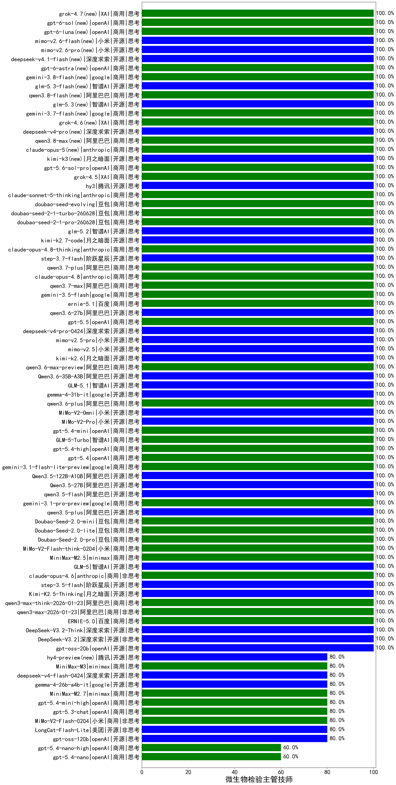

|类别|机构|大模型|【微生物检验主管技师】准确率|平均耗时|平均消耗token|花费/千次（元）|排名（准确率）|
|---|---|-----|-------------------|-------|-----------|-----------|-----------|
|开源|月之暗面|kimi-k2.6|100.0%|51s|828|21.3|1|
|商用|anthropic|claude-opus-4.8|100.0%|9s|498|76.3|2|
|商用|豆包|doubao-seed-2-1-turbo-260628|100.0%|60s|1920|27.7|3|
|商用|豆包|doubao-seed-2-1-pro-260628|100.0%|106s|2845|83.2|4|
|开源|智谱AI|glm-5.2|100.0%|26s|948|25.4|5|
|开源|月之暗面|kimi-k2.7-code|100.0%|8s|470|11.7|6|
|商用|anthropic|claude-opus-4.8-thinking|100.0%|11s|565|88.1|7|
|开源|阶跃星辰|step-3.7-flash|100.0%|11s|1509|11.8|8|
|商用|阿里巴巴|qwen3.7-plus|100.0%|11s|550|4.1|9|
|商用|阿里巴巴|qwen3.7-max|100.0%|13s|593|20.0|10|
|商用|anthropic|claude-sonnet-5-thinking|100.0%|12s|695|44.4|11|
|商用|google|gemini-3.5-flash|100.0%|8s|746|44.4|12|
|商用|百度|ernie-5.1|100.0%|33s|709|12.1|13|
|开源|阿里巴巴|qwen3.6-27b|100.0%|20s|1187|20.6|14|
|商用|openAI|gpt-5.5|100.0%|6s|253|42.5|15|
|开源|深度求索|deepseek-v4-pro-0424|100.0%|30s|373|8.4|16|
|开源|小米|mimo-v2.5-pro|100.0%|22s|1124|19.4|17|
|开源|小米|mimo-v2.5|100.0%|13s|834|8.4|18|
|商用|豆包|doubao-seed-evolving|100.0%|128s|4750|140.3|19|
|开源|腾讯|hy3|100.0%|81s|139|0.4|20|
|商用|阿里巴巴|qwen3.6-max-preview|100.0%|36s|1133|58.7|21|
|商用|阿里巴巴|qwen3.8-flash(new)|100.0%|13s|398|0.9|22|
|商用|openAI|gpt-6-luna(new)|100.0%|235s|181|0.5|23|
|开源|小米|mimo-v2.6-flash(new)|100.0%|72s|575|1.1|24|
|开源|小米|mimo-v2.6-pro(new)|100.0%|14s|608|3.5|25|
|开源|深度求索|deepseek-v4.1-flash(new)|100.0%|3s|251|1.6|26|
|商用|openAI|gpt-6-astra(new)|100.0%|12s|197|51.7|27|
|商用|google|gemini-3.8-flash(new)|100.0%|46s|486|23.4|28|
|开源|智谱AI|glm-5.3-flash(new)|100.0%|107s|592|1.5|29|
|开源|智谱AI|glm-5.3(new)|100.0%|59s|1226|33.2|30|
|商用|XAI|grok-4.5|100.0%|115s|787|26.0|31|
|商用|google|gemini-3.7-flash(new)|100.0%|4s|562|13.7|32|
|商用|XAI|grok-4.6(new)|100.0%|14s|709|22.7|33|
|开源|深度求索|deepseek-v4-pro(new)|100.0%|11s|318|6.3|34|
|商用|阿里巴巴|qwen3.8-max(new)|100.0%|10s|423|13.0|35|
|商用|anthropic|claude-opus-5(new)|100.0%|13s|562|87.6|36|
|开源|月之暗面|kimi-k3(new)|100.0%|381s|380|27.8|37|
|商用|openAI|gpt-5.6-sol-pro|100.0%|11s|2587|180.9|38|
|开源|openAI|gpt-oss-20b|100.0%|3s|584|0.6|39|
|商用|openAI|gpt-6-sol(new)|100.0%|619s|136|6.1|40|
|开源|阿里巴巴|Qwen3.6-35B-A3B|100.0%|105s|1084|11.2|41|
|开源|智谱AI|GLM-5|100.0%|32s|1069|18.5|42|
|商用|google|gemini-3.1-pro-preview|100.0%|16s|940|76.5|43|
|开源|阿里巴巴|qwen3.5-plus|100.0%|18s|1319|6.1|44|
|商用|豆包|Doubao-Seed-2.0-mini|100.0%|178s|928|1.7|45|
|商用|豆包|Doubao-Seed-2.0-lite|100.0%|124s|675|2.1|46|
|商用|豆包|Doubao-Seed-2.0-pro|100.0%|215s|610|8.6|47|
|商用|小米|MiMo-V2-Flash-think-0204|100.0%|621s|932|1.9|48|
|商用|minimax|MiniMax-M2.5|100.0%|13s|553|4.1|49|
|商用|anthropic|claude-opus-4.6|100.0%|10s|546|84.5|50|
|开源|阿里巴巴|Qwen3.5-27B|100.0%|43s|1135|5.2|51|
|开源|阶跃星辰|step-3.5-flash|100.0%|7s|721|1.4|52|
|开源|月之暗面|Kimi-K2.5-Thinking|100.0%|219s|1078|21.8|53|
|商用|阿里巴巴|qwen3-max-think-2026-01-23|100.0%|55s|1556|15.1|54|
|商用|阿里巴巴|qwen3-max-2026-01-23|100.0%|79s|254|2.1|55|
|商用|百度|ERNIE-5.0|100.0%|95s|995|23.1|56|
|开源|深度求索|DeepSeek-V3.2-Think|100.0%|19s|527|1.5|57|
|开源|深度求索|DeepSeek-V3.2|100.0%|85s|230|0.6|58|
|开源|智谱AI|GLM-5.1|100.0%|113s|823|18.8|59|
|开源|阿里巴巴|qwen3.5-flash|100.0%|245s|1606|3.1|60|
|开源|阿里巴巴|Qwen3.5-122B-A10B|100.0%|201s|1537|9.5|61|
|开源|小米|MiMo-V2-Pro|100.0%|478s|799|12.6|62|
|商用|openAI|gpt-5.4|100.0%|5s|200|15.7|63|
|商用|openAI|gpt-5.4-high|100.0%|23s|445|41.3|64|
|商用|智谱AI|GLM-5-Turbo|100.0%|17s|940|19.8|65|
|商用|openAI|gpt-5.4-mini|100.0%|8s|148|3.0|66|
|开源|google|gemma-4-31b-it|100.0%|42s|354|0.9|67|
|商用|阿里巴巴|qwen3.6-plus|100.0%|52s|1221|14.1|68|
|商用|google|gemini-3.1-flash-lite-preview|100.0%|3s|242|2.1|69|
|开源|小米|MiMo-V2-Omni|100.0%|5s|870|8.8|70|
|开源|google|gemma-4-26b-a4b-it|80.0%|86s|555|1.4|71|
|开源|深度求索|deepseek-v4-flash-0424|80.0%|37s|1726|3.4|72|
|开源|腾讯|hy4-preview(new)|80.0%|58s|1958|34.5|73|
|开源|openAI|gpt-oss-120b|80.0%|41s|394|1.0|74|
|商用|minimax|MiniMax-M2.7|80.0%|21s|824|6.4|75|
|商用|openAI|gpt-5.4-mini-high|80.0%|175s|413|11.4|76|
|开源|美团|LongCat-Flash-Lite|80.0%|290s|374|0.0|77|
|商用|小米|MiMo-V2-Flash-0204|80.0%|165s|313|0.6|78|
|商用|minimax|MiniMax-M3|80.0%|25s|579|7.0|79|
|商用|openAI|gpt-5.3-chat|80.0%|6s|298|24.0|80|
|商用|openAI|gpt-5.4-nano-high|60.0%|8s|282|2.0|81|
|商用|openAI|gpt-5.4-nano|60.0%|4s|197|1.3|82|

