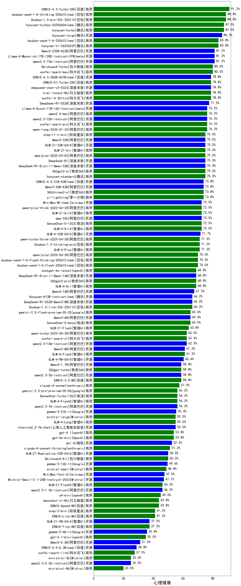

| 类别 | 大模型                         | 心理健康 | 排名 |
|-----|------------------------------|---------|----|
|开源|hunyuan-large|83.0%|1|
|商用|Doubao-1.5-pro-32k-250115|82.8%|2|
|商用|hunyuan-turbos-20250313|81.7%|3|
|商用|ERNIE-4.5-Turbo-32K(new)|80.5%|4|
|商用|hunyuan-turbos-20250604(new)|80.0%|5|
|商用|hunyuan-turbo|79.9%|6|
|商用|hunyuan-t1-20250321|78.9%|7|
|开源|deepseek-chat-v3-0324|75.8%|8|
|开源|Qwen3-32B|75.4%|9|
|商用|qwq-plus-2025-03-05|75.0%|10|
|商用|ERNIE-X1-Turbo-32K(new)|75.0%|11|
|开源|Qwen3-30B-A3B|74.8%|12|
|开源|qwq-32b|74.7%|13|
|商用|qwen-plus|74.6%|14|
|商用|qwen2.5-max|74.5%|15|
|商用|qwen-long|74.1%|16|
|商用|hunyuan-standard|73.8%|17|
|商用|hunyuan-t1-20250529(new)|72.5%|18|
|开源|Llama-4-Maverick-17B-128E-Instruct-FP8|72.5%|19|
|商用|xunfei-4.0Ultra|72.3%|20|
|商用|Baichuan4-Turbo|71.8%|21|
|开源|Qwen3-8B|71.8%|22|
|商用|xunfei-spark-pro|71.6%|23|
|商用|xunfei-spark-max|71.5%|24|
|商用|gemini-2.5-flash-preview-04-17|71.3%|25|
|商用|Doubao-1.5-thinking-pro(new)|71.2%|26|
|商用|qwen-turbo|71.0%|27|
|开源|DeepSeek-R1-0528(new)|70.8%|28|
|开源|DeepSeek-R1|70.8%|29|
|开源|qwen2.5-32b-instruct|70.7%|30|
|商用|yi-lightning|70.5%|31|
|商用|GLM-Z1-Air|70.2%|32|
|开源|qwen2.5-72b-instruct|70.0%|33|
|开源|GLM-Z1-32B-0414|69.9%|34|
|商用|kimi-latest-8k|69.7%|35|
|开源|Qwen3-14B|68.8%|36|
|开源|DeepSeek-R1-Distill-Qwen-14B|67.8%|37|
|开源|Llama-4-Scout-17B-16E-Instruct|66.8%|38|
|开源|DeepSeek-R1-Distill-Qwen-32B|66.5%|39|
|商用|SenseChat-5-1202|66.1%|40|
|商用|360gpt2-o1|66.1%|41|
|开源|Qwen3-4B|65.2%|42|
|开源|GLM-4-32B-0414|65.1%|43|
|商用|360zhinao2-o1|65.0%|44|
|商用|GLM-4-Air|64.6%|45|
|商用|Doubao-1.5-lite-32k-250115|64.6%|46|
|商用|GLM-4-AirX|64.6%|47|
|商用|chatgpt-4o-latest|64.5%|48|
|开源|Llama-3.3-70B-Instruct|64.2%|49|
|开源|Llama-3.3-70B-Instruct-fp8|64.2%|50|
|开源|Qwen3-1.7B|63.2%|51|
|商用|GLM-Z1-AirX|61.2%|52|
|商用|360gpt2-pro|60.7%|53|
|商用|GLM-4-Plus|60.3%|54|
|商用|step-r1-v-mini(new)|60.0%|55|
|开源|qwen2.5-3b-instruct|59.5%|56|
|开源|DeepSeek-R1-Distill-Llama-70B|59.4%|57|
|开源|Qwen3-235B-A22B|58.2%|58|
|开源|DeepSeek-R1-0528-Qwen3-8B(new)|57.9%|59|
|商用|claude-4-sonnet(new)|57.5%|60|
|开源|qwen2.5-7b-instruct|57.4%|61|
|商用|xunfei-spark-x1(new)|57.2%|62|
|开源|GLM-4-9B-0414|57.1%|63|
|开源|qwen2.5-14b-instruct|56.8%|64|
|开源|Meta-Llama-3.1-405B-Instruct|56.5%|65|
|商用|360gpt-turbo|56.3%|66|
|商用|gemini-2.5-pro-preview-05-06(new)|56.2%|67|
|商用|SenseChat-5-beta|56.1%|68|
|商用|SenseChat-Turbo-1202|55.0%|69|
|商用|ERNIE-3.5-8K|54.8%|70|
|商用|GLM-Z1-Flash|54.6%|71|
|商用|claude-4-sonnet-thinking(new)|53.8%|72|
|商用|gpt-4.1(new)|53.8%|73|
|开源|internlm2_5-7b-chat|53.1%|74|
|开源|gemma-3-27b-it|53.0%|75|
|商用|GLM-4-Long|50.8%|76|
|商用|Baichuan4-Air|50.7%|77|
|商用|GLM-4-Flash|50.0%|78|
|商用|mistral-large|49.4%|79|
|商用|gpt-4o-mini|49.0%|80|
|商用|ERNIE-Speed-8K|48.5%|81|
|商用|mistral-small|47.8%|82|
|开源|phi-4|47.6%|83|
|商用|gemini-2.5-flash-preview-05-20(new)|47.5%|84|
|开源|MiniMax-Text-01|47.1%|85|
|开源|GLM-Z1-Rumination-32B-0414|46.3%|86|
|开源|Mistral-Small-3.1-24B-Instruct-2503|46.3%|87|
|商用|gemini-2.5-pro-preview-03-25|46.1%|88|
|商用|o4-mini(new)|45.0%|89|
|开源|qwen2.5-1.5b-instruct|44.0%|90|
|商用|GLM-Z1-FlashX|42.1%|91|
|开源|gemma-3-12b-it|41.4%|92|
|商用|step-2-mini|40.4%|93|
|开源|GLM-Z1-9B-0414|39.5%|94|
|商用|moonshot-v1-8k|38.6%|95|
|商用|GLM-4-FlashX|38.1%|96|
|开源|DeepSeek-R1-Distill-Qwen-7B|37.2%|97|
|商用|gpt-4.1-mini(new)|35.0%|98|
|商用|ERNIE-Lite-8K|34.3%|99|
|开源|gemma-3-4b-it|30.8%|100|
|商用|ERNIE-Tiny-8K|30.7%|101|
|开源|Meta-Llama-3.1-8B-Instruct-fp8|30.2%|102|
|开源|Llama-3.1-8B-Instruct|30.1%|103|
|商用|xunfei-spark-lite|27.5%|104|
|开源|Llama-3.2-3B-Instruct|25.9%|105|
|商用|ministral-8b|25.8%|106|
|开源|DeepSeek-R1-Distill-Llama-8B|24.5%|107|
|商用|ministral-3b|24.4%|108|
|开源|Qwen3-0.6B|22.3%|109|
|开源|Llama-3.2-1B-Instruct|19.8%|110|
|开源|qwen2.5-0.5b-instruct|19.5%|111|

