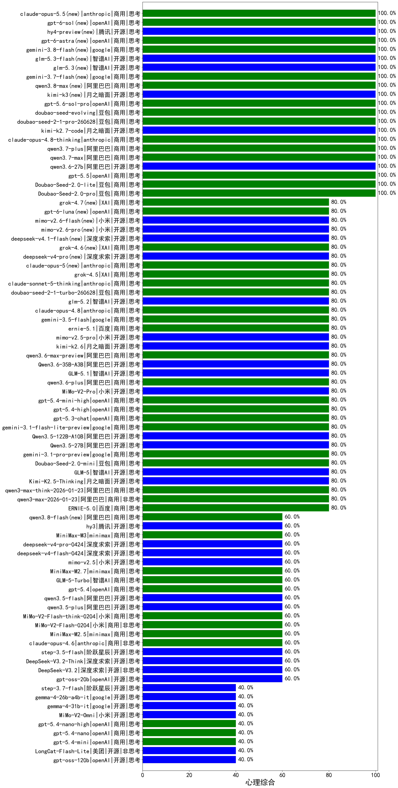

|类别|机构|大模型|【心理综合】准确率|平均耗时|平均消耗token|花费/千次（元）|排名（准确率）|
|---|---|-----|-------------------|-------|-----------|-----------|-----------|
|商用|豆包|doubao-seed-2-1-lite-260915(new)|100.0%|10s|437|1.0|1|
|商用|豆包|Doubao-Seed-2.0-pro|100.0%|245s|1053|15.7|2|
|商用|openAI|gpt-5.5|100.0%|6s|319|58.0|3|
|开源|阿里巴巴|qwen3.6-27b|100.0%|24s|1405|24.6|4|
|商用|阿里巴巴|qwen3.7-max|100.0%|16s|822|28.4|5|
|商用|阿里巴巴|qwen3.7-plus|100.0%|26s|1312|10.2|6|
|商用|anthropic|claude-opus-4.8-thinking|100.0%|18s|692|112.1|7|
|开源|月之暗面|kimi-k2.7-code|100.0%|11s|476|12.0|8|
|商用|豆包|doubao-seed-2-1-pro-260628|100.0%|142s|7219|214.5|9|
|商用|豆包|doubao-seed-evolving|100.0%|215s|7247|215.4|10|
|商用|openAI|gpt-5.6-sol-pro|100.0%|7s|2452|156.9|11|
|开源|月之暗面|kimi-k3(new)|100.0%|34s|487|39.0|12|
|商用|google|gemini-3.7-flash(new)|100.0%|41s|628|15.6|13|
|商用|豆包|Doubao-Seed-2.0-lite|100.0%|152s|764|2.5|14|
|商用|阿里巴巴|qwen3.8-max(new)|100.0%|14s|556|18.0|15|
|开源|智谱AI|glm-5.3(new)|100.0%|30s|1268|34.5|16|
|商用|google|gemini-3.8-flash(new)|100.0%|21s|777|39.0|17|
|商用|豆包|doubao-seed-2-1-pro-260915(new)|100.0%|50s|1339|38.1|18|
|商用|anthropic|claude-opus-5.5(new)|100.0%|13s|523|65.8|19|
|商用|openAI|gpt-6-astra(new)|100.0%|8s|141|35.0|20|
|商用|openAI|gpt-6-sol(new)|100.0%|86s|197|11.0|21|
|开源|腾讯|hy4-preview(new)|100.0%|61s|2520|44.7|22|
|开源|智谱AI|glm-5.3-flash(new)|100.0%|28s|831|2.2|23|
|开源|小米|mimo-v2.6-flash(new)|80.0%|33s|624|1.2|24|
|商用|百度|ernie-5.1|80.0%|56s|812|14.0|25|
|商用|google|gemini-3.5-flash|80.0%|6s|929|56.3|26|
|商用|XAI|grok-4.7(new)|80.0%|24s|2849|83.8|27|
|商用|anthropic|claude-opus-4.8|80.0%|10s|474|74.1|28|
|商用|openAI|gpt-6-luna(new)|80.0%|252s|227|0.7|29|
|商用|豆包|doubao-seed-2-1-turbo-260628|80.0%|200s|7903|117.5|30|
|开源|智谱AI|glm-5.2|80.0%|34s|1475|40.3|31|
|开源|小米|mimo-v2.6-pro(new)|80.0%|15s|486|2.8|32|
|商用|anthropic|claude-sonnet-5-thinking|80.0%|15s|700|45.4|33|
|商用|XAI|grok-4.5|80.0%|105s|926|32.0|34|
|开源|深度求索|deepseek-v4.1-flash(new)|80.0%|3s|514|3.7|35|
|商用|anthropic|claude-opus-5(new)|80.0%|11s|577|92.1|36|
|商用|阿里巴巴|qwen3.6-max-preview|80.0%|30s|1137|59.3|37|
|开源|深度求索|deepseek-v4-pro(new)|80.0%|30s|718|17.2|38|
|商用|XAI|grok-4.6(new)|80.0%|14s|828|27.9|39|
|开源|月之暗面|kimi-k2.6|80.0%|49s|796|20.6|40|
|开源|小米|mimo-v2.5-pro|80.0%|10s|780|12.3|41|
|开源|阿里巴巴|Qwen3.6-35B-A3B|80.0%|10s|1355|14.2|42|
|商用|openAI|gpt-5.4-mini-high|80.0%|8s|778|23.2|43|
|商用|百度|ERNIE-5.0|80.0%|146s|2735|65.0|44|
|商用|阿里巴巴|qwen3-max-2026-01-23|80.0%|36s|361|3.3|45|
|商用|阿里巴巴|qwen3-max-think-2026-01-23|80.0%|82s|2546|25.1|46|
|开源|月之暗面|Kimi-K2.5-Thinking|80.0%|246s|994|20.1|47|
|开源|智谱AI|GLM-5|80.0%|107s|1692|29.8|48|
|商用|豆包|Doubao-Seed-2.0-mini|80.0%|690s|2875|5.6|49|
|商用|google|gemini-3.1-pro-preview|80.0%|22s|1175|97.1|50|
|开源|阿里巴巴|Qwen3.5-27B|80.0%|185s|2724|12.9|51|
|开源|阿里巴巴|Qwen3.5-122B-A10B|80.0%|200s|2672|16.8|52|
|商用|google|gemini-3.1-flash-lite-preview|80.0%|2s|282|2.6|53|
|商用|openAI|gpt-5.4-high|80.0%|8s|449|42.7|54|
|商用|openAI|gpt-5.3-chat|80.0%|45s|300|25.0|55|
|开源|智谱AI|GLM-5.1|80.0%|48s|1300|30.4|56|
|开源|小米|MiMo-V2-Pro|80.0%|135s|827|13.3|57|
|商用|阿里巴巴|qwen3.6-plus|80.0%|24s|1351|15.7|58|
|开源|openAI|gpt-oss-20b|60.0%|4s|558|0.6|59|
|开源|阿里巴巴|qwen3.5-flash|60.0%|380s|3180|6.3|60|
|商用|minimax|MiniMax-M2.5|60.0%|35s|1845|15.0|61|
|开源|深度求索|deepseek-v4-pro-0424|60.0%|13s|291|6.5|62|
|商用|小米|MiMo-V2-Flash-0204|60.0%|355s|461|0.9|63|
|商用|阿里巴巴|qwen3.8-flash(new)|60.0%|13s|492|1.1|64|
|商用|小米|MiMo-V2-Flash-think-0204|60.0%|763s|1441|2.9|65|
|开源|深度求索|deepseek-v4-flash-0424|60.0%|6s|386|0.7|66|
|开源|阿里巴巴|qwen3.5-plus|60.0%|37s|2753|13.0|67|
|商用|anthropic|claude-opus-4.6|60.0%|14s|478|74.4|68|
|开源|阶跃星辰|step-3.5-flash|60.0%|19s|2772|5.8|69|
|商用|minimax|MiniMax-M3|60.0%|19s|487|5.6|70|
|开源|小米|mimo-v2.5|60.0%|12s|853|8.7|71|
|开源|腾讯|hy3|60.0%|70s|193|0.6|72|
|商用|openAI|gpt-5.4|60.0%|17s|177|14.1|73|
|商用|minimax|MiniMax-M2.7|60.0%|28s|1078|8.6|74|
|商用|智谱AI|GLM-5-Turbo|60.0%|29s|1156|24.7|75|
|开源|深度求索|DeepSeek-V3.2-Think|60.0%|18s|527|1.5|76|
|开源|深度求索|DeepSeek-V3.2|60.0%|150s|238|0.7|77|
|商用|openAI|gpt-5.4-nano-high|40.0%|20s|344|2.6|78|
|开源|google|gemma-4-31b-it|40.0%|113s|612|1.6|79|
|开源|google|gemma-4-26b-a4b-it|40.0%|62s|584|1.5|80|
|开源|美团|LongCat-Flash-Lite|40.0%|80s|264|0.0|81|
|商用|openAI|gpt-5.4-nano|40.0%|6s|88|0.4|82|
|开源|小米|MiMo-V2-Omni|40.0%|5s|776|7.6|83|
|商用|openAI|gpt-5.4-mini|40.0%|45s|149|3.4|84|
|开源|阶跃星辰|step-3.7-flash|40.0%|17s|1105|8.6|85|
|开源|openAI|gpt-oss-120b|40.0%|3s|420|1.1|86|

