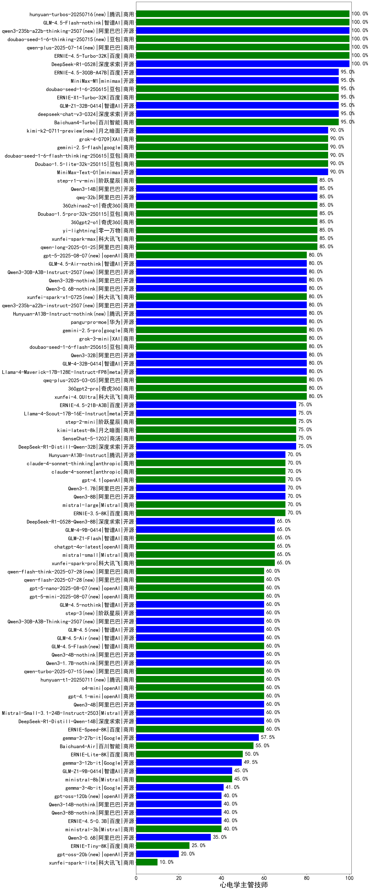

|类别|机构|大模型|【心电学主管技师】准确率|平均耗时|平均消耗token|花费/千次（元）|排名（准确率）|
|---|---|-----|-------------------|-------|-----------|-----------|-----------|
|开源|腾讯|hunyuan-large|100.0%|9s|1168|7.2|1|
|商用|豆包|doubao-seed-1-6-thinking-250615|100.0%|309s|1502|5.7|2|
|开源|深度求索|DeepSeek-R1-0528|100.0%|246s|2050|31.9|3|
|商用|百度|ERNIE-4.5-Turbo-32K|100.0%|22s|556|1.6|4|
|商用|阿里巴巴|qwen-plus-2025-04-28|100.0%|166s|447|0.9|5|
|商用|阿里巴巴|qwen-plus-2025-07-14(new)|100.0%|16s|505|0.9|6|
|开源|阿里巴巴|Qwen3-235B-A22B-nothink|100.0%|23s|527|4.6|7|
|开源|深度求索|deepseek-chat-v3-0324|95.0%|21s|371|2.6|8|
|开源|智谱AI|GLM-Z1-32B-0414|95.0%|115s|2518|10.3|9|
|开源|百度|ERNIE-4.5-300B-A47B(new)|95.0%|10s|326|2.1|10|
|商用|豆包|doubao-seed-1-6-250615|95.0%|105s|386|1.3|11|
|商用|百度|ERNIE-X1-Turbo-32K|95.0%|83s|1989|7.8|12|
|开源|minimax|MiniMax-M1(new)|95.0%|330s|4409|21.6|13|
|商用|百川智能|Baichuan4-Turbo|95.0%|/|/|/|14|
|商用|阿里巴巴|qwen2.5-max|95.0%|26s|483|4.0|15|
|商用|豆包|doubao-seed-1-6-flash-thinking-250615|90.0%|12s|895|0.4|16|
|商用|腾讯|hunyuan-standard|90.0%|/|/|/|17|
|开源|minimax|MiniMax-Text-01|90.0%|12s|910|7.4|18|
|商用|豆包|Doubao-1.5-lite-32k-250115|90.0%|3s|194|0.1|19|
|商用|智谱AI|GLM-4-Air|90.0%|47s|271|0.1|20|
|商用|豆包|Doubao-1.5-thinking-pro|90.0%|551s|1581|24.4|21|
|商用|智谱AI|GLM-Z1-AirX|90.0%|24s|2493|12.5|22|
|开源|阿里巴巴|Qwen3-235B-A22B|90.0%|107s|3211|31.5|23|
|商用|XAI|grok-4-0709(new)|90.0%|289s|1464|152.2|24|
|商用|google|gemini-2.5-flash(new)|90.0%|10s|1789|31.1|25|
|商用|腾讯|hunyuan-t1-20250529|90.0%|259s|1026|3.8|26|
|开源|月之暗面|kimi-k2-0711-preview(new)|90.0%|26s|469|6.7|27|
|商用|智谱AI|GLM-4-AirX|86.7%|9s|264|2.6|28|
|商用|阿里巴巴|qwen-plus-think-2025-04-28|85.0%|106s|2594|20.0|29|
|商用|阿里巴巴|qwen-turbo-think-2025-04-28|85.0%|183s|3562|7.7|30|
|商用|阶跃星辰|step-r1-v-mini|85.0%|163s|2208|17.1|31|
|商用|腾讯|hunyuan-turbos-20250604|85.0%|92s|479|0.8|32|
|开源|阿里巴巴|qwen2.5-72b-instruct|85.0%|8s|295|2.9|33|
|商用|零一万物|yi-lightning|85.0%|/|/|/|34|
|开源|阿里巴巴|Qwen3-14B|85.0%|52s|2294|4.5|35|
|开源|阿里巴巴|Qwen3-30B-A3B|85.0%|53s|2505|6.8|36|
|商用|奇虎360|360gpt2-o1|85.0%|13s|322|13.2|37|
|商用|豆包|Doubao-1.5-pro-32k-250115|85.0%|7s|322|0.5|38|
|商用|阿里巴巴|qwen-long-2025-01-25|85.0%|90s|334|0.6|39|
|商用|科大讯飞|xunfei-spark-max|85.0%|4s|154|4.6|40|
|开源|阿里巴巴|qwq-32b|85.0%|53s|2635|15.5|41|
|商用|奇虎360|360zhinao2-o1|85.0%|/|/|/|42|
|商用|智谱AI|GLM-4-Plus|83.0%|11s|314|1.6|43|
|开源|阿里巴巴|Qwen3-32B|80.0%|47s|1903|7.4|44|
|商用|奇虎360|360gpt2-pro|80.0%|43s|244|0.9|45|
|开源|腾讯|Hunyuan-A13B-Instruct-nothink(new)|80.0%|166s|351|1.2|46|
|开源|华为|pangu-pro-moe(new)|80.0%|111s|2091|8.1|47|
|开源|智谱AI|GLM-4-32B-0414|80.0%|14s|454|0.9|48|
|开源|meta|Llama-4-Maverick-17B-128E-Instruct-FP8|80.0%|14s|561|2.2|49|
|商用|阿里巴巴|qwq-plus-2025-03-05|80.0%|76s|3024|11.9|50|
|商用|科大讯飞|xunfei-4.0Ultra|80.0%|3s|134|9.4|51|
|商用|智谱AI|GLM-4-Long|80.0%|24s|379|0.4|52|
|商用|google|gemini-2.5-pro(new)|80.0%|49s|2803|198.0|53|
|商用|豆包|doubao-seed-1-6-flash-250615|80.0%|4s|248|0.2|54|
|商用|XAI|grok-3-mini(new)|80.0%|129s|1152|4.1|55|
|开源|阿里巴巴|qwen3-235b-a22b-instruct-2507(new)|80.0%|14s|520|3.7|56|
|商用|阿里巴巴|qwen-turbo-2025-04-28|75.0%|5s|447|0.2|57|
|开源|meta|Llama-4-Scout-17B-16E-Instruct|75.0%|162s|544|1.3|58|
|开源|百度|ERNIE-4.5-21B-A3B(new)|75.0%|5s|342|0.0|59|
|商用|智谱AI|GLM-Z1-Air|75.0%|132s|4812|0.8|60|
|开源|阿里巴巴|qwen2.5-14b-instruct|75.0%|3s|305|0.8|61|
|商用|商汤|SenseChat-5-1202|75.0%|/|/|/|62|
|商用|月之暗面|kimi-latest-8k|75.0%|44s|514|6.1|63|
|商用|商汤|SenseChat-5-beta|75.0%|23s|340|5.9|64|
|商用|阶跃星辰|step-2-mini|75.0%|98s|440|0.6|65|
|开源|深度求索|DeepSeek-R1-Distill-Qwen-32B|75.0%|45s|945|1.0|66|
|开源|腾讯|Hunyuan-A13B-Instruct(new)|70.0%|64s|1572|6.1|67|
|商用|科大讯飞|xunfei-spark-x1|70.0%|52s|1572|18.9|68|
|商用|Mistral|mistral-large|70.0%|/|/|/|69|
|商用|anthropic|claude-4-sonnet|70.0%|44s|495|44.6|70|
|商用|anthropic|claude-4-sonnet-thinking|70.0%|48s|1045|104.4|71|
|开源|阿里巴巴|Qwen3-1.7B|70.0%|22s|1448|4.1|72|
|开源|上海人工智能实验室|internlm2_5-7b-chat|70.0%|/|/|/|73|
|开源|阿里巴巴|qwen2.5-32b-instruct|70.0%|17s|277|1.3|74|
|商用|OpenAI|gpt-4o-mini|70.0%|/|/|/|75|
|商用|百度|ERNIE-3.5-8K|70.0%|21s|358|0.7|76|
|商用|openAI|gpt-4.1|70.0%|8s|326|15.2|77|
|开源|阿里巴巴|Qwen3-8B|70.0%|254s|6967|0.0|78|
|商用|科大讯飞|xunfei-spark-pro|65.0%|/|/|/|79|
|商用|智谱AI|GLM-4-Flash|65.0%|9s|326|0.0|80|
|商用|商汤|SenseChat-Turbo-1202|65.0%|/|/|/|81|
|开源|阿里巴巴|qwen2.5-7b-instruct|65.0%|6s|243|0.2|82|
|开源|微软|phi-4|65.0%|/|/|/|83|
|商用|openAI|chatgpt-4o-latest|65.0%|/|/|/|84|
|商用|google|gemini-2.5-flash-lite-preview-06-17(new)|65.0%|5s|816|2.2|85|
|开源|深度求索|DeepSeek-R1-0528-Qwen3-8B|65.0%|252s|1849|0.0|86|
|开源|智谱AI|GLM-4-9B-0414|65.0%|7s|513|0.0|87|
|商用|Mistral|mistral-small|65.0%|/|/|/|88|
|商用|智谱AI|GLM-4-FlashX|65.0%|5s|322|0.0|89|
|商用|奇虎360|360gpt-turbo|65.0%|/|/|/|90|
|商用|智谱AI|GLM-Z1-Flash|65.0%|28s|3117|0.0|91|
|商用|智谱AI|GLM-Z1-FlashX|65.0%|34s|3947|0.4|92|
|商用|阿里巴巴|qwen-turbo-2025-07-15(new)|60.0%|8s|387|0.2|93|
|商用|百度|ERNIE-Speed-8K|60.0%|/|/|/|94|
|开源|深度求索|DeepSeek-R1-Distill-Qwen-14B|60.0%|/|/|/|95|
|商用|openAI|gpt-4.1-mini|60.0%|8s|346|3.3|96|
|开源|Mistral|Mistral-Small-3.1-24B-Instruct-2503|60.0%|/|/|/|97|
|商用|腾讯|hunyuan-t1-20250711(new)|60.0%|151s|14302|39.8|98|
|开源|阿里巴巴|Qwen3-4B|60.0%|22s|2122|6.1|99|
|商用|openAI|o4-mini|60.0%|32s|1160|35.0|100|
|开源|Google|gemma-3-27b-it|57.5%|/|/|/|101|
|商用|百川智能|Baichuan4-Air|55.0%|/|/|/|102|
|商用|百度|ERNIE-Lite-8K|50.0%|/|/|/|103|
|开源|阿里巴巴|qwen2.5-3b-instruct|50.0%|9s|291|0.2|104|
|开源|Google|gemma-3-12b-it|49.5%|/|/|/|105|
|开源|阿里巴巴|qwen2.5-1.5b-instruct|45.0%|8s|175|0.0|106|
|开源|阿里巴巴|qwen2.5-0.5b-instruct|45.0%|9s|218|0.0|107|
|商用|Mistral|ministral-8b|45.0%|/|/|/|108|
|开源|智谱AI|GLM-Z1-Rumination-32B-0414|45.0%|18s|1022|2.4|109|
|开源|智谱AI|GLM-Z1-9B-0414|45.0%|182s|3912|0.0|110|
|开源|Google|gemma-3-4b-it|41.0%|/|/|/|111|
|商用|Mistral|ministral-3b|40.0%|/|/|/|112|
|开源|百度|ERNIE-4.5-0.3B(new)|40.0%|5s|367|0.0|113|
|开源|阿里巴巴|Qwen3-0.6B|35.0%|8s|1538|4.4|114|
|商用|百度|ERNIE-Tiny-8K|25.0%|/|/|/|115|
|商用|科大讯飞|xunfei-spark-lite|10.0%|/|/|/|116|

