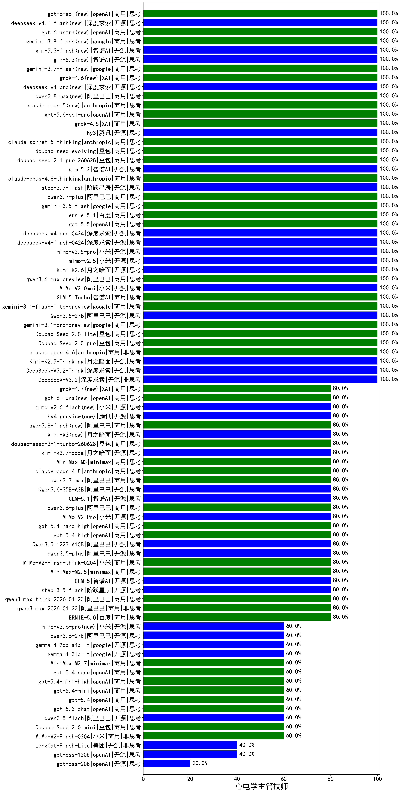

|类别|机构|大模型|【心电学主管技师】准确率|平均耗时|平均消耗token|花费/千次（元）|排名（准确率）|
|---|---|-----|-------------------|-------|-----------|-----------|-----------|
|商用|智谱AI|GLM-5-Turbo|100.0%|33s|1759|37.5|1|
|开源|小米|mimo-v2.5-pro|100.0%|19s|1306|22.9|2|
|商用|阿里巴巴|qwen3.7-plus(new)|100.0%|24s|1277|9.8|3|
|商用|google|gemini-3.5-flash|100.0%|8s|1296|77.9|4|
|商用|百度|ernie-5.1|100.0%|26s|1139|19.6|5|
|商用|openAI|gpt-5.5|100.0%|12s|697|132.1|6|
|开源|深度求索|deepseek-v4-pro-0424|100.0%|32s|1220|28.5|7|
|开源|深度求索|deepseek-v4-flash-0424|100.0%|24s|1127|2.2|8|
|开源|小米|mimo-v2.5|100.0%|22s|1626|19.2|9|
|商用|豆包|Doubao-Seed-2.0-pro|100.0%|246s|1122|16.5|10|
|开源|月之暗面|kimi-k2.6|100.0%|505s|3310|87.9|11|
|商用|阿里巴巴|qwen3.6-max-preview|100.0%|39s|1503|77.9|12|
|开源|小米|MiMo-V2-Omni|100.0%|230s|1513|17.6|13|
|商用|google|gemini-3.1-flash-lite-preview|100.0%|4s|345|3.0|14|
|开源|阿里巴巴|Qwen3.5-27B|100.0%|537s|6810|32.4|15|
|商用|google|gemini-3.1-pro-preview|100.0%|41s|1465|119.7|16|
|开源|阶跃星辰|step-3.7-flash(new)|100.0%|76s|6240|50.0|17|
|商用|anthropic|claude-opus-4.8-thinking(new)|100.0%|21s|967|155.5|18|
|开源|智谱AI|glm-5.2(new)|100.0%|54s|2424|66.3|19|
|商用|豆包|doubao-seed-2-1-pro-260628(new)|100.0%|351s|17687|528.0|20|
|商用|豆包|doubao-seed-evolving(new)|100.0%|564s|13324|397.1|21|
|商用|anthropic|claude-sonnet-5-thinking(new)|100.0%|20s|1184|77.4|22|
|开源|腾讯|hy3(new)|100.0%|69s|280|0.9|23|
|商用|XAI|grok-4.5(new)|100.0%|77s|2487|96.8|24|
|商用|openAI|gpt-5.6-sol-pro(new)|100.0%|18s|3698|306.1|25|
|商用|anthropic|claude-opus-5(new)|100.0%|12s|591|89.7|26|
|商用|阿里巴巴|qwen3.8-max(new)|100.0%|20s|928|30.8|27|
|开源|深度求索|deepseek-v4-pro(new)|100.0%|23s|1088|26.7|28|
|商用|XAI|grok-4.6(new)|100.0%|29s|1621|60.4|29|
|商用|google|gemini-3.7-flash(new)|100.0%|5s|791|19.3|30|
|开源|智谱AI|glm-5.3(new)|100.0%|38s|860|22.5|31|
|开源|智谱AI|glm-5.3-flash(new)|100.0%|104s|4338|12.0|32|
|商用|google|gemini-3.8-flash(new)|100.0%|18s|740|35.8|33|
|商用|豆包|Doubao-Seed-2.0-lite|100.0%|400s|1802|6.1|34|
|商用|openAI|gpt-6-astra(new)|100.0%|10s|248|64.0|35|
|商用|anthropic|claude-opus-4.6|100.0%|22s|668|102.9|36|
|商用|openAI|gpt-5.2-high|100.0%|22s|682|60.7|37|
|开源|深度求索|DeepSeek-V3.2|100.0%|50s|422|1.2|38|
|开源|深度求索|DeepSeek-V3.2-Think|100.0%|49s|1430|4.2|39|
|开源|月之暗面|Kimi-K2.5-Thinking|100.0%|543s|2523|51.8|40|
|开源|智谱AI|GLM-4.7|100.0%|86s|4007|55.3|41|
|商用|openAI|gpt-5.2-medium|100.0%|9s|610|53.5|42|
|商用|腾讯|hunyuan-2.0-thinking-20251109|100.0%|14s|747|2.8|43|
|商用|豆包|doubao-seed-1-8-251215|100.0%|36s|716|4.9|44|
|商用|阿里巴巴|qwen-plus-2025-12-01|100.0%|38s|1522|3.0|45|
|商用|阿里巴巴|qwen-plus-think-2025-12-01|100.0%|113s|3566|28.0|46|
|开源|小米|MiMo-V2-Flash-think|80.0%|152s|2709|0.0|47|
|商用|minimax|MiniMax-M3(new)|80.0%|56s|1492|22.1|48|
|商用|小米|MiMo-V2-Flash-think-0204|80.0%|1445s|3728|7.7|49|
|商用|anthropic|claude-opus-4.8(new)|80.0%|8s|531|79.2|50|
|商用|阿里巴巴|qwen3.7-max|80.0%|30s|1466|51.0|51|
|商用|阿里巴巴|qwen3-max-preview-think|80.0%|130s|4128|97.6|52|
|开源|小米|MiMo-V2-Flash|80.0%|131s|466|0.0|53|
|商用|豆包|doubao-seed-2-1-turbo-260628(new)|80.0%|383s|18482|275.9|54|
|开源|月之暗面|kimi-k2.7-code(new)|80.0%|36s|1090|28.0|55|
|商用|google|gemini-3-flash-preview|80.0%|17s|1507|30.8|56|
|商用|阿里巴巴|qwen3-max-2026-01-23|80.0%|101s|505|4.5|57|
|商用|openAI|gpt-5.2|80.0%|4s|207|13.5|58|
|开源|月之暗面|kimi-k3(new)|80.0%|67s|1585|146.6|59|
|商用|腾讯|hunyuan-2.0-instruct-20251111|80.0%|8s|553|1.0|60|
|开源|Mistral|mistral-large-2512|80.0%|13s|504|4.8|61|
|商用|阿里巴巴|qwen3.8-flash(new)|80.0%|63s|3163|8.3|62|
|商用|百度|ERNIE-5.0|80.0%|181s|2209|51.9|63|
|开源|智谱AI|GLM-4.7-Flash|80.0%|659s|2747|0.0|64|
|商用|阿里巴巴|qwen3-max-think-2026-01-23|80.0%|127s|3306|32.5|65|
|商用|openAI|gpt-5.4-nano-high|80.0%|157s|1271|10.5|66|
|开源|阿里巴巴|Qwen3.6-35B-A3B|80.0%|95s|1863|19.5|67|
|开源|阿里巴巴|qwen3.5-plus|80.0%|38s|3413|16.1|68|
|开源|阿里巴巴|Qwen3.5-122B-A10B|80.0%|279s|4191|26.4|69|
|开源|智谱AI|GLM-5.1|80.0%|159s|1391|32.1|70|
|商用|minimax|MiniMax-M2.5|80.0%|62s|2804|22.9|71|
|商用|openAI|gpt-5.4-high|80.0%|16s|870|84.3|72|
|商用|阿里巴巴|qwen3.6-plus|80.0%|38s|1556|17.9|73|
|开源|阶跃星辰|step-3.5-flash|80.0%|25s|3709|7.7|74|
|开源|小米|MiMo-V2-Pro|80.0%|53s|1217|21.1|75|
|开源|智谱AI|GLM-5|80.0%|102s|3545|62.8|76|
|商用|openAI|gpt-5.3-chat|60.0%|41s|438|36.0|77|
|开源|阿里巴巴|qwen3.5-flash|60.0%|247s|3967|7.8|78|
|开源|阿里巴巴|qwen3-next-80b-a3b-thinking|60.0%|172s|3656|14.4|79|
|商用|豆包|Doubao-Seed-2.0-mini|60.0%|789s|6215|12.2|80|
|商用|openAI|gpt-5.4|60.0%|4s|266|20.8|81|
|商用|openAI|gpt-5.4-mini|60.0%|11s|211|4.5|82|
|开源|美团|LongCat-Flash-Thinking-2601|60.0%|152s|3474|0.0|83|
|商用|openAI|gpt-5.4-mini-high|60.0%|32s|1687|51.0|84|
|商用|openAI|gpt-5.4-nano|60.0%|8s|231|1.4|85|
|商用|minimax|MiniMax-M2.7|60.0%|57s|2318|18.8|86|
|开源|google|gemma-4-31b-it|60.0%|24s|528|1.3|87|
|开源|google|gemma-4-26b-a4b-it|60.0%|67s|597|1.5|88|
|商用|minimax|MiniMax-M2.1|60.0%|87s|1667|13.3|89|
|开源|阿里巴巴|qwen3.6-27b|60.0%|29s|1672|29.0|90|
|商用|小米|MiMo-V2-Flash-0204|60.0%|341s|526|1.0|91|
|开源|Mistral|Ministral-3-3B-Instruct-2512|40.0%|3s|516|0.4|92|
|开源|Mistral|Ministral-3-8B-Instruct-2512|40.0%|6s|953|1.0|93|
|开源|美团|LongCat-Flash-Lite|40.0%|400s|594|0.0|94|
|开源|openAI|gpt-oss-120b|40.0%|4s|709|2.0|95|
|开源|openAI|gpt-oss-20b|20.0%|268s|916|0.9|96|
|开源|Mistral|Ministral-3-14B-Instruct-2512|20.0%|12s|652|0.9|97|

