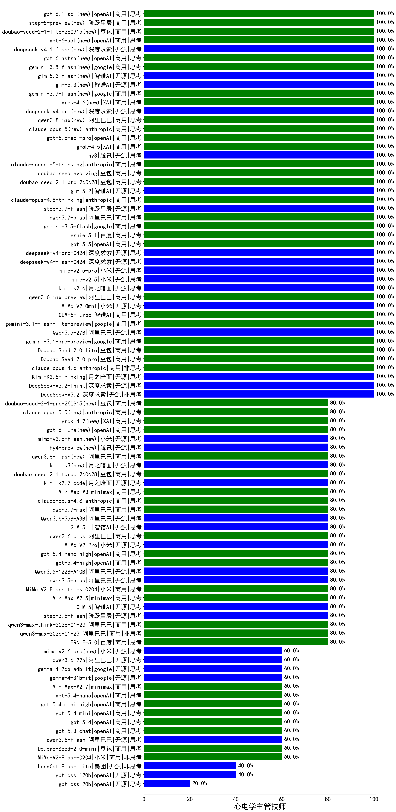

|类别|机构|大模型|【心电学主管技师】准确率|平均耗时|平均消耗token|花费/千次（元）|排名（准确率）|
|---|---|-----|-------------------|-------|-----------|-----------|-----------|
|商用|豆包|doubao-seed-2-1-pro-260628|100.0%|351s|17687|528.0|1|
|商用|阿里巴巴|qwen3.7-plus|100.0%|24s|1277|9.8|2|
|商用|anthropic|claude-opus-4.8-thinking|100.0%|21s|967|155.5|3|
|开源|智谱AI|glm-5.2|100.0%|54s|2424|66.3|4|
|商用|豆包|doubao-seed-evolving|100.0%|564s|13324|397.1|5|
|商用|anthropic|claude-sonnet-5-thinking|100.0%|20s|1184|77.4|6|
|开源|腾讯|hy3|100.0%|69s|280|0.9|7|
|商用|XAI|grok-4.5|100.0%|77s|2487|96.8|8|
|商用|openAI|gpt-5.6-sol-pro|100.0%|18s|3698|306.1|9|
|商用|anthropic|claude-opus-5|100.0%|12s|591|89.7|10|
|商用|阿里巴巴|qwen3.8-max|100.0%|20s|928|30.8|11|
|开源|深度求索|deepseek-v4-pro|100.0%|23s|1088|26.7|12|
|商用|XAI|grok-4.6|100.0%|29s|1621|60.4|13|
|商用|google|gemini-3.7-flash|100.0%|5s|791|19.3|14|
|开源|智谱AI|glm-5.3(new)|100.0%|38s|860|22.5|15|
|开源|智谱AI|glm-5.3-flash(new)|100.0%|104s|4338|12.0|16|
|商用|google|gemini-3.8-flash(new)|100.0%|18s|740|35.8|17|
|商用|openAI|gpt-6-astra(new)|100.0%|10s|248|64.0|18|
|开源|深度求索|deepseek-v4.1-flash(new)|100.0%|20s|2101|16.2|19|
|商用|openAI|gpt-6-sol(new)|100.0%|101s|249|12.9|20|
|商用|豆包|doubao-seed-2-1-lite-260915(new)|100.0%|29s|1668|4.3|21|
|商用|阶跃星辰|step-5-preview(new)|100.0%|25s|1875|36.5|22|
|商用|openAI|gpt-6.1-sol(new)|100.0%|9s|251|13.0|23|
|商用|google|gemini-4-argon(new)|100.0%|22s|659|81.2|24|
|商用|anthropic|claude-haiku-5.5(new)|100.0%|5s|731|2.3|25|
|开源|阶跃星辰|step-3.7-flash|100.0%|76s|6240|50.0|26|
|商用|minimax|MiniMax-M3.1-Flash(new)|100.0%|20s|1293|4.4|27|
|开源|深度求索|deepseek-v4-flash-0424|100.0%|24s|1127|2.2|28|
|开源|阿里巴巴|Qwen3.5-27B|100.0%|537s|6810|32.4|29|
|商用|阿里巴巴|qwen3.6-max-preview|100.0%|39s|1503|77.9|30|
|开源|月之暗面|kimi-k2.6|100.0%|505s|3310|87.9|31|
|开源|小米|mimo-v2.5|100.0%|22s|1626|19.2|32|
|开源|小米|mimo-v2.5-pro|100.0%|19s|1306|22.9|33|
|商用|google|gemini-3.1-flash-lite-preview|100.0%|4s|345|3.0|34|
|开源|深度求索|deepseek-v4-pro-0424|100.0%|32s|1220|28.5|35|
|商用|openAI|gpt-5.5|100.0%|12s|697|132.1|36|
|商用|google|gemini-3.1-pro-preview|100.0%|41s|1465|119.7|37|
|商用|百度|ernie-5.1|100.0%|26s|1139|19.6|38|
|开源|深度求索|DeepSeek-V3.2-Think|100.0%|49s|1430|4.2|39|
|商用|google|gemini-3.5-flash|100.0%|8s|1296|77.9|40|
|开源|深度求索|DeepSeek-V3.2|100.0%|50s|422|1.2|41|
|商用|XAI|grok-4.7(new)|80.0%|35s|3509|110.8|42|
|开源|小米|mimo-v2.6-flash(new)|80.0%|51s|1315|2.6|43|
|商用|openAI|gpt-6-luna(new)|80.0%|87s|441|1.3|44|
|开源|阿里巴巴|Qwen3.5-122B-A10B|80.0%|279s|4191|26.4|45|
|商用|minimax|MiniMax-M3|80.0%|56s|1492|22.1|46|
|商用|anthropic|claude-opus-5.5(new)|80.0%|17s|714|88.8|47|
|商用|豆包|doubao-seed-2-1-pro-260915(new)|80.0%|132s|3008|87.6|48|
|商用|百度|ERNIE-5.0|80.0%|181s|2209|51.9|49|
|开源|腾讯|hy4-preview(new)|80.0%|140s|5751|102.5|50|
|商用|阿里巴巴|qwen3.8-flash(new)|80.0%|63s|3163|8.3|51|
|商用|阿里巴巴|qwen3.6-plus|80.0%|38s|1556|17.9|52|
|商用|anthropic|claude-opus-4.8|80.0%|8s|531|79.2|53|
|开源|智谱AI|GLM-5.1|80.0%|159s|1391|32.1|54|
|开源|阿里巴巴|Qwen3.6-35B-A3B|80.0%|95s|1863|19.5|55|
|开源|月之暗面|kimi-k3|80.0%|67s|1585|146.6|56|
|商用|豆包|doubao-seed-2-1-turbo-260628|80.0%|383s|18482|275.9|57|
|开源|月之暗面|kimi-k2.7-code|80.0%|36s|1090|28.0|58|
|商用|阿里巴巴|qwen3.7-max|80.0%|30s|1466|51.0|59|
|商用|minimax|MiniMax-M2.7|60.0%|57s|2318|18.8|60|
|开源|小米|mimo-v2.6-pro(new)|60.0%|29s|1340|7.8|61|
|开源|google|gemma-4-31b-it|60.0%|24s|528|1.3|62|
|开源|google|gemma-4-26b-a4b-it|60.0%|67s|597|1.5|63|
|开源|阿里巴巴|qwen3.6-27b|60.0%|29s|1672|29.0|64|
|商用|anthropic|claude-sonnet-5.5(new)|60.0%|9s|691|42.7|65|
|开源|openAI|gpt-oss-120b|40.0%|4s|709|2.0|66|
|开源|openAI|gpt-oss-20b|20.0%|268s|916|0.9|67|

