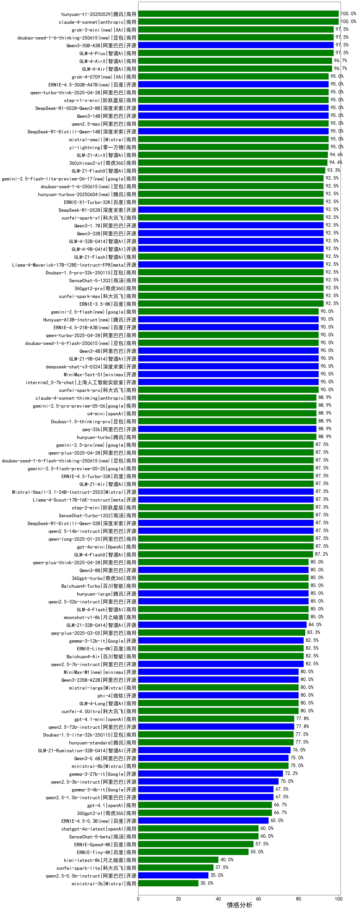

|类别|机构|大模型|【情感分析】准确率|平均耗时|平均消耗token|花费/千次（元）|排名（准确率）|
|---|---|-----|-------------------|-------|-----------|-----------|-----------|
|商用|anthropic|claude-4-sonnet|100.0%|43s|279|21.0|1|
|商用|智谱AI|GLM-4.5-Flash(new)|100.0%|26s|1142|0.0|2|
|商用|智谱AI|GLM-4-Plus|97.5%|3s|120|0.6|3|
|开源|阿里巴巴|Qwen3-30B-A3B|97.5%|67s|396|1.0|4|
|商用|XAI|grok-3-mini|97.5%|156s|579|2.0|5|
|开源|openAI|gpt-oss-120b(new)|97.5%|2s|256|0.5|6|
|商用|智谱AI|GLM-4-AirX|96.7%|1s|116|1.2|7|
|开源|阿里巴巴|Qwen3-14B|95.0%|67s|384|0.7|8|
|开源|深度求索|DeepSeek-R1-0528-Qwen3-8B|95.0%|340s|490|0.0|9|
|商用|阿里巴巴|qwen-turbo-think-2025-04-28|95.0%|164s|509|1.4|10|
|商用|零一万物|yi-lightning|95.0%|/|/|/|11|
|商用|Mistral|mistral-small|95.0%|/|/|/|12|
|开源|深度求索|DeepSeek-R1-Distill-Qwen-14B|95.0%|/|/|/|13|
|商用|阿里巴巴|qwen2.5-max|95.0%|2s|100|0.5|14|
|开源|阿里巴巴|Qwen3-235B-A22B-nothink|95.0%|4s|143|1.0|15|
|商用|豆包|doubao-seed-1-6-thinking-250715(new)|95.0%|7s|442|3.1|16|
|商用|阶跃星辰|step-r1-v-mini|95.0%|21s|596|4.4|17|
|开源|百度|ERNIE-4.5-300B-A47B|95.0%|5s|103|0.5|18|
|商用|XAI|grok-4-0709|95.0%|23s|338|31.8|19|
|商用|腾讯|hunyuan-t1-20250711(new)|95.0%|5s|342|1.1|20|
|开源|腾讯|Hunyuan-A13B-Instruct-nothink(new)|95.0%|22s|135|0.4|21|
|商用|智谱AI|GLM-Z1-AirX|94.6%|26s|490|2.5|22|
|商用|奇虎360|360zhinao2-o1|94.4%|/|/|/|23|
|商用|智谱AI|GLM-Z1-FlashX|93.3%|31s|599|0.1|24|
|开源|智谱AI|GLM-4-9B-0414|92.5%|4s|192|0.0|25|
|开源|meta|Llama-4-Maverick-17B-128E-Instruct-FP8|92.5%|4s|327|1.2|26|
|商用|豆包|Doubao-1.5-pro-32k-250115|92.5%|2s|117|0.2|27|
|商用|商汤|SenseChat-5-1202|92.5%|/|/|/|28|
|商用|奇虎360|360gpt2-pro|92.5%|5s|118|0.4|29|
|商用|科大讯飞|xunfei-spark-max|92.5%|3s|106|3.2|30|
|商用|百度|ERNIE-3.5-8K|92.5%|2s|79|0.1|31|
|开源|阿里巴巴|Qwen3-1.7B|92.5%|33s|380|1.0|32|
|开源|智谱AI|GLM-4-32B-0414|92.5%|3s|78|0.1|33|
|商用|智谱AI|GLM-Z1-Flash|92.5%|47s|581|0.0|34|
|开源|阿里巴巴|Qwen3-30B-A3B-Thinking-2507(new)|92.5%|31s|1109|3.0|35|
|商用|阿里巴巴|qwen-plus-2025-07-14(new)|92.5%|4s|177|0.3|36|
|商用|腾讯|hunyuan-turbos-20250604|92.5%|51s|173|0.2|37|
|商用|百度|ERNIE-X1-Turbo-32K|92.5%|213s|483|1.8|38|
|开源|阿里巴巴|Qwen3-32B|92.5%|65s|523|1.9|39|
|开源|智谱AI|GLM-4.5-Air(new)|92.5%|23s|1130|6.5|40|
|开源|阿里巴巴|Qwen3-30B-A3B-Instruct-2507(new)|92.5%|1s|171|0.4|41|
|开源|阿里巴巴|qwen3-235b-a22b-instruct-2507(new)|92.5%|3s|164|1.0|42|
|开源|深度求索|DeepSeek-R1-0528|92.5%|139s|1033|15.9|43|
|商用|豆包|doubao-seed-1-6-250615|92.5%|6s|173|0.8|44|
|商用|google|gemini-2.5-flash-lite-preview-06-17|92.5%|1s|202|0.5|45|
|开源|百度|ERNIE-4.5-21B-A3B|90.0%|61s|130|0.0|46|
|开源|腾讯|Hunyuan-A13B-Instruct|90.0%|29s|251|0.8|47|
|开源|阿里巴巴|Qwen3-4B|90.0%|32s|421|1.1|48|
|商用|豆包|doubao-seed-1-6-flash-250615|90.0%|6s|178|0.2|49|
|商用|google|gemini-2.5-flash|90.0%|8s|798|13.6|50|
|开源|上海人工智能实验室|internlm2_5-7b-chat|90.0%|/|/|/|51|
|开源|智谱AI|GLM-Z1-9B-0414|90.0%|13s|607|0.0|52|
|商用|科大讯飞|xunfei-spark-pro|90.0%|/|/|/|53|
|开源|minimax|MiniMax-Text-01|90.0%|5s|782|6.3|54|
|开源|深度求索|deepseek-chat-v3-0324|90.0%|164s|139|0.8|55|
|开源|月之暗面|kimi-k2-0711-preview(new)|90.0%|1s|71|0.5|56|
|商用|google|gemini-2.5-pro|90.0%|22s|1075|74.3|57|
|商用|智谱AI|GLM-4.5-Flash-nothink|90.0%|8s|289|0.0|58|
|商用|科大讯飞|xunfei-spark-x1-0725(new)|90.0%|/|265|3.2|59|
|开源|阿里巴巴|Qwen3-32B-nothink|90.0%|25s|175|0.5|60|
|开源|阿里巴巴|qwq-32b|88.9%|8s|496|2.7|61|
|商用|anthropic|claude-4-sonnet-thinking|88.9%|44s|647|61.0|62|
|商用|openAI|o4-mini|88.9%|22s|299|7.7|63|
|开源|meta|Llama-4-Scout-17B-16E-Instruct|87.5%|5s|354|0.7|64|
|开源|Mistral|Mistral-Small-3.1-24B-Instruct-2503|87.5%|/|/|/|65|
|商用|智谱AI|GLM-Z1-Air|87.5%|44s|505|0.3|66|
|开源|阿里巴巴|qwen2.5-14b-instruct|87.5%|3s|163|0.3|67|
|商用|OpenAI|gpt-4o-mini|87.5%|/|/|/|68|
|商用|阿里巴巴|qwen-long-2025-01-25|87.5%|5s|151|0.2|69|
|开源|深度求索|DeepSeek-R1-Distill-Qwen-32B|87.5%|8s|365|0.5|70|
|开源|openAI|gpt-oss-20b(new)|87.5%|1s|297|0.2|71|
|商用|阿里巴巴|qwen-turbo-2025-07-15(new)|87.5%|4s|151|0.1|72|
|商用|百度|ERNIE-4.5-Turbo-32K|87.5%|21s|110|0.2|73|
|商用|豆包|doubao-seed-1-6-flash-thinking-250615|87.5%|6s|324|0.3|74|
|开源|阿里巴巴|Qwen3-4B-nothink|87.5%|10s|185|0.4|75|
|开源|智谱AI|GLM-4.5(new)|87.5%|31s|1189|16.0|76|
|开源|阿里巴巴|Qwen3-30B-A3B-nothink|87.5%|9s|193|0.4|77|
|商用|阶跃星辰|step-2-mini|87.5%|4s|177|0.3|78|
|商用|智谱AI|GLM-4-FlashX|87.2%|1s|129|0.0|79|
|开源|智谱AI|GLM-4.5-nothink|85.0%|9s|303|3.6|80|
|开源|阶跃星辰|step-3(new)|85.0%|52s|1056|4.1|81|
|开源|阿里巴巴|qwen3-235b-a22b-thinking-2507(new)|85.0%|46s|1568|30.3|82|
|商用|百川智能|Baichuan4-Turbo|85.0%|/|/|/|83|
|商用|奇虎360|360gpt-turbo|85.0%|/|/|/|84|
|开源|阿里巴巴|qwen2.5-32b-instruct|85.0%|2s|117|0.5|85|
|开源|阿里巴巴|Qwen3-8B|85.0%|28s|430|0.0|86|
|商用|阿里巴巴|qwen-plus-think-2025-04-28|85.0%|162s|451|3.2|87|
|开源|腾讯|hunyuan-large|85.0%|4s|971|5.1|88|
|开源|智谱AI|GLM-Z1-32B-0414|84.0%|112s|593|2.2|89|
|商用|阿里巴巴|qwq-plus-2025-03-05|83.3%|10s|504|1.9|90|
|开源|华为|pangu-pro-moe(new)|82.5%|25s|488|1.8|91|
|商用|百度|ERNIE-Lite-8K|82.5%|/|/|/|92|
|开源|阿里巴巴|qwen2.5-7b-instruct|82.5%|4s|161|0.1|93|
|商用|百川智能|Baichuan4-Air|82.5%|/|/|/|94|
|开源|Google|gemma-3-12b-it|82.5%|/|/|/|95|
|开源|智谱AI|GLM-4.5-Air-nothink|82.5%|5s|286|1.4|96|
|开源|阿里巴巴|Qwen3-8B-nothink|82.5%|12s|194|0.0|97|
|商用|智谱AI|GLM-4-Long|80.0%|2s|121|0.1|98|
|商用|Mistral|mistral-large|80.0%|/|/|/|99|
|商用|科大讯飞|xunfei-4.0Ultra|80.0%|3s|120|8.4|100|
|开源|微软|phi-4|80.0%|/|/|/|101|
|开源|阿里巴巴|Qwen3-235B-A22B|80.0%|344s|457|4.1|102|
|开源|minimax|MiniMax-M1|80.0%|41s|565|3.5|103|
|开源|阿里巴巴|Qwen3-1.7B-nothink|80.0%|7s|152|0.3|104|
|商用|openAI|gpt-4.1-mini|77.8%|6s|178|1.4|105|
|开源|阿里巴巴|qwen2.5-72b-instruct|77.8%|4s|130|1.0|106|
|开源|阿里巴巴|Qwen3-0.6B-nothink|77.5%|4s|88|0.1|107|
|商用|豆包|Doubao-1.5-lite-32k-250115|77.5%|2s|107|0.0|108|
|商用|腾讯|hunyuan-standard|77.5%|/|/|/|109|
|开源|阿里巴巴|Qwen3-14B-nothink|77.5%|7s|237|0.4|110|
|开源|智谱AI|GLM-Z1-Rumination-32B-0414|76.0%|15s|947|2.2|111|
|商用|Mistral|ministral-8b|75.0%|/|/|/|112|
|开源|阿里巴巴|Qwen3-0.6B|75.0%|35s|363|0.9|113|
|开源|Google|gemma-3-27b-it|72.2%|/|/|/|114|
|开源|阿里巴巴|qwen2.5-3b-instruct|70.0%|3s|202|0.1|115|
|开源|Google|gemma-3-4b-it|67.5%|/|/|/|116|
|开源|阿里巴巴|qwen2.5-1.5b-instruct|67.5%|2s|95|0.0|117|
|商用|openAI|gpt-4.1|66.7%|8s|127|4.0|118|
|商用|奇虎360|360gpt2-o1|66.7%|8s|150|5.2|119|
|开源|百度|ERNIE-4.5-0.3B|65.0%|41s|100|0.0|120|
|商用|openAI|chatgpt-4o-latest|60.0%|/|/|/|121|
|商用|百度|ERNIE-Speed-8K|57.5%|/|/|/|122|
|商用|百度|ERNIE-Tiny-8K|55.0%|/|/|/|123|
|商用|月之暗面|kimi-latest-8k|40.0%|5s|128|1.5|124|
|商用|科大讯飞|xunfei-spark-lite|37.5%|/|/|/|125|
|开源|阿里巴巴|qwen2.5-0.5b-instruct|35.0%|1s|78|0.0|126|
|商用|Mistral|ministral-3b|30.0%|/|/|/|127|

