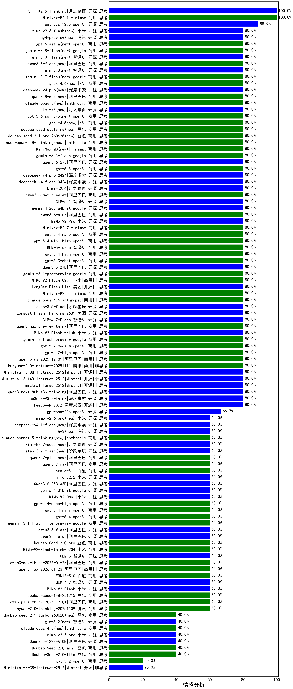

|类别|机构|大模型|【情感分析】准确率|平均耗时|平均消耗token|花费/千次（元）|排名（准确率）|
|---|---|-----|-------------------|-------|-----------|-----------|-----------|
|开源|月之暗面|Kimi-K2.5-Thinking|100.0%|161s|1029|20.2|1|
|开源|openAI|gpt-oss-120b|88.9%|2s|256|0.5|2|
|商用|openAI|gpt-5.6-sol-pro|80.0%|7s|2303|123.8|3|
|开源|google|gemma-4-26b-a4b-it|80.0%|11s|285|0.6|4|
|开源|智谱AI|GLM-5.1|80.0%|99s|680|14.7|5|
|商用|阿里巴巴|qwen3.6-max-preview|80.0%|35s|1022|51.2|6|
|开源|深度求索|deepseek-v4-flash-0424|80.0%|23s|313|0.5|7|
|开源|深度求索|deepseek-v4-pro-0424|80.0%|18s|302|6.2|8|
|商用|openAI|gpt-5.5|80.0%|5s|187|20.6|9|
|开源|阿里巴巴|qwen3.6-27b|80.0%|21s|1276|21.6|10|
|商用|google|gemini-3.5-flash|80.0%|6s|837|47.8|11|
|商用|minimax|MiniMax-M3|80.0%|20s|630|7.4|12|
|商用|anthropic|claude-opus-4.8-thinking|80.0%|10s|551|75.6|13|
|商用|豆包|doubao-seed-2-1-pro-260628|80.0%|100s|4650|136.3|14|
|商用|豆包|doubao-seed-evolving|80.0%|117s|3637|106.0|15|
|商用|XAI|grok-4.5|80.0%|94s|1051|35.7|16|
|开源|月之暗面|kimi-k3(new)|80.0%|36s|701|57.3|17|
|开源|小米|MiMo-V2-Pro|80.0%|267s|794|12.0|18|
|商用|anthropic|claude-opus-5(new)|80.0%|11s|585|81.6|19|
|商用|阿里巴巴|qwen3.8-max(new)|80.0%|13s|355|9.7|20|
|开源|深度求索|deepseek-v4-pro(new)|80.0%|11s|459|9.5|21|
|商用|XAI|grok-4.6(new)|80.0%|26s|1474|53.4|22|
|商用|google|gemini-3.7-flash(new)|80.0%|26s|483|10.7|23|
|开源|智谱AI|glm-5.3(new)|80.0%|34s|1207|31.9|24|
|商用|阿里巴巴|qwen3.8-flash(new)|80.0%|11s|463|1.0|25|
|开源|智谱AI|glm-5.3-flash(new)|80.0%|39s|1419|3.8|26|
|商用|google|gemini-3.8-flash(new)|80.0%|41s|425|18.3|27|
|商用|openAI|gpt-6-astra(new)|80.0%|7s|140|19.2|28|
|开源|腾讯|hy4-preview(new)|80.0%|44s|2624|46.0|29|
|开源|小米|mimo-v2.6-flash(new)|80.0%|13s|377|0.7|30|
|商用|openAI|gpt-6-luna(new)|80.0%|535s|199|0.4|31|
|商用|阿里巴巴|qwen3.6-plus|80.0%|36s|1060|11.8|32|
|开源|月之暗面|kimi-k2.6|80.0%|37s|620|15.1|33|
|商用|minimax|MiniMax-M2.7|80.0%|10s|373|2.4|34|
|商用|openAI|gpt-5.4-high|80.0%|7s|296|21.7|35|
|开源|深度求索|DeepSeek-V3.2|80.0%|53s|340|0.9|36|
|开源|深度求索|DeepSeek-V3.2-Think|80.0%|106s|780|2.3|37|
|开源|阶跃星辰|step-3.5-flash|80.0%|16s|821|1.6|38|
|商用|anthropic|claude-opus-4.6|80.0%|14s|324|35.7|39|
|商用|minimax|MiniMax-M2.5|80.0%|13s|629|4.6|40|
|开源|美团|LongCat-Flash-Lite|80.0%|28s|214|0.0|41|
|商用|小米|MiMo-V2-Flash-0204|80.0%|35s|292|0.5|42|
|商用|google|gemini-3.1-pro-preview|80.0%|14s|931|72.7|43|
|开源|阿里巴巴|Qwen3.5-27B|80.0%|119s|1864|8.6|44|
|商用|openAI|gpt-5.3-chat|80.0%|6s|231|13.5|45|
|商用|openAI|gpt-6-sol(new)|80.0%|190s|181|6.7|46|
|商用|openAI|gpt-5.4-nano|80.0%|3s|114|0.2|47|
|商用|openAI|gpt-5.4-mini-high|80.0%|12s|267|5.6|48|
|商用|智谱AI|GLM-5-Turbo|80.0%|65s|642|12.6|49|
|开源|openAI|gpt-oss-20b|66.7%|1s|297|0.2|50|
|商用|openAI|gpt-5.4|60.0%|4s|157|7.2|51|
|商用|anthropic|claude-sonnet-5-thinking|60.0%|9s|481|25.3|52|
|开源|智谱AI|GLM-5|60.0%|34s|1100|18.6|53|
|开源|阿里巴巴|Qwen3.6-35B-A3B|60.0%|95s|829|8.1|54|
|商用|openAI|gpt-5.4-mini|60.0%|5s|136|1.5|55|
|商用|小米|MiMo-V2-Flash-think-0204|60.0%|947s|1455|2.9|56|
|商用|豆包|Doubao-Seed-2.0-pro|60.0%|384s|1831|27.6|57|
|开源|深度求索|deepseek-v4.1-flash(new)|60.0%|39s|1027|7.6|58|
|开源|阿里巴巴|qwen3.5-plus|60.0%|42s|3489|16.4|59|
|开源|腾讯|hy3|60.0%|63s|164|0.4|60|
|开源|小米|mimo-v2.5|60.0%|7s|859|8.3|61|
|商用|阿里巴巴|qwen3-max-2026-01-23|60.0%|5s|259|1.9|62|
|商用|百度|ERNIE-5.0|60.0%|81s|905|20.3|63|
|开源|阿里巴巴|qwen3.5-flash|60.0%|297s|2069|4.0|64|
|开源|小米|MiMo-V2-Omni|60.0%|12s|859|8.2|65|
|开源|月之暗面|kimi-k2.7-code|60.0%|11s|421|9.7|66|
|开源|小米|mimo-v2.6-pro(new)|60.0%|24s|787|4.4|67|
|开源|阶跃星辰|step-3.7-flash|60.0%|10s|573|4.0|68|
|商用|阿里巴巴|qwen3.7-plus|60.0%|19s|915|6.8|69|
|开源|google|gemma-4-31b-it|60.0%|23s|285|0.6|70|
|商用|openAI|gpt-5.4-nano-high|60.0%|6s|183|0.8|71|
|商用|阿里巴巴|qwen3.7-max|60.0%|15s|591|19.1|72|
|商用|google|gemini-3.1-flash-lite-preview|60.0%|34s|308|2.4|73|
|商用|百度|ernie-5.1|60.0%|48s|494|7.5|74|
|商用|阿里巴巴|qwen3-max-think-2026-01-23|60.0%|101s|2327|22.5|75|
|商用|豆包|Doubao-Seed-2.0-mini|40.0%|131s|667|1.1|76|
|商用|豆包|Doubao-Seed-2.0-lite|40.0%|158s|785|2.4|77|
|商用|豆包|doubao-seed-2-1-turbo-260628|40.0%|128s|5905|87.0|78|
|开源|小米|mimo-v2.5-pro|40.0%|17s|1042|17.1|79|
|开源|阿里巴巴|Qwen3.5-122B-A10B|40.0%|406s|4150|26.1|80|
|商用|anthropic|claude-opus-4.8|40.0%|7s|383|46.3|81|
|开源|智谱AI|glm-5.2|40.0%|37s|1166|30.7|82|

