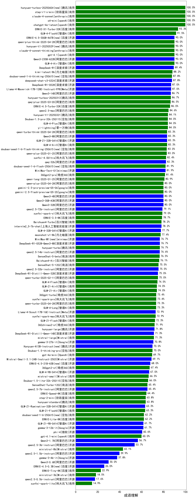

|类别|机构|大模型|【成语理解】准确率|平均耗时|平均消耗token|花费/千次（元）|排名（准确率）|
|---|---|-----|-------------------|-------|-----------|-----------|-----------|
|商用|openAI|chatgpt-4o-latest|100.0%|/|/|/|1|
|商用|anthropic|claude-4-sonnet|100.0%|40s|568|42.2|2|
|商用|openAI|o4-mini|100.0%|12s|931|25.7|3|
|商用|智谱AI|GLM-4-FlashX|91.5%|4s|291|0.0|4|
|开源|百度|ERNIE-4.5-300B-A47B(new)|90.0%|15s|367|2.0|5|
|商用|openAI|gpt-4.1|90.0%|12s|460|19.5|6|
|商用|百度|ERNIE-X1-Turbo-32K|90.0%|220s|1084|3.9|7|
|商用|智谱AI|GLM-4-Air|90.0%|3s|234|0.1|8|
|开源|深度求索|deepseek-chat-v3-0324|90.0%|109s|353|2.0|9|
|开源|阿里巴巴|Qwen3-235B-A22B-nothink|90.0%|27s|592|4.7|10|
|商用|XAI|grok-4-0709(new)|90.0%|382s|1516|151.6|11|
|商用|anthropic|claude-4-sonnet-thinking|90.0%|47s|1207|111.6|12|
|商用|月之暗面|kimi-latest-8k|88.2%|16s|457|5.5|13|
|商用|百度|ERNIE-4.5-Turbo-32K|88.0%|14s|432|1.1|14|
|商用|豆包|doubao-seed-1-6-thinking-250715(new)|88.0%|19s|915|6.3|15|
|开源|阿里巴巴|qwen3-235b-a22b-instruct-2507(new)|88.0%|15s|670|4.4|16|
|商用|阿里巴巴|qwq-plus-2025-03-05|86.5%|33s|1102|4.0|17|
|开源|阿里巴巴|Qwen3-30B-A3B-Thinking-2507(new)|86.0%|53s|2240|5.9|18|
|商用|腾讯|hunyuan-turbos-20250604|86.0%|72s|488|0.8|19|
|商用|豆包|doubao-seed-1-6-thinking-250615|86.0%|20s|1054|7.4|20|
|商用|豆包|doubao-seed-1-6-flash-thinking-250615|86.0%|8s|809|1.0|21|
|开源|阿里巴巴|qwen3-235b-a22b-thinking-2507(new)|86.0%|45s|1933|35.1|22|
|商用|阶跃星辰|step-r1-v-mini|86.0%|79s|1194|8.6|23|
|开源|meta|Llama-4-Maverick-17B-128E-Instruct-FP8|86.0%|11s|694|2.6|24|
|商用|google|gemini-2.5-pro(new)|86.0%|28s|1808|121.2|25|
|商用|阿里巴巴|qwen2.5-max|84.6%|6s|316|1.9|26|
|商用|XAI|grok-3-mini(new)|84.0%|103s|1282|4.4|27|
|商用|豆包|Doubao-1.5-pro-32k-250115|84.0%|10s|545|0.9|28|
|商用|零一万物|yi-lightning|84.0%|/|/|/|29|
|开源|阿里巴巴|Qwen3-14B|84.0%|75s|1563|2.9|30|
|开源|阿里巴巴|Qwen3-235B-A22B|84.0%|46s|1246|11.3|31|
|商用|智谱AI|GLM-4-Plus|84.0%|12s|385|1.9|32|
|商用|科大讯飞|xunfei-spark-x1|84.0%|30s|1008|12.1|33|
|商用|阿里巴巴|qwen-plus-think-2025-04-28|84.0%|196s|1308|9.3|34|
|商用|阿里巴巴|qwen-plus-2025-07-14(new)|84.0%|10s|710|1.2|35|
|商用|豆包|doubao-seed-1-6-flash-250615|84.0%|4s|443|0.5|36|
|开源|智谱AI|GLM-Z1-32B-0414|83.3%|209s|1406|5.2|37|
|商用|智谱AI|GLM-4-AirX|83.3%|2s|234|2.5|38|
|商用|科大讯飞|xunfei-spark-x1-0725(new)|83.0%|/|687|8.3|39|
|商用|科大讯飞|xunfei-4.0Ultra|82.4%|3s|235|16.5|40|
|开源|阿里巴巴|qwq-32b|82.3%|19s|1144|6.3|41|
|商用|google|gemini-2.5-flash(new)|82.0%|8s|1589|26.3|42|
|开源|阿里巴巴|Qwen3-32B|82.0%|73s|1139|4.1|43|
|商用|腾讯|hunyuan-t1-20250711(new)|82.0%|20s|1244|4.4|44|
|开源|智谱AI|GLM-4.5-Air(new)|82.0%|32s|1919|10.3|45|
|开源|minimax|MiniMax-Text-01|81.9%|8s|971|7.8|46|
|商用|奇虎360|360gpt2-pro|81.4%|11s|285|0.9|47|
|商用|阿里巴巴|qwen-long-2025-01-25|80.9%|114s|374|0.5|48|
|开源|阿里巴巴|Qwen3-30B-A3B|80.0%|101s|1839|4.8|49|
|开源|深度求索|DeepSeek-R1-0528|80.0%|114s|1682|25.3|50|
|开源|阿里巴巴|Qwen3-32B-nothink|80.0%|58s|575|1.8|51|
|开源|月之暗面|kimi-k2-0711-preview(new)|80.0%|23s|475|6.1|52|
|商用|阿里巴巴|qwen-turbo-think-2025-04-28|79.6%|178s|1680|4.6|53|
|开源|阿里巴巴|qwen2.5-72b-instruct|79.1%|6s|277|2.1|54|
|商用|百度|ERNIE-3.5-8K|78.7%|26s|535|0.9|55|
|商用|百川智能|Baichuan4-Turbo|78.2%|/|/|/|56|
|开源|上海人工智能实验室|internlm2_5-7b-chat|78.2%|/|/|/|57|
|开源|meta|Llama-4-Scout-17B-16E-Instruct|78.0%|11s|698|1.3|58|
|商用|阿里巴巴|qwen-plus-2025-04-28|78.0%|94s|604|1.0|59|
|开源|智谱AI|GLM-4-32B-0414|78.0%|10s|340|0.6|60|
|开源|深度求索|DeepSeek-R1-0528-Qwen3-8B|78.0%|401s|1723|0.0|61|
|开源|阿里巴巴|qwen2.5-14b-instruct|76.6%|5s|338|0.7|62|
|商用|商汤|SenseChat-5-beta|76.5%|12s|319|4.7|63|
|商用|百川智能|Baichuan4-Air|76.1%|/|/|/|64|
|开源|阿里巴巴|Qwen3-4B|76.0%|53s|1144|3.0|65|
|商用|智谱AI|GLM-Z1-Air|76.0%|55s|1262|0.6|66|
|商用|智谱AI|GLM-4.5-Flash(new)|76.0%|28s|1742|0.0|67|
|开源|阿里巴巴|qwen2.5-32b-instruct|75.5%|3s|271|1.0|68|
|商用|商汤|SenseChat-5-1202|75.5%|/|/|/|69|
|开源|深度求索|DeepSeek-R1-Distill-Qwen-32B|75.0%|19s|902|1.1|70|
|商用|智谱AI|GLM-4-Flash|74.5%|8s|303|0.0|71|
|开源|阿里巴巴|Qwen3-8B-nothink|74.0%|39s|652|0.0|72|
|商用|智谱AI|GLM-Z1-AirX|74.0%|23s|1733|11.2|73|
|开源|阿里巴巴|Qwen3-8B|74.0%|66s|1798|0.0|74|
|开源|阿里巴巴|Qwen3-14B-nothink|74.0%|13s|653|1.1|75|
|开源|智谱AI|GLM-4.5(new)|74.0%|49s|2067|25.7|76|
|开源|阿里巴巴|Qwen3-30B-A3B-nothink|74.0%|18s|632|1.4|77|
|商用|奇虎360|360gpt-turbo|73.4%|/|/|/|78|
|商用|科大讯飞|xunfei-spark-pro|73.4%|/|/|/|79|
|商用|智谱AI|GLM-4-Long|73.3%|2s|209|0.2|80|
|商用|科大讯飞|xunfei-spark-max|72.9%|3s|228|6.8|81|
|商用|google|gemini-2.5-flash-lite-preview-06-17(new)|72.0%|4s|1064|2.7|82|
|商用|智谱AI|GLM-Z1-Flash|72.0%|23s|1215|0.0|83|
|商用|奇虎360|360zhinao2-o1|71.9%|/|/|/|84|
|开源|腾讯|hunyuan-large|71.8%|8s|1770|10.0|85|
|开源|minimax|MiniMax-M1(new)|71.4%|198s|1430|9.7|86|
|商用|Mistral|mistral-large|71.3%|/|/|/|87|
|开源|深度求索|DeepSeek-R1-Distill-Qwen-14B|71.3%|/|/|/|88|
|开源|Google|gemma-3-27b-it|70.8%|/|/|/|89|
|开源|智谱AI|GLM-Z1-9B-0414|70.0%|36s|1386|0.0|90|
|开源|阿里巴巴|Qwen3-30B-A3B-Instruct-2507(new)|70.0%|8s|739|1.8|91|
|开源|华为|pangu-pro-moe(new)|70.0%|50s|1028|3.7|92|
|商用|阿里巴巴|qwen-turbo-2025-04-28|70.0%|8s|555|0.3|93|
|开源|腾讯|Hunyuan-A13B-Instruct(new)|70.0%|85s|951|3.4|94|
|商用|智谱AI|GLM-Z1-FlashX|70.0%|17s|1079|0.1|95|
|商用|OpenAI|gpt-4o-mini|69.7%|/|/|/|96|
|开源|百度|ERNIE-4.5-21B-A3B(new)|68.0%|53s|390|0.0|97|
|商用|阿里巴巴|qwen-turbo-2025-07-15(new)|68.0%|8s|477|0.2|98|
|开源|阿里巴巴|Qwen3-4B-nothink|68.0%|19s|726|1.7|99|
|商用|奇虎360|360gpt2-o1|67.4%|32s|778|34.0|100|
|商用|Mistral|mistral-small|66.5%|/|/|/|101|
|商用|豆包|Doubao-1.5-lite-32k-250115|66.0%|4s|309|0.1|102|
|开源|阿里巴巴|qwen2.5-7b-instruct|65.4%|4s|255|0.2|103|
|商用|商汤|SenseChat-Turbo-1202|65.4%|/|/|/|104|
|商用|百度|ERNIE-Speed-8K|64.4%|/|/|/|105|
|商用|豆包|doubao-seed-1-6-250615|64.0%|136s|346|1.5|106|
|商用|阶跃星辰|step-2-mini|63.8%|9s|512|0.9|107|
|商用|腾讯|hunyuan-standard|63.8%|/|/|/|108|
|开源|智谱AI|GLM-Z1-Rumination-32B-0414|63.3%|59s|2292|7.3|109|
|商用|百度|ERNIE-Lite-8K|62.2%|/|/|/|110|
|开源|腾讯|Hunyuan-A13B-Instruct-nothink(new)|62.0%|651s|570|1.8|111|
|开源|智谱AI|GLM-4-9B-0414|62.0%|11s|488|0.0|112|
|开源|Google|gemma-3-12b-it|61.7%|/|/|/|113|
|开源|微软|phi-4|60.6%|/|/|/|114|
|开源|Mistral|Mistral-Small-3.1-24B-Instruct-2503|60.0%|/|/|/|115|
|商用|openAI|gpt-4.1-mini|60.0%|9s|529|4.7|116|
|开源|阿里巴巴|Qwen3-1.7B|54.0%|38s|1478|4.0|117|
|开源|阿里巴巴|qwen2.5-3b-instruct|53.7%|5s|383|0.3|118|
|开源|阿里巴巴|Qwen3-1.7B-nothink|48.0%|10s|633|1.4|119|
|商用|Mistral|ministral-8b|43.1%|/|/|/|120|
|开源|阿里巴巴|qwen2.5-1.5b-instruct|39.9%|4s|281|0.0|121|
|开源|Google|gemma-3-4b-it|37.8%|/|/|/|122|
|开源|阿里巴巴|Qwen3-0.6B|34.0%|23s|861|2.2|123|
|开源|阿里巴巴|Qwen3-0.6B-nothink|26.0%|4s|262|0.4|124|
|开源|百度|ERNIE-4.5-0.3B(new)|24.0%|56s|448|0.0|125|
|商用|百度|ERNIE-Tiny-8K|22.9%|/|/|/|126|
|商用|Mistral|ministral-3b|18.5%|/|/|/|127|
|开源|阿里巴巴|qwen2.5-0.5b-instruct|17.6%|1s|363|0.0|128|
|商用|科大讯飞|xunfei-spark-lite|14.9%|/|/|/|129|

