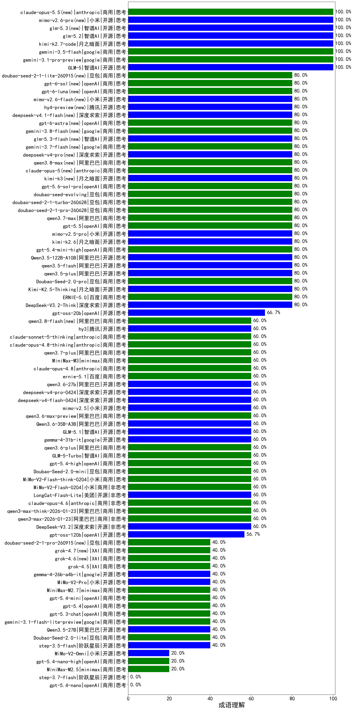

|类别|机构|大模型|【成语理解】准确率|平均耗时|平均消耗token|花费/千次（元）|排名（准确率）|
|---|---|-----|-------------------|-------|-----------|-----------|-----------|
|商用|anthropic|claude-opus-5.5(new)|100.0%|12s|694|71.8|1|
|商用|google|gemini-3.5-flash|100.0%|11s|2161|127.7|2|
|开源|月之暗面|kimi-k2.7-code|100.0%|90s|1428|35.9|3|
|开源|小米|mimo-v2.6-pro(new)|100.0%|25s|1114|6.2|4|
|开源|智谱AI|glm-5.2|100.0%|68s|3109|84.0|5|
|开源|智谱AI|GLM-5|100.0%|72s|2637|45.4|6|
|开源|智谱AI|glm-5.3(new)|100.0%|-685s|1559|40.6|7|
|商用|google|gemini-3.1-pro-preview|100.0%|33s|1833|144.8|8|
|开源|小米|mimo-v2.5-pro|80.0%|43s|2407|44.9|9|
|商用|anthropic|claude-opus-5(new)|80.0%|11s|714|93.6|10|
|商用|阿里巴巴|qwen3.7-max|80.0%|22s|1191|39.4|11|
|商用|豆包|doubao-seed-2-1-pro-260628|80.0%|279s|5443|158.8|12|
|商用|豆包|doubao-seed-2-1-turbo-260628|80.0%|203s|10833|160.3|13|
|商用|豆包|doubao-seed-evolving|80.0%|159s|5142|149.8|14|
|商用|openAI|gpt-5.6-sol-pro|80.0%|20s|3563|264.9|15|
|开源|月之暗面|kimi-k3(new)|80.0%|42s|1001|83.4|16|
|商用|google|gemini-3.7-flash(new)|80.0%|4s|664|14.1|17|
|商用|阿里巴巴|qwen3.8-max(new)|80.0%|17s|858|26.5|18|
|开源|深度求索|deepseek-v4-pro(new)|80.0%|35s|1442|35.0|19|
|开源|月之暗面|kimi-k2.6|80.0%|127s|1862|47.6|20|
|开源|智谱AI|glm-5.3-flash(new)|80.0%|107s|3603|9.8|21|
|商用|google|gemini-3.8-flash(new)|80.0%|19s|918|41.5|22|
|商用|openAI|gpt-6-astra(new)|80.0%|10s|315|63.2|23|
|开源|深度求索|deepseek-v4.1-flash(new)|80.0%|64s|2649|20.2|24|
|开源|腾讯|hy4-preview(new)|80.0%|97s|6973|123.6|25|
|开源|小米|mimo-v2.6-flash(new)|80.0%|31s|736|1.3|26|
|商用|openAI|gpt-6-luna(new)|80.0%|118s|761|2.2|27|
|商用|openAI|gpt-6-sol(new)|80.0%|96s|332|13.8|28|
|商用|openAI|gpt-5.5|80.0%|11s|644|105.8|29|
|商用|豆包|doubao-seed-2-1-lite-260915(new)|80.0%|112s|4171|10.9|30|
|商用|豆包|Doubao-Seed-2.0-pro|80.0%|172s|874|11.6|31|
|开源|阿里巴巴|qwen3.5-plus|80.0%|47s|3987|18.6|32|
|开源|阿里巴巴|qwen3.5-flash|80.0%|229s|3194|6.1|33|
|开源|深度求索|DeepSeek-V3.2-Think|80.0%|199s|1592|4.6|34|
|商用|百度|ERNIE-5.0|80.0%|120s|2463|56.6|35|
|开源|月之暗面|Kimi-K2.5-Thinking|80.0%|245s|1614|31.7|36|
|商用|openAI|gpt-5.4-mini-high|80.0%|29s|1374|38.9|37|
|开源|阿里巴巴|Qwen3.5-122B-A10B|80.0%|143s|3147|19.3|38|
|开源|openAI|gpt-oss-20b|66.7%|339s|1377|1.4|39|
|商用|openAI|gpt-5.4-high|60.0%|15s|867|76.2|40|
|商用|阿里巴巴|qwen3-max-2026-01-23|60.0%|211s|779|6.6|41|
|商用|anthropic|claude-opus-4.8-thinking|60.0%|12s|872|121.2|42|
|商用|阿里巴巴|qwen3-max-think-2026-01-23|60.0%|116s|3199|30.8|43|
|商用|anthropic|claude-sonnet-5-thinking|60.0%|30s|889|49.7|44|
|商用|anthropic|claude-opus-4.6|60.0%|7s|434|44.5|45|
|商用|minimax|MiniMax-M3|60.0%|189s|5173|83.0|46|
|开源|腾讯|hy3|60.0%|79s|699|2.3|47|
|开源|美团|LongCat-Flash-Lite|60.0%|207s|702|0.0|48|
|商用|豆包|Doubao-Seed-2.0-mini|60.0%|77s|1897|3.5|49|
|商用|阿里巴巴|qwen3.8-flash(new)|60.0%|14s|871|2.0|50|
|商用|阿里巴巴|qwen3.7-plus|60.0%|28s|1509|11.2|51|
|商用|小米|MiMo-V2-Flash-0204|60.0%|509s|609|1.0|52|
|商用|anthropic|claude-opus-4.8|60.0%|10s|674|86.6|53|
|开源|小米|mimo-v2.5|60.0%|29s|2072|24.6|54|
|开源|深度求索|DeepSeek-V3.2|60.0%|44s|371|1.0|55|
|商用|阿里巴巴|qwen3.6-plus|60.0%|37s|2071|23.4|56|
|开源|google|gemma-4-31b-it|60.0%|99s|598|1.4|57|
|开源|智谱AI|GLM-5.1|60.0%|198s|1852|41.8|58|
|开源|阿里巴巴|Qwen3.6-35B-A3B|60.0%|21s|2447|25.1|59|
|商用|小米|MiMo-V2-Flash-think-0204|60.0%|575s|3395|6.9|60|
|商用|阿里巴巴|qwen3.6-max-preview|60.0%|82s|2690|138.7|61|
|开源|深度求索|deepseek-v4-flash-0424|60.0%|30s|1001|1.9|62|
|开源|深度求索|deepseek-v4-pro-0424|60.0%|43s|1680|38.6|63|
|开源|阿里巴巴|qwen3.6-27b|60.0%|43s|2290|39.0|64|
|商用|百度|ernie-5.1|60.0%|22s|845|13.1|65|
|商用|智谱AI|GLM-5-Turbo|60.0%|28s|1736|35.7|66|
|开源|openAI|gpt-oss-120b|56.7%|20s|718|1.8|67|
|开源|阶跃星辰|step-3.5-flash|40.0%|25s|3438|7.0|68|
|商用|XAI|grok-4.7(new)|40.0%|85s|5539|193.4|69|
|商用|豆包|doubao-seed-2-1-pro-260915(new)|40.0%|71s|1833|50.5|70|
|商用|google|gemini-3.1-flash-lite-preview|40.0%|40s|533|4.2|71|
|商用|XAI|grok-4.6(new)|40.0%|566s|2495|94.5|72|
|商用|豆包|Doubao-Seed-2.0-lite|40.0%|246s|1161|3.6|73|
|商用|XAI|grok-4.5|40.0%|61s|2710|103.6|74|
|开源|阿里巴巴|Qwen3.5-27B|40.0%|426s|4508|21.0|75|
|商用|openAI|gpt-5.3-chat|40.0%|59s|598|44.2|76|
|商用|openAI|gpt-5.4|40.0%|5s|391|26.4|77|
|商用|openAI|gpt-5.4-mini|40.0%|111s|316|5.5|78|
|开源|google|gemma-4-26b-a4b-it|40.0%|67s|652|1.5|79|
|开源|小米|MiMo-V2-Pro|40.0%|54s|1418|24.2|80|
|商用|minimax|MiniMax-M2.7|40.0%|59s|2476|19.7|81|
|商用|minimax|MiniMax-M2.5|20.0%|44s|2041|16.0|82|
|商用|openAI|gpt-5.4-nano-high|20.0%|11s|1025|7.7|83|
|开源|小米|MiMo-V2-Omni|20.0%|23s|2262|27.2|84|
|开源|阶跃星辰|step-3.7-flash|0.0%|9s|1053|7.5|85|
|商用|openAI|gpt-5.4-nano|0.0%|46s|250|1.0|86|

