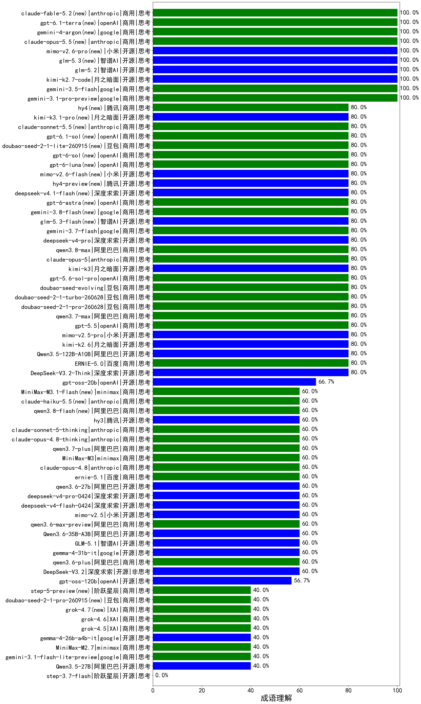

|类别|机构|大模型|【成语理解】准确率|平均耗时|平均消耗token|花费/千次（元）|排名（准确率）|
|---|---|-----|-------------------|-------|-----------|-----------|-----------|
|开源|智谱AI|glm-5.3(new)|100.0%|-685s|1559|40.6|1|
|商用|openAI|gpt-6.1-terra(new)|100.0%|5s|433|10.5|2|
|开源|小米|mimo-v2.6-pro(new)|100.0%|25s|1114|6.2|3|
|商用|anthropic|claude-opus-5.5(new)|100.0%|12s|694|71.8|4|
|开源|月之暗面|kimi-k2.7-code|100.0%|90s|1428|35.9|5|
|开源|智谱AI|glm-5.2|100.0%|68s|3109|84.0|6|
|商用|google|gemini-4-argon(new)|100.0%|24s|444|41.2|7|
|商用|google|gemini-3.5-flash|100.0%|11s|2161|127.7|8|
|商用|google|gemini-3.1-pro-preview|100.0%|33s|1833|144.8|9|
|商用|google|gemini-4-carbon(new)|100.0%|20s|980|116.2|10|
|商用|anthropic|claude-fable-5.2(new)|100.0%|13s|504|90.5|11|
|商用|阿里巴巴|qwen3.8-max|80.0%|17s|858|26.5|12|
|开源|腾讯|hy4-preview(new)|80.0%|97s|6973|123.6|13|
|开源|深度求索|deepseek-v4.1-flash(new)|80.0%|64s|2649|20.2|14|
|商用|openAI|gpt-6-astra(new)|80.0%|10s|315|63.2|15|
|开源|深度求索|deepseek-v4-pro|80.0%|35s|1442|35.0|16|
|商用|google|gemini-3.8-flash(new)|80.0%|19s|918|41.5|17|
|开源|月之暗面|kimi-k3|80.0%|42s|1001|83.4|18|
|商用|anthropic|claude-opus-5|80.0%|11s|714|93.6|19|
|商用|豆包|doubao-seed-2-1-pro-260628|80.0%|279s|5443|158.8|20|
|商用|豆包|doubao-seed-2-1-turbo-260628|80.0%|203s|10833|160.3|21|
|商用|阿里巴巴|qwen3.7-max|80.0%|22s|1191|39.4|22|
|开源|智谱AI|glm-5.3-flash(new)|80.0%|107s|3603|9.8|23|
|商用|openAI|gpt-5.6-sol-pro|80.0%|20s|3563|264.9|24|
|商用|豆包|doubao-seed-evolving|80.0%|159s|5142|149.8|25|
|商用|腾讯|hy4-flash(new)|80.0%|11s|1379|2.5|26|
|开源|小米|mimo-v2.6-flash(new)|80.0%|31s|736|1.3|27|
|商用|anthropic|claude-sonnet-5.5(new)|80.0%|8s|756|40.3|28|
|开源|深度求索|DeepSeek-V3.2-Think|80.0%|199s|1592|4.6|29|
|商用|百度|ERNIE-5.0|80.0%|120s|2463|56.6|30|
|开源|阿里巴巴|Qwen3.5-122B-A10B|80.0%|143s|3147|19.3|31|
|商用|腾讯|hy4(new)|80.0%|59s|2811|48.7|32|
|开源|月之暗面|kimi-k3.1-pro(new)|80.0%|31s|1128|65.2|33|
|商用|google|gemini-3.7-flash|80.0%|4s|664|14.1|34|
|商用|openAI|gpt-6-luna(new)|80.0%|118s|761|2.2|35|
|商用|openAI|gpt-6.1-sol(new)|80.0%|6s|284|10.4|36|
|开源|月之暗面|kimi-k2.6|80.0%|127s|1862|47.6|37|
|商用|豆包|doubao-seed-2-1-lite-260915(new)|80.0%|112s|4171|10.9|38|
|开源|小米|mimo-v2.5-pro|80.0%|43s|2407|44.9|39|
|商用|openAI|gpt-6-sol(new)|80.0%|96s|332|13.8|40|
|商用|openAI|gpt-5.5|80.0%|11s|644|105.8|41|
|开源|openAI|gpt-oss-20b|66.7%|339s|1377|1.4|42|
|商用|minimax|MiniMax-M3.1-Flash(new)|60.0%|37s|3115|11.5|43|
|商用|阿里巴巴|qwen3.8-flash(new)|60.0%|14s|871|2.0|44|
|商用|anthropic|claude-haiku-5.5(new)|60.0%|19s|808|2.2|45|
|商用|anthropic|claude-sonnet-5-thinking|60.0%|30s|889|49.7|46|
|开源|深度求索|deepseek-v4-pro-0424|60.0%|43s|1680|38.6|47|
|开源|阿里巴巴|qwen3.6-27b|60.0%|43s|2290|39.0|48|
|开源|智谱AI|GLM-5.1|60.0%|198s|1852|41.8|49|
|开源|阿里巴巴|Qwen3.6-35B-A3B|60.0%|21s|2447|25.1|50|
|商用|阿里巴巴|qwen3.6-max-preview|60.0%|82s|2690|138.7|51|
|开源|小米|mimo-v2.5|60.0%|29s|2072|24.6|52|
|开源|深度求索|deepseek-v4-flash-0424|60.0%|30s|1001|1.9|53|
|开源|google|gemma-4-31b-it|60.0%|99s|598|1.4|54|
|商用|阿里巴巴|qwen3.6-plus|60.0%|37s|2071|23.4|55|
|商用|百度|ernie-5.1|60.0%|22s|845|13.1|56|
|商用|anthropic|claude-opus-4.8|60.0%|10s|674|86.6|57|
|商用|minimax|MiniMax-M3|60.0%|189s|5173|83.0|58|
|商用|阿里巴巴|qwen3.7-plus|60.0%|28s|1509|11.2|59|
|开源|深度求索|DeepSeek-V3.2|60.0%|44s|371|1.0|60|
|商用|anthropic|claude-opus-4.8-thinking|60.0%|12s|872|121.2|61|
|开源|腾讯|hy3|60.0%|79s|699|2.3|62|
|开源|openAI|gpt-oss-120b|56.7%|20s|718|1.8|63|
|开源|阿里巴巴|Qwen3.5-27B|40.0%|426s|4508|21.0|64|
|商用|google|gemini-3.1-flash-lite-preview|40.0%|40s|533|4.2|65|
|商用|minimax|MiniMax-M2.7|40.0%|59s|2476|19.7|66|
|商用|XAI|grok-4.6|40.0%|566s|2495|94.5|67|
|开源|google|gemma-4-26b-a4b-it|40.0%|67s|652|1.5|68|
|商用|阶跃星辰|step-5-preview(new)|40.0%|73s|4116|80.4|69|
|商用|XAI|grok-4.5|40.0%|61s|2710|103.6|70|
|商用|XAI|grok-4.7(new)|40.0%|85s|5539|193.4|71|
|商用|豆包|doubao-seed-2-1-pro-260915(new)|40.0%|71s|1833|50.5|72|
|开源|阶跃星辰|step-3.7-flash|0.0%|9s|1053|7.5|73|

