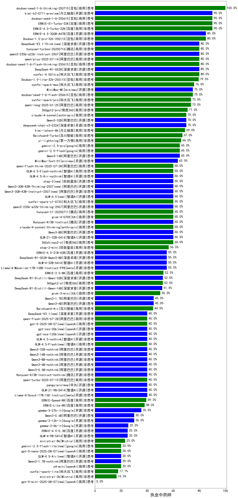

|类别|机构|大模型|【执业中药师】准确率|平均耗时|平均消耗token|花费/千次（元）|排名（准确率）|
|---|---|-----|-------------------|-------|-----------|-----------|-----------|
|商用|豆包|doubao-seed-1-6-thinking-250715|100.0%|43s|941|7.1|1|
|商用|百度|ERNIE-X1-Turbo-32K|90.0%|288s|2551|10.0|2|
|商用|百度|ERNIE-4.5-Turbo-32K|90.0%|22s|536|1.6|3|
|开源|月之暗面|kimi-k2-0711-preview|90.0%|20s|374|5.2|4|
|商用|豆包|doubao-seed-1-6-250615|90.0%|7s|410|2.6|5|
|商用|豆包|Doubao-1.5-pro-32k-250115|85.0%|10s|351|0.6|6|
|开源|百度|ERNIE-4.5-300B-A47B|85.0%|24s|345|2.3|7|
|开源|深度求索|DeepSeek-R1-0528|80.0%|228s|1820|28.4|8|
|商用|豆包|doubao-seed-1-6-flash-thinking-250615|80.0%|6s|452|0.5|9|
|商用|科大讯飞|xunfei-4.0Ultra|80.0%|3s|133|9.3|10|
|商用|腾讯|hunyuan-turbos-20250716|80.0%|9s|457|0.8|11|
|商用|阿里巴巴|qwen-plus-2025-07-14|80.0%|15s|433|0.8|12|
|开源|阿里巴巴|qwen3-235b-a22b-instruct-2507|80.0%|12s|408|2.9|13|
|开源|深度求索|DeepSeek-V3.1-Think(new)|80.0%|57s|1060|12.3|14|
|商用|豆包|Doubao-1.5-lite-32k-250115|79.5%|4s|190|0.1|15|
|商用|科大讯飞|xunfei-spark-max|76.0%|5s|135|4.1|16|
|开源|minimax|MiniMax-M1|75.0%|216s|2756|20.8|17|
|商用|豆包|doubao-seed-1-6-flash-250615|75.0%|4s|311|0.4|18|
|商用|科大讯飞|xunfei-spark-pro|73.5%|/|/|/|19|
|商用|阿里巴巴|qwen-long-2025-01-25|73.5%|8s|258|0.4|20|
|商用|奇虎360|360gpt2-pro|71.0%|8s|193|0.7|21|
|商用|anthropic|claude-4-sonnet|70.0%|46s|521|47.8|22|
|开源|阿里巴巴|Qwen3-32B|70.0%|27s|959|3.6|23|
|开源|深度求索|deepseek-chat-v3-0324|70.0%|141s|258|1.7|24|
|商用|月之暗面|kimi-latest-8k|69.0%|15s|420|5.0|25|
|商用|百川智能|Baichuan4-Turbo|67.0%|/|/|/|26|
|商用|零一万物|yi-lightning|66.0%|/|/|/|27|
|商用|google|gemini-2.5-flash|65.0%|11s|1693|29.6|28|
|开源|阿里巴巴|Qwen3-14B|65.0%|30s|1892|3.7|29|
|商用|google|gemini-2.5-pro|65.0%|42s|2112|149.0|30|
|开源|minimax|MiniMax-Text-01|63.5%|17s|881|7.1|31|
|开源|阿里巴巴|Qwen3-30B-A3B-Thinking-2507(new)|60.0%|59s|2357|6.4|32|
|开源|阿里巴巴|Qwen3-30B-A3B-Instruct-2507(new)|60.0%|3s|366|1.0|33|
|开源|腾讯|Hunyuan-A13B-Instruct|60.0%|83s|1179|4.5|34|
|商用|腾讯|hunyuan-t1-20250711|60.0%|22s|1252|4.7|35|
|商用|XAI|grok-4-0709|60.0%|69s|1033|106.1|36|
|商用|智谱AI|GLM-4.5-Flash-nothink|60.0%|16s|836|0.0|37|
|开源|阶跃星辰|step-3(new)|60.0%|88s|1725|6.7|38|
|开源|阿里巴巴|qwen3-235b-a22b-thinking-2507|60.0%|126s|2281|44.6|39|
|商用|科大讯飞|xunfei-spark-x1-0725|60.0%|/|920|11.0|40|
|开源|智谱AI|GLM-4.5(new)|60.0%|72s|1704|23.2|41|
|商用|anthropic|claude-4-sonnet-thinking|60.0%|55s|1119|112.8|42|
|开源|智谱AI|GLM-4.5-Air-nothink|60.0%|15s|908|5.1|43|
|商用|阿里巴巴|qwen-flash-think-2025-07-28|60.0%|20s|1820|2.6|44|
|开源|阿里巴巴|Qwen3-8B|60.0%|136s|4362|0.0|45|
|开源|智谱AI|GLM-Z1-32B-0414|60.0%|109s|2261|8.9|46|
|商用|奇虎360|360zhinao2-o1|60.0%|/|/|/|47|
|商用|阶跃星辰|step-2-mini|56.5%|4s|274|0.5|48|
|开源|智谱AI|GLM-4-32B-0414|55.0%|50s|314|0.6|49|
|开源|深度求索|DeepSeek-R1-0528-Qwen3-8B|55.0%|205s|1877|0.0|50|
|开源|百度|ERNIE-4.5-21B-A3B|55.0%|6s|318|0.0|51|
|开源|meta|Llama-4-Maverick-17B-128E-Instruct-FP8|55.0%|8s|510|2.0|52|
|商用|百度|ERNIE-3.5-8K|52.5%|25s|386|0.7|53|
|开源|深度求索|DeepSeek-R1-Distill-Qwen-32B|52.0%|16s|671|0.8|54|
|商用|奇虎360|360gpt2-o1|52.0%|13s|295|12.5|55|
|开源|深度求索|DeepSeek-R1-Distill-Qwen-14B|51.5%|/|/|/|56|
|商用|XAI|grok-3-mini|50.0%|184s|1051|3.7|57|
|开源|阿里巴巴|Qwen3-1.7B|45.0%|20s|2263|6.6|58|
|开源|阿里巴巴|Qwen3-4B|45.0%|31s|2716|8.0|59|
|商用|百川智能|Baichuan4-Air|44.5%|/|/|/|60|
|商用|openAI|gpt-5-2025-08-07(new)|40.0%|24s|218|12.0|61|
|开源|meta|Llama-4-Scout-17B-16E-Instruct|40.0%|11s|479|0.9|62|
|开源|深度求索|DeepSeek-V3.1(new)|40.0%|29s|534|6.0|63|
|商用|阿里巴巴|qwen-flash-2025-07-28|40.0%|6s|386|0.5|64|
|开源|openAI|gpt-oss-120b(new)|40.0%|3s|721|2.1|65|
|商用|智谱AI|GLM-4.5-Flash(new)|40.0%|26s|1398|0.0|66|
|开源|阿里巴巴|Qwen3-8B-nothink|40.0%|29s|541|0.0|67|
|开源|阿里巴巴|Qwen3-4B-nothink|40.0%|13s|342|0.9|68|
|开源|阿里巴巴|Qwen3-0.6B-nothink|40.0%|7s|230|0.5|69|
|开源|智谱AI|GLM-4.5-nothink|40.0%|18s|589|7.6|70|
|开源|华为|pangu-pro-moe|40.0%|82s|1405|5.4|71|
|开源|openAI|gpt-oss-20b(new)|40.0%|15s|1268|1.4|72|
|开源|阿里巴巴|Qwen3-14B-nothink|40.0%|12s|514|0.9|73|
|商用|阿里巴巴|qwen-turbo-2025-07-15|40.0%|5s|296|0.2|74|
|开源|阿里巴巴|Qwen3-32B-nothink|40.0%|26s|507|1.8|75|
|开源|智谱AI|GLM-Z1-9B-0414|40.0%|115s|2481|0.0|76|
|开源|腾讯|Hunyuan-A13B-Instruct-nothink|40.0%|11s|352|1.2|77|
|商用|百度|ERNIE-Speed-8K|39.3%|/|/|/|78|
|商用|百度|ERNIE-Lite-8K|38.0%|/|/|/|79|
|开源|Google|gemma-3-27b-it|35.5%|/|/|/|80|
|开源|阿里巴巴|Qwen3-0.6B|30.0%|6s|1095|3.1|81|
|开源|Google|gemma-3-12b-it|30.0%|/|/|/|82|
|开源|Google|gemma-3-4b-it|25.5%|/|/|/|83|
|开源|百度|ERNIE-4.5-0.3B|25.0%|6s|341|0.0|84|
|开源|智谱AI|GLM-4-9B-0414|25.0%|8s|417|0.0|85|
|商用|Mistral|ministral-8b|23.0%|/|/|/|86|
|开源|智谱AI|GLM-4.5-Air(new)|20.0%|28s|1373|7.9|87|
|商用|openAI|gpt-5-nano-2025-08-07(new)|20.0%|19s|2095|5.9|88|
|商用|openAI|o4-mini|20.0%|39s|1301|39.7|89|
|开源|阿里巴巴|Qwen3-1.7B-nothink|20.0%|7s|388|1.0|90|
|商用|google|gemini-2.5-flash-lite(new)|20.0%|2s|332|0.8|91|
|商用|科大讯飞|xunfei-spark-lite|17.7%|/|/|/|92|
|商用|Mistral|ministral-3b|16.5%|/|/|/|93|
|商用|openAI|gpt-5-mini-2025-08-07(new)|/%|46s|1009|13.8|94|

