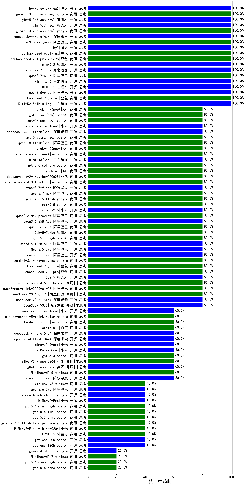

|类别|机构|大模型|【执业中药师】准确率|平均耗时|平均消耗token|花费/千次（元）|排名（准确率）|
|---|---|-----|-------------------|-------|-----------|-----------|-----------|
|开源|月之暗面|kimi-k2.6|100.0%|183s|2599|69.0|1|
|商用|google|gemini-3.7-flash(new)|100.0%|26s|724|17.9|2|
|商用|阿里巴巴|qwen3.7-plus|100.0%|17s|892|6.8|3|
|开源|月之暗面|kimi-k2.7-code|100.0%|10s|546|13.6|4|
|开源|智谱AI|glm-5.2|100.0%|92s|1332|36.1|5|
|商用|豆包|doubao-seed-2-1-pro-260628|100.0%|470s|10557|314.4|6|
|商用|豆包|doubao-seed-evolving|100.0%|222s|8689|258.4|7|
|开源|腾讯|hy3|100.0%|47s|175|0.5|8|
|开源|智谱AI|GLM-5.1|100.0%|140s|1163|26.9|9|
|商用|豆包|Doubao-Seed-2.0-mini|100.0%|94s|2075|4.0|10|
|商用|阿里巴巴|qwen3.8-max(new)|100.0%|41s|1887|65.6|11|
|开源|深度求索|deepseek-v4-pro(new)|100.0%|19s|537|12.1|12|
|开源|阿里巴巴|qwen3.5-plus|100.0%|45s|3139|14.8|13|
|开源|智谱AI|glm-5.3-flash(new)|100.0%|119s|5437|15.1|14|
|商用|google|gemini-3.8-flash(new)|100.0%|10s|733|36.2|15|
|开源|月之暗面|Kimi-K2.5-Thinking|100.0%|417s|2018|41.4|16|
|开源|智谱AI|glm-5.3(new)|100.0%|48s|1344|36.4|17|
|开源|腾讯|hy4-preview(new)|100.0%|63s|4353|77.5|18|
|商用|XAI|grok-4.6(new)|80.0%|61s|2476|96.8|19|
|商用|anthropic|claude-opus-4.8-thinking|80.0%|20s|850|138.1|20|
|商用|阿里巴巴|qwen3.6-max-preview|80.0%|54s|1534|80.1|21|
|开源|小米|mimo-v2.5|80.0%|16s|947|9.9|22|
|商用|openAI|gpt-5.5|80.0%|19s|423|77.4|23|
|商用|google|gemini-3.5-flash|80.0%|9s|1515|92.6|24|
|商用|阿里巴巴|qwen3.7-max|80.0%|18s|857|29.4|25|
|商用|openAI|gpt-6-luna(new)|80.0%|227s|411|1.3|26|
|开源|阶跃星辰|step-3.7-flash|80.0%|82s|1390|10.8|27|
|开源|深度求索|deepseek-v4.1-flash(new)|80.0%|19s|1784|13.8|28|
|开源|小米|mimo-v2.6-pro(new)|80.0%|24s|725|4.2|29|
|商用|豆包|doubao-seed-2-1-turbo-260628|80.0%|252s|13227|197.3|30|
|商用|openAI|gpt-6-astra(new)|80.0%|11s|228|61.4|31|
|商用|XAI|grok-4.5|80.0%|169s|1744|66.1|32|
|商用|openAI|gpt-5.6-sol-pro|80.0%|12s|3196|248.7|33|
|开源|月之暗面|kimi-k3(new)|80.0%|32s|636|53.0|34|
|商用|anthropic|claude-opus-5(new)|80.0%|13s|611|96.3|35|
|商用|阿里巴巴|qwen3.8-flash(new)|80.0%|23s|846|2.1|36|
|开源|阿里巴巴|Qwen3.6-35B-A3B|80.0%|113s|1661|17.4|37|
|商用|openAI|gpt-6-sol(new)|80.0%|467s|266|15.0|38|
|商用|豆包|Doubao-Seed-2.0-pro|80.0%|371s|1625|24.8|39|
|开源|阿里巴巴|Qwen3.5-122B-A10B|80.0%|191s|3543|22.3|40|
|开源|智谱AI|GLM-5|80.0%|97s|2704|47.9|41|
|商用|anthropic|claude-opus-4.6|80.0%|23s|522|80.4|42|
|商用|阿里巴巴|qwen3-max-think-2026-01-23|80.0%|287s|2049|20.0|43|
|商用|阿里巴巴|qwen3-max-2026-01-23|80.0%|10s|359|3.1|44|
|商用|openAI|gpt-5.4-high|80.0%|21s|1046|104.1|45|
|开源|深度求索|DeepSeek-V3.2-Think|80.0%|105s|879|2.6|46|
|开源|阿里巴巴|Qwen3.5-27B|80.0%|416s|4430|21.0|47|
|开源|阿里巴巴|qwen3.5-flash|80.0%|209s|2805|5.5|48|
|商用|google|gemini-3.1-pro-preview|80.0%|49s|1619|134.1|49|
|商用|豆包|Doubao-Seed-2.0-lite|80.0%|224s|1029|3.4|50|
|开源|深度求索|DeepSeek-V3.2|80.0%|9s|302|0.9|51|
|商用|阿里巴巴|qwen3.6-plus|80.0%|44s|1515|17.6|52|
|商用|智谱AI|GLM-5-Turbo|80.0%|92s|1375|29.3|53|
|商用|anthropic|claude-sonnet-5-thinking|60.0%|15s|706|45.1|54|
|开源|美团|LongCat-Flash-Lite|60.0%|121s|537|0.0|55|
|商用|minimax|MiniMax-M2.5|60.0%|33s|1545|12.4|56|
|商用|openAI|gpt-5.4|60.0%|15s|198|15.1|57|
|开源|阶跃星辰|step-3.5-flash|60.0%|15s|1379|2.8|58|
|商用|小米|MiMo-V2-Flash-0204|60.0%|142s|359|0.6|59|
|商用|anthropic|claude-opus-4.8|60.0%|8s|451|68.2|60|
|商用|百度|ernie-5.1|60.0%|25s|1002|17.3|61|
|开源|小米|mimo-v2.6-flash(new)|60.0%|28s|907|1.8|62|
|开源|深度求索|deepseek-v4-pro-0424|60.0%|47s|701|16.2|63|
|开源|深度求索|deepseek-v4-flash-0424|60.0%|98s|2800|5.5|64|
|开源|小米|mimo-v2.5-pro|60.0%|35s|1945|36.6|65|
|开源|小米|MiMo-V2-Omni|60.0%|35s|2300|28.8|66|
|商用|百度|ERNIE-5.0|40.0%|108s|2504|59.2|67|
|开源|google|gemma-4-26b-a4b-it|40.0%|35s|486|1.2|68|
|商用|google|gemini-3.1-flash-lite-preview|40.0%|2s|253|2.2|69|
|商用|小米|MiMo-V2-Flash-think-0204|40.0%|954s|1732|3.5|70|
|商用|openAI|gpt-5.3-chat|40.0%|6s|405|34.0|71|
|商用|openAI|gpt-5.4-mini|40.0%|8s|172|3.7|72|
|商用|openAI|gpt-5.4-mini-high|40.0%|57s|3480|107.9|73|
|商用|minimax|MiniMax-M3|40.0%|15s|470|5.1|74|
|开源|阿里巴巴|qwen3.6-27b|40.0%|24s|1498|26.1|75|
|开源|小米|MiMo-V2-Pro|40.0%|136s|1024|17.3|76|
|开源|openAI|gpt-oss-20b|40.0%|15s|1268|1.4|77|
|开源|openAI|gpt-oss-120b|40.0%|3s|721|2.1|78|
|开源|google|gemma-4-31b-it|20.0%|106s|430|1.1|79|
|商用|openAI|gpt-5.4-nano|20.0%|10s|176|1.1|80|
|商用|openAI|gpt-5.4-nano-high|20.0%|14s|582|4.6|81|
|商用|minimax|MiniMax-M2.7|20.0%|32s|1256|10.0|82|

