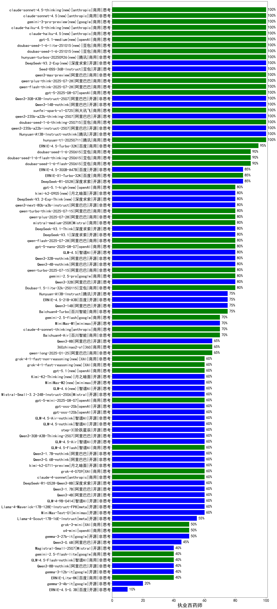

| 类别 | 大模型                         | 执业西药师 | 排名 |
|-----|------------------------------|---------|----|
|商用|Doubao-1.5-thinking-pro(new)|100.0|1|
|商用|ERNIE-4.5-8K-Preview|90.0|2|
|商用|hunyuan-turbo|90.0|3|
|商用|ERNIE-4.5-Turbo-32K(new)|90.0|4|
|开源|Qwen3-235B-A22B(new)|90.0|5|
|商用|Doubao-1.5-pro-32k-250115|89.0|6|
|商用|hunyuan-turbos-20250226|88.0|7|
|开源|Qwen3-30B-A3B(new)|86.7|8|
|开源|hunyuan-large|86.0|9|
|商用|ERNIE-X1-Turbo-32K(new)|83.3|10|
|开源|DeepSeek-R1-0528(new)|83.3|11|
|商用|ERNIE-X1-32K-Preview|83.3|12|
|商用|gemini-2.5-flash-preview-04-17|80.0|13|
|开源|Qwen3-32B(new)|80.0|14|
|商用|GLM-4-Plus|80.0|15|
|商用|hunyuan-turbos-20250313|79.0|16|
|开源|DeepSeek-R1|78.0|17|
|商用|Doubao-1.5-lite-32k-250115|77.0|18|
|开源|Qwen3-14B(new)|76.7|19|
|商用|qwen2.5-max|75.0|20|
|商用|hunyuan-t1-20250321|74.3|21|
|商用|xunfei-spark-pro|73.0|22|
|开源|deepseek-chat-v3-0324|72.5|23|
|商用|qwq-plus-2025-03-05|71.0|24|
|商用|GLM-Z1-AirX|70.0|25|
|商用|gpt-4.1-mini(new)|70.0|26|
|商用|gemini-2.5-flash-preview-05-20(new)|70.0|27|
|商用|xunfei-4.0Ultra|70.0|28|
|商用|hunyuan-standard|70.0|29|
|商用|kimi-latest-8k|69.0|30|
|商用|xunfei-spark-max|69.0|31|
|商用|qwen-long|68.5|32|
|开源|qwq-32b|68.5|33|
|商用|360gpt2-pro|68.0|34|
|商用|qwen-plus|68.0|35|
|开源|Llama-4-Maverick-17B-128E-Instruct-FP8|68.0|36|
|商用|Baichuan4-Turbo|68.0|37|
|开源|Qwen3-8B(new)|66.7|38|
|商用|SenseChat-5-1202|66.0|39|
|开源|qwen2.5-72b-instruct|66.0|40|
|开源|DeepSeek-R1-Distill-Qwen-32B|66.0|41|
|开源|GLM-4-32B-0414|64.0|42|
|商用|GLM-Z1-Air|64.0|43|
|商用|xunfei-spark-x1(new)|64.0|44|
|商用|qwen-turbo|63.5|45|
|开源|GLM-Z1-32B-0414|63.3|46|
|开源|MiniMax-Text-01|62.5|47|
|商用|yi-lightning|61.5|48|
|开源|qwen2.5-14b-instruct|61.5|49|
|商用|360gpt-turbo|61.5|50|
|开源|qwen2.5-32b-instruct|61.0|51|
|商用|gemini-2.0-flash-001|61.0|52|
|商用|360zhinao2-o1|61.0|53|
|商用|360gpt2-o1|61.0|54|
|商用|Claude-3.5-Sonnet|60.0|55|
|商用|gemini-2.5-pro-preview-03-25|60.0|56|
|商用|gpt-4.1(new)|60.0|57|
|商用|SenseChat-5-beta|60.0|58|
|开源|Qwen3-4B(new)|60.0|59|
|开源|qwen2.5-7b-instruct|59.5|60|
|商用|GLM-4-Long|59.0|61|
|开源|internlm2_5-20b-chat|59.0|62|
|商用|GLM-4-Air|58.5|63|
|商用|GLM-4-AirX|58.5|64|
|开源|Qwen3-1.7B(new)|56.7|65|
|开源|DeepSeek-R1-0528-Qwen3-8B(new)|56.7|66|
|开源|DeepSeek-R1-Distill-Qwen-14B|56.5|67|
|开源|internlm2_5-7b-chat|56.0|68|
|商用|chatgpt-4o-latest|56.0|69|
|开源|GLM-4-9B-0414|55.0|70|
|商用|SenseChat-Turbo-1202|54.0|71|
|开源|Meta-Llama-3.1-405B-Instruct|53.5|72|
|商用|step-2-mini|53.0|73|
|商用|ERNIE-3.5-8K|52.5|74|
|开源|Llama-4-Scout-17B-16E-Instruct|52.5|75|
|开源|DeepSeek-R1-Distill-Llama-70B|52.0|76|
|开源|glm-4-9b-chat|51.0|77|
|商用|gemini-2.5-pro-preview-05-06(new)|50.0|78|
|商用|o4-mini(new)|50.0|79|
|商用|GLM-4-FlashX|49.5|80|
|商用|GLM-Z1-FlashX|48.0|81|
|开源|Llama-3.3-70B-Instruct|48.0|82|
|商用|GLM-Z1-Flash|47.5|83|
|开源|GLM-Z1-9B-0414|47.5|84|
|商用|GLM-4-Flash|47.0|85|
|商用|moonshot-v1-8k|47.0|86|
|商用|Baichuan4-Air|46.0|87|
|商用|o3-mini|46.0|88|
|开源|qwen2.5-3b-instruct|46.0|89|
|商用|abab6.5s-chat|45.0|90|
|商用|mistral-small|45.0|91|
|开源|Mistral-Small-3.1-24B-Instruct-2503|45.0|92|
|商用|gpt-4o-mini|44.0|93|
|开源|Llama-3.3-70B-Instruct-fp8|44.0|94|
|商用|ERNIE-Speed-Pro-128K|42.0|95|
|商用|ERNIE-Lite-Pro-128K|41.0|96|
|商用|ERNIE-Speed-8K|40.1|97|
|商用|ERNIE-4.0-Turbo-8K|40.0|98|
|开源|gemma-3-27b-it|39.5|99|
|商用|mistral-large|39.0|100|
|商用|ERNIE-Lite-8K|38.5|101|
|开源|qwen2.5-1.5b-instruct|36.5|102|
|开源|gemma-3-12b-it|36.0|103|
|开源|phi-4|34.0|104|
|开源|Qwen3-0.6B(new)|33.3|105|
|开源|GLM-Z1-Rumination-32B-0414|30.0|106|
|开源|Llama-3.1-8B-Instruct|29.5|107|
|商用|ministral-8b|28.5|108|
|开源|DeepSeek-R1-Distill-Llama-8B|26.5|109|
|开源|Meta-Llama-3.1-8B-Instruct-fp8|25.0|110|
|开源|Llama-3.2-3B-Instruct|25.0|111|
|商用|ERNIE-Tiny-8K|24.5|112|
|开源|qwen2.5-0.5b-instruct|24.0|113|
|开源|gemma-3-4b-it|22.5|114|
|开源|DeepSeek-R1-Distill-Qwen-7B|21.5|115|
|商用|ministral-3b|21.5|116|
|商用|xunfei-spark-lite|18.5|117|
|开源|Llama-3.2-1B-Instruct|17.5|118|
|开源|DeepSeek-R1-Distill-Qwen-1.5B|16.5|119|

