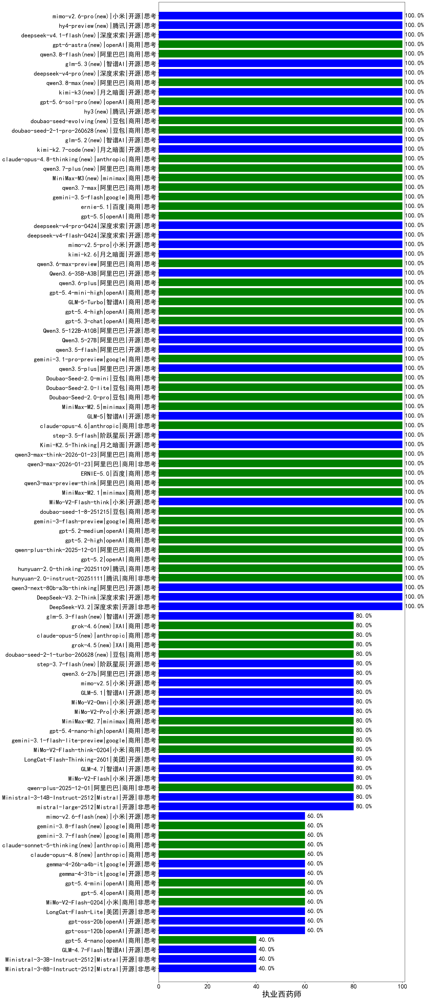

|类别|机构|大模型|【执业西药师】准确率|平均耗时|平均消耗token|花费/千次（元）|排名（准确率）|
|---|---|-----|-------------------|-------|-----------|-----------|-----------|
|商用|openAI|gpt-5.4-mini-high|100.0%|17s|1136|34.1|1|
|商用|openAI|gpt-5.4-high|100.0%|12s|580|55.5|2|
|开源|阿里巴巴|Qwen3.6-35B-A3B|100.0%|20s|2083|22.0|3|
|开源|深度求索|deepseek-v4-pro(new)|100.0%|51s|2203|57.1|4|
|商用|阿里巴巴|qwen3.6-plus|100.0%|22s|1370|15.8|5|
|开源|智谱AI|glm-5.3(new)|100.0%|148s|3616|100.1|6|
|商用|阿里巴巴|qwen3.8-flash(new)|100.0%|49s|1222|3.1|7|
|商用|智谱AI|GLM-5-Turbo|100.0%|33s|1259|26.8|8|
|商用|openAI|gpt-5.3-chat|100.0%|5s|349|28.9|9|
|开源|月之暗面|kimi-k2.6|100.0%|182s|2420|64.2|10|
|开源|月之暗面|kimi-k3(new)|100.0%|26s|542|43.7|11|
|开源|阿里巴巴|Qwen3.5-27B|100.0%|383s|3464|16.4|12|
|开源|阿里巴巴|qwen3.5-flash|100.0%|413s|4222|8.3|13|
|商用|google|gemini-3.1-pro-preview|100.0%|25s|1298|106.7|14|
|开源|阿里巴巴|qwen3.5-plus|100.0%|31s|2260|10.6|15|
|商用|豆包|Doubao-Seed-2.0-mini|100.0%|274s|2887|5.6|16|
|商用|阿里巴巴|qwen3.6-max-preview|100.0%|59s|1698|89.0|17|
|开源|小米|mimo-v2.5-pro|100.0%|51s|1511|27.5|18|
|商用|豆包|Doubao-Seed-2.0-pro|100.0%|374s|1674|25.5|19|
|商用|阿里巴巴|qwen3.7-plus(new)|100.0%|23s|1109|8.5|20|
|开源|腾讯|hy3(new)|100.0%|48s|198|0.6|21|
|商用|豆包|doubao-seed-evolving(new)|100.0%|446s|9069|269.8|22|
|商用|豆包|doubao-seed-2-1-pro-260628(new)|100.0%|291s|10959|326.5|23|
|开源|智谱AI|glm-5.2(new)|100.0%|60s|2884|79.5|24|
|开源|月之暗面|kimi-k2.7-code(new)|100.0%|21s|807|20.7|25|
|商用|anthropic|claude-opus-4.8-thinking(new)|100.0%|23s|576|90.8|26|
|商用|minimax|MiniMax-M3(new)|100.0%|23s|715|9.3|27|
|开源|深度求索|deepseek-v4-flash-0424|100.0%|57s|1432|2.8|28|
|商用|阿里巴巴|qwen3.8-max(new)|100.0%|13s|564|18.0|29|
|商用|阿里巴巴|qwen3.7-max|100.0%|21s|1071|37.1|30|
|商用|google|gemini-3.5-flash|100.0%|8s|1498|91.5|31|
|商用|百度|ernie-5.1|100.0%|58s|1004|17.4|32|
|商用|openAI|gpt-5.5|100.0%|9s|528|100.0|33|
|开源|深度求索|deepseek-v4-pro-0424|100.0%|87s|2028|48.1|34|
|商用|豆包|Doubao-Seed-2.0-lite|100.0%|226s|941|3.1|35|
|开源|阿里巴巴|Qwen3.5-122B-A10B|100.0%|172s|3502|22.1|36|
|开源|小米|MiMo-V2-Flash-think|100.0%|32s|3399|0.0|37|
|商用|阿里巴巴|qwen3-max-preview-think|100.0%|201s|2006|47.0|38|
|开源|深度求索|DeepSeek-V3.2|100.0%|16s|398|1.1|39|
|开源|深度求索|DeepSeek-V3.2-Think|100.0%|138s|1732|5.1|40|
|开源|阿里巴巴|qwen3-next-80b-a3b-thinking|100.0%|185s|4131|16.3|41|
|开源|小米|mimo-v2.6-pro(new)|100.0%|25s|860|5.0|42|
|开源|腾讯|hy4-preview(new)|100.0%|73s|5051|90.1|43|
|商用|腾讯|hunyuan-2.0-instruct-20251111|100.0%|9s|549|1.0|44|
|商用|腾讯|hunyuan-2.0-thinking-20251109|100.0%|9s|875|3.4|45|
|商用|openAI|gpt-5.2|100.0%|13s|160|10.5|46|
|商用|阿里巴巴|qwen-plus-think-2025-12-01|100.0%|96s|3418|26.9|47|
|商用|openAI|gpt-5.2-high|100.0%|12s|336|28.0|48|
|商用|openAI|gpt-5.2-medium|100.0%|8s|302|24.6|49|
|商用|google|gemini-3-flash-preview|100.0%|44s|873|17.6|50|
|商用|豆包|doubao-seed-1-8-251215|100.0%|35s|639|4.4|51|
|商用|minimax|MiniMax-M2.1|100.0%|89s|1829|14.8|52|
|商用|openAI|gpt-5.6-sol-pro(new)|100.0%|16s|3476|284.4|53|
|开源|月之暗面|Kimi-K2.5-Thinking|100.0%|766s|3807|79.0|54|
|商用|openAI|gpt-6-astra(new)|100.0%|22s|201|52.8|55|
|开源|阶跃星辰|step-3.5-flash|100.0%|16s|2474|5.1|56|
|商用|minimax|MiniMax-M2.5|100.0%|25s|1289|10.3|57|
|商用|阿里巴巴|qwen3-max-2026-01-23|100.0%|66s|500|4.6|58|
|开源|智谱AI|GLM-5|100.0%|55s|1959|34.5|59|
|商用|百度|ERNIE-5.0|100.0%|148s|2969|70.4|60|
|商用|阿里巴巴|qwen3-max-think-2026-01-23|100.0%|119s|3849|38.0|61|
|商用|anthropic|claude-opus-4.6|100.0%|20s|476|73.1|62|
|开源|深度求索|deepseek-v4.1-flash(new)|100.0%|6s|1053|8.0|63|
|商用|minimax|MiniMax-M2.7|80.0%|42s|1680|13.6|64|
|开源|阶跃星辰|step-3.7-flash(new)|80.0%|110s|2663|21.2|65|
|开源|Mistral|Ministral-3-14B-Instruct-2512|80.0%|11s|564|0.8|66|
|开源|Mistral|mistral-large-2512|80.0%|12s|388|3.7|67|
|商用|豆包|doubao-seed-2-1-turbo-260628(new)|80.0%|267s|13059|194.8|68|
|商用|anthropic|claude-opus-5(new)|80.0%|11s|609|96.5|69|
|商用|XAI|grok-4.5(new)|80.0%|123s|1763|66.9|70|
|商用|google|gemini-3.1-flash-lite-preview|80.0%|5s|348|3.2|71|
|开源|智谱AI|glm-5.3-flash(new)|80.0%|59s|2649|7.3|72|
|商用|阿里巴巴|qwen-plus-2025-12-01|80.0%|24s|866|1.7|73|
|开源|小米|MiMo-V2-Pro|80.0%|30s|961|16.0|74|
|开源|阿里巴巴|qwen3.6-27b|80.0%|28s|1731|30.3|75|
|开源|美团|LongCat-Flash-Thinking-2601|80.0%|207s|2126|0.0|76|
|开源|小米|mimo-v2.5|80.0%|28s|1684|20.2|77|
|开源|小米|MiMo-V2-Flash|80.0%|19s|433|0.0|78|
|开源|智谱AI|GLM-4.7|80.0%|82s|2794|38.5|79|
|开源|智谱AI|GLM-5.1|80.0%|55s|1742|40.8|80|
|商用|XAI|grok-4.6(new)|80.0%|49s|2381|92.9|81|
|商用|openAI|gpt-5.4-nano-high|80.0%|101s|703|5.7|82|
|开源|小米|MiMo-V2-Omni|80.0%|26s|1775|21.5|83|
|商用|小米|MiMo-V2-Flash-think-0204|80.0%|304s|2719|5.6|84|
|商用|google|gemini-3.8-flash(new)|60.0%|25s|867|43.2|85|
|商用|google|gemini-3.7-flash(new)|60.0%|7s|766|18.9|86|
|开源|openAI|gpt-oss-120b|60.0%|5s|647|1.8|87|
|商用|anthropic|claude-sonnet-5-thinking(new)|60.0%|14s|793|51.5|88|
|商用|anthropic|claude-opus-4.8(new)|60.0%|6s|380|56.5|89|
|开源|google|gemma-4-26b-a4b-it|60.0%|94s|606|1.6|90|
|开源|google|gemma-4-31b-it|60.0%|104s|479|1.2|91|
|开源|openAI|gpt-oss-20b|60.0%|4s|781|0.8|92|
|商用|openAI|gpt-5.4-mini|60.0%|18s|170|3.7|93|
|商用|openAI|gpt-5.4|60.0%|4s|222|17.9|94|
|商用|小米|MiMo-V2-Flash-0204|60.0%|400s|449|0.8|95|
|开源|美团|LongCat-Flash-Lite|60.0%|55s|466|0.0|96|
|开源|小米|mimo-v2.6-flash(new)|60.0%|108s|4612|9.2|97|
|商用|openAI|gpt-5.4-nano|40.0%|3s|169|1.0|98|
|开源|智谱AI|GLM-4.7-Flash|40.0%|974s|4547|0.0|99|
|开源|Mistral|Ministral-3-3B-Instruct-2512|40.0%|11s|784|0.6|100|
|开源|Mistral|Ministral-3-8B-Instruct-2512|40.0%|12s|522|0.6|101|

