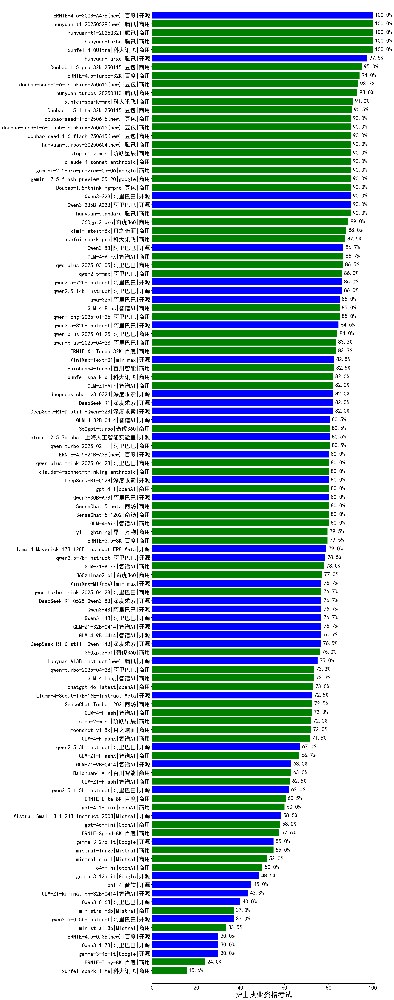

|类别|机构|大模型|【护士执业资格考试】准确率|平均耗时|平均消耗token|花费/千次（元）|排名（准确率）|
|---|---|-----|-------------------|-------|-----------|-----------|-----------|
|开源|openAI|gpt-oss-120b|100.0%|68s|575|1.5|1|
|开源|阿里巴巴|qwen3-next-80b-a3b-instruct|100.0%|6s|479|1.7|2|
|商用|腾讯|hunyuan-t1-20250711|100.0%|17s|1007|3.7|3|
|商用|阿里巴巴|qwen-turbo-2025-07-15|100.0%|7s|319|0.2|4|
|商用|科大讯飞|xunfei-spark-x1-0725|100.0%|/|881|10.6|5|
|开源|阿里巴巴|Qwen3-14B-nothink|100.0%|9s|479|0.8|6|
|开源|智谱AI|GLM-4.5-Air|100.0%|29s|1489|8.6|7|
|开源|阿里巴巴|Qwen3-30B-A3B-Thinking-2507|100.0%|61s|2279|6.2|8|
|开源|阶跃星辰|step-3|100.0%|73s|1446|5.6|9|
|开源|智谱AI|GLM-4.5-nothink|100.0%|17s|485|6.0|10|
|商用|阿里巴巴|qwen-flash-think-2025-07-28|100.0%|19s|1976|2.9|11|
|商用|阿里巴巴|qwen-turbo-think-2025-07-15|100.0%|/|2489|7.3|12|
|开源|豆包|Seed-OSS-36B-Instruct|100.0%|40s|1076|4.1|13|
|商用|腾讯|hunyuan-turbos-20250926(new)|100.0%|11s|505|0.9|14|
|开源|百度|ERNIE-4.5-300B-A47B|100.0%|9s|286|1.8|15|
|开源|智谱AI|GLM-4.6(new)|100.0%|53s|2014|27.4|16|
|商用|豆包|doubao-seed-1-6-lite-251015(new)|100.0%|85s|560|1.1|17|
|开源|minimax|MiniMax-M2(new)|100.0%|19s|1357|10.8|18|
|开源|月之暗面|Kimi-K2-Thinking(new)|100.0%|168s|1198|18.4|19|
|商用|anthropic|claude-haiku-4.5(new)|100.0%|12s|651|20.0|20|
|商用|百度|ERNIE-X1.1-Preview(new)|100.0%|110s|400|1.4|21|
|商用|百度|ERNIE-5.0-Thinking-Preview(new)|100.0%|241s|1384|32.1|22|
|开源|Mistral|mistral-large-2512(new)|100.0%|12s|411|3.6|23|
|商用|腾讯|hunyuan-2.0-instruct-20251111(new)|100.0%|5s|301|0.5|24|
|商用|腾讯|hunyuan-2.0-thinking-20251109(new)|100.0%|11s|560|2.1|25|
|开源|小米|MiMo-V2-Flash(new)|100.0%|125s|398|0.0|26|
|开源|月之暗面|kimi-k2-0711-preview|100.0%|22s|390|5.4|27|
|开源|小米|MiMo-V2-Flash-think(new)|100.0%|28s|1987|0.0|28|
|商用|豆包|doubao-seed-1-6-flash-thinking-250615|100.0%|6s|545|0.7|29|
|商用|百度|ERNIE-4.5-Turbo-32K|100.0%|21s|513|1.5|30|
|商用|豆包|doubao-seed-1-6-flash-250615|95.0%|3s|293|0.3|31|
|开源|阿里巴巴|Qwen3-32B|95.0%|26s|787|2.9|32|
|商用|豆包|doubao-seed-1-6-250615|90.0%|122s|405|2.5|33|
|商用|anthropic|claude-4-sonnet|90.0%|44s|586|51.8|34|
|开源|阿里巴巴|Qwen3-14B|85.0%|34s|1996|3.9|35|
|开源|深度求索|DeepSeek-R1-0528|85.0%|226s|1642|25.4|36|
|商用|百度|ERNIE-X1-Turbo-32K|85.0%|88s|1594|6.2|37|
|商用|阿里巴巴|qwen-long-2025-01-25|85.0%|8s|316|0.5|38|
|商用|google|gemini-2.5-pro|80.0%|35s|2523|177.6|39|
|商用|google|gemini-3-pro-preview(new)|80.0%|13s|1212|97.8|40|
|商用|Mistral|mistral-medium-2508|80.0%|687s|426|5.0|41|
|开源|Mistral|Magistral-Small-2507|80.0%|173s|5569|59.8|42|
|商用|阿里巴巴|qwen-plus-2025-07-28|80.0%|12s|441|0.8|43|
|开源|minimax|MiniMax-M1|80.0%|87s|1541|9.1|44|
|开源|阿里巴巴|Qwen3-4B|80.0%|20s|1114|3.1|45|
|商用|阿里巴巴|qwen3-max-preview|80.0%|10s|404|8.3|46|
|开源|阿里巴巴|Qwen3-8B|80.0%|600s|15031|0.0|47|
|开源|百度|ERNIE-4.5-21B-A3B|80.0%|58s|278|0.0|48|
|商用|anthropic|claude-4-sonnet-thinking|80.0%|49s|1305|130.0|49|
|开源|深度求索|DeepSeek-V3.2-Exp-Think(new)|80.0%|56s|830|2.4|50|
|商用|豆包|doubao-seed-1-6-251015(new)|80.0%|14s|634|4.4|51|
|商用|anthropic|claude-haiku-4.5-thinking(new)|80.0%|27s|3293|114.9|52|
|商用|XAI|grok-4-1-fast-reasoning(new)|80.0%|12s|1193|3.7|53|
|开源|月之暗面|kimi-k2-0905(new)|80.0%|113s|286|3.5|54|
|开源|深度求索|DeepSeek-V3.1-Think|80.0%|55s|1062|12.2|55|
|商用|anthropic|claude-sonnet-4.5(new)|80.0%|10s|686|64.9|56|
|商用|anthropic|claude-sonnet-4.5-thinking(new)|80.0%|22s|1469|147.6|57|
|商用|anthropic|claude-opus-4.5(new)|80.0%|15s|685|106.2|58|
|商用|阿里巴巴|qwen3-max-2025-09-23(new)|80.0%|416s|399|8.1|59|
|商用|openAI|gpt-5-mini-high(new)|80.0%|815s|2158|30.2|60|
|开源|深度求索|DeepSeek-V3.2(new)|80.0%|156s|339|0.9|61|
|开源|深度求索|DeepSeek-V3.2-Think(new)|80.0%|72s|780|2.3|62|
|开源|阿里巴巴|qwen3-next-80b-a3b-thinking(new)|80.0%|167s|3009|11.8|63|
|商用|豆包|Doubao-1.5-lite-32k-250115|80.0%|5s|205|0.1|64|
|开源|Mistral|Ministral-3-3B-Instruct-2512(new)|80.0%|14s|567|0.4|65|
|商用|google|gemini-3-flash-preview(new)|80.0%|119s|894|17.7|66|
|商用|豆包|doubao-seed-1-8-251215(new)|80.0%|28s|568|3.7|67|
|商用|百川智能|Baichuan4-Turbo|80.0%|/|/|/|68|
|商用|google|gemini-2.5-flash-lite|80.0%|5s|465|1.2|69|
|开源|深度求索|DeepSeek-V3.2-Exp(new)|80.0%|16s|321|0.9|70|
|开源|深度求索|DeepSeek-V3.1|80.0%|13s|260|2.6|71|
|开源|阿里巴巴|Qwen3-30B-A3B-Instruct-2507|80.0%|4s|425|1.1|72|
|商用|XAI|grok-3-mini|80.0%|295s|1007|3.5|73|
|开源|阿里巴巴|qwen3-235b-a22b-instruct-2507|80.0%|9s|426|2.9|74|
|商用|豆包|doubao-seed-1-6-thinking-250715|80.0%|14s|665|4.8|75|
|开源|深度求索|DeepSeek-R1-0528-Qwen3-8B|80.0%|284s|1632|0.0|76|
|商用|XAI|grok-4-0709|80.0%|174s|1375|142.1|77|
|商用|智谱AI|GLM-4.5-Flash|80.0%|22s|1294|0.0|78|
|商用|google|gemini-2.5-flash|80.0%|11s|1911|33.3|79|
|开源|智谱AI|GLM-4.5|80.0%|26s|1448|19.5|80|
|商用|阿里巴巴|qwen-plus-think-2025-07-28|80.0%|/|2338|18.1|81|
|商用|阿里巴巴|qwen-flash-2025-07-28|80.0%|6s|454|0.6|82|
|开源|openAI|gpt-oss-20b|80.0%|9s|950|1.0|83|
|开源|智谱AI|GLM-4-9B-0414|75.0%|8s|424|0.0|84|
|开源|meta|Llama-4-Maverick-17B-128E-Instruct-FP8|75.0%|6s|482|1.9|85|
|开源|meta|Llama-4-Scout-17B-16E-Instruct|75.0%|8s|529|1.0|86|
|开源|腾讯|Hunyuan-A13B-Instruct|75.0%|51s|829|3.1|87|
|商用|百度|ERNIE-Lite-8K|75.0%|/|/|/|88|
|开源|minimax|MiniMax-Text-01|70.0%|9s|907|7.3|89|
|商用|360|360zhinao2-o1|70.0%|/|/|/|90|
|开源|阿里巴巴|Qwen3-8B-nothink|60.0%|16s|406|0.0|91|
|商用|openAI|gpt-5-mini-2025-08-07|60.0%|44s|1013|13.6|92|
|开源|阿里巴巴|qwen3-235b-a22b-thinking-2507|60.0%|33s|2293|44.4|93|
|开源|Mistral|Ministral-3-14B-Instruct-2512(new)|60.0%|15s|502|0.7|94|
|商用|openAI|gpt-5-nano-2025-08-07|60.0%|129s|1616|4.5|95|
|商用|阿里巴巴|qwen-plus-think-2025-12-01(new)|60.0%|53s|2349|18.2|96|
|商用|openAI|gpt-5.2(new)|60.0%|3s|184|10.7|97|
|商用|阿里巴巴|qwen-plus-2025-12-01(new)|60.0%|21s|741|1.4|98|
|商用|openAI|gpt-5-nano-high(new)|60.0%|333s|5250|15.0|99|
|商用|openAI|gpt-5.2-high(new)|60.0%|7s|354|27.6|100|
|商用|openAI|gpt-5.2-medium(new)|60.0%|8s|285|20.7|101|
|开源|Mistral|Mistral-Small-3.2-24B-Instruct-2506|60.0%|26s|662|1.3|102|
|开源|腾讯|Hunyuan-A13B-Instruct-nothink|60.0%|13s|337|1.1|103|
|开源|阿里巴巴|Qwen3-0.6B-nothink|60.0%|7s|272|0.6|104|
|商用|openAI|gpt-5.1-high(new)|60.0%|14s|883|57.3|105|
|商用|openAI|gpt-5.1-medium(new)|60.0%|150s|473|28.1|106|
|商用|openAI|gpt-5-2025-08-07|60.0%|18s|314|17.6|107|
|开源|google|gemma-3-27b-it|60.0%|/|/|/|108|
|开源|阿里巴巴|Qwen3-32B-nothink|60.0%|27s|455|1.6|109|
|开源|阿里巴巴|Qwen3-4B-nothink|60.0%|18s|346|0.8|110|
|商用|XAI|grok-4-1-fast-non-reasoning(new)|60.0%|82s|620|1.7|111|
|开源|阿里巴巴|Qwen3-0.6B|50.0%|6s|1335|3.8|112|
|商用|openAI|o4-mini|50.0%|41s|1165|34.9|113|
|开源|google|gemma-3-12b-it|50.0%|/|/|/|114|
|商用|百川智能|Baichuan4-Air|50.0%|/|/|/|115|
|商用|openAI|gpt-5.1(new)|40.0%|536s|210|9.5|116|
|开源|阿里巴巴|Qwen3-1.7B-nothink|40.0%|6s|461|1.2|117|
|开源|智谱AI|GLM-4.5-Air-nothink|40.0%|14s|874|4.9|118|
|商用|智谱AI|GLM-4.5-Flash-nothink|40.0%|19s|826|0.0|119|
|开源|google|gemma-3-4b-it|30.0%|/|/|/|120|
|开源|阿里巴巴|Qwen3-1.7B|25.0%|18s|1995|5.8|121|
|开源|百度|ERNIE-4.5-0.3B|25.0%|50s|338|0.0|122|
|开源|Mistral|Ministral-3-8B-Instruct-2512(new)|20.0%|12s|526|0.6|123|

