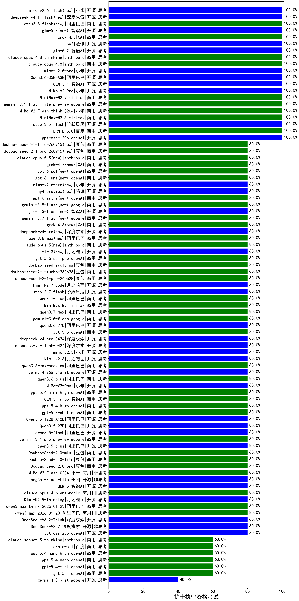

|类别|机构|大模型|【护士执业资格考试】准确率|平均耗时|平均消耗token|花费/千次（元）|排名（准确率）|
|---|---|-----|-------------------|-------|-----------|-----------|-----------|
|开源|openAI|gpt-oss-120b|100.0%|68s|575|1.5|1|
|商用|google|gemini-3.1-flash-lite-preview|100.0%|41s|358|3.1|2|
|开源|小米|mimo-v2.6-flash(new)|100.0%|258s|600|1.1|3|
|开源|深度求索|deepseek-v4.1-flash(new)|100.0%|6s|984|7.3|4|
|商用|阿里巴巴|qwen3.8-flash(new)|100.0%|19s|513|1.1|5|
|开源|智谱AI|glm-5.3(new)|100.0%|42s|1253|33.5|6|
|商用|XAI|grok-4.5|100.0%|28s|964|32.9|7|
|开源|腾讯|hy3|100.0%|45s|191|0.5|8|
|开源|智谱AI|glm-5.2|100.0%|39s|1397|37.6|9|
|商用|anthropic|claude-opus-4.8-thinking|100.0%|12s|599|89.3|10|
|商用|anthropic|claude-opus-4.8|100.0%|12s|571|84.6|11|
|开源|阿里巴巴|Qwen3.6-35B-A3B|100.0%|110s|1496|15.5|12|
|开源|智谱AI|GLM-5.1|100.0%|132s|1071|24.4|13|
|开源|小米|MiMo-V2-Pro|100.0%|493s|1059|17.8|14|
|商用|minimax|MiniMax-M2.7|100.0%|25s|976|7.6|15|
|开源|小米|mimo-v2.5-pro|100.0%|14s|986|16.2|16|
|商用|小米|MiMo-V2-Flash-think-0204|100.0%|456s|1682|3.4|17|
|商用|百度|ERNIE-5.0|100.0%|139s|1096|25.2|18|
|开源|阶跃星辰|step-3.5-flash|100.0%|18s|1723|3.5|19|
|商用|minimax|MiniMax-M2.5|100.0%|15s|848|6.5|20|
|商用|豆包|Doubao-Seed-2.0-lite|80.0%|166s|768|2.4|21|
|商用|阿里巴巴|qwen3-max-think-2026-01-23|80.0%|82s|2409|23.5|22|
|商用|anthropic|claude-opus-5(new)|80.0%|17s|663|100.6|23|
|开源|月之暗面|kimi-k3(new)|80.0%|34s|564|44.9|24|
|商用|openAI|gpt-5.6-sol-pro|80.0%|9s|2974|217.0|25|
|开源|月之暗面|Kimi-K2.5-Thinking|80.0%|346s|1655|33.6|26|
|开源|深度求索|deepseek-v4-pro(new)|80.0%|20s|624|14.2|27|
|商用|豆包|doubao-seed-evolving|80.0%|138s|4044|118.7|28|
|商用|豆包|doubao-seed-2-1-turbo-260628|80.0%|106s|4041|59.3|29|
|商用|豆包|doubao-seed-2-1-pro-260628|80.0%|84s|3338|97.5|30|
|开源|月之暗面|kimi-k2.7-code|80.0%|13s|407|9.6|31|
|商用|anthropic|claude-opus-4.6|80.0%|11s|608|90.9|32|
|开源|阶跃星辰|step-3.7-flash|80.0%|16s|1457|11.3|33|
|商用|阿里巴巴|qwen3.8-max(new)|80.0%|13s|581|18.2|34|
|商用|google|gemini-3.7-flash(new)|80.0%|38s|826|20.1|35|
|商用|XAI|grok-4.6(new)|80.0%|22s|1096|38.5|36|
|商用|minimax|MiniMax-M3|80.0%|26s|628|7.6|37|
|商用|阿里巴巴|qwen3-max-2026-01-23|80.0%|38s|385|3.3|38|
|开源|智谱AI|glm-5.3-flash(new)|80.0%|25s|1047|2.8|39|
|商用|google|gemini-3.8-flash(new)|80.0%|23s|667|31.8|40|
|商用|openAI|gpt-6-astra(new)|80.0%|15s|251|63.2|41|
|开源|深度求索|DeepSeek-V3.2-Think|80.0%|72s|780|2.3|42|
|开源|腾讯|hy4-preview(new)|80.0%|20s|1206|20.7|43|
|开源|小米|mimo-v2.6-pro(new)|80.0%|35s|1506|8.8|44|
|开源|深度求索|DeepSeek-V3.2|80.0%|156s|339|0.9|45|
|商用|openAI|gpt-6-luna(new)|80.0%|93s|357|1.0|46|
|商用|openAI|gpt-6-sol(new)|80.0%|232s|248|12.5|47|
|商用|XAI|grok-4.7(new)|80.0%|18s|2473|67.3|48|
|商用|anthropic|claude-opus-5.5(new)|80.0%|14s|633|76.0|49|
|商用|豆包|doubao-seed-2-1-pro-260915(new)|80.0%|19s|529|13.2|50|
|商用|阿里巴巴|qwen3.7-plus|80.0%|16s|766|5.7|51|
|开源|智谱AI|GLM-5|80.0%|53s|1638|28.5|52|
|商用|豆包|Doubao-Seed-2.0-mini|80.0%|421s|1601|3.0|53|
|商用|阿里巴巴|qwen3.6-plus|80.0%|39s|1453|16.7|54|
|开源|阿里巴巴|qwen3.5-plus|80.0%|30s|2572|12.0|55|
|商用|google|gemini-3.1-pro-preview|80.0%|29s|1127|90.6|56|
|开源|阿里巴巴|qwen3.5-flash|80.0%|325s|2670|5.2|57|
|开源|阿里巴巴|Qwen3.5-27B|80.0%|160s|2616|12.2|58|
|开源|阿里巴巴|Qwen3.5-122B-A10B|80.0%|325s|2239|13.9|59|
|商用|豆包|Doubao-Seed-2.0-pro|80.0%|192s|902|13.0|60|
|商用|openAI|gpt-5.3-chat|80.0%|8s|391|30.8|61|
|商用|openAI|gpt-5.4-high|80.0%|8s|432|37.7|62|
|商用|智谱AI|GLM-5-Turbo|80.0%|21s|833|17.1|63|
|商用|openAI|gpt-5.4-mini-high|80.0%|62s|953|27.7|64|
|商用|小米|MiMo-V2-Flash-0204|80.0%|100s|490|0.9|65|
|商用|阿里巴巴|qwen3.7-max|80.0%|18s|737|24.7|66|
|开源|小米|MiMo-V2-Omni|80.0%|12s|957|9.8|67|
|商用|豆包|doubao-seed-2-1-lite-260915(new)|80.0%|10s|567|1.4|68|
|开源|深度求索|deepseek-v4-pro-0424|80.0%|15s|417|9.2|69|
|开源|美团|LongCat-Flash-Lite|80.0%|154s|328|0.0|70|
|商用|阿里巴巴|qwen3.6-max-preview|80.0%|40s|1373|70.8|71|
|商用|google|gemini-3.5-flash|80.0%|8s|1278|76.5|72|
|开源|月之暗面|kimi-k2.6|80.0%|35s|900|22.9|73|
|开源|阿里巴巴|qwen3.6-27b|80.0%|27s|1656|28.7|74|
|开源|小米|mimo-v2.5|80.0%|9s|1093|11.7|75|
|开源|google|gemma-4-26b-a4b-it|80.0%|65s|548|1.4|76|
|商用|openAI|gpt-5.5|80.0%|7s|368|62.0|77|
|开源|openAI|gpt-oss-20b|80.0%|9s|950|1.0|78|
|开源|深度求索|deepseek-v4-flash-0424|80.0%|16s|587|1.1|79|
|商用|百度|ernie-5.1|60.0%|30s|847|14.3|80|
|商用|anthropic|claude-sonnet-5-thinking|60.0%|14s|765|47.4|81|
|商用|openAI|gpt-5.4|60.0%|4s|302|24.0|82|
|商用|openAI|gpt-5.4-mini|60.0%|14s|276|6.4|83|
|商用|openAI|gpt-5.4-nano|60.0%|8s|187|1.0|84|
|商用|openAI|gpt-5.4-nano-high|60.0%|5s|364|2.5|85|
|开源|google|gemma-4-31b-it|40.0%|98s|545|1.4|86|

