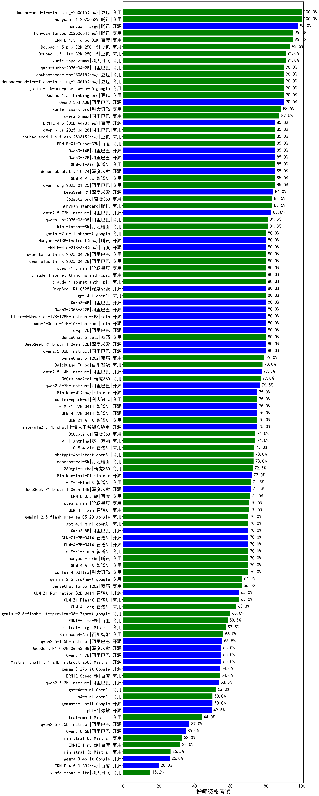

|类别|机构|大模型|【护师资格考试】准确率|平均耗时|平均消耗token|花费/千次（元）|排名（准确率）|
|---|---|-----|-------------------|-------|-----------|-----------|-----------|
|商用|科大讯飞|xunfei-spark-x1-0725(new)|100.0%|/|908|10.9|1|
|开源|腾讯|hunyuan-large|98.0%|8s|1046|6.6|2|
|商用|百度|ERNIE-4.5-Turbo-32K|95.0%|20s|498|1.5|3|
|商用|腾讯|hunyuan-turbos-20250604|95.0%|8s|377|0.6|4|
|商用|豆包|Doubao-1.5-pro-32k-250115|93.5%|9s|349|0.6|5|
|商用|豆包|Doubao-1.5-lite-32k-250115|91.0%|5s|193|0.1|6|
|商用|科大讯飞|xunfei-spark-max|91.0%|4s|137|4.1|7|
|商用|豆包|doubao-seed-1-6-flash-thinking-250615|90.0%|8s|503|0.6|8|
|开源|月之暗面|kimi-k2-0711-preview(new)|90.0%|22s|392|5.6|9|
|开源|阿里巴巴|Qwen3-30B-A3B|90.0%|18s|1235|3.3|10|
|商用|豆包|doubao-seed-1-6-250615|90.0%|128s|413|2.7|11|
|商用|科大讯飞|xunfei-spark-pro|88.5%|/|/|/|12|
|商用|阿里巴巴|qwen2.5-max|87.5%|16s|441|3.7|13|
|开源|深度求索|deepseek-chat-v3-0324|85.0%|160s|267|1.8|14|
|商用|智谱AI|GLM-4-Plus|85.0%|16s|273|1.4|15|
|商用|百度|ERNIE-X1-Turbo-32K|85.0%|78s|1717|6.7|16|
|商用|阿里巴巴|qwen-long-2025-01-25|85.0%|224s|317|0.5|17|
|商用|智谱AI|GLM-Z1-Air|85.0%|56s|1371|0.7|18|
|商用|豆包|doubao-seed-1-6-flash-250615|85.0%|3s|285|0.3|19|
|开源|阿里巴巴|Qwen3-32B|85.0%|24s|731|2.7|20|
|开源|阿里巴巴|Qwen3-14B|85.0%|31s|1153|2.2|21|
|开源|百度|ERNIE-4.5-300B-A47B|85.0%|20s|262|1.7|22|
|商用|奇虎360|360gpt2-pro|83.5%|8s|246|1.0|23|
|商用|腾讯|hunyuan-standard|83.5%|/|/|/|24|
|开源|阿里巴巴|qwen2.5-72b-instruct|83.0%|14s|270|2.7|25|
|商用|月之暗面|kimi-latest-8k|81.0%|21s|480|5.8|26|
|商用|阿里巴巴|qwq-plus-2025-03-05|81.0%|65s|2297|9.0|27|
|开源|深度求索|DeepSeek-R1-Distill-Qwen-32B|80.0%|21s|697|0.9|28|
|开源|阿里巴巴|qwen2.5-32b-instruct|80.0%|8s|237|1.1|29|
|开源|meta|Llama-4-Maverick-17B-128E-Instruct-FP8|80.0%|7s|483|1.9|30|
|开源|meta|Llama-4-Scout-17B-16E-Instruct|80.0%|8s|394|0.8|31|
|商用|anthropic|claude-4-sonnet|80.0%|37s|511|47.0|32|
|商用|阶跃星辰|step-r1-v-mini|80.0%|150s|2397|18.8|33|
|商用|openAI|gpt-4.1|80.0%|11s|260|11.8|34|
|开源|深度求索|DeepSeek-R1-0528|80.0%|218s|1903|29.8|35|
|商用|豆包|doubao-seed-1-6-thinking-250715(new)|80.0%|14s|922|6.9|36|
|开源|阿里巴巴|Qwen3-30B-A3B-Instruct-2507(new)|80.0%|3s|393|1.0|37|
|商用|阿里巴巴|qwen-turbo-2025-07-15(new)|80.0%|6s|297|0.2|38|
|商用|腾讯|hunyuan-t1-20250711(new)|80.0%|34s|1949|7.5|39|
|开源|阿里巴巴|Qwen3-235B-A22B|80.0%|286s|1607|15.6|40|
|开源|阿里巴巴|Qwen3-4B|80.0%|22s|986|2.8|41|
|商用|anthropic|claude-4-sonnet-thinking|80.0%|51s|1021|102.4|42|
|商用|google|gemini-2.5-flash|80.0%|12s|1577|27.6|43|
|开源|百度|ERNIE-4.5-21B-A3B|80.0%|3s|276|0.0|44|
|开源|腾讯|Hunyuan-A13B-Instruct|80.0%|39s|776|2.9|45|
|商用|阿里巴巴|qwen-turbo-think-2025-04-28|80.0%|179s|2164|6.3|46|
|商用|阿里巴巴|qwen-plus-think-2025-04-28|80.0%|252s|1696|13.1|47|
|开源|阿里巴巴|qwq-32b|80.0%|42s|2320|13.6|48|
|商用|商汤|SenseChat-5-1202|79.0%|/|/|/|49|
|商用|百川智能|Baichuan4-Turbo|78.0%|/|/|/|50|
|开源|阿里巴巴|qwen2.5-14b-instruct|77.5%|16s|185|0.4|51|
|商用|奇虎360|360zhinao2-o1|77.0%|/|/|/|52|
|开源|阿里巴巴|qwen2.5-7b-instruct|76.5%|4s|154|0.1|53|
|商用|google|gemini-2.5-pro|75.0%|39s|2438|172.9|54|
|开源|minimax|MiniMax-M1|75.0%|248s|2248|16.8|55|
|开源|智谱AI|GLM-Z1-32B-0414|75.0%|102s|2024|7.9|56|
|开源|上海人工智能实验室|internlm2_5-7b-chat|75.0%|/|/|/|57|
|商用|智谱AI|GLM-Z1-AirX|75.0%|29s|1364|9.8|58|
|开源|智谱AI|GLM-4-32B-0414|75.0%|60s|374|0.7|59|
|商用|零一万物|yi-lightning|74.0%|/|/|/|60|
|商用|奇虎360|360gpt2-o1|74.0%|15s|318|13.4|61|
|商用|openAI|chatgpt-4o-latest|73.0%|/|/|/|62|
|商用|奇虎360|360gpt-turbo|72.5%|/|/|/|63|
|开源|minimax|MiniMax-Text-01|72.0%|12s|896|7.2|64|
|商用|智谱AI|GLM-4-FlashX|71.5%|4s|244|0.0|65|
|开源|深度求索|DeepSeek-R1-Distill-Qwen-14B|71.5%|/|/|/|66|
|商用|百度|ERNIE-3.5-8K|71.0%|11s|251|0.4|67|
|商用|阶跃星辰|step-2-mini|70.5%|5s|278|0.5|68|
|商用|XAI|grok-3-mini|70.0%|157s|1040|3.7|69|
|商用|智谱AI|GLM-4-AirX|70.0%|5s|208|2.2|70|
|商用|科大讯飞|xunfei-4.0Ultra|70.0%|12s|122|8.6|71|
|商用|智谱AI|GLM-Z1-Flash|70.0%|16s|1876|0.0|72|
|商用|XAI|grok-4-0709|70.0%|65s|1497|156.9|73|
|开源|阿里巴巴|Qwen3-8B|70.0%|118s|3544|0.0|74|
|商用|openAI|gpt-4.1-mini|70.0%|7s|307|2.9|75|
|开源|智谱AI|GLM-Z1-9B-0414|70.0%|163s|2652|0.0|76|
|开源|智谱AI|GLM-4-9B-0414|70.0%|9s|425|0.0|77|
|开源|智谱AI|GLM-Z1-Rumination-32B-0414|65.0%|20s|1106|2.8|78|
|商用|智谱AI|GLM-Z1-FlashX|65.0%|28s|1519|0.2|79|
|商用|智谱AI|GLM-4-Long|63.3%|8s|322|0.3|80|
|开源|智谱AI|GLM-4.5-Air(new)|60.0%|34s|1304|7.5|81|
|开源|阿里巴巴|Qwen3-30B-A3B-Thinking-2507(new)|60.0%|64s|2993|8.2|82|
|商用|智谱AI|GLM-4.5-Flash-nothink|60.0%|18s|833|0.0|83|
|开源|智谱AI|GLM-4.5(new)|60.0%|73s|1625|22.1|84|
|商用|google|gemini-2.5-flash-lite-preview-06-17|60.0%|4s|474|1.2|85|
|开源|智谱AI|GLM-4.5-nothink|60.0%|15s|640|8.3|86|
|开源|智谱AI|GLM-4.5-Air-nothink|60.0%|16s|868|4.9|87|
|开源|openAI|gpt-oss-20b(new)|60.0%|6s|750|0.8|88|
|开源|华为|pangu-pro-moe(new)|60.0%|74s|1211|4.6|89|
|开源|阿里巴巴|qwen3-235b-a22b-instruct-2507(new)|60.0%|9s|401|2.8|90|
|开源|阿里巴巴|Qwen3-235B-A22B-nothink|60.0%|24s|414|3.6|91|
|开源|阿里巴巴|Qwen3-8B-nothink|60.0%|157s|409|0.0|92|
|开源|阿里巴巴|Qwen3-30B-A3B-nothink|60.0%|9s|403|1.0|93|
|开源|阿里巴巴|Qwen3-4B-nothink|60.0%|8s|335|0.8|94|
|商用|阿里巴巴|qwen-plus-2025-07-14(new)|60.0%|10s|385|0.7|95|
|开源|阿里巴巴|Qwen3-32B-nothink|60.0%|20s|406|1.4|96|
|商用|百度|ERNIE-Lite-8K|58.5%|/|/|/|97|
|商用|Mistral|mistral-large|57.5%|/|/|/|98|
|商用|百川智能|Baichuan4-Air|56.0%|/|/|/|99|
|开源|阿里巴巴|qwen2.5-1.5b-instruct|55.5%|5s|83|0.0|100|
|开源|Mistral|Mistral-Small-3.1-24B-Instruct-2503|55.0%|/|/|/|101|
|开源|深度求索|DeepSeek-R1-0528-Qwen3-8B|55.0%|305s|1227|0.0|102|
|开源|阿里巴巴|Qwen3-1.7B|55.0%|17s|1987|5.8|103|
|开源|Google|gemma-3-27b-it|54.0%|/|/|/|104|
|商用|百度|ERNIE-Speed-8K|54.0%|/|/|/|105|
|开源|阿里巴巴|qwen2.5-3b-instruct|53.5%|6s|205|0.1|106|
|商用|OpenAI|gpt-4o-mini|52.0%|/|/|/|107|
|开源|Google|gemma-3-12b-it|50.0%|/|/|/|108|
|商用|openAI|o4-mini|50.0%|31s|726|21.4|109|
|开源|微软|phi-4|49.5%|/|/|/|110|
|商用|Mistral|mistral-small|44.0%|/|/|/|111|
|开源|阶跃星辰|step-3(new)|40.0%|114s|2240|8.8|112|
|开源|阿里巴巴|Qwen3-14B-nothink|40.0%|7s|412|0.7|113|
|开源|阿里巴巴|qwen3-235b-a22b-thinking-2507(new)|40.0%|136s|3118|61.2|114|
|开源|腾讯|Hunyuan-A13B-Instruct-nothink(new)|40.0%|9s|244|0.8|115|
|商用|智谱AI|GLM-4.5-Flash(new)|40.0%|23s|1373|0.0|116|
|开源|阿里巴巴|Qwen3-1.7B-nothink|40.0%|6s|351|0.9|117|
|开源|阿里巴巴|qwen2.5-0.5b-instruct|37.0%|8s|207|0.0|118|
|开源|阿里巴巴|Qwen3-0.6B|35.0%|9s|870|2.4|119|
|商用|Mistral|ministral-8b|33.0%|/|/|/|120|
|商用|百度|ERNIE-Tiny-8K|32.0%|/|/|/|121|
|商用|Mistral|ministral-3b|26.5%|/|/|/|122|
|开源|Google|gemma-3-4b-it|26.0%|/|/|/|123|
|开源|阿里巴巴|Qwen3-0.6B-nothink|20.0%|4s|209|0.4|124|
|开源|百度|ERNIE-4.5-0.3B|20.0%|5s|352|0.0|125|
|开源|openAI|gpt-oss-120b(new)|20.0%|10s|543|1.4|126|
|商用|科大讯飞|xunfei-spark-lite|15.2%|/|/|/|127|

