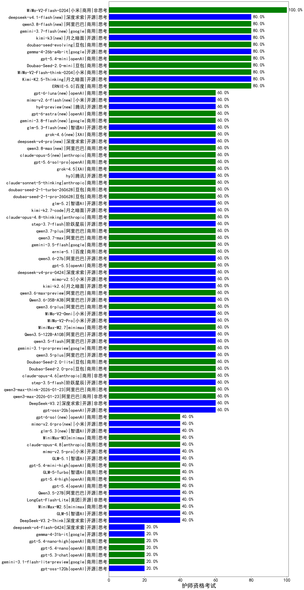

|类别|机构|大模型|【护师资格考试】准确率|平均耗时|平均消耗token|花费/千次（元）|排名（准确率）|
|---|---|-----|-------------------|-------|-----------|-----------|-----------|
|商用|小米|MiMo-V2-Flash-0204|100.0%|331s|390|0.7|1|
|商用|豆包|doubao-seed-evolving|80.0%|263s|9689|288.3|2|
|开源|google|gemma-4-26b-a4b-it|80.0%|47s|503|1.3|3|
|商用|google|gemini-3.7-flash(new)|80.0%|6s|951|23.6|4|
|商用|openAI|gpt-5.4-mini|80.0%|3s|201|4.4|5|
|商用|阿里巴巴|qwen3.8-flash(new)|80.0%|19s|435|1.0|6|
|开源|月之暗面|kimi-k3(new)|80.0%|51s|1137|102.9|7|
|开源|深度求索|deepseek-v4.1-flash(new)|80.0%|35s|808|6.0|8|
|商用|小米|MiMo-V2-Flash-think-0204|80.0%|1199s|2285|4.7|9|
|商用|豆包|Doubao-Seed-2.0-mini|80.0%|374s|1526|2.9|10|
|商用|百度|ERNIE-5.0|80.0%|234s|3191|75.7|11|
|开源|月之暗面|Kimi-K2.5-Thinking|80.0%|217s|1147|23.1|12|
|商用|阿里巴巴|qwen3.7-plus|60.0%|23s|1191|9.2|13|
|商用|openAI|gpt-5.6-sol-pro|60.0%|29s|3044|235.0|14|
|商用|豆包|doubao-seed-2-1-turbo-260628|60.0%|215s|9190|136.7|15|
|商用|anthropic|claude-opus-5(new)|60.0%|19s|802|128.1|16|
|开源|阿里巴巴|Qwen3.6-35B-A3B|60.0%|10s|1626|17.0|17|
|商用|阿里巴巴|qwen3.6-max-preview|60.0%|49s|1462|76.1|18|
|商用|豆包|doubao-seed-2-1-pro-260628|60.0%|157s|7848|233.1|19|
|开源|openAI|gpt-oss-20b|60.0%|6s|750|0.8|20|
|开源|智谱AI|glm-5.2|60.0%|33s|1375|37.2|21|
|开源|小米|mimo-v2.5|60.0%|28s|2250|28.1|22|
|开源|月之暗面|kimi-k2.7-code|60.0%|67s|1063|27.6|23|
|开源|深度求索|deepseek-v4-pro-0424|60.0%|78s|1683|39.7|24|
|开源|腾讯|hy3|60.0%|56s|164|0.5|25|
|商用|openAI|gpt-5.5|60.0%|23s|458|83.2|26|
|开源|阿里巴巴|qwen3.6-27b|60.0%|27s|1671|29.1|27|
|商用|百度|ernie-5.1|60.0%|21s|632|10.6|28|
|商用|阿里巴巴|qwen3.6-plus|60.0%|42s|1324|15.3|29|
|商用|google|gemini-3.5-flash|60.0%|7s|1171|70.4|30|
|商用|阿里巴巴|qwen3.7-max|60.0%|21s|1062|36.7|31|
|商用|anthropic|claude-opus-4.8-thinking|60.0%|12s|699|110.2|32|
|开源|阶跃星辰|step-3.7-flash|60.0%|48s|4347|34.8|33|
|商用|XAI|grok-4.5|60.0%|34s|1406|51.7|34|
|商用|阿里巴巴|qwen3.8-max(new)|60.0%|27s|1178|40.0|35|
|开源|月之暗面|kimi-k2.6|60.0%|87s|1601|42.1|36|
|开源|小米|MiMo-V2-Omni|60.0%|9s|1221|13.6|37|
|开源|小米|MiMo-V2-Pro|60.0%|478s|1104|18.9|38|
|开源|深度求索|DeepSeek-V3.2|60.0%|11s|243|0.7|39|
|商用|openAI|gpt-6-luna(new)|60.0%|196s|260|0.7|40|
|商用|阿里巴巴|qwen3-max-2026-01-23|60.0%|578s|301|2.5|41|
|商用|阿里巴巴|qwen3-max-think-2026-01-23|60.0%|120s|2924|28.7|42|
|开源|阶跃星辰|step-3.5-flash|60.0%|60s|2355|4.9|43|
|商用|anthropic|claude-opus-4.6|60.0%|20s|544|82.8|44|
|开源|小米|mimo-v2.6-flash(new)|60.0%|16s|609|1.2|45|
|开源|腾讯|hy4-preview(new)|60.0%|69s|4390|78.2|46|
|商用|豆包|Doubao-Seed-2.0-pro|60.0%|377s|1508|22.8|47|
|商用|豆包|Doubao-Seed-2.0-lite|60.0%|213s|1042|3.4|48|
|开源|阿里巴巴|qwen3.5-plus|60.0%|33s|2582|12.1|49|
|商用|google|gemini-3.1-pro-preview|60.0%|58s|1466|120.4|50|
|开源|阿里巴巴|qwen3.5-flash|60.0%|386s|3477|6.8|51|
|开源|阿里巴巴|Qwen3.5-122B-A10B|60.0%|331s|2458|15.4|52|
|商用|openAI|gpt-6-astra(new)|60.0%|14s|235|61.6|53|
|商用|google|gemini-3.8-flash(new)|60.0%|23s|806|39.7|54|
|开源|智谱AI|glm-5.3-flash(new)|60.0%|47s|1607|4.4|55|
|商用|anthropic|claude-sonnet-5-thinking|60.0%|14s|644|40.2|56|
|开源|深度求索|deepseek-v4-pro(new)|60.0%|404s|1753|44.9|57|
|商用|minimax|MiniMax-M2.7|60.0%|27s|1100|8.7|58|
|商用|XAI|grok-4.6(new)|60.0%|31s|1396|51.3|59|
|开源|小米|mimo-v2.6-pro(new)|40.0%|22s|759|4.4|60|
|开源|智谱AI|glm-5.3(new)|40.0%|-618s|3957|109.5|61|
|商用|openAI|gpt-6-sol(new)|40.0%|131s|362|21.2|62|
|商用|minimax|MiniMax-M3|40.0%|18s|516|5.9|63|
|商用|智谱AI|GLM-5-Turbo|40.0%|22s|1381|29.4|64|
|开源|深度求索|DeepSeek-V3.2-Think|40.0%|169s|1721|5.1|65|
|开源|智谱AI|GLM-5|40.0%|83s|2283|40.3|66|
|商用|minimax|MiniMax-M2.5|40.0%|21s|1126|8.9|67|
|开源|美团|LongCat-Flash-Lite|40.0%|396s|392|0.0|68|
|开源|阿里巴巴|Qwen3.5-27B|40.0%|319s|5189|24.6|69|
|商用|openAI|gpt-5.4|40.0%|6s|239|18.6|70|
|商用|anthropic|claude-opus-4.8|40.0%|10s|476|71.2|71|
|商用|openAI|gpt-5.4-high|40.0%|24s|483|44.3|72|
|商用|openAI|gpt-5.4-mini-high|40.0%|76s|1010|29.9|73|
|开源|智谱AI|GLM-5.1|40.0%|94s|1669|39.0|74|
|开源|小米|mimo-v2.5-pro|40.0%|25s|1520|27.6|75|
|商用|openAI|gpt-5.4-nano|20.0%|16s|172|1.0|76|
|商用|openAI|gpt-5.3-chat|20.0%|34s|311|24.1|77|
|商用|google|gemini-3.1-flash-lite-preview|20.0%|3s|359|3.2|78|
|商用|openAI|gpt-5.4-nano-high|20.0%|78s|401|3.0|79|
|开源|google|gemma-4-31b-it|20.0%|24s|426|1.1|80|
|开源|深度求索|deepseek-v4-flash-0424|20.0%|33s|1052|2.1|81|
|开源|openAI|gpt-oss-120b|20.0%|10s|543|1.4|82|

