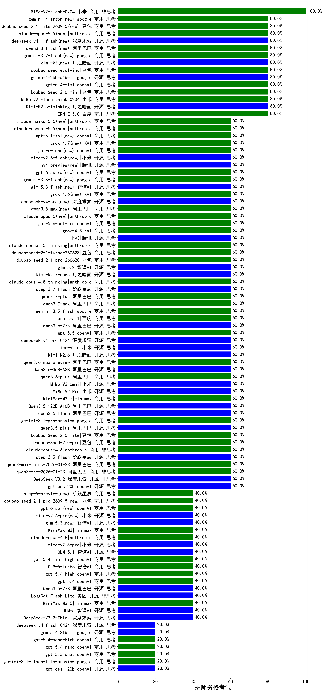

|类别|机构|大模型|【护师资格考试】准确率|平均耗时|平均消耗token|花费/千次（元）|排名（准确率）|
|---|---|-----|-------------------|-------|-----------|-----------|-----------|
|商用|阿里巴巴|qwen3.8-flash(new)|80.0%|19s|435|1.0|1|
|开源|google|gemma-4-26b-a4b-it|80.0%|47s|503|1.3|2|
|开源|月之暗面|kimi-k3|80.0%|51s|1137|102.9|3|
|开源|深度求索|deepseek-v4.1-flash(new)|80.0%|35s|808|6.0|4|
|商用|百度|ERNIE-5.0|80.0%|234s|3191|75.7|5|
|商用|anthropic|claude-opus-5.5(new)|80.0%|14s|650|81.0|6|
|商用|google|gemini-4-argon(new)|80.0%|12s|337|37.1|7|
|商用|豆包|doubao-seed-2-1-lite-260915(new)|80.0%|77s|2743|7.2|8|
|商用|google|gemini-3.7-flash|80.0%|6s|951|23.6|9|
|商用|豆包|doubao-seed-evolving|80.0%|263s|9689|288.3|10|
|开源|腾讯|hy3|60.0%|56s|164|0.5|11|
|商用|anthropic|claude-sonnet-5-thinking|60.0%|14s|644|40.2|12|
|商用|豆包|doubao-seed-2-1-pro-260628|60.0%|157s|7848|233.1|13|
|商用|豆包|doubao-seed-2-1-turbo-260628|60.0%|215s|9190|136.7|14|
|开源|openAI|gpt-oss-20b|60.0%|6s|750|0.8|15|
|开源|智谱AI|glm-5.2|60.0%|33s|1375|37.2|16|
|开源|月之暗面|kimi-k2.7-code|60.0%|67s|1063|27.6|17|
|商用|XAI|grok-4.5|60.0%|34s|1406|51.7|18|
|商用|阿里巴巴|qwen3.8-max|60.0%|27s|1178|40.0|19|
|商用|openAI|gpt-5.6-sol-pro|60.0%|29s|3044|235.0|20|
|商用|anthropic|claude-opus-5|60.0%|19s|802|128.1|21|
|开源|阶跃星辰|step-3.7-flash|60.0%|48s|4347|34.8|22|
|开源|深度求索|deepseek-v4-pro|60.0%|404s|1753|44.9|23|
|商用|XAI|grok-4.6|60.0%|31s|1396|51.3|24|
|开源|智谱AI|glm-5.3-flash(new)|60.0%|47s|1607|4.4|25|
|商用|google|gemini-3.8-flash(new)|60.0%|23s|806|39.7|26|
|商用|openAI|gpt-6-astra(new)|60.0%|14s|235|61.6|27|
|开源|腾讯|hy4-preview(new)|60.0%|69s|4390|78.2|28|
|商用|anthropic|claude-opus-4.8-thinking|60.0%|12s|699|110.2|29|
|商用|XAI|grok-4.7(new)|60.0%|57s|3015|90.3|30|
|商用|阿里巴巴|qwen3.7-plus|60.0%|23s|1191|9.2|31|
|商用|阿里巴巴|qwen3.6-max-preview|60.0%|49s|1462|76.1|32|
|开源|深度求索|DeepSeek-V3.2|60.0%|11s|243|0.7|33|
|商用|anthropic|claude-haiku-5.5(new)|60.0%|5s|597|1.8|34|
|商用|google|gemini-3.1-pro-preview|60.0%|58s|1466|120.4|35|
|开源|阿里巴巴|Qwen3.5-122B-A10B|60.0%|331s|2458|15.4|36|
|商用|anthropic|claude-sonnet-5.5(new)|60.0%|7s|495|29.6|37|
|商用|minimax|MiniMax-M2.7|60.0%|27s|1100|8.7|38|
|商用|阿里巴巴|qwen3.6-plus|60.0%|42s|1324|15.3|39|
|商用|openAI|gpt-6.1-sol(new)|60.0%|8s|306|17.3|40|
|开源|小米|mimo-v2.6-flash(new)|60.0%|16s|609|1.2|41|
|开源|阿里巴巴|Qwen3.6-35B-A3B|60.0%|10s|1626|17.0|42|
|开源|月之暗面|kimi-k2.6|60.0%|87s|1601|42.1|43|
|开源|小米|mimo-v2.5|60.0%|28s|2250|28.1|44|
|开源|深度求索|deepseek-v4-pro-0424|60.0%|78s|1683|39.7|45|
|商用|openAI|gpt-5.5|60.0%|23s|458|83.2|46|
|开源|阿里巴巴|qwen3.6-27b|60.0%|27s|1671|29.1|47|
|商用|百度|ernie-5.1|60.0%|21s|632|10.6|48|
|商用|google|gemini-3.5-flash|60.0%|7s|1171|70.4|49|
|商用|阿里巴巴|qwen3.7-max|60.0%|21s|1062|36.7|50|
|商用|openAI|gpt-6-luna(new)|60.0%|196s|260|0.7|51|
|商用|阶跃星辰|step-5-preview(new)|40.0%|29s|2202|43.2|52|
|商用|豆包|doubao-seed-2-1-pro-260915(new)|40.0%|112s|2864|83.5|53|
|商用|openAI|gpt-6-sol(new)|40.0%|131s|362|21.2|54|
|商用|minimax|MiniMax-M3.1-Flash(new)|40.0%|19s|1162|3.9|55|
|开源|小米|mimo-v2.6-pro(new)|40.0%|22s|759|4.4|56|
|开源|智谱AI|glm-5.3(new)|40.0%|-618s|3957|109.5|57|
|商用|minimax|MiniMax-M3|40.0%|18s|516|5.9|58|
|商用|anthropic|claude-opus-4.8|40.0%|10s|476|71.2|59|
|开源|小米|mimo-v2.5-pro|40.0%|25s|1520|27.6|60|
|开源|智谱AI|GLM-5.1|40.0%|94s|1669|39.0|61|
|开源|阿里巴巴|Qwen3.5-27B|40.0%|319s|5189|24.6|62|
|开源|深度求索|DeepSeek-V3.2-Think|40.0%|169s|1721|5.1|63|
|开源|深度求索|deepseek-v4-flash-0424|20.0%|33s|1052|2.1|64|
|开源|google|gemma-4-31b-it|20.0%|24s|426|1.1|65|
|商用|google|gemini-3.1-flash-lite-preview|20.0%|3s|359|3.2|66|
|开源|openAI|gpt-oss-120b|20.0%|10s|543|1.4|67|

