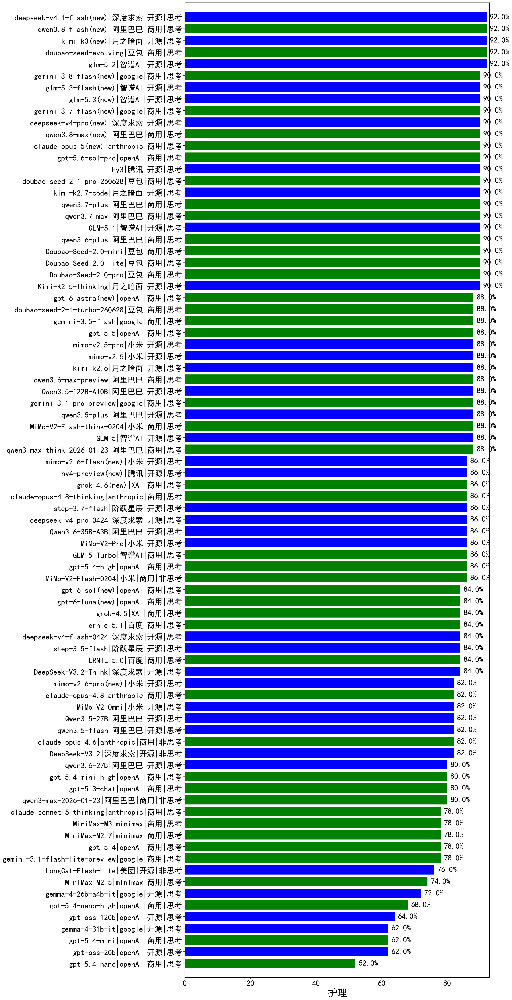

|类别|机构|大模型|【护理】准确率|平均耗时|平均消耗token|花费/千次（元）|排名（准确率）|
|---|---|-----|-------------------|-------|-----------|-----------|-----------|
|商用|豆包|doubao-seed-evolving|92.0%|193s|5912|174.5|1|
|开源|智谱AI|glm-5.2|92.0%|47s|1592|42.9|2|
|开源|深度求索|deepseek-v4.1-flash(new)|92.0%|23s|911|6.7|3|
|商用|阿里巴巴|qwen3.8-flash(new)|92.0%|60s|1232|3.1|4|
|开源|月之暗面|kimi-k3(new)|92.0%|39s|785|66.2|5|
|商用|openAI|gpt-5.6-sol-pro|90.0%|17s|3324|256.4|6|
|开源|深度求索|deepseek-v4-pro(new)|90.0%|149s|914|21.9|7|
|商用|阿里巴巴|qwen3.7-plus|90.0%|20s|1021|7.7|8|
|商用|anthropic|claude-opus-5(new)|90.0%|16s|764|116.0|9|
|商用|阿里巴巴|qwen3.8-max(new)|90.0%|24s|1061|35.3|10|
|开源|腾讯|hy3|90.0%|48s|227|0.7|11|
|开源|智谱AI|glm-5.3(new)|90.0%|-87s|1904|51.6|12|
|商用|阿里巴巴|qwen3.6-plus|90.0%|36s|1606|18.4|13|
|商用|豆包|doubao-seed-2-1-pro-260628|90.0%|198s|6340|187.4|14|
|开源|智谱AI|GLM-5.1|90.0%|154s|1362|31.3|15|
|开源|月之暗面|kimi-k2.7-code|90.0%|29s|800|20.1|16|
|商用|google|gemini-3.7-flash(new)|90.0%|11s|727|17.3|17|
|商用|阿里巴巴|qwen3.7-max|90.0%|20s|960|32.6|18|
|商用|豆包|Doubao-Seed-2.0-mini|90.0%|273s|1758|3.3|19|
|商用|豆包|Doubao-Seed-2.0-lite|90.0%|200s|893|2.8|20|
|商用|豆包|Doubao-Seed-2.0-pro|90.0%|211s|962|13.8|21|
|开源|智谱AI|glm-5.3-flash(new)|90.0%|50s|1504|4.0|22|
|开源|月之暗面|Kimi-K2.5-Thinking|90.0%|292s|1553|31.3|23|
|商用|google|gemini-3.8-flash(new)|90.0%|19s|741|35.3|24|
|开源|阿里巴巴|qwen3.5-plus|88.0%|29s|2285|10.6|25|
|商用|google|gemini-3.1-pro-preview|88.0%|41s|1359|109.7|26|
|商用|google|gemini-3.5-flash|88.0%|8s|1307|77.8|27|
|商用|openAI|gpt-5.5|88.0%|12s|437|74.2|28|
|开源|小米|mimo-v2.5-pro|88.0%|21s|1272|22.1|29|
|开源|小米|mimo-v2.5|88.0%|57s|1387|15.8|30|
|商用|阿里巴巴|qwen3.6-max-preview|88.0%|50s|1601|82.7|31|
|商用|阿里巴巴|qwen3-max-think-2026-01-23|88.0%|132s|2900|28.3|32|
|商用|豆包|doubao-seed-2-1-turbo-260628|88.0%|169s|5580|82.3|33|
|商用|openAI|gpt-6-astra(new)|88.0%|13s|288|72.5|34|
|开源|月之暗面|kimi-k2.6|88.0%|91s|1570|40.8|35|
|商用|小米|MiMo-V2-Flash-think-0204|88.0%|642s|1982|4.0|36|
|开源|智谱AI|GLM-5|88.0%|70s|1839|32.0|37|
|开源|阿里巴巴|Qwen3.5-122B-A10B|88.0%|228s|2586|16.1|38|
|开源|阶跃星辰|step-3.7-flash|86.0%|36s|2335|18.3|39|
|商用|anthropic|claude-opus-4.8-thinking|86.0%|14s|762|115.7|40|
|商用|XAI|grok-4.6(new)|86.0%|153s|1358|49.2|41|
|开源|深度求索|deepseek-v4-pro-0424|86.0%|33s|868|19.9|42|
|开源|小米|MiMo-V2-Pro|86.0%|305s|1198|20.5|43|
|开源|小米|mimo-v2.6-flash(new)|86.0%|152s|954|1.8|44|
|商用|智谱AI|GLM-5-Turbo|86.0%|34s|1261|26.4|45|
|开源|阿里巴巴|Qwen3.6-35B-A3B|86.0%|51s|1703|17.6|46|
|开源|腾讯|hy4-preview(new)|86.0%|54s|2987|52.7|47|
|商用|小米|MiMo-V2-Flash-0204|86.0%|223s|523|1.0|48|
|商用|openAI|gpt-5.4-high|86.0%|14s|669|61.3|49|
|商用|XAI|grok-4.5|84.0%|72s|1355|49.0|50|
|商用|openAI|gpt-6-luna(new)|84.0%|283s|410|1.2|51|
|商用|openAI|gpt-6-sol(new)|84.0%|249s|270|13.2|52|
|商用|百度|ernie-5.1|84.0%|25s|897|15.1|53|
|开源|深度求索|deepseek-v4-flash-0424|84.0%|26s|770|1.5|54|
|开源|深度求索|DeepSeek-V3.2-Think|84.0%|98s|1093|3.2|55|
|商用|百度|ERNIE-5.0|84.0%|163s|1947|45.5|56|
|开源|阶跃星辰|step-3.5-flash|84.0%|28s|1948|4.0|57|
|开源|小米|MiMo-V2-Omni|82.0%|286s|1420|16.2|58|
|商用|anthropic|claude-opus-4.8|82.0%|10s|598|86.9|59|
|开源|深度求索|DeepSeek-V3.2|82.0%|59s|360|1.0|60|
|开源|小米|mimo-v2.6-pro(new)|82.0%|51s|2277|13.4|61|
|开源|阿里巴巴|Qwen3.5-27B|82.0%|295s|2985|14.0|62|
|开源|阿里巴巴|qwen3.5-flash|82.0%|258s|2888|5.6|63|
|商用|anthropic|claude-opus-4.6|82.0%|13s|676|100.4|64|
|商用|openAI|gpt-5.4-mini-high|80.0%|25s|904|25.8|65|
|商用|openAI|gpt-5.3-chat|80.0%|23s|399|30.5|66|
|商用|阿里巴巴|qwen3-max-2026-01-23|80.0%|132s|521|4.6|67|
|开源|阿里巴巴|qwen3.6-27b|80.0%|28s|1740|30.1|68|
|商用|minimax|MiniMax-M3|78.0%|24s|678|8.3|69|
|商用|openAI|gpt-5.4|78.0%|10s|335|26.3|70|
|商用|google|gemini-3.1-flash-lite-preview|78.0%|15s|412|3.6|71|
|商用|minimax|MiniMax-M2.7|78.0%|37s|1468|11.6|72|
|商用|anthropic|claude-sonnet-5-thinking|78.0%|16s|811|49.7|73|
|开源|美团|LongCat-Flash-Lite|76.0%|246s|492|0.0|74|
|商用|minimax|MiniMax-M2.5|74.0%|28s|1448|11.5|75|
|开源|google|gemma-4-26b-a4b-it|72.0%|60s|618|1.5|76|
|商用|openAI|gpt-5.4-nano-high|68.0%|44s|539|4.0|77|
|开源|openAI|gpt-oss-120b|64.0%|31s|652|1.7|78|
|商用|openAI|gpt-5.4-mini|62.0%|68s|293|6.6|79|
|开源|google|gemma-4-31b-it|62.0%|66s|545|1.3|80|
|开源|openAI|gpt-oss-20b|62.0%|47s|1132|1.2|81|
|商用|openAI|gpt-5.4-nano|52.0%|13s|258|1.5|82|

