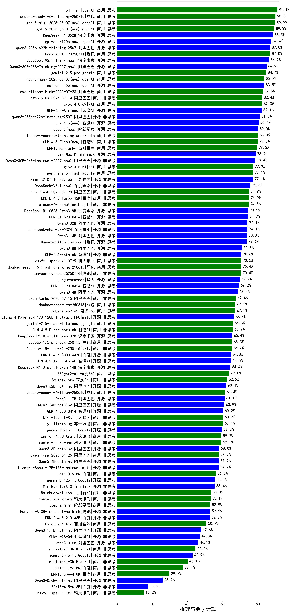

|类别|机构|大模型|【推理与数学计算】准确率|平均耗时|平均消耗token|花费/千次（元）|排名（准确率）|
|---|---|-----|-------------------|-------|-----------|-----------|-----------|
|商用|openAI|o4-mini|87.0%|47s|2425|66.1|1|
|商用|openAI|gpt-5.1-high(new)|84.7%|127s|4954|318.5|2|
|商用|openAI|gpt-5.1-medium(new)|83.5%|182s|2935|175.1|3|
|商用|google|gemini-3-pro-preview(new)|81.8%|72s|5202|395.8|4|
|商用|openAI|gpt-5-mini-2025-08-07|80.2%|75s|2385|28.6|5|
|商用|openAI|gpt-5-mini-high(new)|79.8%|412s|6246|83.8|6|
|商用|anthropic|claude-haiku-4.5-thinking(new)|78.9%|58s|7933|267.7|7|
|商用|XAI|grok-4-1-fast-reasoning(new)|78.1%|70s|4984|16.3|8|
|商用|anthropic|claude-sonnet-4.5-thinking(new)|78.0%|63s|5367|525.3|9|
|商用|腾讯|hunyuan-2.0-thinking-20251109(new)|77.9%|55s|5822|21.7|10|
|开源|深度求索|DeepSeek-V3.2-Think(new)|77.6%|185s|5371|15.6|11|
|开源|豆包|Seed-OSS-36B-Instruct|77.3%|324s|5608|21.0|12|
|商用|豆包|doubao-seed-1-6-thinking-250715|76.4%|63s|4290|30.2|13|
|开源|openAI|gpt-oss-120b|76.0%|75s|1956|5.0|14|
|开源|月之暗面|Kimi-K2-Thinking(new)|75.3%|524s|9258|141.9|15|
|开源|深度求索|DeepSeek-V3.2-Exp-Think(new)|75.1%|373s|4523|13.1|16|
|商用|openAI|gpt-5-2025-08-07|74.7%|67s|1078|47.1|17|
|商用|百度|ERNIE-5.0-Thinking-Preview(new)|74.0%|515s|7233|161.8|18|
|开源|深度求索|DeepSeek-R1-0528|73.8%|288s|5887|92.9|19|
|商用|阿里巴巴|qwen-plus-think-2025-07-28|73.1%|/|5569|40.4|20|
|商用|openAI|gpt-5-nano-high(new)|72.9%|640s|11046|30.7|21|
|商用|阿里巴巴|qwen3-max-2025-09-23(new)|72.6%|173s|2434|46.6|22|
|商用|阿里巴巴|qwen-plus-think-2025-12-01(new)|72.4%|122s|5248|37.2|23|
|商用|阿里巴巴|qwen-plus-think-2025-12-01(new)|72.4%|122s|5248|37.2|24|
|商用|google|gemini-2.5-pro|72.2%|68s|4087|259.7|25|
|开源|阿里巴巴|qwen3-235b-a22b-thinking-2507|72.0%|200s|5447|92.3|26|
|商用|腾讯|hunyuan-t1-20250711|72.0%|126s|5908|21.6|27|
|开源|深度求索|DeepSeek-V3.1-Think|71.2%|233s|5108|57.6|28|
|商用|豆包|doubao-seed-1-6-lite-251015(new)|71.2%|159s|3227|6.3|29|
|商用|阿里巴巴|qwen3-max-preview|71.0%|69s|1877|34.8|30|
|商用|openAI|gpt-5-nano-2025-08-07|69.6%|105s|4036|10.5|31|
|商用|anthropic|claude-4-sonnet|69.1%|55s|735|49.9|32|
|开源|阶跃星辰|step-3|68.5%|325s|6323|24.1|33|
|商用|anthropic|claude-opus-4.5(new)|67.9%|22s|1963|258.1|34|
|商用|google|gemini-2.5-flash|67.5%|51s|4384|70.3|35|
|商用|腾讯|hunyuan-2.0-instruct-20251111(new)|67.1%|17s|1904|3.0|36|
|开源|智谱AI|GLM-4.6(new)|66.7%|84s|4294|54.8|37|
|商用|阿里巴巴|qwen-plus-2025-12-01(new)|66.5%|56s|2863|4.9|38|
|商用|阿里巴巴|qwen-plus-2025-12-01(new)|66.5%|56s|2863|4.9|39|
|商用|阿里巴巴|qwen-plus-2025-07-28|66.4%|84s|2139|3.6|40|
|开源|openAI|gpt-oss-20b|66.0%|221s|3255|3.3|41|
|开源|阿里巴巴|qwen3-235b-a22b-instruct-2507|66.0%|73s|2194|14.1|42|
|商用|豆包|doubao-seed-1-6-251015(new)|65.7%|105s|2401|14.2|43|
|开源|阿里巴巴|Qwen3-30B-A3B-Thinking-2507|65.1%|144s|5234|13.5|44|
|商用|腾讯|hunyuan-turbos-20250926(new)|64.9%|52s|2515|4.2|45|
|开源|阿里巴巴|Qwen3-30B-A3B-Instruct-2507|64.4%|62s|2398|5.9|46|
|商用|阿里巴巴|qwen-flash-think-2025-07-28|64.3%|86s|5144|6.9|47|
|商用|anthropic|claude-sonnet-4.5(new)|64.0%|8s|1060|59.6|48|
|商用|XAI|grok-4-0709|63.7%|227s|4105|406.6|49|
|商用|百度|ERNIE-X1.1-Preview(new)|63.5%|321s|6229|22.9|50|
|开源|minimax|MiniMax-M2(new)|63.3%|76s|4873|37.5|51|
|商用|XAI|grok-3-mini|62.9%|158s|2526|8.5|52|
|开源|智谱AI|GLM-4.5|62.9%|157s|5560|72.6|53|
|开源|智谱AI|GLM-4.5-Air|62.8%|113s|6621|36.5|54|
|开源|阿里巴巴|qwen3-next-80b-a3b-thinking(new)|62.5%|169s|6383|23.6|55|
|开源|minimax|MiniMax-M1|62.3%|297s|6679|48.3|56|
|开源|深度求索|DeepSeek-V3.2(new)|62.1%|102s|1873|5.1|57|
|开源|深度求索|DeepSeek-V3.1|61.7%|48s|1318|12.2|58|
|商用|智谱AI|GLM-4.5-Flash|61.5%|119s|6487|0.0|59|
|商用|anthropic|claude-4-sonnet-thinking|61.0%|60s|1209|100.1|60|
|开源|深度求索|DeepSeek-V3.2-Exp(new)|60.3%|258s|1438|3.9|61|
|开源|阿里巴巴|qwen3-next-80b-a3b-instruct|60.2%|70s|2367|7.8|62|
|开源|深度求索|DeepSeek-R1-0528-Qwen3-8B|60.0%|548s|8048|0.0|63|
|开源|月之暗面|kimi-k2-0905(new)|59.5%|100s|2202|28.7|64|
|商用|阿里巴巴|qwen-flash-2025-07-28|59.4%|63s|2444|2.9|65|
|商用|阿里巴巴|qwen-turbo-think-2025-07-15|58.6%|/|5474|14.9|66|
|开源|腾讯|Hunyuan-A13B-Instruct|58.5%|170s|4499|16.3|67|
|商用|百度|ERNIE-4.5-Turbo-32K|55.9%|42s|1292|2.8|68|
|商用|openAI|gpt-5.1(new)|55.8%|156s|823|25.2|69|
|开源|阿里巴巴|Qwen3-8B|55.8%|239s|7407|0.0|70|
|商用|百度|ERNIE-X1-Turbo-32K|55.2%|433s|5043|18.3|71|
|开源|月之暗面|kimi-k2-0711-preview|55.0%|141s|2089|27.9|72|
|商用|openAI|gpt-5.2(new)|54.7%|8s|856|38.5|73|
|开源|阿里巴巴|Qwen3-14B|54.3%|115s|4823|8.9|74|
|开源|meta|Llama-4-Maverick-17B-128E-Instruct-FP8|54.0%|10s|763|2.4|75|
|开源|阿里巴巴|Qwen3-32B|53.8%|126s|3997|14.5|76|
|商用|360|360zhinao2-o1|53.2%|/|/|/|77|
|开源|Mistral|mistral-large-2512(new)|53.1%|18s|1524|11.4|78|
|商用|anthropic|claude-haiku-4.5(new)|53.0%|22s|1075|20.0|79|
|商用|豆包|doubao-seed-1-6-flash-thinking-250615|52.5%|50s|4391|5.7|80|
|商用|豆包|doubao-seed-1-6-250615|51.8%|102s|1144|4.8|81|
|开源|智谱AI|GLM-4.5-nothink|51.4%|86s|2168|25.1|82|
|开源|阿里巴巴|Qwen3-4B|51.2%|74s|3429|9.0|83|
|商用|豆包|Doubao-1.5-lite-32k-250115|50.3%|8s|792|0.3|84|
|开源|百度|ERNIE-4.5-300B-A47B|49.5%|140s|1102|5.4|85|
|商用|豆包|doubao-seed-1-6-flash-250615|48.8%|19s|1240|1.1|86|
|开源|阿里巴巴|Qwen3-32B-nothink|48.8%|97s|1222|3.2|87|
|商用|科大讯飞|xunfei-spark-x1-0725|48.7%|/|4548|54.6|88|
|商用|google|gemini-2.5-flash-lite|48.6%|53s|6522|17.7|89|
|开源|Mistral|Ministral-3-14B-Instruct-2512(new)|46.8%|28s|3094|4.4|90|
|开源|智谱AI|GLM-4.5-Air-nothink|46.8%|48s|3232|16.9|91|
|开源|meta|Llama-4-Scout-17B-16E-Instruct|46.4%|10s|726|1.1|92|
|商用|智谱AI|GLM-4.5-Flash-nothink|46.0%|61s|3293|0.0|93|
|商用|阿里巴巴|qwen-turbo-2025-07-15|46.0%|57s|1341|0.6|94|
|开源|阿里巴巴|Qwen3-1.7B|45.3%|64s|4670|12.7|95|
|商用|XAI|grok-4-1-fast-non-reasoning(new)|45.1%|67s|936|1.9|96|
|开源|google|gemma-3-12b-it|45.0%|/|/|/|97|
|开源|Mistral|Ministral-3-8B-Instruct-2512(new)|44.0%|21s|2969|3.2|98|
|开源|Mistral|Magistral-Small-2507|43.9%|321s|9688|101.1|99|
|商用|百川智能|Baichuan4-Turbo|43.9%|/|/|/|100|
|开源|腾讯|Hunyuan-A13B-Instruct-nothink|43.8%|658s|1049|2.5|101|
|开源|google|gemma-3-27b-it|43.4%|/|/|/|102|
|开源|Mistral|Mistral-Small-3.2-24B-Instruct-2506|43.2%|106s|2525|4.6|103|
|开源|阿里巴巴|Qwen3-14B-nothink|42.2%|57s|1546|2.2|104|
|商用|百川智能|Baichuan4-Air|42.1%|/|/|/|105|
|开源|Mistral|Ministral-3-3B-Instruct-2512(new)|41.9%|25s|4082|2.9|106|
|开源|minimax|MiniMax-Text-01|41.7%|15s|1169|7.9|107|
|开源|阿里巴巴|Qwen3-4B-nothink|39.5%|70s|1359|2.5|108|
|商用|阿里巴巴|qwen-long-2025-01-25|39.1%|55s|725|1.0|109|
|开源|百度|ERNIE-4.5-21B-A3B|38.5%|73s|1663|0.3|110|
|商用|Mistral|mistral-medium-2508|37.8%|322s|1325|12.3|111|
|开源|阿里巴巴|Qwen3-8B-nothink|36.4%|53s|1497|0.0|112|
|开源|阿里巴巴|Qwen3-1.7B-nothink|35.0%|19s|1158|1.9|113|
|开源|google|gemma-3-4b-it|34.5%|/|/|/|114|
|开源|阿里巴巴|Qwen3-0.6B|31.8%|30s|2493|6.2|115|
|开源|智谱AI|GLM-4-9B-0414|31.2%|8s|705|0.0|116|
|商用|百度|ERNIE-Lite-8K|26.4%|/|/|/|117|
|开源|阿里巴巴|Qwen3-0.6B-nothink|23.4%|18s|907|1.2|118|
|开源|百度|ERNIE-4.5-0.3B|18.9%|39s|1207|0.1|119|

